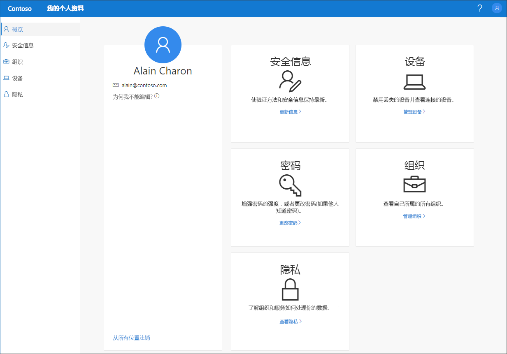

# “我的配置文件”（预览版）门户概述

[!INCLUDE [preview-notice](../../../includes/active-directory-end-user-preview-notice-myprofile.md)]

可以使用“我的配置文件”（预览版）门户对工作或学校帐户进行管理，以便：

- 设置和管理进行双重验证和密码重置所需的安全信息。

- 管理连接的组织和设备。

- 查看组织如何使用你的数据。

>[!Important]
>此内容适用于用户。 如果你是管理员，可以在 [Azure Active Directory 文档](https://docs.microsoft.com/azure/active-directory)中查找有关如何设置和管理 Azure Active Directory (Azure AD) 环境的详细信息。

## 访问“我的配置文件”门户
可以使用下述任何浏览器的当前版本访问 https://myprofile.microsoft.com，以便访问“我的配置文件”门户：

- Chrome
- Microsoft Edge
- Safari
- Firefox
- Internet Explorer 11

    

## 本节内容
可以在下述文章中找到有关“我的配置文件”门户及其页面的详细信息。

|文章 |说明 |
|------|------------|
|[管理安全信息（预览版）](user-help-security-info-overview.md)|介绍如何设置和管理安全信息。|
|[管理组织](myprofile-portal-organizations-page.md)|介绍如何管理连接到工作或学校帐户的组织。|
|[管理连接的设备](myprofile-portal-devices-page.md)| 介绍如何管理连接到工作或学校帐户的设备。|
|[查看与隐私相关的信息](myprofile-portal-privacy-page.md)|介绍如何查看组织用你的数据做些什么。|