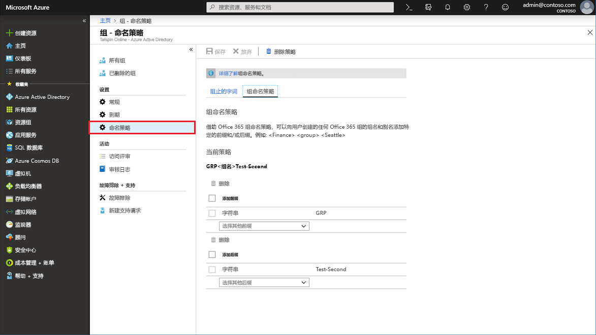
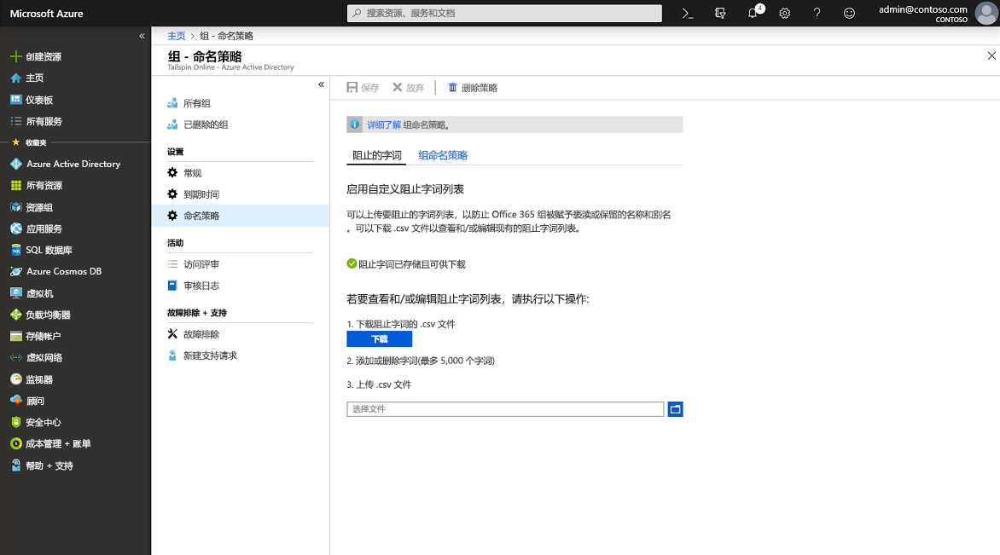

# <a name="enforce-a-naming-policy-on-office-365-groups-in-azure-active-directory"></a>在 Azure Active Directory 中的 Office 365 组上强制实施命名策略

若要为用户创建或编辑的 Office 365 组强制执行一致的命名约定，请在 Azure Active Directory （Azure AD）中为你的组织设置组命名策略。 例如，可以使用命名策略传达组的功能、成员身份、地理区域或创建组的人员。 使用命名策略还可帮助对通讯簿中的组分类。 可以使用策略来阻止组名称和别名中使用特定字词。

> [!IMPORTANT]
> 如果对 Office 365 组使用 Azure AD 命名策略，则需要拥有但不一定要为一个或多个 Office 365 组的成员的每个唯一用户分配 Azure Active Directory Premium P1 许可证或 Azure AD Basic EDU 许可证。

命名策略应用于创建组或编辑跨工作负荷（例如 Outlook、Microsoft Teams、SharePoint、Exchange 或 Planner）创建的组。 它应用于组名和组别名。 如果在 Azure AD 中设置命名策略，并且具有现有的 Exchange 组命名策略，则会在你的组织中强制实施 Azure AD 命名策略。

配置组命名策略时，策略将应用于最终用户创建的新 Office 365 组。 命名策略不适用于某些目录角色，如全局管理员或用户管理员（有关从组命名策略中免除的角色的完整列表，请参阅下文）。 对于现有的 Office 365 组，在配置时，该策略不会立即应用。 组所有者编辑这些组的组名称后，将强制实施命名策略。

## <a name="naming-policy-features"></a>命名策略功能

你可以通过两种不同的方式对组实施命名策略：

- **前后缀命名策略** 可以定义前缀或后缀，稍后会自动添加这些前缀或后缀，以对组实施命名约定（例如，在组名称“GRP\_JAPAN\_My Group\_Engineering”中，GRP\_JAPAN\_ 是前缀，\_Engineering 是后缀）。 

- **自定义阻止字词** 可上传一组特定于组织的阻止字词，将在用户创建的组中阻止这些字词（例如，“CEO、工资单、HR”）。

### <a name="prefix-suffix-naming-policy"></a>前后缀命名策略

命名约定的一般结构是“前缀[GroupName]后缀”。 虽然可以定义多个前缀和后缀，但设置中仅可包含一个 [GroupName] 实例。 前缀或后缀可以是固定字符串，也可以是根据创建组的用户替换的用户属性（如 \[Department\]）。 前缀和后缀字符串（包括组名）的允许字符总数为53个字符。 

前缀和后缀可包含组名和组别名中支持的特殊字符。 如果前缀或后缀中有任何组别名不支持的字符，这些字符仍可应用于组名，但会从组别名中删除。 由于存在此限制，应用于组名的前缀和后缀与应用于组别名的前缀和后缀可能有所不同。 

#### <a name="fixed-strings"></a>固定字符串

使用字符串，可更轻松地扫描和区分全局地址列表和左侧组工作负荷导航链接中的组。 一些常见的前缀是类似“Grp\_Name”、“\#Name”、“\_Name”的关键字

#### <a name="user-attributes"></a>用户属性

可以使用属性帮助你和你的用户标识针对哪个部门、办公室或地理区域创建了组。 例如，如果将命名策略定义为 `PrefixSuffixNamingRequirement = "GRP [GroupName] [Department]"`，且 `User’s department = Engineering`，则强制使用的组名可能是“GRP My Group Engineering”。 支持的 Azure AD 属性包括 \[Department\]、\[Company\]、\[Office\]、\[StateOrProvince\]、\[CountryOrRegion\]、\[Title\]。 不支持的用户属性被视为固定字符串；例如，“\[postalCode\]”。 不支持扩展属性和自定义属性。

建议对组织中的所有用户使用已填充值的属性，不使用具有 Long 值的属性。

### <a name="custom-blocked-words"></a>自定义阻止字词

阻止的字词列表是要在组名和组别名中阻止的短语的逗号分隔列表。 未执行任何子字符串搜索。 组名与一个或多个自定义阻止字词之间完全匹配才会触发失败。 不会执行子字符串搜索，因此用户可使用“Class”甚至是“lass”等作为阻止词。

阻止的字词列表规则：

- 阻止的字词不区分大小写。
- 当用户在组名中输入阻止的字词时，会看到错误消息以及阻止的字词。
- 对于阻止的字词，没有字符限制。
- 在阻止的字词列表中可配置最多 5000 个短语。 

### <a name="roles-and-permissions"></a>角色和权限

若要配置命名策略，需要以下角色之一：
- 全局管理员
- 组管理员
- 用户管理员

选定的管理员可跨所有组工作负荷和终结点得到这些策略的豁免，因此可以使用阻止的字词及其自己的命名约定创建组。 下面列出了可得到组命名策略豁免的管理员角色。

- 全局管理员
- 合作伙伴一线支持人员
- 合作伙伴二线支持人员
- 用户管理员
- 目录写入者

## <a name="configure-naming-policy-in-azure-portal"></a>在 Azure 门户中配置命名策略

1. 使用组管理员帐户登录到[Azure AD 管理中心](https://aad.portal.azure.com)。
1. 选择“组”，然后选择“命名策略”，以便打开“命名策略”页。********

    

### <a name="view-or-edit-the-prefix-suffix-naming-policy"></a>查看或编辑前缀-后缀命名策略

1. 在“命名策略”页上，选择“组命名策略”。********
1. 可以单独查看或编辑当前的前缀或后缀命名策略，只需选择需要在命名策略中强制实施的属性或字符串即可。
1. 若要从列表中删除某个前缀或后缀，请选择该前缀或后缀，然后选择“删除”。**** 可以同时删除多个项。
1. 通过选择 "**保存**"，保存新策略的更改，使其生效。

### <a name="edit-custom-blocked-words"></a>编辑自定义阻止字词

1. 在“命名策略”页上，选择“阻止字词”。********

    

1. 查看或编辑自定义阻止字词的当前列表，方法是选择“下载”。****
1. 上传自定义阻止字词的新列表，方法是选择文件图标。
1. 通过选择 "**保存**"，保存新策略的更改，使其生效。

## <a name="install-powershell-cmdlets"></a>安装 PowerShell cmdlet

请先确保卸载任意较早版本的适用于 Windows PowerShell 的 Azure Active Directory PowerShell for Graph 模块，并安装 [Azure Active Directory PowerShell for Graph - 公共预览版 2.0.0.137](https://www.powershellgallery.com/packages/AzureADPreview/2.0.0.137)，然后再运行 PowerShell 命令。

1. 以管理员身份打开 Windows PowerShell 应用。
2. 卸载任何以前版本的 AzureADPreview。
  
   ``` PowerShell
   Uninstall-Module AzureADPreview
   ```

3. 安装最新版本的 AzureADPreview。
  
   ``` PowerShell
   Install-Module AzureADPreview
   ```

   如果系统提示你访问不受信任的存储库，请输入**Y**。新模块安装可能需要几分钟时间。

## <a name="configure-naming-policy-in-powershell"></a>在 PowerShell 中配置命名策略

1. 在计算机上打开 Windows PowerShell 窗口。 无需提升的权限即可打开该窗口。

1. 运行以下命令，准备运行 cmdlet。
  
   ``` PowerShell
   Import-Module AzureADPreview
   Connect-AzureAD
   ```

   在打开的“登录到你的帐户”屏幕上，输入管理员帐户和密码以连接到服务，然后选择“登录”********。

1. 按照 Azure Active Directory cmdlet 中的步骤[配置组设置](groups-settings-cmdlets.md)，为此组织创建组设置。

### <a name="view-the-current-settings"></a>查看当前设置

1. 提取当前命名策略，查看当前设置。
  
   ``` PowerShell
   $Setting = Get-AzureADDirectorySetting -Id (Get-AzureADDirectorySetting | where -Property DisplayName -Value "Group.Unified" -EQ).id
   ```
  
1. 显示当前组设置。
  
   ``` PowerShell
   $Setting.Values
   ```
  
### <a name="set-the-naming-policy-and-custom-blocked-words"></a>设置命名策略和自定义阻止字词

1. 在 Azure AD PowerShell 中设置组名前缀和后缀。 要使功能正常工作，必须在设置中包含 [GroupName]。
  
   ``` PowerShell
   $Setting["PrefixSuffixNamingRequirement"] =“GRP_[GroupName]_[Department]"
   ```
  
1. 设置要限制的自定义阻止字词。 下面的示例演示如何添加自己的自定义字词。
  
   ``` PowerShell
   $Setting["CustomBlockedWordsList"]=“Payroll,CEO,HR"
   ```
  
1. 保存新策略的设置，使其生效，如以下示例中所示。
  
   ``` PowerShell
   Set-AzureADDirectorySetting -Id (Get-AzureADDirectorySetting | where -Property DisplayName -Value "Group.Unified" -EQ).id -DirectorySetting $Setting
   ```
  
就这么简单。 现已设置了命名策略，并添加了阻止字词。

## <a name="export-or-import-custom-blocked-words"></a>导出或导入自定义阻止字词

有关详细信息，请参阅文章[Azure Active Directory 用于配置组设置的 cmdlet](groups-settings-cmdlets.md)。

下面的 PowerShell 脚本示例可导出多个阻止字词：

``` PowerShell
$Words = (Get-AzureADDirectorySetting).Values | Where-Object -Property Name -Value CustomBlockedWordsList -EQ 
Add-Content "c:\work\currentblockedwordslist.txt" -Value $words.value.Split(",").Replace("`"","")  
```

下面的 PowerShell 脚本示例可导入多个阻止字词：

``` PowerShell
$BadWords = Get-Content "C:\work\currentblockedwordslist.txt"
$BadWords = [string]::join(",", $BadWords)
$Settings = Get-AzureADDirectorySetting | Where-Object {$_.DisplayName -eq "Group.Unified"}
if ($Settings.Count -eq 0)
    {$Template = Get-AzureADDirectorySettingTemplate | Where-Object {$_.DisplayName -eq "Group.Unified"}
    $Settings = $Template.CreateDirectorySetting()
    New-AzureADDirectorySetting -DirectorySetting $Settings
    $Settings = Get-AzureADDirectorySetting | Where-Object {$_.DisplayName -eq "Group.Unified"}}
$Settings["CustomBlockedWordsList"] = $BadWords
Set-AzureADDirectorySetting -Id $Settings.Id -DirectorySetting $Settings 
```

## <a name="remove-the-naming-policy"></a>删除命名策略

### <a name="remove-the-naming-policy-using-azure-portal"></a>使用 Azure 门户删除命名策略

1. 在“命名策略”页上，选择“删除策略”。********
1. 确认删除之后，将会删除命名策略，包括所有前缀-后缀命名策略和任何自定义阻止字词。

### <a name="remove-the-naming-policy-using-azure-ad-powershell"></a>使用 Azure AD PowerShell 删除命名策略

1. 清空 Azure AD PowerShell 中的组名前缀和后缀。
  
   ``` PowerShell
   $Setting["PrefixSuffixNamingRequirement"] =""
   ```
  
1. 清空自定义阻止字词。
  
   ``` PowerShell
   $Setting["CustomBlockedWordsList"]=""
   ```
  
1. 保存设置。
  
   ``` PowerShell
   Set-AzureADDirectorySetting -Id (Get-AzureADDirectorySetting | where -Property DisplayName -Value "Group.Unified" -EQ).id -DirectorySetting $Setting
   ```

## <a name="experience-across-office-365-apps"></a>跨 Office 365 应用的体验

在 Azure AD 中设置组命名策略后，用户在 Office 365 应用中创建组时会看到：

- 在用户键入组名后立即看到随命名策略而定的名称预览（包括前缀和后缀）
- 如果用户输入阻止字词，可看到一条错误消息，因此可删除阻止字词。

工作负载 | 合规性
----------- | -------------------------------
Azure Active Directory 门户 | 如果用户在创建或编辑组时键入组名，Azure AD 门户和访问面板门户会显示命名策略强制使用的名称。 当用户输入自定义阻止字词时，会显示一错误消息以及阻止字词，以便用户删除它。
Outlook Web Access (OWA) | 当用户键入组名或组别名时，Outlook Web Access 显示命名策略强制使用的名称。 当用户输入自定义阻止字词时，UI 中会显示一条错误消息以及阻止字词，以便用户删除它。
Outlook 桌面 | 在 Outlook 桌面中创建的组遵循命名策略设置。 用户输入组名时，Outlook 桌面应用当前不会显示强制使用的组名的预览，也不会返回自定义阻止字词错误。 但是，在创建或编辑组时，会自动应用命名策略，并且用户会在组名或组别名中包含自定义阻止字词时看到错误消息。
Microsoft Teams | 用户输入团队名时，Microsoft Teams 显示命名策略强制使用的名称。 当用户输入自定义阻止字词时，会显示一条错误消息以及阻止字词，以便用户删除它。
SharePoint  |  当用户键入站点名或组电子邮件地址时，SharePoint 显示命名策略强制使用的名称。 当用户输入自定义阻止字词时，会显示一条错误消息以及阻止字词，以便用户删除它。
Microsoft Stream | 当用户键入组名或组电子邮件别名时，Microsoft Stream 显示命名策略强制使用的名称。 当用户输入自定义阻止字词时，会显示一条错误消息以及阻止字词，以便用户删除它。
Outlook iOS 和 Android 应用 | 在 Outlook 应用中创建的组遵循配置的命名策略。 用户输入组名时，Outlook 移动应用当前不会显示命名策略强制使用的名称的预览，也不会返回自定义阻止字词错误。 但是，在单击“创建”/“编辑”时会自动应用命名策略，并且用户会在组名或组别名中包含自定义阻止字词时看到错误消息。
组移动应用 | 在组移动应用中创建的组遵循命名策略。 用户输入组名时，组移动应用不会显示组命名策略预览，也不会返回自定义阻止字词错误。 但在创建或编辑组时，会自动应用命名策略，并且用户会在组名或组别名中包含自定义阻止字词时看到相应的错误消息。
Planner | Planner 遵循命名策略。 输入计划名称时，Planner 显示命名策略预览。 创建计划时，如果用户输入自定义阻止字词，会显示一条错误消息。
Dynamics 365 for Customer Engagement | Dynamics 365 for Customer Engagement 遵循命名策略。 当用户键入组名或组电子邮件别名时，Dynamics 365 显示命名策略强制使用的名称。 当用户输入自定义阻止字词时，会显示一条错误消息以及阻止字词，以便用户删除它。
学校数据同步 (SDS) | 通过 SDS 创建的组遵循命名策略，但不会自动应用命名策略。 SDS 管理员必须将前缀和后缀追加需要为其创建组的类名，然后上传到 SDS。 否则，组创建或编辑会失败。
Outlook Customer Manager (OCM) | Outlook Customer Manager 遵循命名策略，并且命名策略自动应用于在 Outlook Customer Manager 中创建的组。 如果检测到自定义阻止字词，则会阻止在 OCM 中创建组，并阻止用户使用 OCM 应用。
Classroom 应用 | 在 Classroom 应用中创建的组遵循命名策略，但不会自动应用命名策略，并且在输入教室组名时不会向用户显示命名策略预览。 用户必须输入强制使用的教室组名称（包含前缀和后缀）。 否则，教室组创建或编辑会失败，并出现错误。
Power BI | Power BI 工作区遵循命名策略。    
Yammer | 当使用其 Azure Active Directory 帐户登录到 Yammer 的用户创建一个组或编辑组名时，组名将符合命名策略。 这适用于 Office 365 连接组以及所有其他 Yammer 组。<br>如果在命名策略到位之前已创建 Office 365 连接组，则组名将不会自动遵循命名策略。 当用户编辑组名，系统将提示他们添加前缀和后缀。
StaffHub  | StaffHub 团队不遵循命名策略，但基础 Office 365 组遵循给策略。 StaffHub 团队名不应用前缀和后缀，也不检查自定义阻止字词。 但在基础 Office 365 组中，StaffHub 应用了前缀和后缀，并删除了阻止字词。
Exchange PowerShell | Exchange PowerShell cmdlet 遵循命名策略。 如果用户不遵循组名和组别名 (mailNickname) 的命名策略，则会收到相应的错误消息，以及建议的前后缀和自定义阻止字词。
Azure Active Directory PowerShell cmdlet | Azure Active Directory PowerShell cmdlet 遵循命名策略。 如果用户不遵循组名和组别名的命名约定，则会收到相应的错误消息，以及建议的前后缀和自定义阻止字词。
Exchange 管理中心 | Exchange 管理中心遵循命名策略。 如果用户不遵循组名和组别名的命名约定，则会收到相应的错误消息，以及建议的前后缀和自定义阻止字词。
Microsoft 365 管理中心 | Microsoft 365 管理中心符合命名策略。 当用户创建或编辑组名时，会自动应用命名策略，并且用户会在输入自定义阻止字词时收到相应的错误消息。 Microsoft 365 管理中心尚未显示命名策略的预览，用户输入组名时，不会返回自定义阻止字词错误。

## <a name="next-steps"></a>后续步骤

以下文章提供有关 Azure AD 组的更多信息。

- [查看现有组](../fundamentals/active-directory-groups-view-azure-portal.md)
- [Office 365 组的到期策略](groups-lifecycle.md)
- [管理组的设置](../fundamentals/active-directory-groups-settings-azure-portal.md)
- [管理组的成员](../fundamentals/active-directory-groups-members-azure-portal.md)
- [管理组的成员身份](../fundamentals/active-directory-groups-membership-azure-portal.md)
- [管理组中用户的动态规则](groups-dynamic-membership.md)
