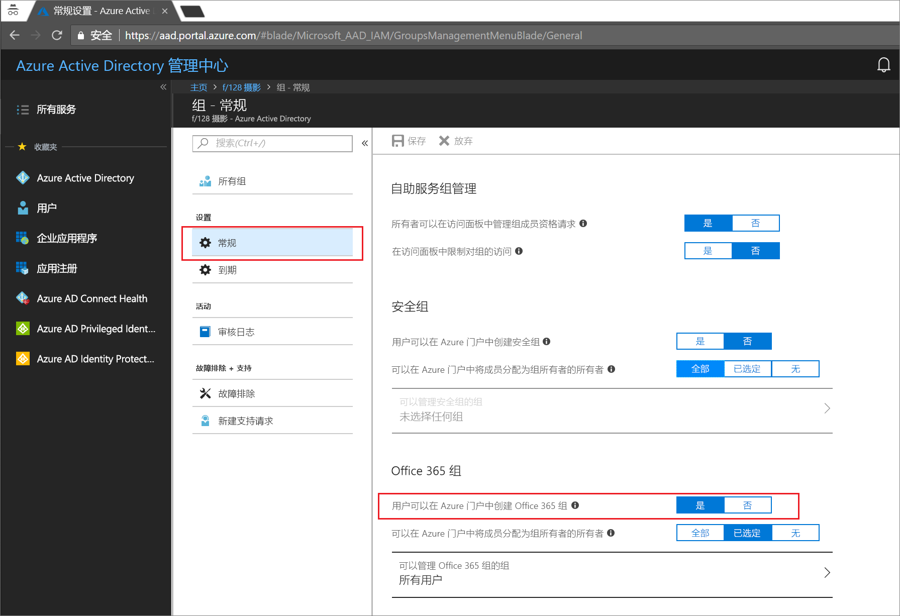
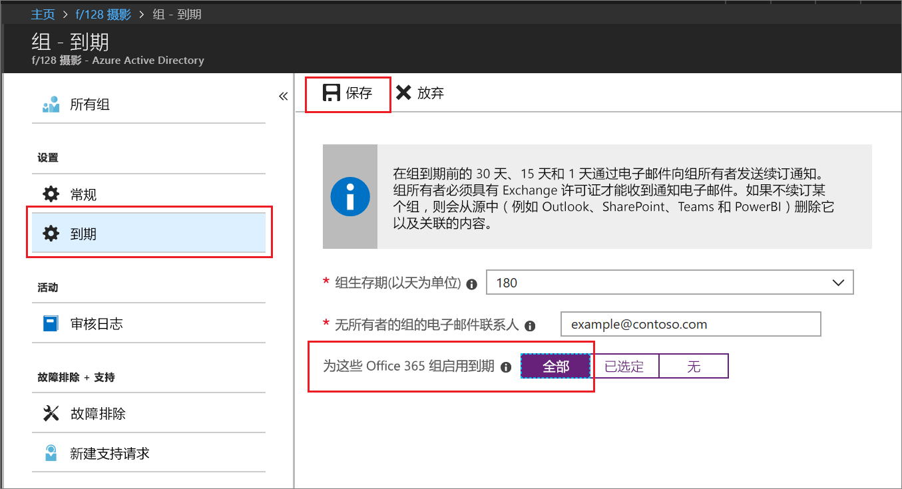

# 快速入门：将 Azure Active Directory 中的 Office 365 组设置为过期

本快速入门介绍如何设置 Office 365 组的过期策略。 当用户可以设置自己的组时，未使用的组可能会成倍增加。 若要管理未使用的组，一种方式是将这些组设置为过期，以便减少手动删除组的维护工作量。

过期策略很简单：

* 系统通知组所有者续订要过期的组
* 未续订的组会被删除
* 已删除的 Office 365 组可以由组所有者或 Azure AD 管理员在 30 天内还原

如果还没有 Azure 订阅，可以在开始前[创建一个免费帐户](https://azure.microsoft.com/free/)。

## 先决条件

只有租户中的全局管理员或用户帐户管理员才能设置组过期。

## 为组启用创建用户的功能

1. 使用充当目录全局管理员或用户帐户管理员的帐户登录到 [Azure 门户](https://portal.azure.com)。

2. 依次选择“组”、“常规”。
  
  

3. 将“用户可创建 Office 365 组”设置为“是”。

4. 设置完成后，选择“保存”以保存组设置。

## 设置组过期

1. 登录到 [Azure 门户](https://portal.azure.com)，选择“Azure Active Directory” > “组” > “过期”打开过期设置。
  
  

2. 设置过期时间间隔。 选择一个预设值，或者输入一个超过 31 天的自定义值。 

3. 提供当组没有所有者时用于发送过期通知的电子邮件地址。

4. 在本快速入门中，请将“为这些 Office 365 组启用过期”设置为“所有”。

5. 设置完成后，选择“保存”来保存过期设置。

就这么简单！ 在本快速入门中，你已成功设置所选 Office 365 组的过期策略。

## 清理资源

**删除过期策略**

1. 确保已使用一个其身份为租户全局管理员的帐户登录到 [Azure 门户](https://portal.azure.com)。
2. 选择“Azure Active Directory” > “组” > “过期”。
3. 将“为这些 Office 365 组启用过期”设置为“无”。

**为组禁用创建用户的功能**

1. 选择“Azure Active Directory” > “组” > “常规”。 
2. 将“用户可以在 Azure 门户中创建 Office 365 组”设置为“否”。

## 后续步骤

有关过期的详细信息，包括技术限制、如何添加自定义阻止单词的列表、跨 Office 365 应用的最终用户体验，请参阅以下文章，其中包含这些过期策略详细信息：

> [!div class="nextstepaction"]
> [过期策略的所有详细信息](groups-lifecycle.md)
