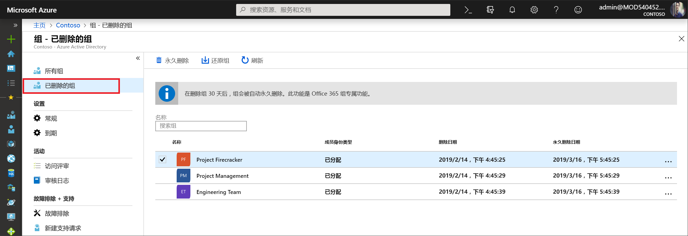

# <a name="restore-a-deleted-office-365-group-in-azure-active-directory"></a>在 Azure Active Directory 中还原已删除的 Office 365 组

在 Azure Active Directory (Azure AD) 中删除某个 Office 365 组后，删除的组会保留，但从删除日期开始算起的 30 天内将不可见。 此行为是为了在需要时可以还原组及其内容。 此功能仅适用于 Azure AD 中的 Office 365 组， 而不适用于安全组和分发组。 请注意，30 天的组还原期不可自定义。

> [!NOTE]
> 请勿使用 `Remove-MsolGroup`，因为它会永久清除组。 始终使用 `Remove-AzureADMSGroup` 来删除 Office 365 组。

还原组所需的权限可能是下列其中一项：

角色 | 权限
--------- | ---------
全局管理员、组管理员、合作伙伴 2 级支持人员和 Intune 管理员 | 可以还原任何已删除的 Office 365 组
用户管理员与合作伙伴 1 级支持人员 | 可以还原任何已删除的 Office 365 组，但分配给公司管理员角色的组除外
用户 | 可以还原他们拥有的任何已删除 Office 365 组

## <a name="view-and-manage-the-deleted-office-365-groups-that-are-available-to-restore"></a>查看和管理可还原的已删除 Office 365 组

1. 使用用户管理员帐户登录到 [Azure AD 管理中心](https://aad.portal.azure.com)。

2. 选择“组”，然后选择“已删除的组”，查看可还原的已删除组   。

    

3. 可以在“已删除的组”边栏选项卡上执行以下操作  ：

   - 选择“还原组”，从而还原已删除的组及其内容  。
   - 选择“永久删除”，从而永久删除已删除的组  。 只有管理员才能永久删除某个组。

## <a name="view-the-deleted-office-365-groups-that-are-available-to-restore-using-powershell"></a>使用 Powershell 查看可还原的已删除 Office 365 组

可以使用以下 cmdlet 查看已删除的组，确认尚未永久清除的、想要还原的一个或多个组。 这些 cmdlet 属于 [Azure AD PowerShell 模块](https://www.powershellgallery.com/packages/AzureAD/)。 [Azure Active Directory PowerShell 版本 2](/powershell/azure/install-adv2?view=azureadps-2.0) 一文中介绍了此模块的详细信息。

1.  运行以下 cmdlet，以显示 Azure AD 组织中所有已删除但仍可还原的 Office 365 组。
   

    ```powershell
    Get-AzureADMSDeletedGroup
    ```

2.  或者，如果知道特定组的 objectID（可通过步骤 1 中的 cmdlet 来获取该 ID），可运行以下 cmdlet 来确认已删除的但尚未永久清除的特定组。

    ```
    Get-AzureADMSDeletedGroup –Id <objectId>
    ```

## <a name="how-to-restore-your-deleted-office-365-group-using-powershell"></a>如何使用 Powershell 还原已删除的 Office 365 组

确认组仍可还原后，可以使用以下步骤之一还原已删除的组。 如果该组包含文档、SP 站点或其他持久对象，可能需要 24 小时才能完全还原该组及其内容。

1. 运行以下 cmdlet 还原该组及其内容。
 

   ```
    Restore-AzureADMSDeletedDirectoryObject –Id <objectId>
    ``` 

2. 或者，可运行以下 cmdlet 永久清除已删除的组。
    

    ```
    Remove-AzureADMSDeletedDirectoryObject –Id <objectId>
    ```

## <a name="how-do-you-know-this-worked"></a>如何知道是否还原成功？

若要验证是否已成功还原 Office 365 组，请运行 `Get-AzureADGroup –ObjectId <objectId>` cmdlet 显示有关该组的信息。 完成还原请求后：

- 该组显示在 Exchange 的左侧导航栏中
- 该组的计划会显示在 Planner 中
- 任何 SharePoint 站点及其所有内容都将可用
- 可从任何 Exchange 终结点以及支持 Office 365 组的其他 Office 365 工作负荷访问该组

## <a name="next-steps"></a>后续步骤

以下文章提供了有关 Azure Active Directory 组的更多信息。

* [查看现有组](../fundamentals/active-directory-groups-view-azure-portal.md)
* [管理组的设置](../fundamentals/active-directory-groups-settings-azure-portal.md)
* [管理组的成员](../fundamentals/active-directory-groups-members-azure-portal.md)
* [管理组的成员身份](../fundamentals/active-directory-groups-membership-azure-portal.md)
* [管理组中用户的动态规则](groups-dynamic-membership.md)
