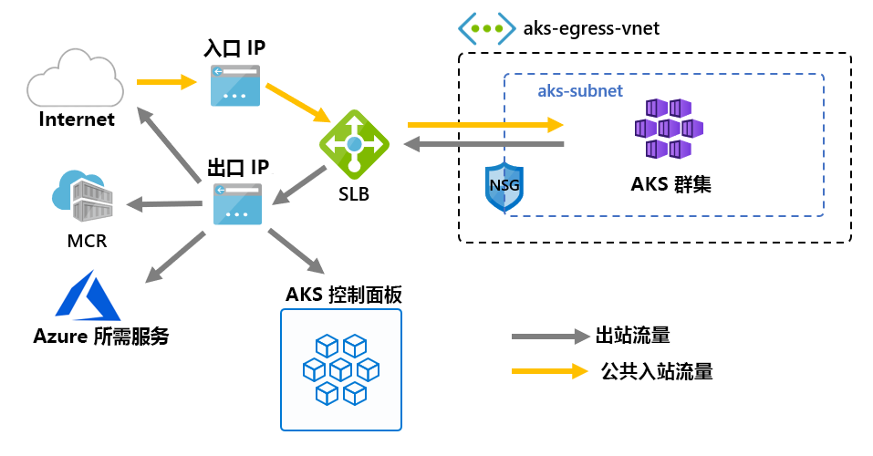

# <a name="customize-cluster-egress-with-a-user-defined-route-preview"></a>使用用户定义的路由自定义群集传出（预览）

可以自定义 AKS 群集的出口，以适合特定方案。 默认情况下，AKS 将设置要设置的标准 SKU 负载平衡器，并将其用于传出。 但是，如果不允许公共 Ip，或者出口需要额外的跃点，则默认设置可能不满足所有方案的要求。

本文介绍如何自定义群集的传出路由以支持自定义网络方案，例如不允许使用公共 Ip 的情况，并要求群集位于网络虚拟设备（NVA）后面。

> [!IMPORTANT]
> AKS 预览功能是自助服务，可通过选择进行提供。 预览*按*原样*提供，并*已从服务级别协议（SLA）和有限担保中排除。 *最大程度地*减少了客户支持 AKS 的预览。 因此，这些功能并不用于生产。 有关详细信息，请参阅以下支持文章：
>
> * [AKS 支持策略](support-policies.md)
> * [Azure 支持常见问题](faq.md)

## <a name="prerequisites"></a>先决条件
* Azure CLI 版本2.0.81 或更高版本
* Azure CLI 预览扩展版本0.4.28 或更高版本
* 或更高`2020-01-01`版本的 API

## <a name="install-the-latest-azure-cli-aks-preview-extension"></a>安装最新 Azure CLI AKS 预览版扩展
若要设置群集的出站类型，需要 Azure CLI AKS 预览版扩展版本0.4.18 或更高版本。 使用 az extension add 命令安装 Azure CLI AKS Preview 扩展，然后使用以下 az extension update 命令检查是否有任何可用的更新：

```azure-cli
# Install the aks-preview extension
az extension add --name aks-preview

# Update the extension to make sure you have the latest version installed
az extension update --name aks-preview
```

## <a name="limitations"></a>限制
* 在预览期间`outboundType` ，只能在群集创建时定义，以后不能更新。
* 预览期间， `outboundType` AKS 群集应使用 Azure CNI。 Kubenet 是可配置的，使用情况需要将路由表手动关联到 AKS 子网。
* 设置`outboundType` `vm-set-type`需要 AKS 群集`VirtualMachineScaleSets` ，并且`load-balancer-sku`的为。 `Standard`
* 如果`outboundType`将设置为值`UDR` ，则需要使用群集的有效出站连接的用户定义的路由。
* 如果`outboundType`将设置为值`UDR` ，则表示路由到负载平衡器的入口源 IP 可能与群集的传出出口目标地址**不匹配**。

## <a name="overview-of-outbound-types-in-aks"></a>AKS 中的出站类型概述

可以使用类型为负载均衡器的唯一`outboundType`或用户定义的路由自定义 AKS 群集。

> [!IMPORTANT]
> 出站类型仅影响群集的出口流量。 有关详细信息，请参阅[设置入口控制器](ingress-basic.md)。

### <a name="outbound-type-of-loadbalancer"></a>LoadBalancer 的出站类型

如果`loadBalancer`设置了，AKS 将自动完成以下设置。 负载均衡器用于通过 AKS 分配的公共 IP 进行传出。 的出站类型`loadBalancer`支持类型`loadBalancer`为 Kubernetes 的服务，该服务需要从 AKS 资源提供程序创建的负载均衡器出口。

以下设置由 AKS 完成。
   * 为群集传出设置公共 IP 地址。
   * 公共 IP 地址分配给负载均衡器资源。
   * 负载均衡器的后端池是群集中代理节点的设置。

下面是默认情况下在 AKS 群集中部署的网络拓扑，它`outboundType`使用`loadBalancer`的是。



### <a name="outbound-type-of-userdefinedrouting"></a>UserDefinedRouting 的出站类型

> [!NOTE]
> 使用出站类型是一种高级网络方案，需要正确的网络配置。

如果`userDefinedRouting`设置了，则 AKS 不会自动配置出口路径。 应由**用户**执行以下操作。

必须使用已配置的子网将 AKS 群集部署到现有的虚拟网络中。 使用标准负载均衡器（SLB）体系结构时，必须建立显式出口。 这要求向设备（例如防火墙、网关、本地）发送传出请求，或允许通过分配到标准负载均衡器或给定节点的公共 IP 完成出口。

AKS 资源提供程序将部署标准负载平衡器（SLB）。 负载均衡器未配置任何规则，并且在[下一条规则之前不会产生费用](https://azure.microsoft.com/pricing/details/load-balancer/)。 AKS**不**会自动为 SLB 前端预配公共 IP 地址。 AKS**不**会自动配置负载均衡器后端池。

## <a name="deploy-a-cluster-with-outbound-type-of-udr-and-azure-firewall"></a>使用 UDR 和 Azure 防火墙的出站类型部署群集

若要说明使用用户定义的路由的出站类型的应用程序，可以在使用 Azure 防火墙的虚拟网络对等互连上配置群集。


* 入口强制流过防火墙筛选器
   * 隔离子网包含用于路由到代理节点的内部负载均衡器
   * 代理节点在专用子网中隔离
* 出站请求使用用户定义的路由从代理节点开始到 Azure 防火墙内部 IP
   * 来自 AKS 代理节点的请求会跟随已放在 AKS 群集部署到的子网中的 UDR。
   * Azure Firewall 从公共 IP 前端 egresses 虚拟网络
   * 对 AKS 控制平面的访问受到启用了防火墙前端 IP 地址的 NSG 的保护
   * 访问公共 internet 或其他 Azure 服务流到防火墙前端 IP 地址

### <a name="set-configuration-via-environment-variables"></a>通过环境变量设置配置

定义要在资源创建中使用的一组环境变量。

```bash
PREFIX="contosofin"
RG="${PREFIX}-rg"
LOC="eastus"
NAME="${PREFIX}outboundudr"
AKS_NAME="${PREFIX}aks"
VNET_NAME="${PREFIX}vnet"
AKSSUBNET_NAME="${PREFIX}akssubnet"
SVCSUBNET_NAME="${PREFIX}svcsubnet"
# DO NOT CHANGE FWSUBNET_NAME - This is currently a requirement for Azure Firewall.
FWSUBNET_NAME="AzureFirewallSubnet"
FWNAME="${PREFIX}fw"
FWPUBLICIP_NAME="${PREFIX}fwpublicip"
FWIPCONFIG_NAME="${PREFIX}fwconfig"
FWROUTE_TABLE_NAME="${PREFIX}fwrt"
FWROUTE_NAME="${PREFIX}fwrn"
FWROUTE_NAME_INTERNET="${PREFIX}fwinternet"
DEVSUBNET_NAME="${PREFIX}dev"
```

接下来，设置订阅 Id。

```azure-cli
# Get ARM Access Token and Subscription ID - This will be used for AuthN later.

ACCESS_TOKEN=$(az account get-access-token -o tsv --query 'accessToken')

# NOTE: Update Subscription Name
# Set Default Azure Subscription to be Used via Subscription ID

az account set -s <SUBSCRIPTION_ID_GOES_HERE>

# NOTE: Update Subscription Name for setting SUBID

SUBID=$(az account show -s '<SUBSCRIPTION_NAME_GOES_HERE>' -o tsv --query 'id')
```

## <a name="create-a-virtual-network-with-multiple-subnets"></a>创建包含多个子网的虚拟网络

预配具有三个单独子网的虚拟网络，一个用于群集，一个用于防火墙，一个用于服务入口。


创建资源组以保存所有资源。

```azure-cli
# Create Resource Group

az group create --name $RG --location $LOC
```

创建两个虚拟网络来托管 AKS 群集和 Azure 防火墙。 每个都有其自己的子网。 让我们从 AKS 网络着手。

```
# Dedicated virtual network with AKS subnet

az network vnet create \
    --resource-group $RG \
    --name $VNET_NAME \
    --address-prefixes 100.64.0.0/16 \
    --subnet-name $AKSSUBNET_NAME \
    --subnet-prefix 100.64.1.0/24

# Dedicated subnet for K8s services

az network vnet subnet create \
    --resource-group $RG \
    --vnet-name $VNET_NAME \
    --name $SVCSUBNET_NAME \
    --address-prefix 100.64.2.0/24

# Dedicated subnet for Azure Firewall (Firewall name cannot be changed)

az network vnet subnet create \
    --resource-group $RG \
    --vnet-name $VNET_NAME \
    --name $FWSUBNET_NAME \
    --address-prefix 100.64.3.0/24
```

## <a name="create-and-setup-an-azure-firewall-with-a-udr"></a>使用 UDR 创建和设置 Azure 防火墙

必须配置 Azure 防火墙入站和出站规则。 防火墙的主要用途是使组织能够在 AKS 群集中设置精细的入口和出口流量规则。


创建一个标准 SKU 公共 IP 资源，该资源将用作 Azure 防火墙前端地址。

```azure-cli
az network public-ip create -g $RG -n $FWPUBLICIP_NAME -l $LOC --sku "Standard"
```

注册预览版 cli-扩展以创建 Azure 防火墙。
```azure-cli
# Install Azure Firewall preview CLI extension

az extension add --name azure-firewall

# Deploy Azure Firewall

az network firewall create -g $RG -n $FWNAME -l $LOC
```

现在可以将之前创建的 IP 地址分配到防火墙前端。
> [!NOTE]
> 将公共 IP 地址设置为 Azure 防火墙可能需要几分钟的时间。
> 
> 如果在以下命令上反复收到错误，请删除现有的防火墙和公共 IP，并同时通过门户设置公共 IP 和 Azure 防火墙。

```azure-cli
# Configure Firewall IP Config

az network firewall ip-config create -g $RG -f $FWNAME -n $FWIPCONFIG_NAME --public-ip-address $FWPUBLICIP_NAME --vnet-name $VNET_NAME
```

当前面的命令成功时，保存防火墙前端 IP 地址以便以后进行配置。

```bash
# Capture Firewall IP Address for Later Use

FWPUBLIC_IP=$(az network public-ip show -g $RG -n $FWPUBLICIP_NAME --query "ipAddress" -o tsv)
FWPRIVATE_IP=$(az network firewall show -g $RG -n $FWNAME --query "ipConfigurations[0].privateIpAddress" -o tsv)
```

### <a name="create-a-udr-with-a-hop-to-azure-firewall"></a>使用跃点到 Azure 防火墙创建 UDR

Azure 自动在 Azure 子网、虚拟网络与本地网络之间路由流量。 若要更改 Azure 的任何默认路由，可以创建一个路由表。

创建一个要与给定子网关联的空路由表。 路由表将定义下一跃点作为前面创建的 Azure 防火墙。 每个子网可以有一个与之关联的路由表，也可以没有。

```azure-cli
# Create UDR and add a route for Azure Firewall

az network route-table create -g $RG --name $FWROUTE_TABLE_NAME
az network route-table route create -g $RG --name $FWROUTE_NAME --route-table-name $FWROUTE_TABLE_NAME --address-prefix 0.0.0.0/0 --next-hop-type VirtualAppliance --next-hop-ip-address $FWPRIVATE_IP --subscription $SUBID
az network route-table route create -g $RG --name $FWROUTE_NAME_INTERNET --route-table-name $FWROUTE_TABLE_NAME --address-prefix $FWPUBLIC_IP/32 --next-hop-type Internet
```

有关如何覆盖 Azure 的默认系统路由或将其他路由添加到子网的路由表的信息，请参阅[虚拟网络路由表文档](../virtual-network/virtual-networks-udr-overview.md#user-defined)。

## <a name="adding-network-firewall-rules"></a>添加网络防火墙规则

> [!WARNING]
> 下面显示了添加防火墙规则的一个示例。 [必需的出口终结点](egress.md)中定义的所有出口终结点必须通过应用程序防火墙规则启用，AKS 群集才能正常运行。 如果没有启用这些终结点，则群集将无法运行。

下面是一个网络和应用程序规则的示例。 我们添加一个网络规则，该规则允许任何协议、源地址、目标地址和目标端口。 我们还为 AKS 所需的**某些**终结点添加应用程序规则。

在生产方案中，只应启用对应用程序所需终结点的访问，以及在[AKS 必需的出口](egress.md)中定义的终结点。

```
# Add Network FW Rules

az network firewall network-rule create -g $RG -f $FWNAME --collection-name 'aksfwnr' -n 'netrules' --protocols 'Any' --source-addresses '*' --destination-addresses '*' --destination-ports '*' --action allow --priority 100

# Add Application FW Rules
# IMPORTANT: Add AKS required egress endpoints

az network firewall application-rule create -g $RG -f $FWNAME \
    --collection-name 'AKS_Global_Required' \
    --action allow \
    --priority 100 \
    -n 'required' \
    --source-addresses '*' \
    --protocols 'http=80' 'https=443' \
    --target-fqdns \
        'aksrepos.azurecr.io' \
        '*blob.core.windows.net' \
        'mcr.microsoft.com' \
        '*cdn.mscr.io' \
        '*.data.mcr.microsoft.com' \
        'management.azure.com' \
        'login.microsoftonline.com' \
        'ntp.ubuntu.com' \
        'packages.microsoft.com' \
        'acs-mirror.azureedge.net'
```

若要详细了解 Azure 防火墙服务，请参阅[Azure 防火墙文档](https://docs.microsoft.com/azure/firewall/overview)。

## <a name="associate-the-route-table-to-aks"></a>将路由表关联到 AKS

若要将群集与防火墙关联，则群集子网的专用子网必须引用前面创建的路由表。 可以通过向虚拟网络发出用于更新群集子网的路由表的命令，来实现关联。

```azure-cli
# Associate route table with next hop to Firewall to the AKS subnet

az network vnet subnet update -g $RG --vnet-name $VNET_NAME --name $AKSSUBNET_NAME --route-table $FWROUTE_TABLE_NAME
```

## <a name="deploy-aks-with-outbound-type-of-udr-to-the-existing-network"></a>将 AKS 的出站类型 UDR 部署到现有网络

现在，可将 AKS 群集部署到现有的虚拟网络设置。 若要将群集出站类型设置为用户定义的路由，必须向 AKS 提供一个现有子网。


### <a name="create-a-service-principal-with-access-to-provision-inside-the-existing-virtual-network"></a>在现有虚拟网络中创建有权访问预配的服务主体

AKS 使用服务主体来创建群集资源。 创建时传递的服务主体用于创建 AKS 使用的基本 AKS 资源，如 Vm、存储和负载均衡器。 如果授予的权限太少，它将无法预配 AKS 群集。

```azure-cli
# Create SP and Assign Permission to Virtual Network

az ad sp create-for-rbac -n "${PREFIX}sp" --skip-assignment
```

现在`APPID` ，将和`PASSWORD`下面的替换为上一命令输出自动生成的服务主体 appid 和服务主体密码。 我们将引用 VNET 资源 ID 来向服务主体授予权限，以便 AKS 可以将资源部署到其中。

```azure-cli
APPID="<SERVICE_PRINCIPAL_APPID_GOES_HERE>"
PASSWORD="<SERVICEPRINCIPAL_PASSWORD_GOES_HERE>"
VNETID=$(az network vnet show -g $RG --name $VNET_NAME --query id -o tsv)

# Assign SP Permission to VNET

az role assignment create --assignee $APPID --scope $VNETID --role Contributor

# View Role Assignment
az role assignment list --assignee $APPID --all -o table
```

### <a name="deploy-aks"></a>部署 AKS

最后，可以将 AKS 群集部署到专用于群集的现有子网中。 要部署到的目标子网由环境变量定义`$SUBNETID`。 在前面的步骤`$SUBNETID`中未定义变量。 若要设置子网 ID 的值，可以使用以下命令：

```azurecli
SUBNETID="/subscriptions/$SUBID/resourceGroups/$RG/providers/Microsoft.Network/virtualNetworks/$VNET_NAME/subnets/$AKSSUBNET_NAME"
```

我们将定义出站类型以跟踪子网上存在的 UDR，从而使 AKS 可以跳过负载均衡器的设置和 IP 预配，该负载均衡器现在完全是内部的。

可添加[api 服务器授权 IP 范围](api-server-authorized-ip-ranges.md)的 AKS 功能，以限制仅限访问防火墙公共终结点的 api 服务器。 授权 IP 范围功能在关系图中表示为 NSG，必须传递此功能才能访问控制平面。 当启用授权 IP 范围功能以限制 API 服务器访问时，开发人员工具必须使用防火墙的虚拟网络中的 jumpbox，或者必须将所有开发人员终结点添加到授权的 IP 范围。

> [!TIP]
> 可以将其他功能添加到群集部署中，如（专用群集） []。 使用授权 IP 范围时，需要在群集网络内使用 jumpbox 来访问 API 服务器。

```azure-cli
az aks create -g $RG -n $AKS_NAME -l $LOC \
  --node-count 3 \
  --network-plugin azure --generate-ssh-keys \
  --service-cidr 192.168.0.0/16 \
  --dns-service-ip 192.168.0.10 \
  --docker-bridge-address 172.22.0.1/29 \
  --vnet-subnet-id $SUBNETID \
  --service-principal $APPID \
  --client-secret $PASSWORD \
  --load-balancer-sku standard \
  --outbound-type userDefinedRouting \
  --api-server-authorized-ip-ranges $FWPUBLIC_IP
  ```

### <a name="enable-developer-access-to-the-api-server"></a>启用对 API 服务器的开发人员访问

由于群集的授权 IP 范围设置，你必须将开发人员工具的 IP 地址添加到已批准 IP 范围的 AKS 群集列表，以访问 API 服务器。 另一种方法是在防火墙的虚拟网络中的单独子网内，使用所需的工具配置 jumpbox。

用以下命令将其他 IP 地址添加到已批准的范围

```bash
# Retrieve your IP address
CURRENT_IP=$(dig @resolver1.opendns.com ANY myip.opendns.com +short)

# Add to AKS approved list
az aks update -g $RG -n $AKS_NAME --api-server-authorized-ip-ranges $CURRENT_IP/32

```

 使用[az aks get 凭据][az-aks-get-credentials]命令将配置`kubectl`为连接到新创建的 Kubernetes 群集。 

 ```azure-cli
 az aks get-credentials -g $RG -n $AKS_NAME
 ```

### <a name="setup-the-internal-load-balancer"></a>设置内部负载均衡器

AKS 已部署具有群集的负载均衡器，可将其设置为[内部负载均衡器](internal-lb.md)。

若要创建内部负载均衡器，请创建一个名为 yaml 的服务清单，其中包含服务类型 LoadBalancer 和 azure 负载均衡器内部批注，如以下示例中所示：

```yaml
apiVersion: v1
kind: Service
metadata:
  name: internal-app
  annotations:
    service.beta.kubernetes.io/azure-load-balancer-internal: "true"
    service.beta.kubernetes.io/azure-load-balancer-internal-subnet: "contosofinsvcsubnet"
spec:
  type: LoadBalancer
  ports:
  - port: 80
  selector:
    app: internal-app
```

使用 kubectl apply 部署内部负载均衡器，并指定 YAML 清单的名称：

```bash
kubectl apply -f internal-lb.yaml
```

## <a name="deploy-a-kubernetes-service"></a>部署 Kubernetes 服务

由于群集出站类型设置为 UDR，AKS 在群集创建时，将代理节点作为负载均衡器的后端池进行关联不会自动完成。 但是，在部署 Kubernetes 服务时，后端池关联由 Kubernetes Azure 云提供程序处理。

将以下 yaml 复制到名为`example.yaml`的文件，部署 Azure 投票应用程序应用程序。

```yaml
apiVersion: apps/v1
kind: Deployment
metadata:
  name: azure-vote-back
spec:
  replicas: 1
  selector:
    matchLabels:
      app: azure-vote-back
  template:
    metadata:
      labels:
        app: azure-vote-back
    spec:
      nodeSelector:
        "beta.kubernetes.io/os": linux
      containers:
      - name: azure-vote-back
        image: redis
        resources:
          requests:
            cpu: 100m
            memory: 128Mi
          limits:
            cpu: 250m
            memory: 256Mi
        ports:
        - containerPort: 6379
          name: redis
---
apiVersion: v1
kind: Service
metadata:
  name: azure-vote-back
spec:
  ports:
  - port: 6379
  selector:
    app: azure-vote-back
---
apiVersion: apps/v1
kind: Deployment
metadata:
  name: azure-vote-front
spec:
  replicas: 1
  selector:
    matchLabels:
      app: azure-vote-front
  template:
    metadata:
      labels:
        app: azure-vote-front
    spec:
      nodeSelector:
        "beta.kubernetes.io/os": linux
      containers:
      - name: azure-vote-front
        image: microsoft/azure-vote-front:v1
        resources:
          requests:
            cpu: 100m
            memory: 128Mi
          limits:
            cpu: 250m
            memory: 256Mi
        ports:
        - containerPort: 80
        env:
        - name: REDIS
          value: "azure-vote-back"
---
apiVersion: v1
kind: Service
metadata:
  name: azure-vote-front
  annotations:
    service.beta.kubernetes.io/azure-load-balancer-internal: "true"
    service.beta.kubernetes.io/azure-load-balancer-internal-subnet: "contosofinsvcsubnet"
spec:
  type: LoadBalancer
  ports:
  - port: 80
  selector:
    app: azure-vote-front
```

通过运行以下操作部署服务：

```bash
kubectl apply -f example.yaml
```

## <a name="add-a-dnat-rule-to-azure-firewall"></a>将 DNAT 规则添加到 Azure 防火墙

若要配置入站连接，必须将 DNAT 规则写入 Azure 防火墙。 若要测试与群集的连接，请为防火墙前端公共 IP 地址定义一个规则，以便路由到由内部服务公开的内部 IP。

可以自定义目标地址，因为它是防火墙上要访问的端口。 转换后的地址必须是内部负载均衡器的 IP 地址。 转换后的端口必须是 Kubernetes 服务的已公开端口。

你将需要指定分配给 Kubernetes 服务创建的负载均衡器的内部 IP 地址。 通过运行以下内容检索地址：

```bash
kubectl get services
```

所需的 IP 地址将列在 "外部 IP" 列中，如下所示。

```bash
NAME               TYPE           CLUSTER-IP       EXTERNAL-IP   PORT(S)        AGE
azure-vote-back    ClusterIP      192.168.92.209   <none>        6379/TCP       23m
azure-vote-front   LoadBalancer   192.168.19.183   100.64.2.5    80:32106/TCP   23m
kubernetes         ClusterIP      192.168.0.1      <none>        443/TCP        4d3h
```

```azure-cli
az network firewall nat-rule create --collection-name exampleset --destination-addresses $FWPUBLIC_IP --destination-ports 80 --firewall-name $FWNAME --name inboundrule --protocols Any --resource-group $RG --source-addresses '*' --translated-port 80 --action Dnat --priority 100 --translated-address <INSERT IP OF K8s SERVICE>
```

## <a name="clean-up-resources"></a>清理资源

> [!NOTE]
> 删除 Kubernetes 内部服务时，如果任何服务都不再使用内部负载均衡器，Azure 云提供程序将删除内部负载均衡器。 下一次服务部署时，如果找不到请求的配置，则会部署负载均衡器。

若要清理 Azure 资源，请删除 AKS 资源组。

```azure-cli
az group delete -g $RG
```

## <a name="validate-connectivity"></a>验证连接

在浏览器中导航到 Azure Firewall 前端 IP 地址，以验证连接性。

应会看到 Azure 投票应用程序的映像。

## <a name="next-steps"></a>后续步骤

请参阅[Azure 网络 UDR 概述](https://docs.microsoft.com/azure/virtual-network/virtual-networks-udr-overview)。

请参阅[如何创建、更改或删除路由表](https://docs.microsoft.com/azure/virtual-network/manage-route-table)。

<!-- LINKS - internal -->
[az-aks-get-credentials]: /cli/azure/aks?view=azure-cli-latest#az-aks-get-credentials
