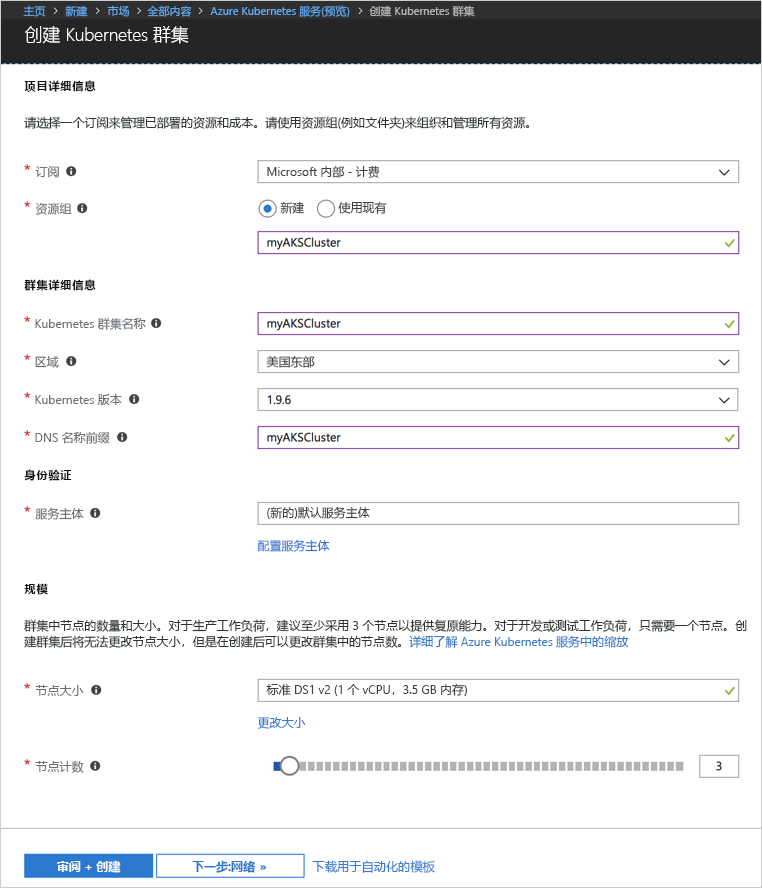
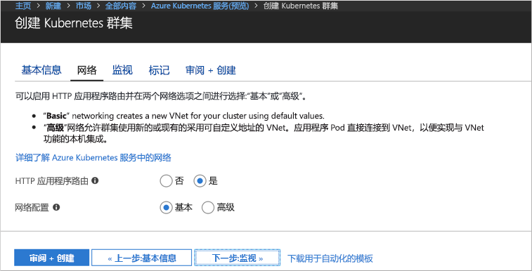
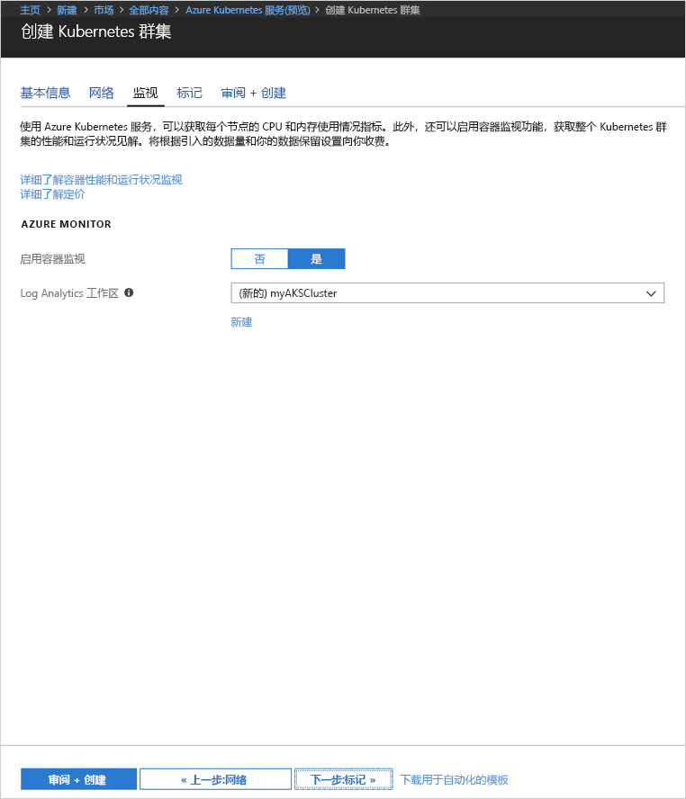
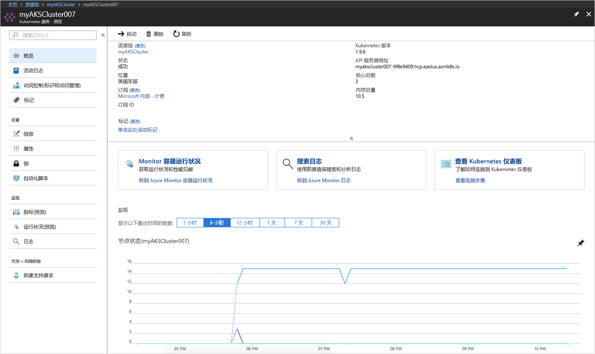
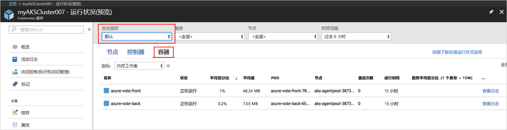
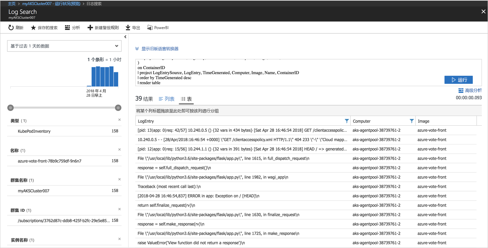

# <a name="quickstart-deploy-an-azure-kubernetes-service-aks-cluster"></a>快速入门：部署 Azure Kubernetes 服务 (AKS) 群集

本快速入门介绍如何使用 Azure 门户部署 AKS 群集。 然后，在群集上运行包含 Web 前端和 Redis 实例的多容器应用程序。 完成后，即可通过 Internet 访问应用程序。


本快速入门假设读者基本了解 Kubernetes 的概念。 有关 Kubernetes 的详细信息，请参阅 [Kubernetes 文档][kubernetes-documentation]。

## <a name="sign-in-to-azure"></a>登录 Azure

通过 http://portal.azure.com 登录到 Azure 门户。

## <a name="create-aks-cluster"></a>创建 AKS 群集

选择“创建资源”，然后选择“Kubernetes 服务”。

在创建 AKS 群集窗体的每个标题下完成以下步骤。

- **项目详细信息**：选择 Azure 订阅和一个新的或现有的 Azure 资源组。
- **群集详细信息**：输入 AKS 群集的名称、区域、版本和 DNS 名称前缀。
- **身份验证**：创建新的或使用现有的服务主体。 使用现有 SPN 时，需要提供 SPN 客户端 ID 和密码。
- **缩放**：选择 AKS 节点的 VM 大小。 一旦部署 AKS 群集，不能更改 VM 大小。 此外，选择要部署到群集的节点数。 部署群集后，可以调整节点计数。

完成时选择“下一步: 网络”。



配置以下网络选项：

- **Http 应用程序路由** - 配置创建自动公共 DNS 名称的集成入口控制器。 有关 Http 路由的详细信息，请参阅 [AKS HTTP 路由和 DNS][http-routing]。
- **网络配置** - 在使用 [kubenet][kubenet] Kubernetes 插件的基本网络配置和使用 [Azure CNI][azure-cni] 的高级网络配置之间进行选择。 有关网络选项的详细信息，请参阅 [AKS 网络概述][aks-network]。

完成时选择“下一步: 监视”。



部署 AKS 群集时，可以将 Azure 容器见解配置为监视 AKS 群集以及群集上运行的 Pod 的运行状况。 有关容器运行状况监视的详细信息，请参阅[监视 Azure Kubernetes 服务运行状况][aks-monitor]。

选择“是”启用容器监视并选择一个现有的或创建一个新的 Log Analytics。

完成时依次选择“评审 + 创建”、“创建”。



片刻之后，AKS 群集即可完成部署并可供使用。 浏览到 AKS 群集资源组，选择 AKS 资源，然后应看到 AKS 群集仪表板。



## <a name="connect-to-the-cluster"></a>连接至群集

若要管理 Kubernetes 群集，请使用 Kubernetes 命令行客户端 [kubectl][kubectl]。 Kubectl 客户端已预装在 Azure Cloud Shell 中。

使用 Azure 门户右上角的按钮打开 Cloud Shell。


使用 [az aks get-credentials][az-aks-get-credentials] 命令将 kubectl 配置为连接到 Kubernetes 群集。

将以下命令复制并粘贴到 Cloud Shell。 根据需要修改资源组和群集名称。

```azurecli-interactive
az aks get-credentials --resource-group myAKSCluster --name myAKSCluster
```

若要验证到群集的连接，请使用 [kubectl get][kubectl-get] 命令返回群集节点的列表。

```azurecli-interactive
kubectl get nodes
```

输出：

```
NAME                       STATUS    ROLES     AGE       VERSION
aks-agentpool-11482510-0   Ready     agent     9m        v1.9.6
aks-agentpool-11482510-1   Ready     agent     8m        v1.9.6
aks-agentpool-11482510-2   Ready     agent     9m        v1.9.6
```

## <a name="run-the-application"></a>运行应用程序

Kubernetes 清单文件用于定义群集的所需状态，例如，应该运行什么容器映像。 就此示例来说，清单用于创建运行 Azure Vote 应用程序所需的所有对象。 这些对象包括两个 [Kubernetes 部署][kubernetes-deployment]，一个用于 Azure Vote 前端，另一个用于 Redis 实例。 此外，还创建了两个 [Kubernetes 服务][kubernetes-service]，一个内部服务用于 Redis 实例，一个外部服务用于从 Internet 访问 Azure Vote 应用程序。

创建名为 `azure-vote.yaml` 的文件，并将以下 YAML 代码复制到其中。 如果在 Azure Cloud Shell 中操作，则可使用 vi 或 Nano 来创建此文件，就像在虚拟或物理系统中操作一样。

```yaml
apiVersion: apps/v1beta1
kind: Deployment
metadata:
  name: azure-vote-back
spec:
  replicas: 1
  template:
    metadata:
      labels:
        app: azure-vote-back
    spec:
      containers:
      - name: azure-vote-back
        image: redis
        ports:
        - containerPort: 6379
          name: redis
---
apiVersion: v1
kind: Service
metadata:
  name: azure-vote-back
spec:
  ports:
  - port: 6379
  selector:
    app: azure-vote-back
---
apiVersion: apps/v1beta1
kind: Deployment
metadata:
  name: azure-vote-front
spec:
  replicas: 1
  template:
    metadata:
      labels:
        app: azure-vote-front
    spec:
      containers:
      - name: azure-vote-front
        image: microsoft/azure-vote-front:v1
        ports:
        - containerPort: 80
        env:
        - name: REDIS
          value: "azure-vote-back"
---
apiVersion: v1
kind: Service
metadata:
  name: azure-vote-front
spec:
  type: LoadBalancer
  ports:
  - port: 80
  selector:
    app: azure-vote-front
```

使用 [kubectl apply][kubectl-apply] 命令运行该应用程序。

```azurecli-interactive
kubectl apply -f azure-vote.yaml
```

输出：

```
deployment "azure-vote-back" created
service "azure-vote-back" created
deployment "azure-vote-front" created
service "azure-vote-front" created
```

## <a name="test-the-application"></a>测试应用程序

在应用程序运行以后，将创建 [Kubernetes 服务][kubernetes-service]，向 Internet 公开应用程序。 此过程可能需要几分钟才能完成。

若要监视进度，请将 [kubectl get service][kubectl-get] 命令与 `--watch` 参数配合使用。

```azurecli-interactive
kubectl get service azure-vote-front --watch
```

起初，azure-vote-front 服务的 EXTERNAL-IP 显示为“挂起”。

```
NAME               TYPE           CLUSTER-IP   EXTERNAL-IP   PORT(S)        AGE
azure-vote-front   LoadBalancer   10.0.37.27   <pending>     80:30572/TCP   6s
```

EXTERNAL-IP 地址从“挂起”变为 IP 地址以后，请使用 `CTRL-C` 停止 kubectl 监视进程。

```
azure-vote-front   LoadBalancer   10.0.37.27   52.179.23.131   80:30572/TCP   2m
```

现在可以浏览到外部 IP 地址来查看 Azure Vote 应用。


## <a name="monitor-health-and-logs"></a>监视运行状况和日志

如果已启用容器见解监视，那么 AKS 群集仪表板将提供 AKS 群集以及群集上运行的 Pod 的运行状况指标。 有关容器运行状况监视的详细信息，请参阅[监视 Azure Kubernetes 服务运行状况][aks-monitor]。

若要查看 Azure Vote Pod 的当前状态、运行时间和资源使用情况，请浏览回到 AKS 资源，选择“监视容器运行状况”，选择“默认”命名空间，选择“容器”。 在 Azure 门户中填充此数据可能需要几分钟。



若要查看 `azure-vote-front` Pod 的日志，请选择“查看日志”链接。 这些日志包括容器中的 stdout 和 stderr 流。



## <a name="delete-cluster"></a>删除群集

不再需要群集时，可以删除群集资源，这会一并删除所有关联的资源。 通过选择 AKS 群集仪表板上的“删除”按钮，可以在 Azure 门户中完成此操作。 或者，可以在 Cloud Shell 中使用 [az aks delete][az-aks-delete] 命令。

```azurecli-interactive
az aks delete --resource-group myAKSCluster --name myAKSCluster --no-wait
```

## <a name="get-the-code"></a>获取代码

本快速入门使用预先创建的容器映像来创建 Kubernetes 部署。 GitHub 上提供了相关的应用程序代码、Dockerfile 和 Kubernetes 清单文件。

[https://github.com/Azure-Samples/azure-voting-app-redis][azure-vote-app]

## <a name="next-steps"></a>后续步骤

在本快速入门中，部署了 Kubernetes 群集，并向该群集部署了多容器应用程序。

若要详细了解 AKS 并演练部署示例的完整代码，请继续阅读“Kubernetes 群集”教程。

> [!div class="nextstepaction"]
> [AKS 教程][aks-tutorial]

<!-- LINKS - external -->
[azure-vote-app]: https://github.com/Azure-Samples/azure-voting-app-redis.git
[azure-cni]: https://github.com/Azure/azure-container-networking/blob/master/docs/cni.md
[kubectl]: https://kubernetes.io/docs/user-guide/kubectl/
[kubectl-apply]: https://kubernetes.io/docs/reference/generated/kubectl/kubectl-commands#apply
[kubectl-get]: https://kubernetes.io/docs/reference/generated/kubectl/kubectl-commands#get
[kubenet]: https://kubernetes.io/docs/concepts/cluster-administration/network-plugins/#kubenet
[kubernetes-deployment]: https://kubernetes.io/docs/concepts/workloads/controllers/deployment/
[kubernetes-documentation]: https://kubernetes.io/docs/home/
[kubernetes-service]: https://kubernetes.io/docs/concepts/services-networking/service/

<!-- LINKS - internal -->
[az-aks-get-credentials]: /cli/azure/aks?view=azure-cli-latest#az_aks_get_credentials
[az-aks-delete]: /cli/azure/aks#az-aks-delete
[aks-monitor]: ../monitoring/monitoring-container-health.md
[aks-network]: ./networking-overview.md
[aks-tutorial]: ./tutorial-kubernetes-prepare-app.md
[http-routing]: ./http-application-routing.md
