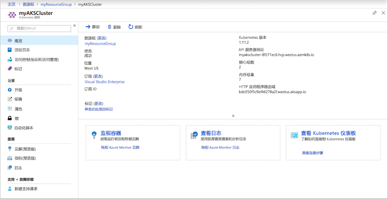
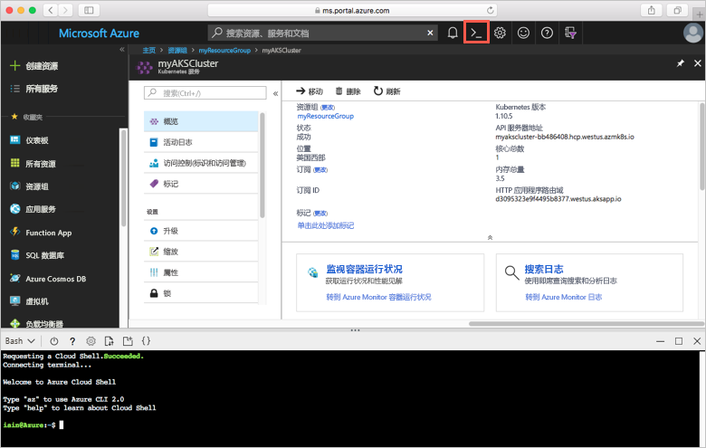
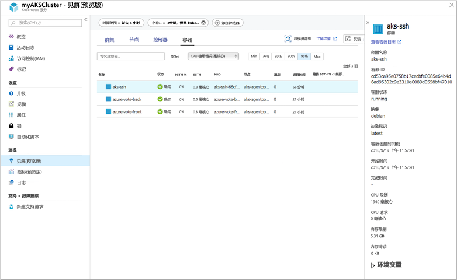

# <a name="quickstart-deploy-an-azure-kubernetes-service-aks-cluster"></a>快速入门：部署 Azure Kubernetes 服务 (AKS) 群集

本快速入门介绍如何使用 Azure 门户部署 AKS 群集。 然后，在群集上运行包含 Web 前端和 Redis 实例的多容器应用程序。 完成后，即可通过 Internet 访问应用程序。


本快速入门假设读者基本了解 Kubernetes 的概念。 有关 Kubernetes 的详细信息，请参阅 [Kubernetes 文档][kubernetes-documentation]。

## <a name="sign-in-to-azure"></a>登录 Azure

通过 http://portal.azure.com 登录到 Azure 门户。

## <a name="create-an-aks-cluster"></a>创建 AKS 群集

在 Azure 门户的左上角，选择“创建资源” > “Kubernetes 服务”。

若要创建 AKS 群集，请完成以下步骤：

1. **基本信息** - 配置以下选项：
    - *项目详细信息*：选择 Azure 订阅，然后选择或创建一个 Azure 资源组，例如 *myResourceGroup*。 输入 **Kubernetes 群集名称**，例如 *myAKSCluster*。
    - *群集详细信息*：选择 AKS 群集的区域、Kubernetes 版本和 DNS 名称前缀。
    - *缩放*：选择 AKS 节点的 VM 大小。 一旦部署 AKS 群集，不能更改 VM 大小。
        - 选择要部署到群集中的节点数。 对于本快速入门，请将“节点计数”设置为“1”。 部署群集后，可以调整节点计数。
    
    

    在完成时选择“下一步: 身份验证”。

1. **身份验证** - 配置以下选项：
    - 创建新的服务主体，或者通过“配置”来使用现有的。 使用现有 SPN 时，需要提供 SPN 客户端 ID 和密码。
    - 启用 Kubernetes 基于角色的访问控制 (RBAC) 所对应的选项。 这些控制可以对部署在 AKS 群集中的 Kubernetes 资源进行更精细的访问控制。

    

    完成时选择“下一步: 网络”。

1. **网络**：配置以下网络选项这些选项应该设置为默认值：
    
    - **Http 应用程序路由** - 选择“是”，以便配置可自动创建公共 DNS 名称的集成入口控制器。 有关 Http 路由的详细信息，请参阅 [AKS HTTP 路由和 DNS][http-routing]。
    - **网络配置** - 选择使用 [kubenet][kubenet] Kubernetes 插件的“基本”网络配置，而不是使用 [Azure CNI][azure-cni] 的高级网络配置。 有关网络选项的详细信息，请参阅 [AKS 网络概述][aks-network]。
    
    完成时选择“下一步: 监视”。

1. 部署 AKS 群集时，可以将 Azure 容器见解配置为监视 AKS 群集以及群集上运行的 Pod 的运行状况。 有关容器运行状况监视的详细信息，请参阅[监视 Azure Kubernetes 服务运行状况][aks-monitor]。

    选择“是”启用容器监视并选择一个现有的或创建一个新的 Log Analytics。
    
    就绪后，选择“评审 + 创建”，然后选择“创建”。

创建 AKS 群集并让其可供使用需要几分钟的时间。 浏览到 AKS 群集资源组（例如 *myResourceGroup*），然后选择 AKS 资源（例如 *myAKSCluster*）。 此时会显示 AKS 群集仪表板，如以下示例屏幕截图所示：



## <a name="connect-to-the-cluster"></a>连接至群集

若要管理 Kubernetes 群集，请使用 Kubernetes 命令行客户端 [kubectl][kubectl]。 `kubectl` 客户端已预装在 Azure Cloud Shell 中。

使用 Azure 门户右上角的按钮打开 Cloud Shell。



使用 [az aks get-credentials][az-aks-get-credentials] 命令将 `kubectl` 配置为连接到 Kubernetes 群集。 以下示例获取名为 *myResourceGroup* 的资源组中群集名称 *myAKSCluster* 的凭据：

```azurecli-interactive
az aks get-credentials --resource-group myResourceGroup --name myAKSCluster
```

若要验证到群集的连接，请使用 [kubectl get][kubectl-get] 命令返回群集节点的列表。

```azurecli-interactive
kubectl get nodes
```

以下示例输出显示在上一步创建的单个节点。

```
NAME                       STATUS    ROLES     AGE       VERSION
aks-agentpool-14693408-0   Ready     agent     10m       v1.10.5
```

## <a name="run-the-application"></a>运行应用程序

Kubernetes 清单文件用于定义群集的所需状态，例如，应该运行什么容器映像。 在本快速入门中，清单用于创建运行示例 Azure Vote 应用程序所需的所有对象。 这些对象包括两个 [Kubernetes 部署][kubernetes-deployment]，一个用于 Azure Vote 前端，另一个用于 Redis 实例。 此外，还创建了两个 [Kubernetes 服务][kubernetes-service]，一个内部服务用于 Redis 实例，一个外部服务用于从 Internet 访问 Azure Vote 应用程序。

创建名为 `azure-vote.yaml` 的文件，并将以下 YAML 代码复制到其中。 如果在 Azure Cloud Shell 中操作，则可使用 `vi` 或 `Nano` 来创建此文件，就像在虚拟或物理系统中操作一样。

```yaml
apiVersion: apps/v1beta1
kind: Deployment
metadata:
  name: azure-vote-back
spec:
  replicas: 1
  template:
    metadata:
      labels:
        app: azure-vote-back
    spec:
      containers:
      - name: azure-vote-back
        image: redis
        ports:
        - containerPort: 6379
          name: redis
---
apiVersion: v1
kind: Service
metadata:
  name: azure-vote-back
spec:
  ports:
  - port: 6379
  selector:
    app: azure-vote-back
---
apiVersion: apps/v1beta1
kind: Deployment
metadata:
  name: azure-vote-front
spec:
  replicas: 1
  template:
    metadata:
      labels:
        app: azure-vote-front
    spec:
      containers:
      - name: azure-vote-front
        image: microsoft/azure-vote-front:v1
        ports:
        - containerPort: 80
        env:
        - name: REDIS
          value: "azure-vote-back"
---
apiVersion: v1
kind: Service
metadata:
  name: azure-vote-front
spec:
  type: LoadBalancer
  ports:
  - port: 80
  selector:
    app: azure-vote-front
```

使用 [kubectl apply][kubectl-apply] 命令运行该应用程序。

```azurecli-interactive
kubectl create -f azure-vote.yaml
```

以下示例输出显示了在 AKS 群集上创建的 Kubernetes 资源：

```
deployment "azure-vote-back" created
service "azure-vote-back" created
deployment "azure-vote-front" created
service "azure-vote-front" created
```

## <a name="test-the-application"></a>测试应用程序

在应用程序运行以后，将创建 [Kubernetes 服务][kubernetes-service]，向 Internet 公开应用程序。 此过程可能需要几分钟才能完成。

若要监视进度，请将 [kubectl get service][kubectl-get] 命令与 `--watch` 参数配合使用。

```azurecli-interactive
kubectl get service azure-vote-front --watch
```

起初，azure-vote-front 服务的 EXTERNAL-IP 显示为“挂起”。

```
NAME               TYPE           CLUSTER-IP   EXTERNAL-IP   PORT(S)        AGE
azure-vote-front   LoadBalancer   10.0.37.27   <pending>     80:30572/TCP   6s
```

EXTERNAL-IP 地址从“挂起”变为 IP 地址以后，请使用 `CTRL-C` 停止 kubectl 监视进程。

```
azure-vote-front   LoadBalancer   10.0.37.27   52.179.23.131   80:30572/TCP   2m
```

将 Web 浏览器打开到服务的外部 IP 地址，以便查看 Azure Vote 应用，如以下示例所示：


## <a name="monitor-health-and-logs"></a>监视运行状况和日志

创建群集后，容器见解监视就已启用。 此监视功能为 AKS 群集以及群集上运行的 Pod 提供运行状况指标。 有关容器运行状况监视的详细信息，请参阅[监视 Azure Kubernetes 服务运行状况][aks-monitor]。

在 Azure 门户中填充此数据可能需要几分钟。 若要查看 Azure Vote Pod 的当前状态、运行时间和资源使用情况，请浏览回到 Azure 门户中的 AKS 资源，例如 *myAKSCluster*。 依次选择“监视容器运行状况”、“默认”命名空间、“容器”。  此时会显示 *azure-vote-back* 和 *azure-vote-front* 容器：



若要查看 `azure-vote-front` Pod 的日志，请在容器列表右侧选择“查看日志”链接。 这些日志包括容器中的 *stdout* 和 *stderr* 流。


## <a name="delete-cluster"></a>删除群集

不再需要群集时，可以删除群集资源，这会一并删除所有关联的资源。 选择 AKS 群集仪表板上的“删除”按钮即可在 Azure 门户中完成此操作。 也可在 Cloud Shell 中使用 [az aks delete][az-aks-delete] 命令：

```azurecli-interactive
az aks delete --resource-group myResourceGroup --name myAKSCluster --no-wait
```

## <a name="get-the-code"></a>获取代码

本快速入门使用预先创建的容器映像来创建 Kubernetes 部署。 GitHub 上提供了相关的应用程序代码、Dockerfile 和 Kubernetes 清单文件。

[https://github.com/Azure-Samples/azure-voting-app-redis][azure-vote-app]

## <a name="next-steps"></a>后续步骤

在本快速入门中，部署了 Kubernetes 群集，并向该群集部署了多容器应用程序。

若要详细了解 AKS 并演练部署示例的完整代码，请继续阅读“Kubernetes 群集”教程。

> [!div class="nextstepaction"]
> [AKS 教程][aks-tutorial]

<!-- LINKS - external -->
[azure-vote-app]: https://github.com/Azure-Samples/azure-voting-app-redis.git
[azure-cni]: https://github.com/Azure/azure-container-networking/blob/master/docs/cni.md
[kubectl]: https://kubernetes.io/docs/user-guide/kubectl/
[kubectl-apply]: https://kubernetes.io/docs/reference/generated/kubectl/kubectl-commands#apply
[kubectl-get]: https://kubernetes.io/docs/reference/generated/kubectl/kubectl-commands#get
[kubenet]: https://kubernetes.io/docs/concepts/cluster-administration/network-plugins/#kubenet
[kubernetes-deployment]: https://kubernetes.io/docs/concepts/workloads/controllers/deployment/
[kubernetes-documentation]: https://kubernetes.io/docs/home/
[kubernetes-service]: https://kubernetes.io/docs/concepts/services-networking/service/

<!-- LINKS - internal -->
[az-aks-get-credentials]: /cli/azure/aks?view=azure-cli-latest#az_aks_get_credentials
[az-aks-delete]: /cli/azure/aks#az-aks-delete
[aks-monitor]: ../monitoring/monitoring-container-health.md
[aks-network]: ./networking-overview.md
[aks-tutorial]: ./tutorial-kubernetes-prepare-app.md
[http-routing]: ./http-application-routing.md
