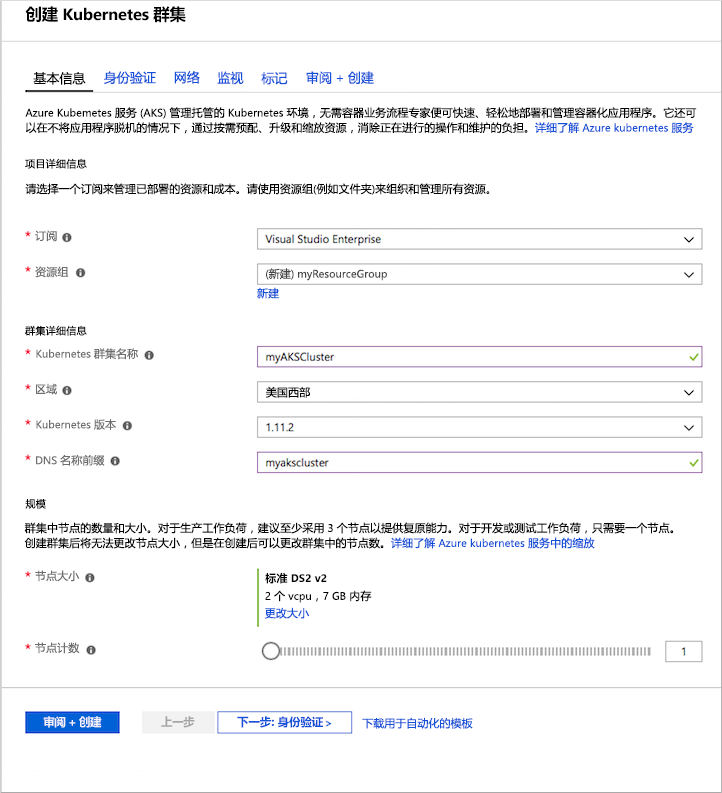
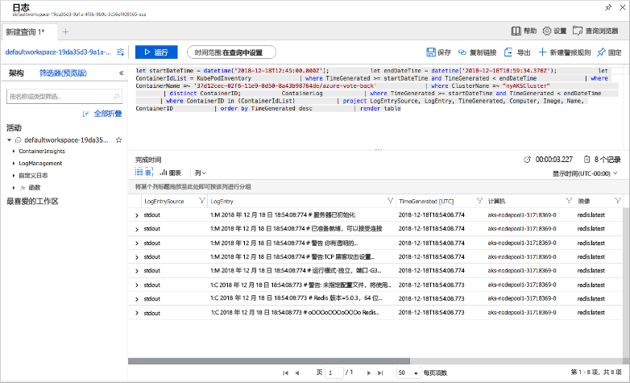

# <a name="quickstart-deploy-an-azure-kubernetes-service-aks-cluster-using-the-azure-portal"></a>快速入门：使用 Azure 门户部署 Azure Kubernetes 服务 (AKS) 群集

Azure Kubernetes 服务 (AKS) 是可用于快速部署和管理群集的托管式 Kubernetes 服务。 本快速入门介绍如何使用 Azure 门户部署 AKS 群集。 该群集中将运行一个包含 Web 前端和 Redis 实例的多容器应用程序。 然后，你将了解如何监视群集的运行状况，以及监视运行该应用程序的 Pod。


本快速入门假设读者基本了解 Kubernetes 的概念。 有关详细信息，请参阅 [Azure Kubernetes 服务 (AKS) 的 Kubernetes 核心概念][kubernetes-concepts]。

如果没有 Azure 订阅，请在开始之前创建一个[免费帐户](https://azure.microsoft.com/free/?WT.mc_id=A261C142F)。

## <a name="sign-in-to-azure"></a>登录 Azure

通过 https://portal.azure.com 登录到 Azure 门户。

## <a name="create-an-aks-cluster"></a>创建 AKS 群集

在 Azure 门户的左上角，选择“+ 创建资源” > “Kubernetes 服务”。  

若要创建 AKS 群集，请完成以下步骤：

1. **基本信息** - 配置以下选项：
   - 项目详细信息  ：选择 Azure 订阅，然后选择或创建 Azure 资源组，例如 *myResourceGroup*。 输入 **Kubernetes 群集名称**，例如 *myAKSCluster*。
   - *群集详细信息*：选择 AKS 群集的区域、Kubernetes 版本和 DNS 名称前缀。
   - *规模*：选择 AKS 节点的 VM 大小。 一旦部署 AKS 群集，不能更改 VM 大小  。
       - 选择要部署到群集中的节点数。 对于本快速入门，请将“节点计数”设置为“1”。   部署群集后，可以调整节点计数  。
    
     

     在完成时选择“下一步:  身份验证”。

1. **身份验证**：配置以下选项：
   - 创建新的服务主体，或者通过“配置”来使用现有的。  使用现有 SPN 时，需要提供 SPN 客户端 ID 和密码。
   - 启用 Kubernetes 基于角色的访问控制 (RBAC) 所对应的选项。 这些控制可以对部署在 AKS 群集中的 Kubernetes 资源进行更精细的访问控制。

     默认情况下将使用“基本”  网络，并且会启用适用于容器的 Azure Monitor。 就绪后，选择“评审 + 创建”，然后选择“创建”   。

创建 AKS 群集并让其可供使用需要几分钟的时间。 完成后，浏览到 AKS 群集资源组（例如 *myResourceGroup*），然后选择 AKS 资源（例如 *myAKSCluster*）。 此时会显示 AKS 群集仪表板，如以下示例屏幕截图所示：


## <a name="connect-to-the-cluster"></a>连接至群集

若要管理 Kubernetes 群集，请使用 Kubernetes 命令行客户端 [kubectl][kubectl]。 `kubectl` 客户端已预装在 Azure Cloud Shell 中。

使用 Azure 门户右上角的按钮打开 Cloud Shell。


若要将 `kubectl` 配置为连接到 Kubernetes 群集，请使用 [az aks get-credentials][az-aks-get-credentials] 命令。 此命令将下载凭据，并将 Kubernetes CLI 配置为使用这些凭据。 以下示例获取名为 *myResourceGroup* 的资源组中群集名称 *myAKSCluster* 的凭据：

```azurecli-interactive
az aks get-credentials --resource-group myResourceGroup --name myAKSCluster
```

若要验证到群集的连接，请使用 [kubectl get][kubectl-get] 命令返回群集节点的列表。

```azurecli-interactive
kubectl get nodes
```

以下示例输出显示在上一步创建的单个节点。 请确保节点的状态为 *Ready*：

```
NAME                       STATUS    ROLES     AGE       VERSION
aks-agentpool-14693408-0   Ready     agent     15m       v1.11.5
```

## <a name="run-the-application"></a>运行应用程序

Kubernetes 清单文件定义群集的所需状态，例如，要运行哪些容器映像。 在本快速入门中，清单用于创建运行 Azure Vote 应用程序所需的所有对象。 此清单包括两个 [Kubernetes 部署][kubernetes-deployment] - 一个用于 Azure Vote Python 示例应用程序，另一个用于 Redis 实例。 此外，还会创建两个 [Kubernetes 服务][kubernetes-service] - 一个内部服务用于 Redis 实例，一个外部服务用于从 Internet 访问 Azure Vote 应用程序。

> [!TIP]
> 在本快速入门中，请手动创建应用程序清单并将其部署到 AKS 群集。 在更实际的方案中，可以使用 [Azure Dev Spaces][azure-dev-spaces] 直接在 AKS 群集中快速地循环访问代码并对其进行调试。 可以跨 OS 平台和开发环境使用 Dev Spaces，并可与团队中的他人进行协作。

创建名为 `azure-vote.yaml` 的文件，并将其复制到以下 YAML 定义中。 在 Azure Cloud Shell 中，使用 `vi` 或 `Nano` 来创建此文件，就像在虚拟或物理系统中操作一样：

```yaml
apiVersion: apps/v1
kind: Deployment
metadata:
  name: azure-vote-back
spec:
  replicas: 1
  selector:
    matchLabels:
      app: azure-vote-back
  template:
    metadata:
      labels:
        app: azure-vote-back
    spec:
      nodeSelector:
        "beta.kubernetes.io/os": linux
      containers:
      - name: azure-vote-back
        image: redis
        resources:
          requests:
            cpu: 100m
            memory: 128Mi
          limits:
            cpu: 250m
            memory: 256Mi
        ports:
        - containerPort: 6379
          name: redis
---
apiVersion: v1
kind: Service
metadata:
  name: azure-vote-back
spec:
  ports:
  - port: 6379
  selector:
    app: azure-vote-back
---
apiVersion: apps/v1
kind: Deployment
metadata:
  name: azure-vote-front
spec:
  replicas: 1
  selector:
    matchLabels:
      app: azure-vote-front
  template:
    metadata:
      labels:
        app: azure-vote-front
    spec:
      nodeSelector:
        "beta.kubernetes.io/os": linux
      containers:
      - name: azure-vote-front
        image: microsoft/azure-vote-front:v1
        resources:
          requests:
            cpu: 100m
            memory: 128Mi
          limits:
            cpu: 250m
            memory: 256Mi
        ports:
        - containerPort: 80
        env:
        - name: REDIS
          value: "azure-vote-back"
---
apiVersion: v1
kind: Service
metadata:
  name: azure-vote-front
spec:
  type: LoadBalancer
  ports:
  - port: 80
  selector:
    app: azure-vote-front
```

使用 [kubectl apply][kubectl-apply] 命令部署应用程序，并指定 YAML 清单的名称：

```azurecli-interactive
kubectl apply -f azure-vote.yaml
```

以下示例输出显示已成功创建了部署和服务：

```
deployment "azure-vote-back" created
service "azure-vote-back" created
deployment "azure-vote-front" created
service "azure-vote-front" created
```

## <a name="test-the-application"></a>测试应用程序

应用程序运行时，Kubernetes 服务将向 Internet 公开应用程序前端。 此过程可能需要几分钟才能完成。

若要监视进度，请将 [kubectl get service][kubectl-get] 命令与 `--watch` 参数配合使用。

```azurecli-interactive
kubectl get service azure-vote-front --watch
```

最初，*azure-vote-front* 服务的 *EXTERNAL-IP* 显示为 *pending*。

```
NAME               TYPE           CLUSTER-IP   EXTERNAL-IP   PORT(S)        AGE
azure-vote-front   LoadBalancer   10.0.37.27   <pending>     80:30572/TCP   6s
```

当 *EXTERNAL-IP* 地址从 *pending* 更改为实际公共 IP 地址时，请使用 `CTRL-C` 停止 `kubectl` 监视进程。 以下示例输出显示向服务分配了有效的公共 IP 地址：

```
azure-vote-front   LoadBalancer   10.0.37.27   52.179.23.131   80:30572/TCP   2m
```

若要查看 Azure Vote 应用的实际效果，请打开 Web 浏览器并转到服务的外部 IP 地址。


## <a name="monitor-health-and-logs"></a>监视运行状况和日志

创建群集后，适用于容器的 Azure Monitor 便已启用。 此监视功能为 AKS 群集以及群集上运行的 Pod 提供运行状况指标。

在 Azure 门户中填充此数据可能需要几分钟。 若要查看 Azure Vote Pod 的当前状态、运行时间和资源使用情况，请浏览回到 Azure 门户中的 AKS 资源，例如 *myAKSCluster*。 然后可以访问运行状况，如下所示：

1. 在左侧的“监视”  下，选择“见解” 
1. 在顶部，选择“+ 添加筛选器” 
1. 选择“命名空间”  作为属性，然后选择“\<除 kube-system 之外的所有项\>” 
1. 选择查看“容器”  。

将显示 *azure-vote-back* 和 *azure-vote-front* 容器，如下面的示例中所示：


若要查看 `azure-vote-front` Pod 的日志，请在容器列表右侧选择“查看容器日志”链接  。 这些日志包括容器中的 *stdout* 和 *stderr* 流。



## <a name="delete-cluster"></a>删除群集

不再需要群集时，可以删除群集资源，这会一并删除所有关联的资源。 选择 AKS 群集仪表板上的“删除”按钮即可在 Azure 门户中完成此操作。  也可在 Cloud Shell 中使用 [az aks delete][az-aks-delete] 命令：

```azurecli-interactive
az aks delete --resource-group myResourceGroup --name myAKSCluster --no-wait
```

> [!NOTE]
> 删除群集时，AKS 群集使用的 Azure Active Directory 服务主体不会被删除。 有关如何删除服务主体的步骤，请参阅 [AKS 服务主体的注意事项和删除][sp-delete]。

## <a name="get-the-code"></a>获取代码

本快速入门使用预先创建的容器映像创建了 Kubernetes 部署。 GitHub 上提供了相关的应用程序代码、Dockerfile 和 Kubernetes 清单文件。

[https://github.com/Azure-Samples/azure-voting-app-redis][azure-vote-app]

## <a name="next-steps"></a>后续步骤

在本快速入门中，部署了 Kubernetes 群集，并向该群集部署了多容器应用程序。

若要详细了解 AKS 并演练部署示例的完整代码，请继续阅读“Kubernetes 群集”教程。

> [!div class="nextstepaction"]
> [AKS 教程][aks-tutorial]

<!-- LINKS - external -->
[azure-vote-app]: https://github.com/Azure-Samples/azure-voting-app-redis.git
[kubectl]: https://kubernetes.io/docs/user-guide/kubectl/
[kubectl-apply]: https://kubernetes.io/docs/reference/generated/kubectl/kubectl-commands#apply
[kubectl-get]: https://kubernetes.io/docs/reference/generated/kubectl/kubectl-commands#get
[kubernetes-documentation]: https://kubernetes.io/docs/home/

<!-- LINKS - internal -->
[kubernetes-concepts]: concepts-clusters-workloads.md
[az-aks-get-credentials]: /cli/azure/aks?view=azure-cli-latest#az-aks-get-credentials
[az-aks-delete]: /cli/azure/aks#az-aks-delete
[aks-monitor]: ../monitoring/monitoring-container-health.md
[aks-network]: ./concepts-network.md
[aks-tutorial]: ./tutorial-kubernetes-prepare-app.md
[http-routing]: ./http-application-routing.md
[sp-delete]: kubernetes-service-principal.md#additional-considerations
[azure-dev-spaces]: https://docs.microsoft.com/azure/dev-spaces/
[kubernetes-deployment]: concepts-clusters-workloads.md#deployments-and-yaml-manifests
[kubernetes-service]: concepts-network.md#services