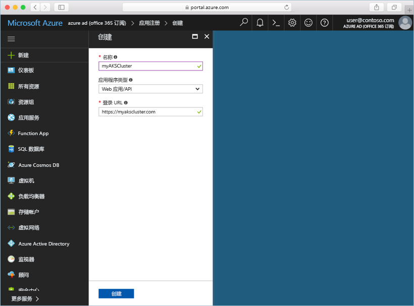
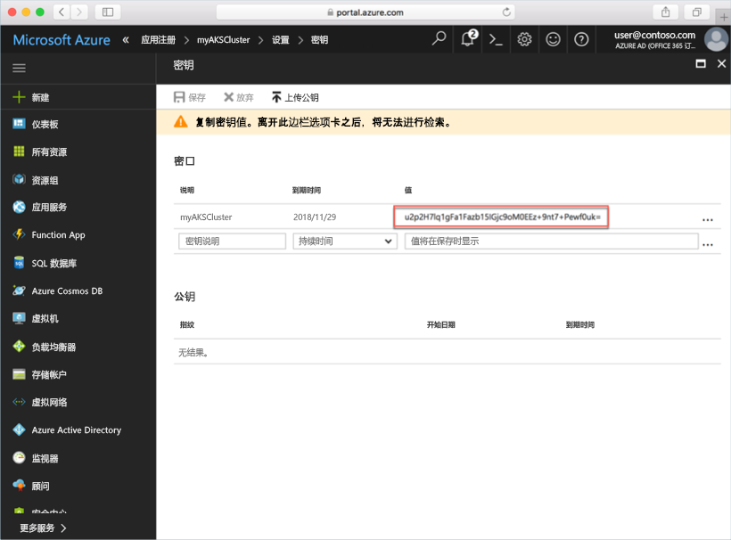

# <a name="deploy-an-azure-container-service-aks-cluster"></a>部署 Azure 容器服务 (AKS) 群集

本快速入门介绍如何使用 Azure 门户部署 AKS 群集。 然后，在群集上运行包含 Web 前端和 Redis 实例的多容器应用程序。 完成后，即可通过 Internet 访问应用程序。


本快速入门假设读者基本了解 Kubernetes 的概念。 有关 Kubernetes 的详细信息，请参阅 [Kubernetes 文档](https://kubernetes.io/docs/home/)。

## <a name="sign-in-to-azure"></a>登录 Azure

通过 http://portal.azure.com 登录到 Azure 门户。

## <a name="create-service-principal"></a>创建服务主体

在 Azure 门户中创建 AKS 群集之前，需要创建服务主体。 Azure 使用此服务主体来管理与 AKS 群集关联的基础结构。

选择“Azure Active Directory” > “应用注册” > “新建应用程序注册”。

输入应用程序的名称，可以是任何值。 选择“Web 应用/API”作为应用程序类型。 输入“登录 URL”的值；这可以是采用有效 URL 格式的任何值，而不需要是实际的终结点。

完成后，选择“创建”。



选择新建的应用程序注册，并记下应用程序 ID。 创建 AKS 群集时需要此值。


接下来，必须为服务主体创建密码。 选择“所有设置” > “密钥”，输入任意值作为密钥说明。 选择服务主体的有效持续时间。

单击“保存”，并记下密码值。 创建 AKS 群集时需要此密码。



## <a name="create-aks-cluster"></a>创建 AKS 群集

选择“新建” > “容器” > “Azure 容器服务 -AKS (预览版)”。

提供群集的群集名称、DNS 前缀、资源组名称、位置和 Kubernetes 版本。 记下群集名称和资源组名称，连接到群集时需要这些信息。

完成后选择“确定”。


在配置窗体中，输入以下信息:

- 用户名 - 为群集节点上的管理帐户指定的名称。
- SSH 公钥 - 与用于访问群集节点的密钥关联。
- 服务主体客户端 ID - 在本文档前面创建的服务主体的应用程序 ID。
- 服务主体客户端机密 - 在本文档前面创建的服务主体密码。
- 节点计数 - 要创建的 AKS 节点数。
- 节点虚拟机大小 - AKS 节点的 VM 大小
- OS 磁盘大小 - AKS 节点 OS 磁盘的大小。

完成后选择“确定”，完成验证后再次选择“确定”。


片刻之后，ASK 群集即可完成部署并可供使用。

## <a name="connect-to-the-cluster"></a>连接至群集

若要管理 Kubernetes 群集，请使用 Kubernetes 命令行客户端 [kubectl](https://kubernetes.io/docs/user-guide/kubectl/)。 Kubectl 客户端已预装在 Azure Cloud Shell 中。

使用 Azure 门户右上角的按钮打开 Cloud Shell。


使用 [az aks get-credentials](/cli/azure/aks?view=azure-cli-latest#az_aks_get_credentials) 命令将 kubectl 配置为连接到 Kubernetes 群集。

将以下命令复制并粘贴到 Cloud Shell。 根据需要修改资源组和群集名称。

```azurecli-interactive
az aks get-credentials --resource-group myAKSCluster --name myAKSCluster
```

若要验证到群集的连接，请使用 [kubectl get](https://kubernetes.io/docs/user-guide/kubectl/v1.6/#get) 命令返回群集节点的列表。

```azurecli-interactive
kubectl get nodes
```

输出：

```
NAME                       STATUS    ROLES     AGE       VERSION
aks-agentpool-14693408-0   Ready     agent     6m        v1.8.1
aks-agentpool-14693408-1   Ready     agent     6m        v1.8.1
aks-agentpool-14693408-2   Ready     agent     7m        v1.8.1
```

## <a name="run-the-application"></a>运行应用程序

Kubernetes 清单文件用于定义群集的所需状态，例如，应该运行什么容器图像。 就此示例来说，清单用于创建运行 Azure Vote 应用程序所需的所有对象。

创建名为 `azure-vote.yml` 的文件，并将以下 YAML 代码复制到其中。 如果在 Azure Cloud Shell 中操作，则可使用 vi 或 Nano 来创建此文件，就像在虚拟或物理系统中操作一样。

```yaml
apiVersion: apps/v1beta1
kind: Deployment
metadata:
  name: azure-vote-back
spec:
  replicas: 1
  template:
    metadata:
      labels:
        app: azure-vote-back
    spec:
      containers:
      - name: azure-vote-back
        image: redis
        ports:
        - containerPort: 6379
          name: redis
---
apiVersion: v1
kind: Service
metadata:
  name: azure-vote-back
spec:
  ports:
  - port: 6379
  selector:
    app: azure-vote-back
---
apiVersion: apps/v1beta1
kind: Deployment
metadata:
  name: azure-vote-front
spec:
  replicas: 1
  template:
    metadata:
      labels:
        app: azure-vote-front
    spec:
      containers:
      - name: azure-vote-front
        image: microsoft/azure-vote-front:redis-v1
        ports:
        - containerPort: 80
        env:
        - name: REDIS
          value: "azure-vote-back"
---
apiVersion: v1
kind: Service
metadata:
  name: azure-vote-front
spec:
  type: LoadBalancer
  ports:
  - port: 80
  selector:
    app: azure-vote-front
```

使用 [kubectl create](https://kubernetes.io/docs/user-guide/kubectl/v1.6/#create) 命令运行该应用程序。

```azurecli-interactive
kubectl create -f azure-vote.yml
```

输出：

```
deployment "azure-vote-back" created
service "azure-vote-back" created
deployment "azure-vote-front" created
service "azure-vote-front" created
```

## <a name="test-the-application"></a>测试应用程序

在应用程序运行以后，将创建 [Kubernetes 服务](https://kubernetes.io/docs/concepts/services-networking/service/)，向 Internet 公开应用程序前端。 此过程可能需要几分钟才能完成。

若要监视进度，请将 [kubectl get service](https://kubernetes.io/docs/user-guide/kubectl/v1.6/#get) 命令与 `--watch` 参数配合使用。

```azurecli-interactive
kubectl get service azure-vote-front --watch
```

起初，azure-vote-front 服务的 EXTERNAL-IP 显示为“挂起”。

```
NAME               TYPE           CLUSTER-IP   EXTERNAL-IP   PORT(S)        AGE
azure-vote-front   LoadBalancer   10.0.37.27   <pending>     80:30572/TCP   6s
```

EXTERNAL-IP 地址从“挂起”变为 IP 地址以后，请使用 `CTRL-C` 停止 kubectl 监视进程。

```
azure-vote-front   LoadBalancer   10.0.37.27   52.179.23.131   80:30572/TCP   2m
```

现在可以浏览到外部 IP 地址来查看 Azure Vote 应用。


## <a name="delete-cluster"></a>删除群集

不再需要群集时，可以删除群集资源组，这会一并删除所有关联的资源。 可在 Azure 门户中完成此操作：选择资源组并单击删除按钮即可。 或者，可以在 Cloud Shell 中使用 [az group delete](/cli/azure/group#delete) 命令。

```azurecli-interactive
az group delete --name myAKSCluster --no-wait
```

## <a name="get-the-code"></a>获取代码

本快速入门使用预先创建的容器映像来创建 Kubernetes 部署。 GitHub 上提供了相关的应用程序代码、Dockerfile 和 Kubernetes 清单文件。

[https://github.com/Azure-Samples/azure-voting-app-redis](https://github.com/Azure-Samples/azure-voting-app-redis.git)

## <a name="next-steps"></a>后续步骤

在本快速入门中，你部署了 Kubernetes 群集，并向该群集部署了多容器应用程序。

若要详细了解 AKS 并演练部署示例的完整代码，请继续阅读“Kubernetes 群集”教程。

> [!div class="nextstepaction"]
> [管理 AKS 群集](./tutorial-kubernetes-prepare-app.md)

