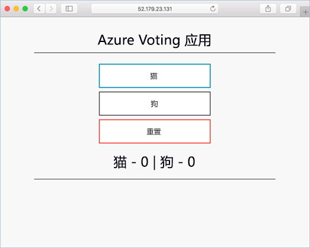

# <a name="quickstart-deploy-an-azure-container-service-aks-cluster"></a>快速入门：部署 Azure 容器服务 (AKS) 群集

在本快速入门中，将使用 Azure CLI 部署 AKS 群集。 然后，在群集上运行包含 Web 前端和 Redis 实例的多容器应用程序。 完成后，即可通过 Internet 访问应用程序。



本快速入门假定你基本了解 Kubernetes 概念。有关 Kubernetes 的详细信息，请参阅 [Kubernetes 文档][kubernetes-documentation]。

[!INCLUDE [cloud-shell-try-it.md](../../includes/cloud-shell-try-it.md)]

如果选择在本地安装并使用 CLI，本快速入门要求运行 Azure CLI 2.0.27 或更高版本。 运行 `az --version` 即可查找版本。 如果需要进行安装或升级，请参阅[安装 Azure CLI][azure-cli-install]。

## <a name="enabling-aks-preview"></a>启用 AKS 预览版

确保使用 `az provider register` 命令启用所需的 Azure 服务提供程序。 

```azurecli-interactive
az provider register -n Microsoft.Network
az provider register -n Microsoft.Storage
az provider register -n Microsoft.Compute
az provider register -n Microsoft.ContainerService
```

注册之后，即可通过 AKS 创建 Kubernetes 群集。

## <a name="create-a-resource-group"></a>创建资源组

使用 [az group create][az-group-create] 命令创建资源组。 Azure 资源组是在其中部署和管理 Azure 资源的逻辑组。
创建资源组时，系统会要求你指定一个位置，该位置是资源在 Azure 中进行存储的地方。 当 AKS 为预览版时，只有部分位置选项可用。 这些选项包括：`eastus, westeurope, centralus, canadacentral, canadaeast`。

以下示例在“eastus”位置创建名为“myResourceGroup”的资源组。

```azurecli-interactive
az group create --name myResourceGroup --location eastus
```

输出：

```json
{
  "id": "/subscriptions/00000000-0000-0000-0000-000000000000/resourceGroups/myResourceGroup",
  "location": "eastus",
  "managedBy": null,
  "name": "myResourceGroup",
  "properties": {
    "provisioningState": "Succeeded"
  },
  "tags": null
}
```

## <a name="create-aks-cluster"></a>创建 AKS 群集

使用 [az aks create][az-aks-create] 命令创建 AKS 群集。 以下示例创建一个具有一个节点的名为 myAKSCluster 的群集。

```azurecli-interactive
az aks create --resource-group myResourceGroup --name myAKSCluster --node-count 1 --generate-ssh-keys
```

几分钟后，该命令完成并返回有关群集的 JSON 格式信息。

## <a name="connect-to-the-cluster"></a>连接至群集

若要管理 Kubernetes 群集，请使用 Kubernetes 命令行客户端 [kubectl][kubectl]。

如果使用的是 Azure Cloud Shell，则 kubectl 已安装。 若要在本地安装，请使用 [az aks install-cli][az-aks-install-cli] 命令。


```azurecli
az aks install-cli
```

若要将 kubectl 配置为连接到 Kubernetes 群集，请使用 [az aks get-credentials][az-aks-get-credentials] 命令。 此步骤下载凭据，并将 Kubernetes CLI 配置为使用这些凭据。

```azurecli-interactive
az aks get-credentials --resource-group myResourceGroup --name myAKSCluster
```

若要验证到群集的连接，请使用 [kubectl get][kubectl-get] 命令返回群集节点的列表。 请注意，可能需要几分钟才会显示。

```azurecli-interactive
kubectl get nodes
```

输出：

```
NAME                          STATUS    ROLES     AGE       VERSION
k8s-myAKSCluster-36346190-0   Ready     agent     2m        v1.7.7
```

## <a name="run-the-application"></a>运行应用程序

Kubernetes 清单文件用于定义群集的所需状态，例如，应该运行什么容器图像。 就此示例来说，清单用于创建运行 Azure Vote 应用程序所需的所有对象。 提供的映像是一个示例应用程序，但你可以根据[创建映像](https://docs.microsoft.com/en-us/azure/aks/tutorial-kubernetes-prepare-app)和[部署到 Azure 容器注册表](https://docs.microsoft.com/en-us/azure/aks/tutorial-kubernetes-prepare-acr)中的说明来使用自己的。

创建名为 `azure-vote.yaml` 的文件，并将以下 YAML 代码复制到其中。 如果在 Azure Cloud Shell 中操作，则可使用 vi 或 Nano 来创建此文件，就像在虚拟或物理系统中操作一样。 如果是在本地操作，可以使用 Visual Studio Code 来创建该文件，只需运行 `code azure-vote.yaml` 即可。

```yaml
apiVersion: apps/v1beta1
kind: Deployment
metadata:
  name: azure-vote-back
spec:
  replicas: 1
  template:
    metadata:
      labels:
        app: azure-vote-back
    spec:
      containers:
      - name: azure-vote-back
        image: redis
        ports:
        - containerPort: 6379
          name: redis
---
apiVersion: v1
kind: Service
metadata:
  name: azure-vote-back
spec:
  ports:
  - port: 6379
  selector:
    app: azure-vote-back
---
apiVersion: apps/v1beta1
kind: Deployment
metadata:
  name: azure-vote-front
spec:
  replicas: 1
  template:
    metadata:
      labels:
        app: azure-vote-front
    spec:
      containers:
      - name: azure-vote-front
        image: microsoft/azure-vote-front:v1
        ports:
        - containerPort: 80
        env:
        - name: REDIS
          value: "azure-vote-back"
---
apiVersion: v1
kind: Service
metadata:
  name: azure-vote-front
spec:
  type: LoadBalancer
  ports:
  - port: 80
  selector:
    app: azure-vote-front
```

使用 [kubectl create][kubectl-create] 命令运行该应用程序。

```azurecli-interactive
kubectl create -f azure-vote.yaml
```

输出：

```
deployment "azure-vote-back" created
service "azure-vote-back" created
deployment "azure-vote-front" created
service "azure-vote-front" created
```

## <a name="test-the-application"></a>测试应用程序

在应用程序运行以后，将创建 [Kubernetes 服务][kubernetes-service]，向 Internet 公开应用程序前端。 此过程可能需要几分钟才能完成。

若要监视进度，请将 [kubectl get service][kubectl-get] 命令与 `--watch` 参数配合使用。

```azurecli-interactive
kubectl get service azure-vote-front --watch
```

azure-vote-front 服务的 EXTERNAL-IP 一开始显示为“挂起”。

```
NAME               TYPE           CLUSTER-IP   EXTERNAL-IP   PORT(S)        AGE
azure-vote-front   LoadBalancer   10.0.37.27   <pending>     80:30572/TCP   6s
```

EXTERNAL-IP 地址从“挂起”变为 IP 地址以后，请使用 `CTRL-C` 停止 kubectl 监视进程。

```
azure-vote-front   LoadBalancer   10.0.37.27   52.179.23.131   80:30572/TCP   2m
```

现在可以浏览到外部 IP 地址来查看 Azure Vote 应用。


## <a name="delete-cluster"></a>删除群集

如果不再需要群集，可以使用 [az group delete][az-group-delete] 命令删除资源组、容器服务及所有相关资源。

```azurecli-interactive
az group delete --name myResourceGroup --yes --no-wait
```

## <a name="get-the-code"></a>获取代码

本快速入门使用预先创建的容器映像来创建 Kubernetes 部署。 GitHub 上提供了相关的应用程序代码、Dockerfile 和 Kubernetes 清单文件。

[https://github.com/Azure-Samples/azure-voting-app-redis][azure-vote-app]

## <a name="next-steps"></a>后续步骤

在本快速入门中，你部署了 Kubernetes 群集，并向该群集部署了多容器应用程序。

若要详细了解 AKS 并演练部署示例的完整代码，请继续阅读“Kubernetes 群集”教程。

> [!div class="nextstepaction"]
> [ASK 教程][aks-tutorial]：

<!-- LINKS - external -->
[azure-vote-app]: https://github.com/Azure-Samples/azure-voting-app-redis.git
[kubectl]: https://kubernetes.io/docs/user-guide/kubectl/
[kubectl-create]: https://kubernetes.io/docs/reference/generated/kubectl/kubectl-commands#create
[kubectl-get]: https://kubernetes.io/docs/reference/generated/kubectl/kubectl-commands#get
[kubernetes-documentation]: https://kubernetes.io/docs/home/
[kubernetes-service]: https://kubernetes.io/docs/concepts/services-networking/service/

<!-- LINKS - internal -->
[az-aks-browse]: /cli/azure/aks?view=azure-cli-latest#az_aks_browse
[az-aks-create]: /cli/azure/aks?view=azure-cli-latest#az_aks_create
[az-aks-get-credentials]: /cli/azure/aks?view=azure-cli-latest#az_aks_get_credentials
[az aks install-cli]: /cli/azure/aks?view=azure-cli-latest#az_aks_install_cli
[az-group-create]: /cli/azure/group#az_group_create
[az-group-delete]: /cli/azure/group#az_group_delete
[azure-cli-install]: /cli/azure/install-azure-cli
[aks-tutorial]: ./tutorial-kubernetes-prepare-app.md

