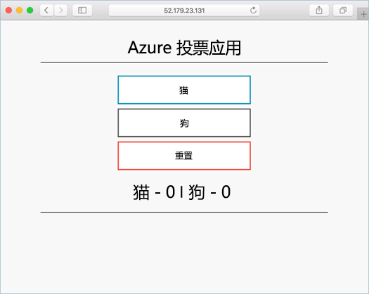

# <a name="tutorial-run-applications-in-azure-kubernetes-service-aks"></a>教程：在 Azure Kubernetes 服务 (AKS) 中运行应用程序

Kubernetes 为容器化应用程序提供一个分布式平台。 你生成自己的应用程序和服务并将其部署到 Kubernetes 群集中，让群集管理可用性和连接性。 在本教程中（第 4 部分，共 7 部分），示例应用程序会部署到 Kubernetes 群集中。 学习如何：

> [!div class="checklist"]
> * 更新 Kubernetes 清单文件
> * 在 Kubernetes 中运行应用程序
> * 测试应用程序

在另外的教程中，此应用程序将进行横向扩展和更新。

本快速入门假设读者基本了解 Kubernetes 的概念。 有关详细信息，请参阅 [Azure Kubernetes 服务 (AKS) 的 Kubernetes 核心概念][kubernetes-concepts]。

## <a name="before-you-begin"></a>开始之前

在前面的教程中，我们已将应用程度打包到容器映像中，将此映像上传到 Azure 容器注册表，并创建了 Kubernetes 群集。

必须先预创建 `azure-vote-all-in-one-redis.yaml` Kubernetes 清单文件，然后才能完成本教程。 此文件是在上一教程中与应用程序源代码一同下载。 验证是否已克隆存储库，并且是否已将目录更改为克隆的存储库。 如果尚未完成这些步骤，并且想要逐一完成，请开始参阅[教程 1 – 创建容器映像][aks-tutorial-prepare-app]。

此教程需要运行 Azure CLI 2.0.53 或更高版本。 运行 `az --version` 即可查找版本。 如果需要进行安装或升级，请参阅[安装 Azure CLI][azure-cli-install]。

## <a name="update-the-manifest-file"></a>更新清单文件

在这些教程中，请使用 Azure 容器注册表 (ACR) 实例来存储示例应用程序的容器映像。 若要部署此应用程序，必须更新 Kubernetes 清单文件中的映像名称，使之包括 ACR 登录服务器名称。

使用 [az acr list][az-acr-list] 命令获取 ACR 登录服务器名称，如下所示：

```azurecli
az acr list --resource-group myResourceGroup --query "[].{acrLoginServer:loginServer}" --output table
```

在第一个教程中克隆的 git 存储库中的示例清单文件使用登录服务器名称 *microsoft*。 确保位于所克隆的 *azure-voting-app-redis* 目录中，然后使用某个文本编辑器（例如 `vi`）打开清单文件：

```console
vi azure-vote-all-in-one-redis.yaml
```

将 *microsoft* 替换为 ACR 登录服务器名称。 映像名称位于清单文件的第 51 行。 以下示例展示了默认映像名称：

```yaml
containers:
- name: azure-vote-front
  image: microsoft/azure-vote-front:v1
```

提供自己的 ACR 登录服务器名称，使清单文件如以下示例所示：

```yaml
containers:
- name: azure-vote-front
  image: <acrName>.azurecr.io/azure-vote-front:v1
```

保存并关闭该文件。 在 `vi` 中，使用 `:wq`。

## <a name="deploy-the-application"></a>部署应用程序

若要部署应用程序，请使用 [kubectl apply][kubectl-apply] 命令。 此命令分析清单文件并创建定义的 Kubernetes 对象。 指定示例清单文件，如以下示例所示：

```console
kubectl apply -f azure-vote-all-in-one-redis.yaml
```

下面的示例输出表明已成功在 AKS 群集中创建了资源：

```
$ kubectl apply -f azure-vote-all-in-one-redis.yaml

deployment "azure-vote-back" created
service "azure-vote-back" created
deployment "azure-vote-front" created
service "azure-vote-front" created
```

## <a name="test-the-application"></a>测试应用程序

应用程序运行时，Kubernetes 服务将向 Internet 公开应用程序前端。 此过程可能需要几分钟才能完成。

若要监视进度，请将 [kubectl get service][kubectl-get] 命令与 `--watch` 参数配合使用。

```console
kubectl get service azure-vote-front --watch
```

最初，*azure-vote-front* 服务的 *EXTERNAL-IP* 显示为 *pending*：

```
azure-vote-front   10.0.34.242   <pending>     80:30676/TCP   7s
```

当 *EXTERNAL-IP* 地址从 *pending* 更改为实际公共 IP 地址时，请使用 `CTRL-C` 停止 `kubectl` 监视进程。 以下示例输出显示向服务分配了有效的公共 IP 地址：

```
azure-vote-front   10.0.34.242   52.179.23.131   80:30676/TCP   2m
```

若要查看应用程序的实际效果，请打开 Web 浏览器，以转到服务的外部 IP 地址：



如果应用程序未加载，可能是因为映像注册表存在授权问题。 若要查看容器的状态，请使用 `kubectl get pods` 命令。 如果无法拉取容器映像，请参阅[允许使用 Kubernetes 机密访问容器注册表](https://docs.microsoft.com/azure/container-registry/container-registry-auth-aks#access-with-kubernetes-secret)。

## <a name="next-steps"></a>后续步骤

在本教程中，已将示例 Azure 投票应用程序部署到 AKS 中的 Kubernetes 群集。 你已了解如何：

> [!div class="checklist"]
> * 更新 Kubernetes 清单文件
> * 在 Kubernetes 中运行应用程序
> * 测试应用程序

转到下一教程，了解如何缩放 Kubernetes 应用程序和底层 Kubernetes 基础结构。

> [!div class="nextstepaction"]
> [缩放 Kubernetes 应用程序和基础结构][aks-tutorial-scale]

<!-- LINKS - external -->
[kubectl-apply]: https://kubernetes.io/docs/reference/generated/kubectl/kubectl-commands#apply
[kubectl-create]: https://kubernetes.io/docs/reference/generated/kubectl/kubectl-commands#create
[kubectl-get]: https://kubernetes.io/docs/reference/generated/kubectl/kubectl-commands#get

<!-- LINKS - internal -->
[aks-tutorial-prepare-app]: ./tutorial-kubernetes-prepare-app.md
[aks-tutorial-scale]: ./tutorial-kubernetes-scale.md
[az-acr-list]: /cli/azure/acr
[azure-cli-install]: /cli/azure/install-azure-cli
[kubernetes-concepts]: concepts-clusters-workloads.md
[kubernetes-service]: concepts-network.md#services
