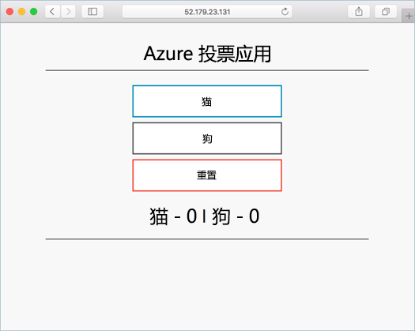

# <a name="tutorial-prepare-an-application-for-azure-kubernetes-service-aks"></a>教程：准备用于 Azure Kubernetes 服务 (AKS) 的应用程序

在本教程的第 1 部分（共 7 部分），将准备一个要在 Kubernetes 中使用的多容器应用程序。 现有的开发工具（例如 Docker Compose）用于在本地生成和测试应用程序。 学习如何：

> [!div class="checklist"]
> * 克隆 GitHub 中的示例应用程序源
> * 根据示例应用程序源创建容器映像
> * 在本地 Docker 环境中测试多容器应用程序

完成后，以下应用程序会在本地开发环境中运行：



在其他教程中，此容器映像会上传到 Azure 容器注册表，然后部署到 AKS 群集中。

## <a name="before-you-begin"></a>开始之前

本教程假定你基本了解核心 Docker 概念，如容器、容器映像和 `docker` 命令。 有关容器的入门基础知识，请参阅 [Docker 入门][docker-get-started]。

若要完成本教程，需要运行 Linux 容器的本地 Docker 开发环境。 Docker 提供的包可在 [Mac][docker-for-mac]、[Windows][docker-for-windows] 或 [Linux][docker-for-linux] 系统上配置 Docker。

Azure Cloud Shell 不包含完成这些教程的每个步骤所需的 Docker 组件。 因此，我们建议使用完整的 Docker 开发环境。

## <a name="get-application-code"></a>获取应用程序代码

本教程使用的示例应用程序是一个基本的投票应用。 该应用程序由前端 Web 组件和后端 Redis 实例组成。 Web 组件打包到自定义容器映像中。 Redis 实例使用 Docker 中心提供的未修改的映像。

使用 [git][] 可将示例应用程序克隆到开发环境：

```console
git clone https://github.com/Azure-Samples/azure-voting-app-redis.git
```

切换到克隆目录。

```console
cd azure-voting-app-redis
```

目录内包含应用程序源代码、预创建的 Docker Compose 文件和 Kubernetes 清单文件。 整套教程都会使用这些文件。

## <a name="create-container-images"></a>创建容器映像

使用 [Docker Compose][docker-compose]，可自动生成容器映像和部署多容器应用程序。

使用示例 `docker-compose.yaml` 文件创建容器映像、下载 Redis 映像和启动应用程序：

```console
docker-compose up -d
```

完成后，使用 [docker images][docker-images] 命令查看创建的映像。 已下载或创建三个映像。 *azure-vote-front* 映像包含前端应用程序，并以 `nginx-flask` 映像为依据。 `redis` 映像用于启动 Redis 实例。

```
$ docker images

REPOSITORY                   TAG        IMAGE ID            CREATED             SIZE
azure-vote-front             latest     9cc914e25834        40 seconds ago      694MB
redis                        latest     a1b99da73d05        7 days ago          106MB
tiangolo/uwsgi-nginx-flask   flask      788ca94b2313        9 months ago        694MB
```

运行 [docker ps][docker-ps] 命令，查看正在运行的容器：

```
$ docker ps

CONTAINER ID        IMAGE             COMMAND                  CREATED             STATUS              PORTS                           NAMES
82411933e8f9        azure-vote-front  "/usr/bin/supervisord"   57 seconds ago      Up 30 seconds       443/tcp, 0.0.0.0:8080->80/tcp   azure-vote-front
b68fed4b66b6        redis             "docker-entrypoint..."   57 seconds ago      Up 30 seconds       0.0.0.0:6379->6379/tcp          azure-vote-back
```

## <a name="test-application-locally"></a>在本地测试应用程序

若要查看正在运行的应用程序，请在本地 Web 浏览器中输入 `http://localhost:8080`。 示例应用程序会加载，如以下示例所示：


## <a name="clean-up-resources"></a>清理资源

现已验证应用程序的功能，可停止并删除正在运行的容器。 请勿删除容器映像 - 在下一教程中，会将 *azure-vote-front* 映像上传到 Azure 容器注册表实例。

使用 [docker-compose down][docker-compose-down] 命令停止并删除容器实例和资源：

```console
docker-compose down
```

删除本地应用程序以后，你就有了一个包含 Azure 投票应用程序的 Docker 映像 azure-vote-front  ，可以在下一教程中使用。

## <a name="next-steps"></a>后续步骤

本教程测试了应用程序并针对应用程序创建了容器映像。 你已了解如何执行以下操作：

> [!div class="checklist"]
> * 克隆 GitHub 中的示例应用程序源
> * 根据示例应用程序源创建容器映像
> * 在本地 Docker 环境中测试多容器应用程序

请转到下一教程，了解如何在 Azure 容器注册表中存储容器映像。

> [!div class="nextstepaction"]
> [向 Azure 容器注册表推送映像][aks-tutorial-prepare-acr]

<!-- LINKS - external -->
[docker-compose]: https://docs.docker.com/compose/
[docker-for-linux]: https://docs.docker.com/engine/installation/#supported-platforms
[docker-for-mac]: https://docs.docker.com/docker-for-mac/
[docker-for-windows]: https://docs.docker.com/docker-for-windows/
[docker-get-started]: https://docs.docker.com/get-started/
[docker-images]: https://docs.docker.com/engine/reference/commandline/images/
[docker-ps]: https://docs.docker.com/engine/reference/commandline/ps/
[docker-compose-down]: https://docs.docker.com/compose/reference/down
[git]: https://git-scm.com/downloads

<!-- LINKS - internal -->
[aks-tutorial-prepare-acr]: ./tutorial-kubernetes-prepare-acr.md
