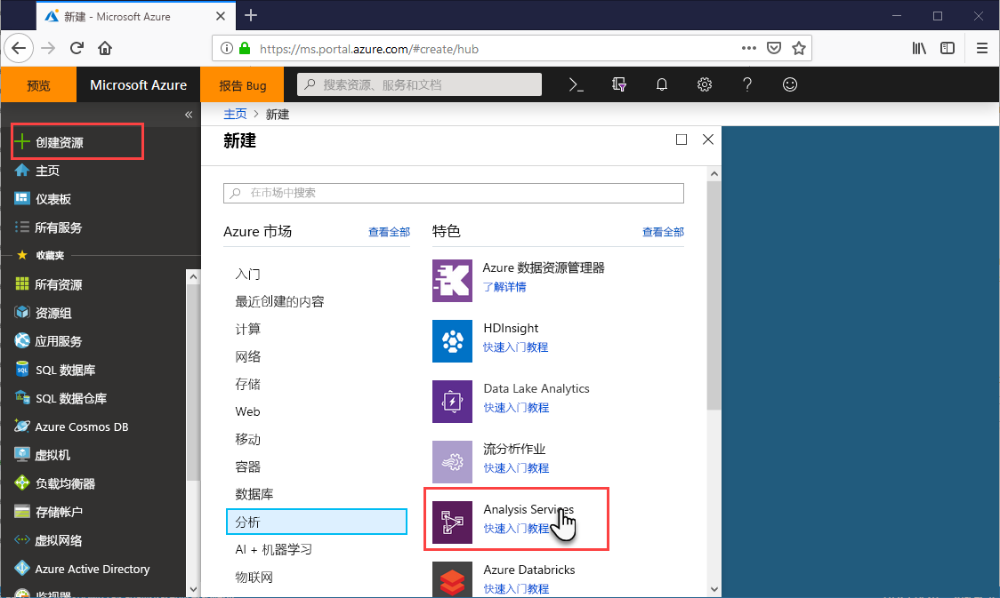
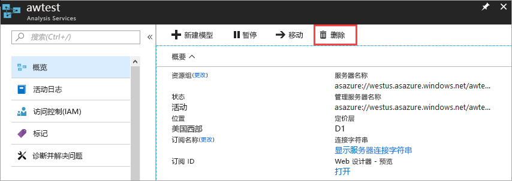

# 快速入门：创建服务器 - 门户

本快速入门介绍如何使用门户在 Azure 订阅中创建 Analysis Services 服务器资源。

## 先决条件 

* **Azure 订阅**：访问 [Azure 免费试用版](https://azure.microsoft.com/offers/ms-azr-0044p/)以创建帐户。
* **Azure Active Directory**：订阅必须与 Azure Active Directory 租户相关联。 并且，需要使用 Azure Active Directory 中的一个帐户登录 Azure。 若要了解详细信息，请参阅[身份验证和用户权限](analysis-services-manage-users.md)。

## 登录到 Azure 门户 

[登录门户](https://portal.azure.com)

## 创建服务器

1. 依次单击“+ 创建资源” > “Analytics” > “Analysis Services”  。

    

2. 在“Analysis Services”中，填写必填字段，然后按“创建” 。
   
   * **服务器名称**：键入用于引用服务器的唯一名称。 服务器名称必须以小写字符开头，并且包含 3 到 128 个小写字符和数字。 不允许使用空格和特殊字符。
   * **订阅**：选择此服务器要关联到的订阅。
   * **资源组**：创建一个新资源组或选择一个现有资源组。 资源组旨在帮助管理 Azure 资源的集合。 有关详细信息，请参阅[资源组](../azure-resource-manager/management/overview.md)。
   * **位置**：此 Azure 数据中心位置托管该服务器。 选择最接近最大用户群的位置。
   * **定价层**：选择定价层。 如果要进行测试且想要安装示例模型数据库，请选择免费的 D1 层。 若要了解详细信息，请参阅 [Azure Analysis Services 定价](https://azure.microsoft.com/pricing/details/analysis-services/)。 
   * **管理员**：默认情况下，这是用于登录的帐户。 可从 Azure Active Directory 选择其他帐户。
   * **备份存储设置**：可选。 如果已有[存储帐户](../storage/common/storage-introduction.md)，则可将其指定为默认模型数据库备份帐户。 稍后还可指定[备份和还原](analysis-services-backup.md)设置。
   * **存储密钥有效期**：可选。 指定存储密钥的有效期。

创建服务器通常不超过一分钟的时间。 如果选择“添加到门户”，请导航到门户查看新服务器。 或者，导航到“所有服务” > “Analysis Services”，查看服务器是否就绪。 服务器支持 1200 和更高兼容级别的表格模型。 模型兼容性级别在 Visual Studio 或 SSMS 中指定。

## 清理资源

不再需要服务器时，即可将其删除。 单击服务器“概述”中的“删除” 。 

 

## 后续步骤
本快速入门介绍了如何在 Azure 订阅中创建服务器。 创建服务器后，可以通过配置（可选）的服务器防火墙对其进行保护。 还可以直接从门户将基本示例数据模型添加到服务器。 拥有一个示例模型有助于了解如何配置模型数据库角色和测试客户端连接。 若要了解更多信息，请继续学习有关添加示例模型的教程。

> [!div class="nextstepaction"]
> [快速入门：配置服务器防火墙 - 门户](analysis-services-qs-firewall.md)   
> [!div class="nextstepaction"]
> [教程：将示例模型添加到服务器](analysis-services-create-sample-model.md)
