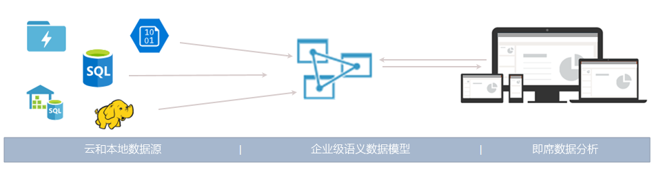
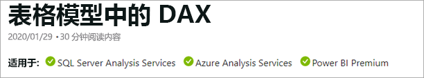

# 什么是 Azure Analysis Services？

Azure Analysis Services 是一个完全托管的平台即服务 (PaaS)，它在云中提供企业级的数据模型。 使用高级糅合和建模功能，可以在单个受信任的表格语义数据模型中合并多个数据源中的数据、定义指标以及保护数据。 数据模型可让用户更快速轻松地使用 Power BI 和 Excel 等工具执行即席数据分析。

**视频：** 请观看 [Azure Analysis Services Overview](https://sec.ch9.ms/ch9/d6dd/a1cda46b-ef03-4cea-8f11-68da23c5d6dd/AzureASoverview_high.mp4)（Azure Analysis Services 概述），了解 Azure Analysis Services 如何适应 Microsoft 的整体 BI 功能。

## 快速启动和运行

在 Azure 门户中，数分钟即可[创建服务器](analysis-services-create-server.md)。 借助 Azure 资源管理器[模板](../azure-resource-manager/resource-manager-create-first-template.md)和 PowerShell，可以使用声明性模板来创建服务器。 利用单个模板可以部署服务器资源及其他 Azure 组件，例如存储帐户和 Azure Functions。 

**视频：** 请观看 [Automating deployment](https://channel9.msdn.com/series/Azure-Analysis-Services/AzureAnalysisServicesAutomation)（将部署自动化），详细了解如何使用 Azure 自动化来加速服务器的创建。

Azure Analysis Services 集成许多 Azure 服务，因此可以生成复杂的分析解决方案。 集成 [Azure Active Directory](../active-directory/fundamentals/active-directory-whatis.md) 后可以对关键数据进行安全的基于角色的访问。 只需包括一项将数据加载到模型中的活动，即可集成 [Azure 数据工厂](../data-factory/introduction.md)管道。 可通过自定义代码将 [Azure 自动化](../automation/automation-intro.md)和 [Azure Functions](../azure-functions/functions-overview.md) 用于模型的轻型业务流程。 

## 符合需要的层级

可在“开发人员”层、“基本”层和“标准”层使用 Azure Analysis Services。    每个层中的计划成本因处理能力、查询处理单位 (QPU) 和内存大小而异。 创建服务器时，将在层内选择计划。 可以在同一层内上下更改计划，或者升级到更高的层，但不能从较高的层降级到较低的层。

### 开发人员层

对于评估、开发和测试方案，建议使用此层。 单个计划包含标准层的相同功能，但处理能力、QPU 和内存大小有限制。 查询副本横向扩展*不适用于*此层。 此层不提供 SLA。

|计划  |QPU  |内存 (GB)  |
|---------|---------|---------|
|D1    |    20     |    3     |

### 基本层

建议在具有小型表格模型的生产解决方案、限制用户并发性和要求简单数据刷新的场合下使用该层。 查询副本横向扩展*不适用于*此层。 此层不支持透视图、多个分区和 DirectQuery 表格模型功能。   

|计划  |QPU  |内存 (GB)  |
|---------|---------|---------|
|B1    |    40     |    10     |
|B2    |    80     |    16     |

### 标准层

此层适用于需要弹性用户并发性，且数据模型不断扩大的任务关键型生产应用程序。 它支持使用高级数据刷新实现接近实时的数据模型更新，并支持所有表格建模功能。

|计划  |QPU  |内存 (GB)  |
|---------|---------|---------|
|S0    |    40     |    10     |
|S1    |    100     |    25     |
|S2    |    200     |    50     |
|S4    |    400     |    100     |
|S8 [1](#depr)、[2](#rec)    |    320    |    200     |
|S9 [1](#depr)、[2](#rec)    |    640    |    400     |
|S8v2 [1](#depr)   |    640     |    200     |
|S9v2 [1](#depr)    |    1280    |    400     |

<a name="depr">1</a> - 并未在所有区域推出。   
<a name="rec">2</a> - 此计划已弃用。 建议使用 v2。

## 按区域列出的可用性

全球的各个区域都支持 azure Analysis Services。 支持的计划和查询副本可用性取决于所选的区域。 计划和查询副本可用性可能会根据每个区域的需求和可用资源而变化。 

### 美洲

|区域  | 支持的计划 | 查询副本（仅限标准计划） |
|---------|---------|:---------:|
|巴西南部     |    B1、B2、S0、S1、S2、S4、D1     |     1    |
|加拿大中部    |     B1、B2、S0、S1、S2、S4、D1    |     1    |
|美国东部     |     B1、B2、S0、S1、S2、S4、D1    |    1     |
|美国东部 2     |     B1、B2、S0、S1、S2、S4、D1   |    7    |
|美国东部 2     |     S8[2](#rec)、S9[2](#rec)、S8v2、S9v2   |    1    |
|美国中北部     |     B1、B2、S0、S1、S2、S4、D1     |    1     |
|美国中部     |    B1、B2、S0、S1、S2、S4、D1     |    1     |
|美国中南部     |    B1、B2、S0、S1、S2、S4、D1     |    1     |
|美国中西部   |     B1、B2、S0、S1、S2、S4、D1    |    3     |
|美国西部     |    B1、B2、S0、S1、S2、S4、D1    |    7   |
|美国西部     |    S8[2](#rec)、S9[2](#rec)、S8v2、S9v2   |    2  |
|美国西部 2    |    B1、B2、S0、S1、S2、S4、D1    |    3   |
|美国西部 2    |    S8[2](#rec)、S9[2](#rec)、S8v2、S9v2  |    1     |

### 欧洲

|区域  | 支持的计划 | 查询副本（仅限标准计划） |
|---------|---------|:---------:|
|北欧     |    B1、B2、S0、S1、S2、S4、D1      |    7     |
|北欧     |    S8v2、S9v2      |    3     |
|英国南部     |    B1、B2、S0、S1、S2、S4、D1      |     1    |
|西欧     |    B1、B2、S0、S1、S2、S4、D1   |    7    |
|西欧    |   S8[2](#rec)、S9[2](#rec)、S8v2、S9v2  |  1  |

### 亚太区 

|区域  | 支持的计划 | 查询副本（仅限标准计划） |
|---------|---------|:---------:|
|澳大利亚东部     |    B1、B2、S0、S1、S2、S4     |    3     |
|澳大利亚东部     |    S8[2](#rec)、S9[2](#rec)、S8v2、S9v2    |    1     |
|澳大利亚东南部     | B1、B2、S0、S1、S2、S4、D1       |    1     |
|日本东部     |   B1、B2、S0、S1、S2、S4、D1       |    1     |
|东南亚     |     B1、B2、S0、S1、S2、S4、S8[2](#rec)、S9[2](#rec)、S8v2、S9v2、D1     |   1      |
|印度西部     |    B1、B2、S0、S1、S2、S4、D1     |    1     |

## 按需求缩放

### 纵向扩展\缩减、暂停和恢复

纵向扩展、纵向缩减或暂停服务器。 使用 Azure 门户，或者通过 PowerShell 进行完全且即时的控制。 仅为所用的部分付费。  

### 进行快速查询响应的横向扩展资源

启用横向扩展后，客户端查询就会分布在查询池中的多个查询副本中。  查询副本已同步表格模型的副本。 可以通过分散查询工作负荷，缩短查询工作负荷高峰期间的响应时间。 可以将模型处理操作与查询池分开，确保客户端查询不受处理操作的负面影响。 

创建查询池时，最多可以有七个其他的查询副本（总共为八个，包括你自己的服务器在内）。 可以在池中创建的查询副本数取决于所选的计划和区域。 查询副本不能分散到服务器区域的外部。 查询副本的计费方式与服务器相同。

可以根据需要横向扩展查询副本，就像更改层一样。 通过门户或 REST API 配置横向扩展。 有关详细信息，请参阅 [Azure Analysis Services 横向扩展](analysis-services-scale-out.md)。

## 定价

总费用取决于许多因素：例如，所选的区域、层、查询副本和暂停/恢复操作。 请使用 [Azure Analysis Services 定价](https://azure.microsoft.com/pricing/details/analysis-services/)计算器确定所在区域的一般定价。 此工具可计算单个区域中单个服务器实例的定价。 请记住，查询副本的计费方式与服务器相同。 

## 基于 SQL Server Analysis Services

Azure Analysis Services 兼容 SQL Server Analysis Services Enterprise Edition 中已有的多个强大功能。 Azure Analysis Services 支持 1200 和更高[兼容级别](analysis-services-compat-level.md)的表格模型。 表格模型属于关系建模构造（模型、表、列），在表格元数据对象定义中以表格模型脚本语言 (TMSL) 和表格对象模型 (TOM) 代码阐述。 支持分区、透视图、行级安全性、双向关系和转换\*。 Azure Analysis Services 不支持多维模型和 PowerPivot for SharePoint。 

支持内存中模式和 DirectQuery 模式的表格模型。 内存中模式（默认）表格模型支持多个数据源。 由于模型数据经过高度压缩并缓存在内存中，因此，此模式可针对大量数据提供最快的查询响应。 此外，它还针对复杂数据集和查询提供最高的灵活性。 分区可以实现增量加载、提高并行度，并减少内存消耗。 其他高级数据建模功能（例如计算表）和所有 DAX 函数均受支持。 必须刷新（处理）内存中模型才能更新数据源中的缓存数据。 借助 Azure 服务主体支持，使用 PowerShell、TOM、TMSL 和 REST 的无人参与刷新操作可灵活确保模型数据始终保持最新。 

DirectQuery 模式* 利用后端关系数据库进行存储和查询执行。 支持单个 SQL Server、SQL Server 数据仓库、Azure SQL 数据库、Azure Synapse Analytics（SQL 数据仓库）、Oracle 和 Teradata 数据源中的极大型数据集。 后端数据集可以超出可用的服务器资源内存。 不需要复杂的数据模型刷新方案。 此外还存在一些限制（例如，受限的数据源类型、DAX 公式限制），并且某些高级数据建模功能不受支持。 在确定最合适的模式之前，请参阅[直接查询模式](https://docs.microsoft.com/analysis-services/tabular-models/directquery-mode-ssas-tabular)。

\* 功能是否可用取决于层。

## 支持的数据源

Azure Analysis Services 中的表格模型支持各种数据源：从简单的文本文件，到 Azure Data Lake Store 中的大数据。 若要了解详细信息，请参阅 [Azure Analysis Services 中支持的数据源](analysis-services-datasource.md)。

## 兼容级别

“兼容性级别”是指 Analysis Services 引擎中特定于发布的行为。 Azure Analysis Services 支持 1200 和更高兼容级别的表格模型。 若要了解详细信息，请参阅[表格模型的兼容性级别](https://docs.microsoft.com/analysis-services/tabular-models/compatibility-level-for-tabular-models-in-analysis-services)。

## 你的数据是安全的

Azure Analysis Services 为多个级别的敏感数据提供安全性。 作为一种 Azure 服务，Analysis Services 提供“基本”级别的  分布式拒绝服务 (DDoS) 攻击保护，该保护已在 Azure 平台中自动启用。 若要了解详细信息，请参阅 [Azure DDoS 保护标准概述](../virtual-network/ddos-protection-overview.md)。 

在服务器级别：Analysis Services 提供防火墙、Azure 身份验证、服务器管理员角色和服务器端加密。 在数据模型级别，用户角色、行级和对象级安全性可确保数据的安全，只有有权的用户才能查看你的数据。

### 防火墙

Azure Analysis Services 防火墙阻止所有客户端连接，规则中指定的 IP 地址除外。 默认情况下，没有为新服务器启用防火墙保护。 建议在创建服务器以后立即通过服务器预配脚本或门户启用防火墙保护并配置规则。 配置规则，按个人客户端 IP 或范围指定允许的 IP 地址。 也可允许或阻止 Power BI（服务）连接。 使用门户或 PowerShell 配置防火墙和规则。 有关详细信息，请参阅[配置服务器防火墙](analysis-services-qs-firewall.md)。

### 身份验证

用户身份验证由 [Azure Active Directory (AAD)](../active-directory/fundamentals/active-directory-whatis.md) 处理。 登录时，用户需使用组织帐户标识对数据库进行基于角色的访问。 用户标识必须是服务器所在订阅的默认 Azure Active Directory 成员。 若要了解详细信息，请参阅[身份验证和用户权限](analysis-services-manage-users.md)。

### 数据安全

Azure Analysis Services 使用 Azure Blob 存储来持久保留 Analysis Services 数据库的存储和元数据。 使用 [Azure Blob 服务器端加密 (SSE)](../storage/common/storage-service-encryption.md) 加密 Blob 中的数据文件。 使用“直接查询”模式时，仅存储元数据。 查询时通过加密的协议从数据源访问实际数据。

通过安装和配置[本地数据网关](analysis-services-gateway.md)，实现对组织内本地数据源的安全访问。 网关提供在 DirectQuery 和内存模式下的数据访问。

### 角色

Analysis Services 使用[基于角色的授权](https://docs.microsoft.com/analysis-services/tabular-models/roles-ssas-tabular)，授予对服务器和模型数据库操作、对象与数据的访问权限。 访问服务器或数据库的所有用户都在分配的角色中使用其 Azure AD 用户帐户执行此操作。 服务器管理员角色位于服务器资源级别。 默认情况下，创建服务器时使用的帐户将自动包含在服务器管理员角色中。 使用门户、SSMS 或 PowerShell 添加其他用户和组帐户。
  
通过数据库角色向查询数据的非管理最终用户授予访问权限。 数据库角色作为数据库中的单独对象创建，并且仅适用于创建该角色的数据库。 数据库角色按（数据库）“管理员”、“读取”与“读取和处理”权限来定义。 使用 SSMS 或 PowerShell 添加用户和组帐户。

### 行级安全性

所有兼容级别的表格模型都支持行级安全性。 行级安全性的定义方式如下：在模型中使用 DAX 表达式，这些表达式可在表中定义行，以及在用户可查询的相关表的许多方向定义任何行。 为“读取”与“读取和处理”权限定义使用 DAX 表达式的行筛选器。 

### 对象级安全性 

1400 兼容级别的表格模型支持对象级安全性，包括表级安全性和列级安全性。 对象级安全性是使用 TMSL 或 TOM 在 Model.bim 文件中基于 JSON 的元数据内设置的。 有关详细信息，请参阅[对象级安全性](https://docs.microsoft.com/analysis-services/tabular-models/object-level-security)。

### 通过服务主体进行自动化

服务主体是在租户中创建的 Azure Active Directory 应用程序资源，用于执行无人参与的资源和服务级别操作。 服务主体可与 Azure 自动化、PowerShell 无人参与模式、自定义客户端应用程序和 Web 应用配合使用，以便自动完成常见的任务，例如数据刷新、纵向扩展/缩减和暂停/恢复。 权限通过角色成员身份分配给服务主体。 有关详细信息，请参阅[使用服务主体进行自动化](analysis-services-service-principal.md)。

### Azure 监管

Azure Analysis Services 受 [Microsoft 联机服务条款](https://www.microsoftvolumelicensing.com/DocumentSearch.aspx?Mode=3&DocumentTypeId=31)和 [Microsoft 隐私声明](https://privacy.microsoft.com/privacystatement)的约束。
有关 Azure 安全性的详细信息，请参阅 [Microsoft 信任中心](https://www.microsoft.com/trustcenter)。

## 使用已经熟悉的工具

### Visual Studio

使用带有 Analysis Services 项目的 Visual Studio 开发和部署模型。 Analysis Services 项目扩展包括可帮助你快速入门的模板和向导。 Visual Studio 中的模型创作环境现在包括现代 Get Data 数据源查询和混合功能，可用于创建表格 1400 及更高模型。 如果你熟悉 Power BI Desktop 和 Excel 2016 中的“获取数据”功能，则已知道创建高度自定义的数据源查询很容易。 

Microsoft Analysis Services 项目作为免费的可安装 VSIX 包提供。 [从市场下载](https://marketplace.visualstudio.com/items?itemName=ProBITools.MicrosoftAnalysisServicesModelingProjects)。 此扩展适用于任何版本的 Visual Studio 2017 及更高版本，包括免费的 Community 版本。

### SQL Server Management Studio

通过使用 [SQL Server Management Studio (SSMS)](https://docs.microsoft.com/sql/ssms/download-sql-server-management-studio-ssms) 管理服务器和模型数据库。 连接到云中的服务器。 直接从 XMLA 查询窗口运行 TMSL 脚本，然后通过 TMSL 脚本和 PowerShell 自动执行任务。 新特性和功能推出迅速 - SSMS 每月进行更新。

### 开源工具

Analysis Services 有一个生机勃勃的开发人员社区，他们会创建各种工具。 请务必查看直观且轻型的[表格编辑器](https://tabulareditor.github.io/)，它是一个开源工具，可用于创建、维护和管理表格模型。 [DAX Studio](https://daxstudio.org/) 是一个强大的开源工具，可用于 DAX 创作、诊断、性能优化和分析。

### PowerShell

服务器资源管理任务，如创建服务器资源、挂起或恢复服务器操作，或更改服务级别（层），都要使用 Azure PowerShell cmdlet。 用于管理数据库的其他任务（例如添加或删除角色成员、处理或运行 TMSL 脚本）使用 SqlServer 模块中的 cmdlet。 有关详细信息，请参阅[使用 PowerShell 管理 Azure Analysis Services](analysis-services-powershell.md)。

### 对象模型和脚本

表格模型提供快速开发功能，其自定义程度可以很高。 表格模型包括用于描述模型对象的[表格对象模型](https://docs.microsoft.com/analysis-services/tom/introduction-to-the-tabular-object-model-tom-in-analysis-services-amo) (TOM)。 TOM 通过[表格模型脚本语言 (TMSL)](https://docs.microsoft.com/analysis-services/tmsl/tabular-model-scripting-language-tmsl-reference) 在 JSON 中公开，通过 [Microsoft.AnalysisServices.Tabular](/dotnet/api/microsoft.analysisservices.tabular) 命名空间在 AMO 数据定义语言中公开。 

## 支持最新的客户端工具

利用新式的数据浏览和可视化工具（例如 Power BI、Excel、Reporting Services 和第三方工具），用户可以通过交互性强且视觉效果丰富的方式来了解模型数据。 

## 监视和诊断

Azure Analysis Services 与 Azure Monitor 指标集成，提供数量众多的资源特定指标来帮助你监视服务器的性能与运行状况。 有关详细信息，请参阅[监视服务器指标](analysis-services-monitor.md)。 使用[资源平台日志](../azure-monitor/platform/platform-logs-overview.md)记录指标。 监视日志并将其发送到 [Azure 存储](https://azure.microsoft.com/services/storage/)，将其流式传输到 [Azure 事件中心](https://azure.microsoft.com/services/event-hubs/)，并将其导出到 [Azure](https://www.microsoft.com/cloud-platform/operations-management-suite) 服务 [Azure Monitor 日志](https://azure.microsoft.com/services/log-analytics/)。 有关详细信息，请参阅[设置诊断日志记录](analysis-services-logging.md)。

Azure Analysis Services 还支持使用[动态管理视图 (DMV)](https://docs.microsoft.com/analysis-services/instances/use-dynamic-management-views-dmvs-to-monitor-analysis-services)。 DMV 基于 SQL 语法，能够与返回元数据和监视有关服务器实例的信息的架构行集相对接。

## 文档

本部分列出了特定于 Azure Analysis Services 的文档。 使用浏览器屏幕左侧的目录可查找文章。 

由于 Azure Analysis Services 中的表格模型在很大程度上与 SQL Server Analysis Services 和 Power BI Premium 数据集中的表格模型相同，因此可以参考 [Analysis Services 文档](https://docs.microsoft.com/analysis-services/?view=azure-analysis-services-current)中分享的大量数据建模教程、概念、过程、开发人员和参考文章。 共享的 Analysis Services 文档中的文章在标题下方的“适用于”段落中说明了它们是否也适用于 Azure Analysis Services。 还可以使用“目录”上方的“版本”选择器，但只能查看适用于你所用的平台的文章。

### 欢迎供稿！

与本文一样，Analysis Services 文档也是开源的。 若要详细了解如何供稿，请参阅[文档供稿指南](https://docs.microsoft.com/contribute/)。 

Azure Analysis Services 文档还包含 [GitHub 问题](https://docs.microsoft.com/teamblog/a-new-feedback-system-is-coming-to-docs)。 可以提供有关产品或文档的反馈， 使用文章底部的“反馈”即可。  共享的 Analysis Services 文档尚未启用“GitHub 问题”。 

## 博客

信息会不断更新。 请通过 [Power BI 博客](https://powerbi.microsoft.com/blog/category/analysis-services/)和 [Azure 博客](https://azure.microsoft.com/blog/)获取最新信息。

## 社区

Analysis Services 拥有一个充满活力的用户社区。 参与 [Azure Analysis Services 论坛](https://aka.ms/azureanalysisservicesforum)上的对话。

## 后续步骤

> [!div class="nextstepaction"]
> [注册 Azure 免费试用帐户](https://azure.microsoft.com/offers/ms-azr-0044p/)   

> [!div class="nextstepaction"]
> [快速入门：创建服务器 - 门户](analysis-services-create-server.md)   

> [!div class="nextstepaction"]
> [快速入门：创建服务器 - PowerShell](analysis-services-create-powershell.md)  
