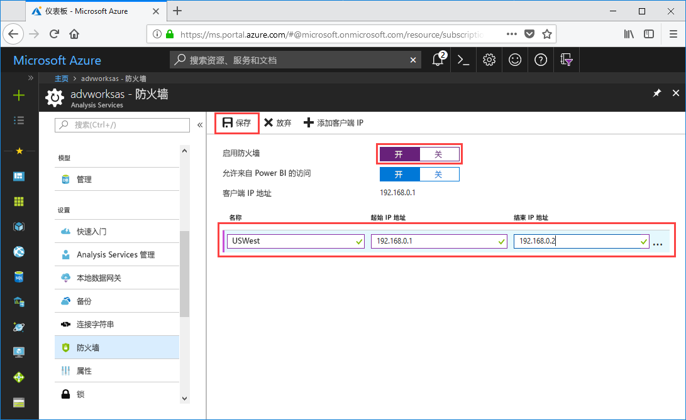

# 快速入门：配置服务器防火墙 - 门户

此快速入门可帮助你为 Azure Analysis Services 服务器配置防火墙。 仅为访问服务器的计算机启用防火墙并配置 IP 地址范围是保护服务器和数据的重要部分。

## 先决条件

- 订阅中的 Analysis Services 服务器。 若要了解详细信息，请参阅[快速入门：创建服务器 - 门户](analysis-services-create-server.md)或[快速入门：创建服务器 - PowerShell](analysis-services-create-powershell.md)
- 客户端计算机的一个或多个 IP 地址范围（如果需要）。

## 登录到 Azure 门户 

[登录到门户](https://portal.azure.com)

## 配置防火墙

1. 单击服务器打开“概述”页。 
2. 在“设置” > “防火墙” > “启用防火墙”，单击“开”。
3. 若要允许从 Power BI 服务进行 DirectQuery 访问，请在“允许从Power BI 访问”中，请单击“开”。  
4. （可选）指定一个或多个 IP 地址范围。 输入每个范围的名称、起始和结束 IP 地址。 
5. 单击“ **保存**”。

     

## 清理资源

不再需要时，请删除 IP 地址范围或禁用防火墙。

## 后续步骤
本快速入门介绍了如何为服务器配置防火墙。 现在你已有服务器，并通过防火墙对其进行了保护，你可以从门户向其添加基本示例数据模型。 拥有一个示例模型有助于了解如何配置模型数据库角色和测试客户端连接。 若要了解更多信息，请继续学习有关添加示例模型的教程。

> [!div class="nextstepaction"]
> [教程：将示例模型添加到服务器](analysis-services-create-sample-model.md)
