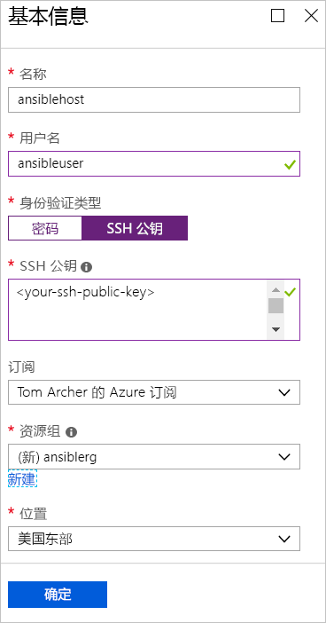
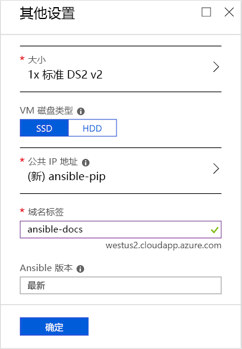
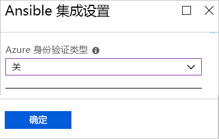
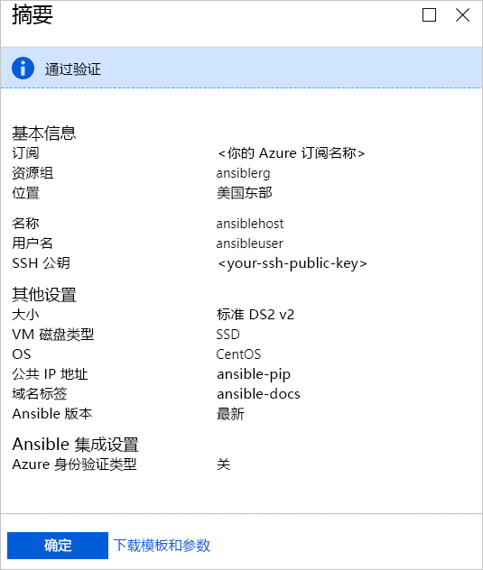
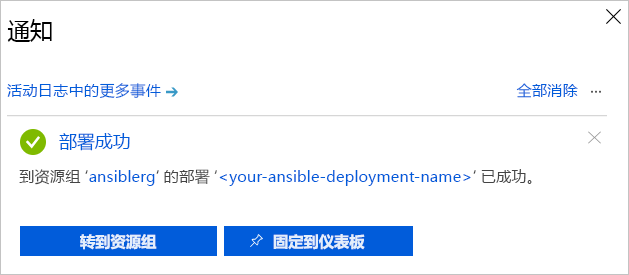

# 快速入门：将适用于 Azure 的 Ansible 解决方案模板部署到 CentOS

适用于 Azure 的 Ansible 解决方案模板用于在 CentOS 虚拟机上配置 Ansible 实例，以及 Ansible 和一套配置为在 Azure 中运行的工具。 这些工具包括：

- **适用于 Azure 的 Ansible 模块** - [适用于 Azure 的 Ansible 模块](./ansible-matrix.md)是用于在 Azure 上创建和管理基础结构的一套模块。 默认会部署这些模块的最新版本。 但是，在部署解决方案模板的过程中，可以指定环境适用的版本号。
- **Azure 命令行接口 (CLI) 2.0** - [Azure CLI 2.0](/cli/azure/?view=azure-cli-latest) 是用于管理 Azure 资源的跨平台命令行体验。 
- **Azure 资源的托管标识** - [Azure 资源的托管标识](/azure/active-directory/managed-identities-azure-resources/overview)功能可以保护云应用程序凭据的安全。

## 先决条件

[!INCLUDE [open-source-devops-prereqs-azure-subscription.md](../../includes/open-source-devops-prereqs-azure-subscription.md)]

## 部署 Ansible 解决方案模板

1. 浏览到 [Azure 市场中的 Ansible 解决方案模板](https://azuremarketplace.microsoft.com/en-%20%20us/marketplace/apps/azure-oss.ansible?tab=Overview)。

1. 选择“立即获取”。

1. 此时会出现一个窗口，其中详细列出了“使用条款”、“隐私政策”和“Azure 市场条款”。 选择“继续”。

1. 此时会出现 Azure 门户，其中显示了描述该解决方案模板的 Ansible 页面。 选择“创建”。

1. “创建 Ansible”页中显示了多个选项卡。 在“基本信息”选项卡上输入所需的信息：

   - **名称** - 指定 Ansible 实例的名称。 本文使用了名称 `ansiblehost` 进行演示。
   - **用户名** - 指定有权访问 Ansible 实例的用户名。 本文使用了名称 `ansibleuser` 进行演示。
   - **身份验证类型** - 选择“密码”或“SSH 公钥”。 本文选择了“SSH 公钥”进行演示。
   - **密码**和**确认密码** - 如果为“身份验证类型”选择了“密码”，请在此处输入密码。
   - **SSH 公钥** - 如果为“身份验证类型”选择了“SSH 公钥”，请以单行格式输入 RSA 公钥 - 以 `ssh-rsa` 开头。
   - **订阅** - 从下拉列表中选择自己的 Azure 订阅。
   - **资源组** - 从下拉列表中选择现有的资源组，或者选择“新建”并指定新资源组的名称。 本文使用了名为 `ansiblerg` 的新资源组进行演示。
   - **位置** - 从下拉列表中选择方案适用的位置。

     

1. 选择“确定”。

1. 在“其他设置”选项卡中输入所需的信息：

   - **大小** - Azure 门户默认使用标准大小。 若要指定适合特定方案的其他大小，选择箭头来显示不同大小的列表。
   - **VM 磁盘类型** - 选择“SSD”（高级固态硬盘）或“HDD”（机械硬盘）。 本文选择了“SSD”进行演示，因为 SSD 具有性能优势。 有关上述每种磁盘存储的详细信息，请参阅以下文章：
       - [VM 的高性能高级存储和托管磁盘](/azure/virtual-machines/windows/premium-storage)
       - [Azure 虚拟机工作负荷的标准 SSD 托管磁盘](/azure/virtual-machines/windows/disks-standard-ssd)
   - **公共 IP 地址** - 如果想要从虚拟机外部与虚拟机通信，请指定此设置。 默认值是名为 `ansible-pip` 的新公共 IP 地址。 若要指定其他 IP 地址，请选择箭头指定该 IP 地址的属性 - 例如名称、SKU 和分配。 
   - **域名标签** - 输入虚拟机的面向公众的域名。 该名称必须唯一且符合命名要求。 有关为虚拟机指定名称的详细信息，请参阅 [Azure 资源的命名约定](/azure/architecture/best-practices/naming-conventions)。
   - **Ansible 版本** - 指定版本号，或者指定值 `latest` 以部署最新版本。 选择“Ansible 版本”旁边的信息图标可以查看有关可用版本的详细信息。

     

1. 选择“确定”。

1. 在“Ansible 集成设置”选项卡中指定身份验证类型。 有关保护 Azure 资源的详细信息，请参阅[什么是 Azure 资源的托管标识？](/azure/active-directory/managed-identities-azure-resources/overview)。

    

1. 选择“确定”。

1. “摘要”页将显示验证过程，并列出 Ansible 部署的指定条件。 使用该选项卡底部的链接可以**下载模板和参数**，以配合支持的 Azure 语言和平台使用。 

     

1. 选择“确定”。

1. “创建”选项卡出现时，请选择“确定”以部署 Ansible。

1. 选择门户页顶部的“通知”图标以跟踪 Ansible 部署。 部署完成后，选择“转到资源组”。 

     

1. 在资源组页上，获取 Ansible 主机的 IP 地址并登录，以使用 Ansible 管理 Azure 资源。

## 后续步骤

> [!div class="nextstepaction"] 
> [快速入门：使用 Ansible 在 Azure 中配置 Linux 虚拟机](/azure/virtual-machines/linux/ansible-create-vm)