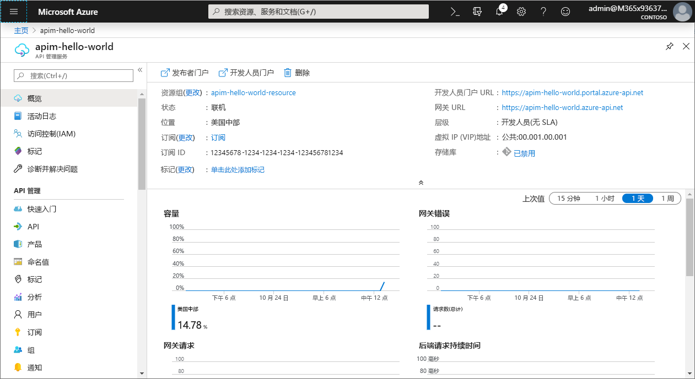
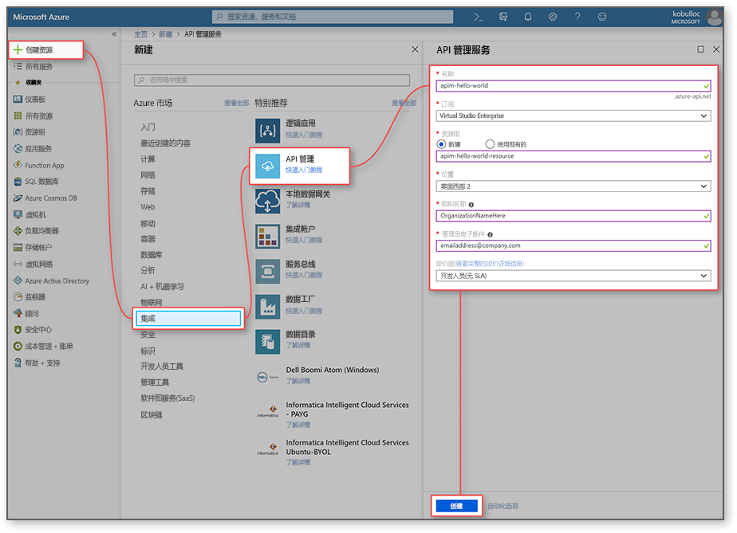
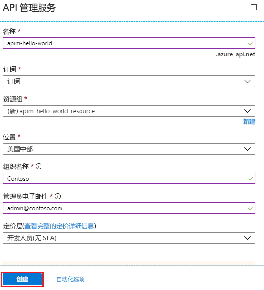
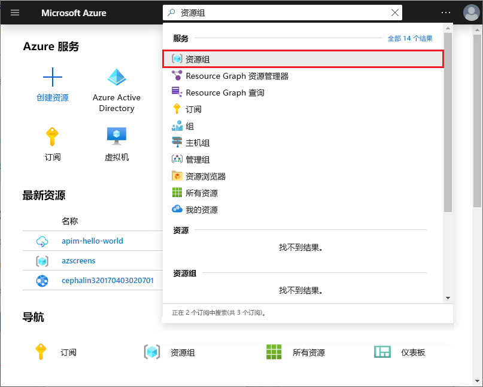
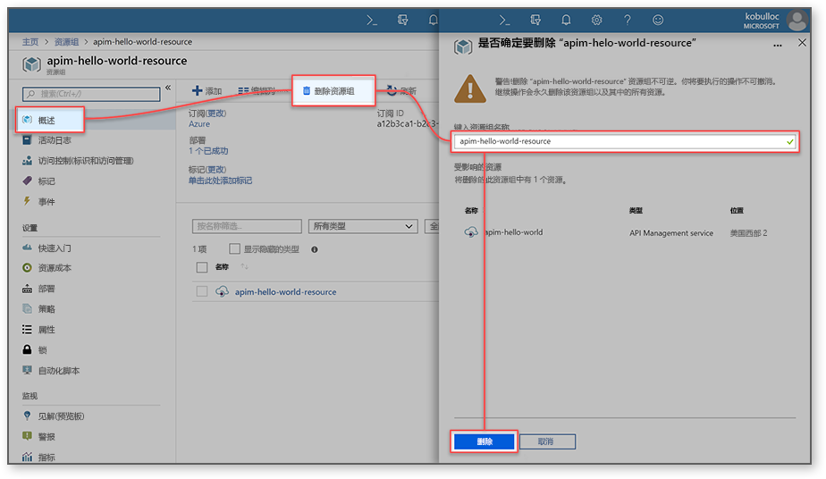

# 创建新的 Azure API 管理服务实例

Azure API 管理 (APIM) 可帮助组织将 API 发布给外部、合作伙伴和内部开发人员，以充分发挥其数据和服务的潜力。 API 管理通过开发人员参与、商业洞察力、分析、安全性和保护提供了核心竞争力以确保成功的 API 程序。 使用 APIM 可以为在任何位置托管的现有后端服务创建和管理新式 API 网关。 有关详细信息，请参阅[概述](api-management-key-concepts.md)主题。

本快速入门介绍如何使用 Azure 门户创建新的 API 管理实例的步骤。

[!INCLUDE [quickstarts-free-trial-note](../../includes/quickstarts-free-trial-note.md)]

## 登录 Azure

通过 https://portal.azure.com 登录到 Azure 门户。

## 创建新服务

1. 在 [Azure 门户](https://portal.azure.com/)中，选择“创建资源” > “企业集成” > “API 管理”。

    或者，选择“新建”，在搜索框中键入 `API management`，然后按 Enter。 单击“创建”。

2. 在“API 管理服务”窗口中，输入设置。

    

    | 设置                 | 建议的值                               | 说明                                                                                                                                                                                                                                                                                                                         |
|-------------------------|-----------------------------------------------|-------------------------------------------------------------------------------------------------------------------------------------------------------------------------------------------------------------------------------------------------------------------------------------------------------------------------------------|
| **名称**                | API 管理服务的唯一名称 | 以后无法更改此名称。 服务名称用来以 *{name}.azure-api.net* 形式生成默认域名。 如果希望使用自定义域名，请参阅[配置自定义域名](configure-custom-domain.md)。   服务名称用来引用服务和相应的 Azure 资源。 |
| **订阅**        | 订阅                             | 要在其下创建此新服务实例的订阅。 在可以访问的不同 Azure 订阅中选择一个订阅。                                                                                                                                                            |
| **资源组**      | *apimResourceGroup*                           | 可以选择新的或现有的资源。 资源组是共享生命周期、权限和策略的资源的集合。 在[此处](../azure-resource-manager/resource-group-overview.md#resource-groups)了解更多信息。                                                                                                  |
| **位置**            | *美国西部*                                    | 选择最近的地理区域。 下拉列表中仅显示可用的 API 管理服务区域。                                                                                                                                                                                                          |
| 组织名称   | 组织的名称                 | 许多位置，包括开发人员门户和通知电子邮件的发件人的标题中使用此名称。                                                                                                                                                                                                             |
| **管理员电子邮件** | *admin@org.com*                               | 设置要将来自 **API 管理**的所有通知发送到的电子邮件地址。                                                                                                                                                                                                                                              |
| **定价层**        | *开发人员*                                   | 设置“开发人员”层来评估服务。 此层不用于生产用途。 有关对 API 管理层进行缩放的详细信息，请参阅[升级和缩放](upgrade-and-scale.md)。                                                                                                                                    |

3. 选择“创建”。

    > [!TIP]
    > 创建 API 管理服务通常需要花费 20 到 30 分钟。 选择“固定到仪表板”可以更容易地查找新创建的服务。

[!INCLUDE [api-management-navigate-to-instance.md](../../includes/api-management-navigate-to-instance.md)]

## 清理资源

如果不再需要资源组和所有相关资源，可以使用以下步骤将其删除：

1. 在 Azure 门户中，选择“所有服务”。
2. 在搜索框中输入 `resource groups`，然后单击结果。

    

3. 找到并单击资源组。
4. 单击“删除资源组”。

    

5. 输入资源组的名称，确认删除。
6. 单击“删除” 。

## 后续步骤

> [!div class="nextstepaction"]
> [导入和发布第一个 API](import-and-publish.md)
