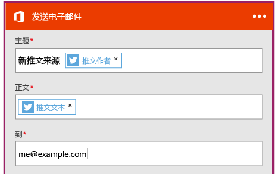

<properties
	pageTitle="创建逻辑应用 | Microsoft Azure"
	description="了解如何创建连接 SaaS 服务的逻辑应用"
	authors="jeffhollan"
	manager="dwrede"
	editor=""
	services="logic-apps"
	documentationCenter=""/>

<tags
	ms.service="logic-apps"
	ms.workload="na"
	ms.tgt_pltfrm="na"
	ms.devlang="na"
	ms.topic="get-started-article"
	ms.date="07/16/2016"
	ms.author="jehollan"/>

# 创建连接 SaaS 服务的新逻辑应用

本主题演示如何操作，只需几分钟时间，你便可以开始使用 [Azure 逻辑应用](app-service-logic-what-are-logic-apps.md)。我们将演练一个允许你向你的电子邮件发送有趣推文的简单工作流。

若要使用此方案，你需要︰

- Azure 订阅
- Twitter 帐户
- Outlook.com 或托管的 Office 365 邮箱

## 创建新的逻辑应用以通过电子邮件向你发送推文

1. 在“[Azure 门户仪表板](https://portal.azure.com)”上，选择“**新建**”。
2. 在搜索栏中，搜索“逻辑应用”，然后选择“**逻辑应用**”。你还可以选择“**新建**”、“**Web + 移动**”，然后选择“**逻辑应用**”。
3. 输入逻辑应用的名称，选择一个位置、资源组，然后选择“**创建**”。如果选择“**固定到仪表板**”，则在部署后逻辑应用将自动打开。
4. 第一次打开逻辑应用后，可以选择从模板开始。现在，请单击“**空逻辑应用**”从头开始构建。
1. 首先需要创建的项目是触发器。这是启动逻辑应用的事件。在触发器搜索框中搜索 **twitter**，然后选择它。
7. 现在，需要键入搜索词以触发。**频率**和**间隔**将确定逻辑应用检查新推文的频率（并返回此时间跨度内的所有推文）。

5. 选择“**新建步骤**”按钮，然后选择“**添加操作**”或“**添加条件**”
6. 选择“**添加操作**”时，可以从“[可用连接器](../connectors/apis-list.md)”中搜索以选择操作。例如，可以选择“**Outlook.com - 发送电子邮件**”从 outlook.com 地址发送邮件︰

7. 接着，需要填写电子邮件所需的参数︰

8. 最后，可以选择“**保存**”以使逻辑应用生效。

## 在创建后管理逻辑应用

现在，你的逻辑应用已启动并运行。它将使用输入的搜索词定期检查推文。当它找到匹配的推文时，它会向你发送一封电子邮件。最后，将学习如何禁用此应用，或了解它是如何运行的。

1. 转到“[Azure 门户](https://portal.azure.com)”

1. 单击屏幕左侧的“**浏览**”并选择“**逻辑应用**”。

2. 单击刚才创建的新逻辑应用以查看当前状态和一般信息。

3. 若要编辑新的逻辑应用，请单击“**编辑**”。

5. 若要关闭该应用，请在命令栏中单击“**禁用**”。

1. 查看运行和触发历史记录，以监视逻辑应用运行时间。可以单击“**刷新**”以查看最新的数据。

在 5 分钟内，你就能够设置一个在云中运行的简单逻辑应用。若要了解有关使用逻辑应用功能的详细信息，请参阅[使用逻辑应用功能]。若要了解有关逻辑应用定义本身的信息，请参阅[创作逻辑应用定义](app-service-logic-author-definitions.md)。

<!-- Shared links -->
[Azure portal]: https://portal.azure.com
[使用逻辑应用功能]: app-service-logic-create-a-logic-app.md

<!---HONumber=AcomDC_0921_2016-->