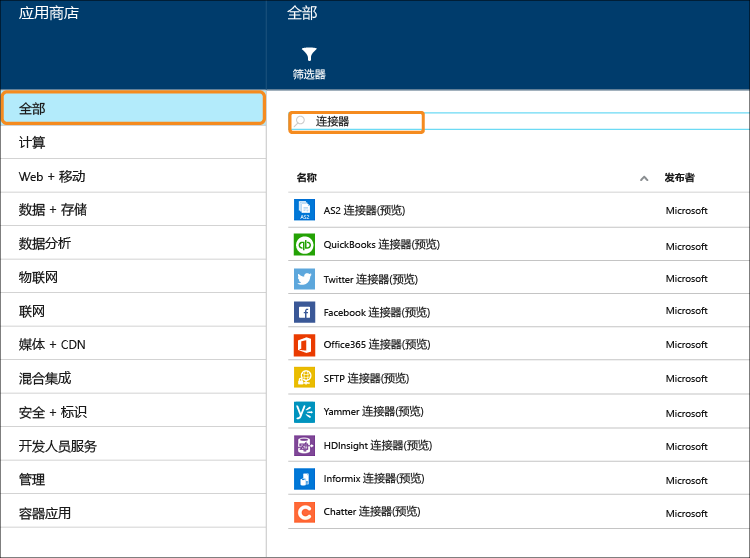

<properties 
	pageTitle="什么是连接器和 BizTalk API 应用" 
	description="了解 API 应用、连接器和 BizTalk API 应用" 
	services="logic-apps" 
	documentationCenter="" 
	authors="MandiOhlinger" 
	manager="erikre" 
	editor=""/>

<tags 
	ms.service="logic-apps" 
	ms.workload="integration" 
	ms.tgt_pltfrm="na" 
	ms.devlang="na" 
	ms.topic="get-started-article" 
	ms.date="09/01/2016" 
	ms.author="mandia"/>

# 什么是连接器和 BizTalk API 应用

[AZURE.INCLUDE [app-service-logic-version-message](../../includes/app-service-logic-version-message.md)]

*连接器*是一种侧重于连接性的 API 应用。像任何其他 API 应用一样，从 Web 应用、移动应用和逻辑应用中使用连接器。连接器让我们轻松连接到现有服务，帮助管理身份验证，提供监视、分析等多种功能。

任何开发人员都可以创建他们自己的 API 应用并私下部署它们。将来，开发人员可以共享自定义创建的 API 应用，并通过市场将其转化为收益。

为了加快开发人员构建解决方案的速度，Azure 团队已向市场增加许多连接器，以满足许多常见方案的要求。此外，为了将覆盖面扩大到复杂和高级的集成方案，团队还提供大量的高级功能和 BizTalk 功能。

有不同的服务“层”可用。所有层均包括所有连接器和 API 应用，其中包括各自的全部功能。

[App Service 定价](https://azure.microsoft.com/pricing/details/app-service/)介绍了这些服务层，同时列出了这些层中包含的内容。以下各节介绍了各种类别的 BizTalk API 应用和连接器。

## 混合连接器 
借助到 [DB2](app-service-logic-connector-db2.md)、[Informix](app-service-logic-connector-informix.md) 和 WebSphere MQ 的连接，混合连接器将连接范围进一步扩展到企业。

## EAI 和 EDI 服务
构建业务关键应用需要的不只是连接。基于 Microsoft 行业领先的集成平台 (BizTalk Server) 基础，BizTalk API 应用提供可以轻松集成到 Web 应用、移动应用和逻辑应用的高级集成功能。其中一些集成功能有：[验证](app-service-logic-xml-validator.md)、[提取](app-service-logic-xpath-extract.md)、[转换](app-service-logic-transform-xml-documents.md)、[编码器](app-service-logic-connector-jsonencoder.md)、[贸易合作伙伴管理](app-service-logic-connector-tpm.md)，以及对 EDI 格式（例如 [X12](app-service-logic-connector-x12.md)、[EDIFACT](app-service-logic-connector-edifact.md) 和 [AS2](app-service-logic-connector-as2.md)）的支持。

其他资源：[企业对企业连接器和 API 应用](app-service-logic-b2b-connectors.md) [创建 B2B 进程](app-service-logic-create-a-b2b-process.md) [创建贸易合作伙伴协议](app-service-logic-create-a-trading-partner-agreement.md) [跟踪 B2B 消息](app-service-logic-track-b2b-messages.md)

## 规则
业务规则封装用来控制业务流程的策略和决策。通常情况下，规则是动态的并且会随时间而改变，这其中有多种原因，包括业务计划、法规和其他许多原因。[BizTalk 规则](app-service-logic-use-biztalk-rules.md)可以让你将这些策略从应用程序代码中分离出来，让更改流程的执行更简单和快捷。

## 连接器和 API 应用列表
请参阅[连接器和 API 应用列表](app-service-logic-connectors-list.md)，查看各个类别包含的连接器和 API 应用的完整列表，其中包括标准连接器、BizTalk EAI、高级连接器等等。
 

<!---HONumber=AcomDC_0921_2016-->