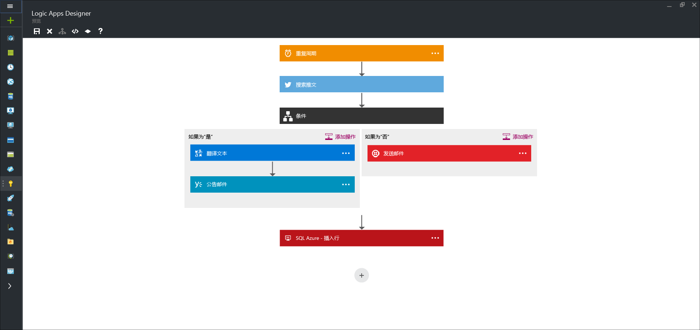

# 什么是逻辑应用？
逻辑应用提供了用于在云中简化并实现可缩放的集成和工作流的方式。 它提供了可视化设计器，用于为流程建模并将流程作为一系列步骤（称为工作流）自动执行。  云中和本地有 [多个连接器](../connectors/apis-list.md) 可跨服务和协议快速集成。  逻辑应用以触发器开头（例如，“当将帐户添加到 Dynamics CRM 时”），在触发之后许多组合操作、转换和条件逻辑才能开始。

使用逻辑应用的优点包括：  

* 使用易于掌握的设计工具设计复杂过程可节省时间
* 可无缝地实现用代码很难实现的模式和工作流
* 可以从模板快速入门
* 可以使用自己的自定义 API、代码和操作自定义逻辑应用
* 可连接并同步跨本地和云的不同系统
* 可利用一流集成支持从 BizTalk server、API 管理、Azure Functions 和 Azure 服务总线构建

逻辑应用是完全托管的 iPaaS（集成平台即服务），使开发人员无需担心如何实现托管、可伸缩性、可用性和管理。  逻辑应用会自动扩大以满足需求。

如前所述，使用逻辑应用可以自动执行业务流程。 下面是一些示例：  

* 将已上载到 FTP 服务器的文件移到 Azure 存储中
* 跨本地和云系统处理并路由订单
* 监视有关特定主题的所有推文、分析观点，并针对需要跟进的项创建警报和任务。

所有此类方案都可通过可视化设计器进行配置，而不必编写一行代码。 开始[立即构建逻辑应用][创建]。  编写后，逻辑应用可以跨多个环境和区域 [快速部署和重新配置](app-service-logic-create-deploy-template.md) 。

## 为什么使用逻辑应用？
逻辑应用可为企业集成空间引入速度和可伸缩性。  它提供易于使用的设计器、各种可用的触发器和操作以及强大的管理工具，使集中管理 API 比以往更加简单。  当企业趋向数字化时，逻辑应用允许用户将旧版系统和先进的系统连接在一起。

此外，使用[企业集成帐户][biztalk] 可以借助 [XML 消息处理][xml]、[贸易合作伙伴管理][tpm] 等功能扩展为成熟的集成方案。

* **易于使用的设计工具** - 可以在浏览器中或使用 Visual Studio 工具端到端地设计逻辑应用。 从设计触发器开始 - 从一个简单的计划到创建 GitHub 问题时。 然后使用丰富的连接器库安排任意数量的操作。
* **轻松连接 API** - 甚至可以实现易于描述但很难用代码实现的组合任务。 使用逻辑应用可以轻松连接不同的系统。 想要将云营销解决方案连接到本地计费系统？ 想要使用企业服务总线跨 API 和系统集中消息传送？ 逻辑应用是为这些问题提供解决方案的最快捷、最可靠的方法。
* **从模板快速入门** - 为帮助用户入门，我们提供了[模板库][模板]，使用户能够快速创建一些常见的解决方案。 提供的模板从高级 B2B 解决方案到简单的 SaaS 连接，甚至有几个模板只是为了“增添些乐趣”- 模板库是开始使用逻辑应用的强大功能的最快捷方法。
* **内嵌的可扩展性** - 看不到所需的连接器？ 逻辑应用旨在让用户使用自己的 API 和代码；用户可以轻松创建自己的 API 应用以用作自定义连接器，或者调用 [Azure 函数](https://functions.azure.com) 按需执行代码段。 
* **真正强大的集成功能** - 开始时简单，但可以根据需要增长。 逻辑应用可以轻松利用 BizTalk（Microsoft 的业界领先的集成解决方案）的强大功能，使集成专业人员能够构建自己所需的解决方案。 了解有关 [Enterprise Integration Pack](app-service-logic-enterprise-integration-overview.md) 的更多信息。

## 逻辑应用概念
以下是构成逻辑应用体验的一些主要模块。 

* **工作流** - 逻辑应用提供了图形化方式，将业务流程建模为一系列步骤或工作流。
* **托管连接器** - 逻辑应用需要访问数据和服务。 专门创建了托管连接器来帮助用户连接到数据和处理数据。 可在[托管连接器][managedapis] 中查看目前提供的连接器列表。
* **触发器** - 某些托管连接器也可用作触发器。 触发器基于特定事件（如电子邮件到达或 Azure 存储帐户中的更改）启动工作流的新实例。
* **操作** - 工作流中触发器后的每个步骤称为操作。 通常，每个操作都映射到托管连接器或自定义 API 应用中的操作。
* **Enterprise Integration Pack** - 对于更高级的集成方案，逻辑应用包括 BizTalk 中的功能。 BizTalk 是 Microsoft 的行业领先的集成平台。 使用 Enterprise Integration Pack 连接器可轻松地在逻辑应用工作流中包括验证、转换等功能。

## 入门
* 若要开始使用逻辑应用，请按照[创建逻辑应用][创建]教程进行操作。  
* [查看常见示例和方案](app-service-logic-examples-and-scenarios.md)
* [使用逻辑应用可以自动执行业务流程](http://channel9.msdn.com/Events/Build/2016/T694) 
* [了解如何将系统与逻辑应用集成](http://channel9.msdn.com/Events/Build/2016/P462)

[biztalk]: app-service-logic-enterprise-integration-accounts.md
[appservice]: ../app-service/app-service-value-prop-what-is.md
[创建]: app-service-logic-create-a-logic-app.md
[managedapis]: ../connectors/apis-list.md
[tpm]: app-service-logic-enterprise-integration-accounts.md
[xml]: app-service-logic-enterprise-integration-b2b.md
[模板]: app-service-logic-use-logic-app-templates.md

<!--HONumber=Nov16_HO2-->

