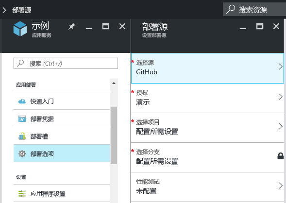
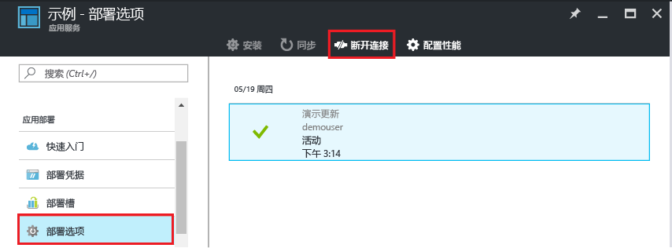

# 连续部署到 Azure App Service
本教程说明如何为 [Azure 应用服务]应用配置连续部署工作流。 将应用服务与 BitBucket、GitHub 和 [Visual Studio Team Services (VSTS)](https://www.visualstudio.com/team-services/) 集成可以实现一种连续部署工作流，在其中，Azure 可以从发布到其中一种服务的项目中拉取最近的更新。 连续部署选项非常适合用于频繁集成多个分发内容的项目。

若要了解如何通过 Azure 门户中未列出的云存储库（如 [GitLab](https://gitlab.com/)）手动配置连续部署，请参阅[使用手动步骤设置连续部署](https://github.com/projectkudu/kudu/wiki/Continuous-deployment#setting-up-continuous-deployment-using-manual-steps)。

## 启用连续部署
若要启用连续部署，请执行以下操作：

1. 将应用内容发布到用于连续部署的存储库。  
    若要深入了解如何将项目发布到这些服务，请参阅[创建存储库 (GitHub)]、[创建存储库 (BitBucket)] 和 [VSTS 入门]。
2. 访问[Azure 门户]，在你的应用的菜单边栏选项卡中单击“应用部署”>“部署选项”。 单击“选择源”，然后选择部署源。  
   
    
   
   > [!NOTE]
   > 若要为应用服务部署配置 VSTS 帐户，请参阅此[教程](https://github.com/projectkudu/kudu/wiki/Setting-up-a-VSTS-account-so-it-can-deploy-to-a-Web-App)。
   > 
   > 
3. 完成授权工作流。
4. 在“部署源”边栏选项卡中，选择要从中进行部署的项目和分支。 完成后，单击“确定”。
   
    
   
   > [!NOTE]
   > 在使用 GitHub 或 BitBucket 启用连续部署时，将显示公用项目和专用项目。
   > 
   > 
   
    应用服务将创建与所选存储库的关联，从指定的分支拉取文件，并保留 App Service 应用存储库的副本。 通过 Azure 门户配置 VSTS 连续部署时，集成使用应用服务 [Kudu 部署引擎](https://github.com/projectkudu/kudu/wiki)，该引擎使用每个 `git push` 来自动完成生成和部署任务。 你不需要在 VSTS 中单独设置连续部署。 此过程完成后，“部署选项”应用边栏选项卡将显示活动部署，指出部署已成功完成。
5. 若要验证是否已成功部署应用，请在 Azure 门户的应用边栏选项卡顶部单击“URL”。
6. 若要验证是否能够在从所选存储库进行连续部署，请将更改推送到该存储库。 推送到存储库完成后，你的应用应该很快更新以反映更改。 可在应用的“部署选项”边栏选项卡中验证是否已拉取更新。

## 连续部署 Visual Studio 解决方案
将 Visual Studio 解决方案推送到 Azure App Service 就像推送简单的 index.html 文件一样容易。 应用服务部署过程简化了所有细节，包括还原 NuGet 依赖项和生成应用程序二进制文件。 可以按照仅在 Git 存储库中维护代码的源控件最佳实践操作，并让应用服务部署处理其余工作。

将 Visual Studio 解决方案推送到应用服务的步骤与[上一部分](#overview)中的步骤相同，前提是按以下方式配置解决方案和存储库：

* 使用 Visual Studio 源代码管理选项生成如下图所示的 `.gitignore` 文件，或者在内容存储库根目录中手动添加一个 `.gitignore` 文件，其内容类似于此 [.gitignore 示例](https://github.com/github/gitignore/blob/master/VisualStudio.gitignore)。
  
  
* 将整个解决方案的目录树添加到你的存储库中，其中 .sln 文件位于存储库根中。

你按照说明设置存储库并将 Azure 中的应用配置为从某个联机 Git 存储库连续发布后，你就可以在 Visual Studio 中从本地开发 ASP.NET 应用程序，并且只需通过将所做的更改推送到联机的 Git 存储库即可连续部署代码。

## 禁用连续部署
若要禁用连续部署，请执行以下操作：

1. 访问[Azure 门户]，在你的应用的菜单边栏选项卡中单击“应用部署”>“部署选项”。 然后单击“部署选项”边栏选项卡中的“断开连接”。
   
    
2. 在显示确认消息时点击“是”后，若要从其他源设置发布，可返回到应用边栏选项卡，再单击“应用部署”>“部署选项”。

## 其他资源
* [How to investigate common issues with continuous deployment](https://github.com/projectkudu/kudu/wiki/Investigating-continuous-deployment)（如何调查连续部署的常见问题）
* [如何使用适用于 Azure 的 PowerShell]
* [如何使用针对 Mac 和 Linux 的 Azure 命令行工具]
* [Git 文档]
* [项目 Kudu](https://github.com/projectkudu/kudu/wiki)
* [Use Azure to automatically generate a CI/CD pipeline to deploy an ASP.NET 4 app](https://www.visualstudio.com/docs/build/get-started/aspnet-4-ci-cd-azure-automatic)（使用 Azure 自动生成部署 ASP.NET 4 应用的 CI/CD 管道）

> [!NOTE]
> 如果想要在注册 Azure 帐户之前开始使用 Azure App Service，请转到[试用 App Service](https://azure.microsoft.com/try/app-service/)，可以通过该页面在 App Service 中立即创建一个生存期较短的入门 Web 应用。 你不需要使用信用卡，也不需要做出承诺。
> 
> 

[Azure 应用服务]: https://azure.microsoft.com/en-us/documentation/articles/app-service-changes-existing-services/
[Azure 门户]: https://portal.azure.com
[VSTS Portal]: https://www.visualstudio.com/en-us/products/visual-studio-team-services-vs.aspx
[Installing Git]: http://git-scm.com/book/en/Getting-Started-Installing-Git
[如何使用适用于 Azure 的 PowerShell]: /powershell/azureps-cmdlets-docs
[如何使用针对 Mac 和 Linux 的 Azure 命令行工具]: ../xplat-cli-install.md
[Git 文档]: http://git-scm.com/documentation

[创建存储库 (GitHub)]: https://help.github.com/articles/create-a-repo
[创建存储库 (BitBucket)]: https://confluence.atlassian.com/display/BITBUCKET/Create+an+Account+and+a+Git+Repo
[VSTS 入门]: https://www.visualstudio.com/docs/vsts-tfs-overview
[Continuous delivery to Azure using Visual Studio Team Services]: ../articles/cloud-services/cloud-services-continuous-delivery-use-vso.md

