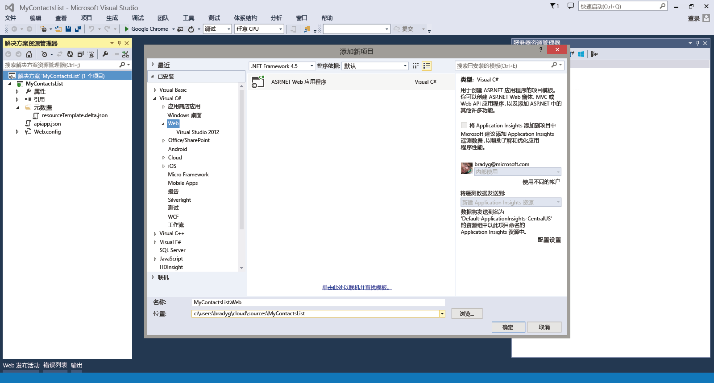
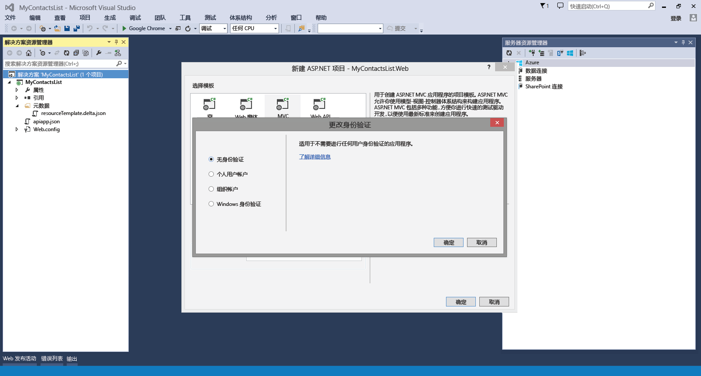
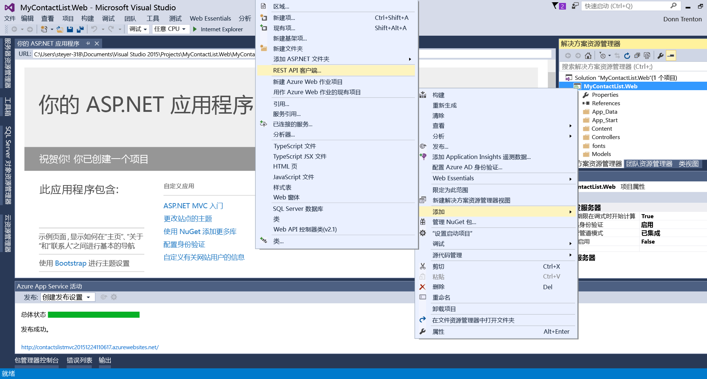
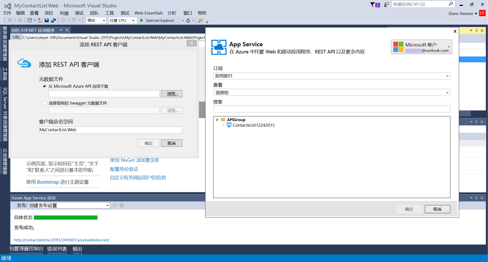
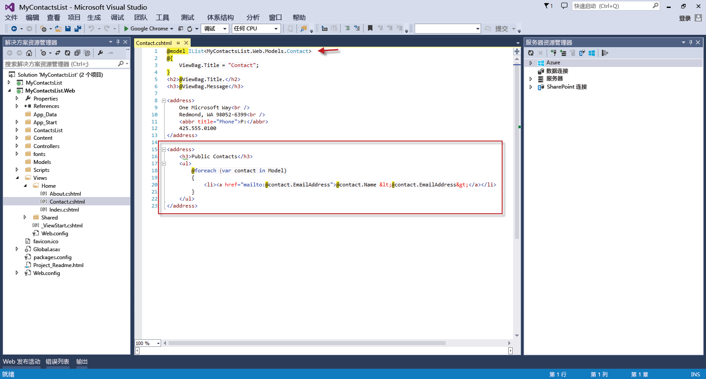

<!-- not suitable for Mooncake -->

<properties 
	pageTitle="在 Azure Web 应用中将 Web 应用连接到 API 应用" 
	description="本教程演示如何从 Azure Web 应用中的 ASP.NET Web 应用使用 API 应用。" 
	services="app-service\web" 
	documentationCenter=".net" 
	authors="syntaxc4" 
	manager="yochayk" 
	editor="jimbe"/>

<tags
	ms.service="app-service-web"
	ms.date="02/26/2016"
	wacn.date=""/>

# 在 Azure 中将 Web 应用连接到 API 应用

本教程演示如何从 [Azure Web 应用](/home/features/web-site/)中的 ASP.NET Web 应用使用 API 应用。

## 先决条件

本教程基于 API 应用教程系列：

1. [创建 Azure API 应用](/documentation/articles/app-service-dotnet-create-api-app)
3. [部署 Azure API 应用](/documentation/articles/app-service-dotnet-deploy-api-app)
4. [调试 Azure API 应用](/documentation/articles/app-service-dotnet-remotely-debug-api-app)

## 在 Visual Studio 中创建 ASP.NET MVC 应用程序

1. 打开 Visual Studio。使用“新建项目”对话框添加新的 **ASP.NET Web 应用程序**。单击**“确定”**。

	

1. 选择 **MVC** 模板。单击“更改身份验证”，选择“无身份验证”，然后两次单击“确定”。

	

1. 在解决方案资源管理器中，右键单击新创建的 Web 应用程序项目，然后选择“添加”>“REST API 客户端...”。

	

1. 在“添加 REST API 客户端”中，选择从 Azure API 应用下载，然后单击“浏览”。选择你要连接到的 API 应用。

	

	>[AZURE.NOTE] 将从 Swagger API 终结点自动生成用于连接到 API 应用的客户端代码。

1. 若要利用生成的 API 代码，请打开 HomeController.cs 文件并使用以下操作替换 `Contact` 操作：

	    public async Task<ActionResult> Contact()
        {
            ViewBag.Message = "Your contact page.";

            var contacts = new ContactsList12242015();
            var contactList = await contacts.Contacts.GetAsync();
            
            return View(contactList);
        }

	

1. 使用以下代码更新 `Contact` 视图以反映联系人的动态列表：
	<pre>// Add to the very top of the view file
	@model IList&lt;MyContactsList.Web.Models.Contact>
	
	// Replace the default email addresses with the following
	&lt;h3>Public Contacts&lt;/h3>
	&lt;ul>
	    @foreach (var contact in Model)
	    {
	        &lt;li>&lt;a href="mailto:@contact.EmailAddress">@contact.Name &amp;lt;@contact.EmailAddress&amp;gt;&lt;/a>&lt;/li>
	    }
	&lt;/ul> 
	</pre>

	

## 将 Web 应用程序部署到 Azure 中的 Web Apps

按照[如何部署 Azure Web 应用](/documentation/articles/web-sites-deploy)的说明进行操作。

>[AZURE.NOTE] 如果想要在注册 Azure 帐户之前开始使用 Azure，请转到[试用 Azure Web 应用](https://tryappservice.azure.com/)，你可以在 Azure 中立即创建一个生存期较短的入门 Web 应用。你不需要使用信用卡，也不需要做出承诺。

## 发生的更改
* 有关从网站更改为 Azure 的指南，请参阅：[Azure 及其对现有 Azure 服务的影响](/documentation/services/web-sites/)
 

<!-----HONumber=Mooncake_0328_2016-->