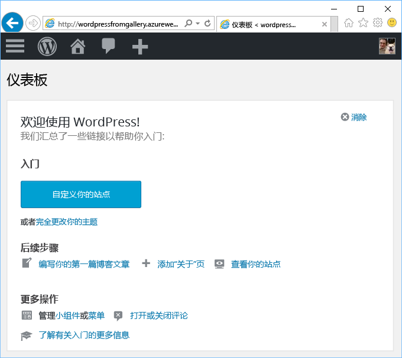

# 通过 Azure Marketplace 创建 Web 应用
<!-- Note: This article replaces web-sites-php-web-site-gallery.md -->

[!INCLUDE [tabs](../../includes/app-service-web-get-started-nav-tabs.md)]

Azure Marketplace 提供开放源代码软件社区开发的各种流行 Web 应用，例如 WordPress 和 Umbraco CMS。 在本教程中，你将了解如何通过 Azure Marketplace 创建 WordPress 应用，
具体而言，如何创建 Azure Web 应用和 MySQL 数据库。 

## 开始之前 

如果你还没有 Azure 订阅，可以在开始前创建一个 [免费帐户](https://azure.microsoft.com/free/?WT.mc_id=A261C142F) 。

## 从 Azure Marketplace 部署
遵循以下步骤通过 Azure Marketplace 部署 WordPress。

### 登录 Azure
登录到 [Azure 门户](https://portal.azure.com)。

### 部署 WordPress 模板
Azure Marketplace 提供用于设置资源的模板。我们首先设置 [WordPress](https://portal.azure.com/#create/WordPress.WordPress) 模板。
   
输入以下信息部署 WordPress 应用及其资源。

  

| 字段         | 建议的值           | 说明  |
| ------------- |-------------------------|-------------|
| 应用程序名称      | mywordpressapp          | 在“Web 应用名称”中输入唯一的应用名称。 此名称将用作应用 `<app_name>.azurewebsites.net` 的默认 DNS 名称的一部分，因此，需要在 Azure 中的所有应用之间保持唯一。 稍后，可以先将自定义域名映射到应用，然后向用户公开该域名 |
| 订阅  | 即用即付             | 选择一个“订阅” 。 如果你有多个订阅，请选择适当的订阅。 |
| 资源组| mywordpressappgroup                 |    输入一个**资源组**。 资源组是在其中部署和管理 Azure 资源（如 Web 应用和数据库）的逻辑容器。 可以创建一个资源组，或使用现有的资源组 |
| 应用服务计划 | myappplan          | 应用服务计划代表用于托管应用的物理资源的集合。 选择“位置”和“定价层”。 有关价格的详细信息，请参阅[应用服务定价层](https://azure.microsoft.com/pricing/details/app-service/)。 |
| 数据库      | mywordpressapp          | 为 MySQL 选择相应的数据库提供程序。 Web 应用支持 **ClearDB**、**用于 MySQL 的 Azure 数据库**和 **MySQL 应用内产品**。 有关详细信息，请参阅下面的[数据库配置](#database-config)部分。 |
| Application Insights | “打开”或“关闭”          | 这是可选的。 如果单击“打开”，[Application Insights](https://azure.microsoft.com/en-us/services/application-insights/) 将为 Web 应用提供监视服务。|

### 数据库配置
根据所选的 MySQL 数据库提供程序执行以下步骤。  建议将 Web 应用和 MySQL 数据库部署在同一位置。

#### ClearDB 
[ClearDB](https://azuremarketplace.microsoft.com/en-us/marketplace/apps/SuccessBricksInc.ClearDBMySQLDatabase?tab=Overview) 是适用于 Azure 中完全集成的 MySQL 服务的第三方解决方案。 若要使用 ClearDB 数据库，需要将信用卡关联到你的 [Azure 帐户](http://account.windowsazure.com/subscriptions)。 如果选择了 ClearDB 数据库提供程序，可以查看现有数据库的列表并从中选择数据库，或者单击“新建”按钮创建数据库。

#### 用于 MySQL 的 Azure 数据库（预览版）
[用于 MySQL 的 Azure 数据库](https://azure.microsoft.com/en-us/services/mysql)提供针对应用开发和部署的托管数据库服务，可用于在最信任的云中数分钟内构建 MySQL 数据库并即时缩放。 通过组合定价模式，可获得所需的全部功能（如高可用性、安全性和恢复功能）- 功能均内置且无额外成本。 单击“定价层”选择其他[定价层](https://azure.microsoft.com/pricing/details/mysql)。 若要使用现有的数据库或现有的 MySQL 服务器，请使用服务器所在的现有资源组。 

> [!NOTE]
>  用于 MySQL 的 Azure 数据库（预览版）和 Linux 上的 Web 应用（预览版）并未在所有区域推出。 详细了解[用于 MySQL 的 Azure 数据库（预览版）](https://docs.microsoft.com/en-us/azure/mysql)和 [Linux 上的 Web 应用](./app-service-linux-intro.md)限制。 

#### MySQL 应用内产品
[MySQL 应用内产品](https://blogs.msdn.microsoft.com/appserviceteam/2017/03/06/announcing-general-availability-for-mysql-in-app)是应用服务的一项功能，可实现在平台本地运行 MySql。 该功能版本支持的核心功能：

- 托管站点的 Web 服务器与 MySQL 服务器在同一个实例上并行运行。 这可以大幅提升应用程序的性能。
- 存储在 MySQL 和 Web 应用文件之间共享。 请注意，如果使用“免费”和“共享”计划，根据执行的操作，在使用站点时可能会达到配额限制。 请查看“免费”和“共享”计划的[配额限制](https://azure.microsoft.com/en-us/pricing/details/app-service/plans/)。
- 可为 MySQL 启用慢速查询日志记录和常规日志记录。 请注意，这可能会影响站点性能，不应一直启用此选项。 日志记录功能可帮助调查任何应用程序问题。 

有关详细信息，请查看[此文](https://blogs.msdn.microsoft.com/appserviceteam/2016/08/18/announcing-mysql-in-app-preview-for-web-apps/ )

部署 WordPress 应用时，单击门户页顶部的铃铛图标可以观察进度。    

## 管理新 Azure Web 应用

转到 Azure 门户，查看刚刚创建的 Web 应用。

为此，请登录到 [https://portal.azure.com](https://portal.azure.com)。

从左侧菜单中单击“应用服务”，然后单击 Azure Web 应用的名称。

现已进入 Web 应用的_边栏选项卡_（水平打开的门户页）。

默认情况下，Web 应用的边栏选项卡显示“概述”页。 在此页中可以查看应用的运行状况。 在此处还可以执行基本的管理任务，例如浏览、停止、启动、重新启动和删除。 边栏选项卡左侧的选项卡显示可以打开的不同配置页。

边栏选项卡中的这些选项卡显示了可添加到 Web 应用的许多强大功能。 以下列表只是列出了一部分可用的功能：

* 映射自定义 DNS 名称
* 绑定自定义 SSL 证书
* 配置持续部署
* 扩展和缩减
* 添加用户身份验证

花费 5 分钟时间完成 WordPress 安装向导来安装一个正常运行的 WordPress 应用。 若要开发 Web 应用，请查看 [Wordpress 文档](https://codex.WordPress.org/)。

## 配置应用 
在将 WordPress 应用用于生产之前，需要执行多个涉及到管理该应用的步骤。 请遵循以下步骤来配置和管理 WordPress 应用：

| 要执行以下操作... | 请使用以下方法... |
| --- | --- |
| **上载或存储大型文件** |[用于使用 Blob 存储的 WordPress 插件](https://wordpress.org/plugins/windows-azure-storage/)|
| **发送电子邮件** |购买 [SendGrid](https://azuremarketplace.microsoft.com/en-us/marketplace/apps/SendGrid.SendGrid?tab=Overview) 电子邮件服务，并通过[用于使用 SendGrid 的 WordPress 插件](https://wordpress.org/plugins/sendgrid-email-delivery-simplified/)对其进行配置|
| **自定义域名** |[在 Azure 应用服务中配置自定义域名](app-service-web-tutorial-custom-domain.md) |
| **HTTPS** |[在 Azure 应用服务中为 Web 应用启用 HTTPS](app-service-web-tutorial-custom-ssl.md) |
| **预生产验证** |[为 Azure 应用服务中的 Web 应用设置过渡和开发环境](web-sites-staged-publishing.md)|
| **监视和故障排除** |[在 Azure 应用服务中启用 Web 应用的诊断日志](web-sites-enable-diagnostic-log.md)和[在 Azure 应用服务中监视 Web 应用](app-service-web-tutorial-monitoring.md) |
| **部署站点** |[在 Azure 应用服务中部署 Web 应用](app-service-deploy-local-git.md) |

## 保护应用 
在将 WordPress 应用用于生产之前，需要执行多个涉及到管理该应用的步骤。 请遵循以下步骤来配置和管理 WordPress 应用：

| 要执行以下操作... | 请使用以下方法... |
| --- | --- |
| **强用户名和密码**|  经常更改密码。 不要使用常用的用户名，例如 *admin* 或 *wordpress* 等。强制所有 WordPress 用户使用唯一的用户名和强密码。 |
| **保持最新状态** | 使 WordPress 的核心、主题和插件保持最新状态。 使用 Azure 应用服务中提供的最新 PHP 运行时 |
| **更新 WordPress 安全密钥** | 更新 [WordPress 安全密钥](https://codex.wordpress.org/Editing_wp-config.php#Security_Keys)，改善 Cookie 中存储的加密数据|

## 提高性能
云中的性能主要通过缓存和横向扩展实现。 但是，还应考虑托管 Web 应用的内存、带宽和其他属性。

| 要执行以下操作... | 请使用以下方法... |
| --- | --- |
| **了解应用服务实例功能** |[定价详细信息，包括应用服务层的功能](https://azure.microsoft.com/en-us/pricing/details/app-service/)|
| **缓存资源** |用 [Azure Redis 缓存](https://azure.microsoft.com/en-us/services/cache/)，或 [Azure Marketplace](https://azuremarketplace.microsoft.com) 中的其他缓存产品之一 |
| **缩放应用程序** |需要缩放 [Azure 应用服务中的 Web 应用](web-sites-scale.md)和/或 MySQL 数据库。 MySQL 应用内产品不支持横向扩展，因此请选择 ClearDB 或用于 MySQL 的 Azure 数据库（预览版）。 [缩放用于 MySQL 的 Azure 数据库（预览版）](https://azure.microsoft.com/en-us/pricing/details/mysql/)，如果使用 [ClearDB 高可用性路由](http://w2.cleardb.net/faqs/)，请扩展数据库 |

## 可用性和灾难恢复
高可用性包括可保持业务连续性的灾难恢复。 针对云中的故障和灾难进行规划要求迅速识别故障。 这些解决方案可以帮助实施某种策略来实现高可用性。

| 要执行以下操作... | 请使用以下方法... |
| --- | --- |
| **对站点进行负载均衡**或**对站点进行地理分配** |[使用 Azure 流量管理器路由流量](https://azure.microsoft.com/en-us/services/traffic-manager/) |
| **备份和还原** |[在 Azure 应用服务中备份 Web 应用](web-sites-backup.md)和[在 Azure 应用服务中还原 Web 应用](web-sites-restore.md) |

## 后续步骤
了解[用于开发和缩放的各种应用服务功能](/app-service-web/)。
