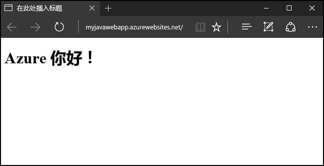
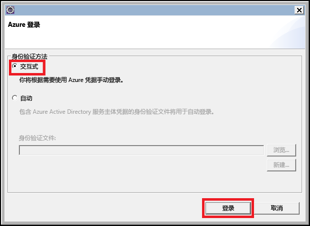

# <a name="create-your-first-java-web-app-in-azure-in-five-minutes"></a>在 Azure 中不到 5 分钟创建你的第一个 Java Web 应用

[!INCLUDE [app-service-web-selector-get-started](../../includes/app-service-web-selector-get-started.md)] 

本快速入门帮助你在数分钟内将你的第一个 Java Web 应用部署到 [Azure 应用服务](../app-service/app-service-value-prop-what-is.md)。 完成本教程后，即可在云中启动并运行简单的基于 Java 的 Web 应用。



## <a name="prerequisites"></a>先决条件

本教程演示如何使用 Eclipse IDE for Java EE Devlopers 生成 Java Web 应用并将其部署到 Azure。 如果尚未安装 Eclipse，可以从 http://www.eclipse.org/ 免费下载。

为了简化向 Azure 发布 Java Web 应用的过程，本教程中的步骤将使用[用于 Eclipse 的 Azure 工具包](/azure/azure-toolkit-for-eclipse)。 有关该工具包安装方法的说明，请参阅[安装用于 Eclipse 的 Azure 工具包](/azure/azure-toolkit-for-eclipse-installation)。

> [!NOTE]
>
> 也可使用 JetBrains 推出的 [IntelliJ IDEA](https://www.jetbrains.com/idea/) 完成本教程中的步骤。 该开发环境的一些步骤可能略有不同，虽然也可使用[用于 IntelliJ 的 Azure 工具包](/azure/azure-toolkit-for-intellij)来简化该 IDE 的发布过程。
>

此外还需一个 Azure 订阅才能完成本教程中的步骤。 如果还没有 Azure 订阅，可以激活 [MSDN 订户权益](https://azure.microsoft.com/pricing/member-offers/msdn-benefits-details/)或注册获取[免费 Azure 帐户](https://azure.microsoft.com/pricing/free-trial/)。

## <a name="create-a-dynamic-web-project-in-eclipse"></a>在 Eclipse 中创建一个动态 Web 项目

在 Eclipse 中，依次选择“文件”菜单、“新建”和“动态 Web 项目”。

在“新建动态 Web 项目”对话框中，将项目命名为 **MyFirstJavaOnAzureWebApp**，然后选择“完成”。
   


> [!NOTE]
>
> 如果已安装本地运行时环境（例如 [Apache Tomcat](https://tomcat.apache.org/)），可在“目标运行时”字段中进行相应指定。
>

创建动态 Web 项目以后，请添加新的 JSP 页，方法是：在项目资源管理器中展开项目，右键单击 **WebContent** 文件夹，单击“新建”，然后单击“JSP 文件”。


在“新建 JSP 文件”对话框出现时，将文件命名为“index.jsp”，将父文件夹保留为“MyFirstJavaOnAzureWebApp/WebContent”，然后单击“下一步”。


在出现的“新建 JSP 文件”对话框的第二页上，将文件命名为“index.jsp”，将父文件夹保留为“MyFirstJavaOnAzureWebApp/WebContent”，然后单击“完成”。


当新页面在 Eclipse 中打开时，请将现有的 `<body></body>` 节替换为以下代码：

```jsp
<body>
<h1><% out.println("Hello Azure!"); %></h1>
</body>
```

保存对页面所做的更改。

## <a name="publish-your-web-app-to-azure"></a>将 Web 应用发布到 Azure

若要将 Web 应用部署到 Azure，可充分利用用于 Eclipse 的 Azure 工具包提供的数项功能。

若要开始发布过程，请使用下述方法之一：

* 在 Eclipse 的“项目资源管理器”中右键单击项目，然后单击“Azure”，再单击“发布为 Azure Web 应用”。

   

* 在 Eclipse 工具栏中单击“发布”图标，然后单击“发布为 Azure Web 应用”。

   

如果尚未登录 Azure 帐户，系统会提示你登录。 为此，请按照以下步骤操作：

1. 可以使用两个不同的选项登录到 Azure 帐户；就本教程来说，请选择“交互式”。

   

1. 输入 Azure 凭据，然后单击“登录”。

   

1. 选择 Azure 订阅，然后单击“选择”。

   

> [!NOTE]
>
> 有关“交互式”登录和“自动”登录的详细说明，请参阅 [Azure Sign In Instructions for the Azure Toolkit for Eclipse](https://go.microsoft.com/fwlink/?linkid=846174)（用于 Eclipse 的 Azure 工具包的 Azure 登录说明）一文。
>

登录 Azure 帐户以后，将会显示“部署 Web 应用”对话框。 如果这是你第一次向 Azure 发布 Web 应用，应看不到应用服务列出。 如果属于这种情况，或者你需要创建新的应用服务，则下一步是创建新的应用服务。 为此，请单击“创建”。


显示“创建应用服务”对话框时，需提供的初始数据是：

* Web 应用的唯一名称，将成为 Web 应用的 DNS 地址；例如：**MyJavaWebApp** 将是 *myjavawebapp.azurewebsites.net*。

* Web 应用将使用哪个 Web 容器；例如：**最新 Tomcat 8.5**。

* 你的 Azure 订阅。

   

如果还没有应用服务计划，或者想要创建新的服务计划，则需提供以下信息：

* 用于新服务计划的唯一名称；当你在以后使用 Azure 工具包发布 Web 应用时，该名称就会显示，并且会在你管理帐户时列在 [Azure 门户](https://portal.azure.com)中。

* 要创建的服务计划所在的地理位置。

* 服务计划的定价层。

   

接下来，请单击“资源组”选项卡。 如果还没有资源组，或者想要创建新的资源组，则需为新的资源组提供唯一名称；否则，请从下拉菜单中选择现有的资源组。


最后，请单击“JDK”选项卡。 列出了多个选项，可供开发人员指定第三方的或自定义的 Java 开发人员工具包 (JDK)，但就本教程来说，应选择“默认”，然后单击“创建”。


Azure 工具包开始创建新的应用服务，并在处理时显示一个进度对话框。


创建新的应用服务以后，最后一个需要选择的选项是是否将 Web 应用部署到新网站的根目录。 例如，如果你在 *wingtiptoys.azurewebsites.net* 中有一个应用服务，而你不部署到根目录，则名为 **MyFirstJavaOnAzureWebApp** 的 Web 应用将部署到 *wingtiptoys.azurewebsites.net/MyFirstJavaOnAzureWebApp*。


完成所有前述步骤后，单击“部署”即可将 Web 应用发布到 Azure。


祝贺你！ 你已成功将 Web 应用部署到 Azure！ 现在可以在 Azure 网站上查看 Web 应用：


## <a name="updating-your-web-app"></a>更新 Web 应用

成功将 Web 应用发布到 Azure 后，更新 Web 应用则要简单得多。以下步骤将演示如何发布对 Web 应用所做的更改。

首先，请更改此前提供的示例 JSP 代码，用当天的日期代替标题：

```jsp
<%@ page
    language="java"
    contentType="text/html; charset=ISO-8859-1"
    pageEncoding="ISO-8859-1"
    import="java.text.SimpleDateFormat"
    import="java.util.Date" %>
<!DOCTYPE html PUBLIC "-//W3C//DTD HTML 4.01 Transitional//EN" "http://www.w3.org/TR/html4/loose.dtd">
<html>
<head>
<meta http-equiv="Content-Type" content="text/html; charset=ISO-8859-1">
<% SimpleDateFormat date = new SimpleDateFormat("yyyy/MM/dd"); %>
<title><% out.println(date.format(new Date())); %></title>
</head>
<body>
<h1><% out.println("Hello Azure!"); %></h1>
</body>
</html>
```

保存所做的更改以后，请在 Eclipse 的“项目资源管理器”中右键单击项目，然后单击“Azure”，再单击“发布为 Azure Web 应用”。


显示“部署 Web 应用”对话框时，将会列出你此前的应用服务。 若要更新 Web 应用，只需突出显示应用服务，然后单击“部署”发布所做的更改即可。


> [!NOTE]
>
> 若要将 Web 应用部署到应用服务的根目录，则每次发布所做的更改时，均需重新选中“部署到根目录”。
>

发布所做的更改以后，你会注意到浏览器中的页面标题已更改为当天的日期。


## <a name="clean-up-resources"></a>清理资源

若要删除 Web 应用，请使用 Azure 工具包随附的 **Azure 资源管理器**。 如果“Azure 资源管理器”视图尚未显示在 Eclipse 中，请通过以下步骤来显示它：

1. 依次单击“窗口”、“显示视图”、“其他”。

   

2. 出现“显示视图”对话框后，请选择“Azure 资源管理器”，然后单击“确定”。

   

若要从 Azure 资源管理器中删除 Web 应用，需要展开“Web 应用”节点，右键单击 Web 应用，然后选择“删除”。


当系统提示你删除 Web 应用时，请单击“确定”。

## <a name="next-steps"></a>后续步骤

有关 Azure Toolkits for Java IDE 的详细信息，请参阅以下链接：

* [用于 Eclipse 的 Azure 工具包（本文）](../azure-toolkit-for-eclipse.md)
  * [用于 Eclipse 的 Azure 工具包的新增功能](../azure-toolkit-for-eclipse-whats-new.md)
  * [安装用于 Eclipse 的 Azure 工具包](../azure-toolkit-for-eclipse-installation.md)
  * [Sign In Instructions for the Azure Toolkit for Eclipse](https://go.microsoft.com/fwlink/?linkid=846174)（用于 Eclipse 的 Azure 工具包的登录说明）
* [用于 IntelliJ 的 Azure 工具包](../azure-toolkit-for-intellij.md)
  * [用于 IntelliJ 的 Azure 工具包的新增功能](../azure-toolkit-for-intellij-whats-new.md)
  * [安装用于 IntelliJ 的 Azure 工具包](../azure-toolkit-for-intellij-installation.md)
  * [Sign In Instructions for the Azure Toolkit for IntelliJ](https://go.microsoft.com/fwlink/?linkid=846179)（用于 IntelliJ 的 Azure 工具包的登录说明）

有关将 Azure 与 Java 配合使用的详细信息，请参阅 [Azure Java 开发人员中心](https://azure.microsoft.com/develop/java/)和[用于 Visual Studio Team Services 的 Java 工具](https://java.visualstudio.com/)。

