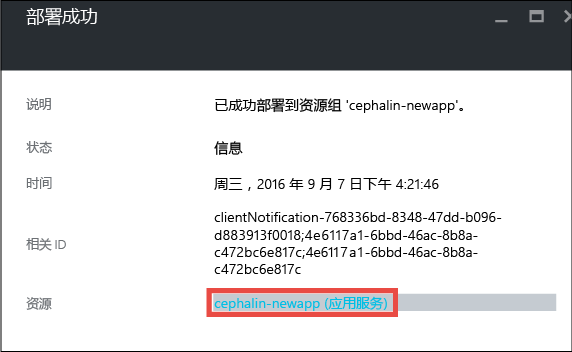
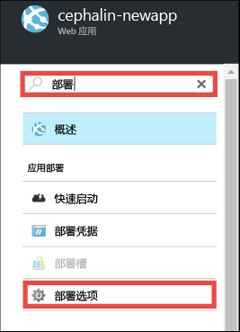
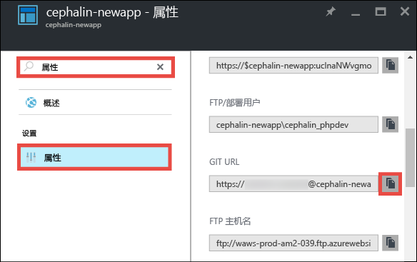

<properties 
	pageTitle="在 5 分钟内将第一个 PHP Web 应用部署到 Azure | Microsoft Azure" 
	description="了解如何通过部署示例应用，轻松地在应用服务中运行 Web 应用。快速开始进行实际开发并立即查看结果。" 
	services="app-service\web"
	documentationCenter=""
	authors="cephalin"
	manager="wpickett"
	editor=""
/>

<tags
	ms.service="app-service-web"
	ms.workload="web"
	ms.tgt_pltfrm="na"
	ms.devlang="na"
	ms.topic="hero-article"
	ms.date="09/16/2016" 
	ms.author="cephalin"
/>
	
# 在 5 分钟内将第一个 PHP Web 应用部署到 Azure

本教程帮助用户将第一个 PHP Web 应用部署到 [Azure App Service](../app-service/app-service-value-prop-what-is.md)。应用服务可用于创建 Web 应用、[移动应用后端](/documentation/learning-paths/appservice-mobileapps/)和 [API 应用](../app-service-api/app-service-api-apps-why-best-platform.md)。

你将能够：

- 在 Azure App Service 中创建 Web 应用。
- 部署 PHP 示例代码。
- 查看生产中实时运行的代码。
- 以[推送 Git 提交](https://git-scm.com/docs/git-push)的相同方式来更新 Web 应用。

## 先决条件

- [安装 Git](http://www.git-scm.com/downloads)。通过以下方式验证安装是否已成功：从新的 Windows 命令提示符、PowerShell 窗口、Linux shell 或 OS X 终端运行 `git --version`。
- 获取 Microsoft Azure 帐户。如果没有帐户，可以[注册免费试用帐户](/pricing/free-trial/?WT.mc_id=A261C142F)，或者[激活 Visual Studio 订户权益](/pricing/member-offers/msdn-benefits-details/?WT.mc_id=A261C142F)。

>[AZURE.NOTE] 无需 Azure 帐户即可[试用应用服务](http://go.microsoft.com/fwlink/?LinkId=523751)。创建入门级应用并使用长达一小时 -- 无需信用卡，也无需做出承诺。

<a name="create">
## 创建 Web 应用

1. 使用你的 Azure 帐户登录到 [Azure 门户](https://portal.azure.com)。

2. 从左侧菜单，依次单击“新建”>“Web + 移动”>“Web 应用”。

    

3. 在应用创建边栏选项卡中，将以下设置用于新应用：

    - **应用名称**：键入一个唯一名称。
    - **资源组**：选择“新建”并为资源组指定名称。
    - **应用服务计划/位置**：单击它进行配置，然后单击“新建”，设置应用服务计划的名称、位置和定价层。可随意使用**免费**定价层。

    完成后，应用创建边栏选项卡应如下所示：

    

3. 单击底部的“创建”。可以单击顶部的“通知”图标查看进度。

    

4. 完成部署后，你应该会看到此通知消息。单击该消息即可打开部署的边栏选项卡。

    

5. 在“部署成功”边栏选项卡中，单击“资源”链接即可打开 Web 应用新的边栏选项卡。

    

## 将代码部署到你的 Web 应用

现在，让我们使用 Git 将一些代码部署到 Azure。

5. 在 Web 应用边栏选项卡中，向下滚动到“部署选项”或搜索它，然后单击它。

    

6. 依次单击“选择源”>“本地 Git 存储库”>“确定”。

7. 返回 Web 应用边栏选项卡，单击“部署凭据”。

8. 设置部署凭据，然后单击“保存”。

7. 返回 Web 应用边栏选项卡，向下滚动到“属性”或搜索它，然后单击它。单击“Git URL”旁边的“复制”按钮。

    

    现在，可以使用 Git 部署你的代码。

1. 在命令行终端中，更改为工作目录 (`CD`) 并克隆示例应用，如下所示：

        git clone https://github.com/Azure-Samples/app-service-web-php-get-started.git

    

    对于 *&lt;github\_sample\_url>*，请使用以下 URL 之一（具体取决于所需的框架）：

2. 更改为示例应用的存储库。例如，

        cd app-service-web-html-get-started

3. 使用之前几个步骤从门户中复制的 Azure 应用的 Git URL，为该应用远程配置 Git。

        git remote add azure <giturlfromportal>

4. 将示例代码部署到 Azure 应用，如同使用 Git 推送任何代码一样：

        git push azure master

    

    如果使用了某种语言框架，将看到不同的输出。这是因为，`git push` 不仅会将代码放在 Azure 中，还会在部署引擎中触发部署任务。如果项目（存储库）根目录中有任何 package.json，则部署脚本将为你还原所需的包。另外，还可以[启用编辑器扩展](web-sites-php-mysql-deploy-use-git.md#composer)，以在 PHP 应用中自动处理 composer.json 文件。

就这么简单！ 你的代码现在 Azure 中实时运行。在浏览器中，导航到 http://*&lt;appname>*.azurewebsites.net 以了解它是否起作用。

## 更新应用

现在可以使用 Git 随时从项目（存储库）根目录进行推送，以更新实时站点。采用首次部署代码时的相同方法执行此操作。例如，每次想要推送已在本地测试的新更改时，只需从项目（存储库）根目录运行以下命令：

    git add .
    git commit -m "<your_message>"
    git push azure master

## 后续步骤

[创建、配置 Laravel Web 应用，并将其部署到 Azure](app-service-web-php-get-started.md)。通过按照本教程中的说明进行操作，你将学会在 Azure 中运行任何 PHP Web 应用所需的以下基本技能：

- 通过 PowerShell/Bash 在 Azure 中创建并配置应用。
- 设置 PHP 版本。
- 使用不在根应用程序目录中的启动文件。
- 启用编辑器自动化。
- 访问特定于环境的变量。
- 排查常见错误。

或者，使用你的第一个 Web 应用执行更多操作。例如：

- 尝试[将代码部署到 Azure 的其他方法](../app-service-web/web-sites-deploy.md)。例如，若要从你的其中一个 GitHub 存储库进行部署，只需选择“GitHub”，而不是选择“部署选项”中的“本地 Git 存储库”。
- 使 Azure 应用上升到更高的层次。对用户进行身份验证。按需缩放。设置一些性能警报。所有这些操作只需按几下鼠标即可完成。请参阅[在第一个 Web 应用中添加功能](app-service-web-get-started-2.md)。

<!---HONumber=AcomDC_0921_2016-->