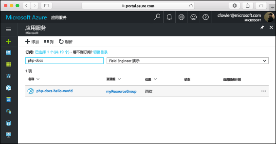

# 在 Azure 中创建 PHP Web 应用
<a id="create-a-php-web-app-in-azure" class="xliff"></a>

[Azure Web 应用](https://docs.microsoft.com/azure/app-service-web/app-service-web-overview)提供高度可缩放、自修补的 Web 托管服务。  本快速入门教程演示如何将 PHP 应用部署到 Azure Web 应用。 使用 [Azure CLI](https://docs.microsoft.com/cli/azure/get-started-with-azure-cli) 创建 Web 应用，并使用 Git 将 PHP 代码示例部署到 Web 应用。

![在 Azure 中运行的应用示例]](media/app-service-web-get-started-php/hello-world-in-browser.png)

可以在 Mac、Windows 或 Linux 计算机上执行以下步骤。 安装先决条件后，大约需要五分钟完成这些步骤。

## 先决条件
<a id="prerequisites" class="xliff"></a>

完成本快速入门教程：

* [安装 Git](https://git-scm.com/)
* [安装 PHP](https://php.net)

[!INCLUDE [quickstarts-free-trial-note](../../includes/quickstarts-free-trial-note.md)]

[!INCLUDE [cloud-shell-try-it.md](../../includes/cloud-shell-try-it.md)]

如果选择在本地安装并使用 CLI，本主题要求运行 Azure CLI 2.0 版或更高版本。 运行 `az --version` 即可查找版本。 如果需要进行安装或升级，请参阅[安装 Azure CLI 2.0]( /cli/azure/install-azure-cli)。 

## 下载示例
<a id="download-the-sample" class="xliff"></a>

在终端窗口中，运行以下命令，将示例应用存储库克隆到本地计算机。

```bash
git clone https://github.com/Azure-Samples/php-docs-hello-world
```

使用此终端窗口运行本快速入门中的所有命令。

切换到包含示例代码的目录。

```bash
cd php-docs-hello-world
```

## 在本地运行应用
<a id="run-the-app-locally" class="xliff"></a>

打开终端窗口并使用 `php` 命令启动内置 PHP Web 服务器，在本地运行应用程序。

```bash
php -S localhost:8080
```

打开 Web 浏览器并导航到 http://localhost:8080 处的示例应用。

此时会看到来自示例应用的 Hello World! 消息显示在页面中。


在终端窗口中，按 **Ctrl+C** 退出 Web 服务器。

[!INCLUDE [Log in to Azure](../../includes/login-to-azure.md)] 

[!INCLUDE [Configure deployment user](../../includes/configure-deployment-user.md)] 

[!INCLUDE [Create resource group](../../includes/app-service-web-create-resource-group.md)] 

[!INCLUDE [Create app service plan](../../includes/app-service-web-create-app-service-plan.md)] 

[!INCLUDE [Create web app](../../includes/app-service-web-create-web-app.md)] 


已在 Azure 中新建了一个空的 Web 应用。

[!INCLUDE [Configure local git](../../includes/app-service-web-configure-local-git.md)] 

[!INCLUDE [Push to Azure](../../includes/app-service-web-git-push-to-azure.md)] 

```bash
Counting objects: 2, done.
Delta compression using up to 4 threads.
Compressing objects: 100% (2/2), done.
Writing objects: 100% (2/2), 352 bytes | 0 bytes/s, done.
Total 2 (delta 1), reused 0 (delta 0)
remote: Updating branch 'master'.
remote: Updating submodules.
remote: Preparing deployment for commit id '25f18051e9'.
remote: Generating deployment script.
remote: Running deployment command...
remote: Handling Basic Web Site deployment.
remote: Kudu sync from: '/home/site/repository' to: '/home/site/wwwroot'
remote: Copying file: '.gitignore'
remote: Copying file: 'LICENSE'
remote: Copying file: 'README.md'
remote: Copying file: 'index.php'
remote: Ignoring: .git
remote: Finished successfully.
remote: Running post deployment command(s)...
remote: Deployment successful.
To https://<app_name>.scm.azurewebsites.net/<app_name>.git
   cc39b1e..25f1805  master -> master
```

## 浏览到应用
<a id="browse-to-the-app" class="xliff"></a>

使用 Web 浏览器浏览到已部署的应用程序。

```bash
http://<app_name>.azurewebsites.net
```

PHP 示例代码在 Azure App Service Web 应用中运行。


**祝贺你！** 现已将第一个 PHP 应用部署到应用服务。

## 更新并重新部署代码
<a id="update-and-redeploy-the-code" class="xliff"></a>

使用本地文本编辑器打开 PHP 应用中的 `index.php` 文件，然后对 `echo` 旁边的字符串中的文本稍微进行更改：

```php
echo "Hello Azure!";
```

提交在 Git 中所做的更改，然后将代码更改推送到 Azure。

```bash
git commit -am "updated output"
git push azure master
```

完成部署后，切换回“浏览到应用”步骤中打开的浏览器窗口，然后刷新页面。


## 管理新 Azure Web 应用
<a id="manage-your-new-azure-web-app" class="xliff"></a>

转到 <a href="https://portal.azure.com" target="_blank">Azure 门户</a>管理创建的 Web 应用。

在左侧菜单中单击“应用服务”，然后单击 Azure Web 应用的名称。



将看到 Web 应用的概述页。 在此处可以执行基本的管理任务，例如浏览、停止、启动、重新启动和删除。 


左侧菜单提供用于配置应用的不同页面。 

[!INCLUDE [cli-samples-clean-up](../../includes/cli-samples-clean-up.md)]

## 后续步骤
<a id="next-steps" class="xliff"></a>

> [!div class="nextstepaction"]
> [带 MySQL 的 PHP](app-service-web-tutorial-php-mysql.md)

