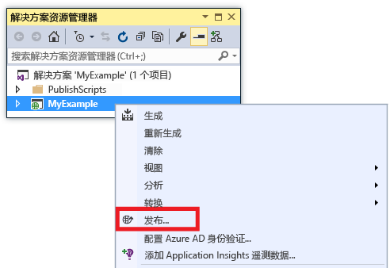
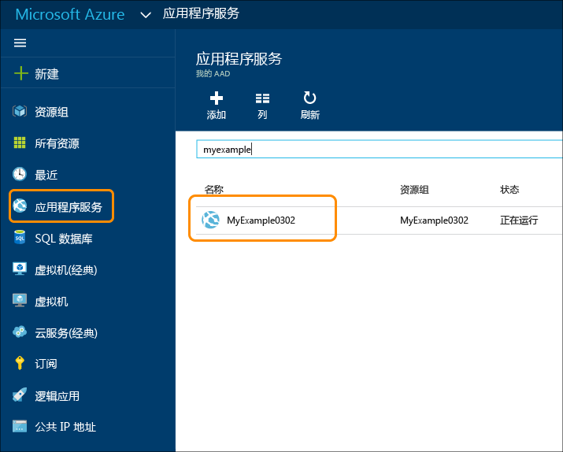
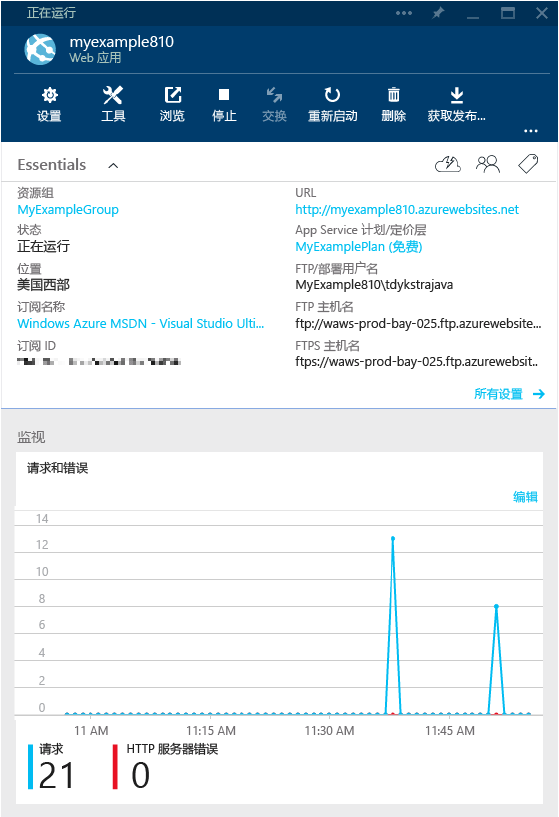
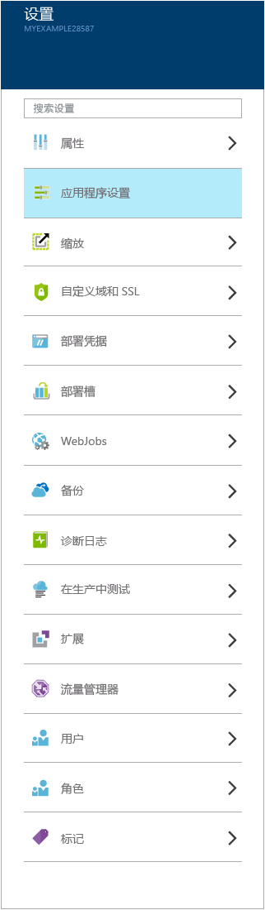
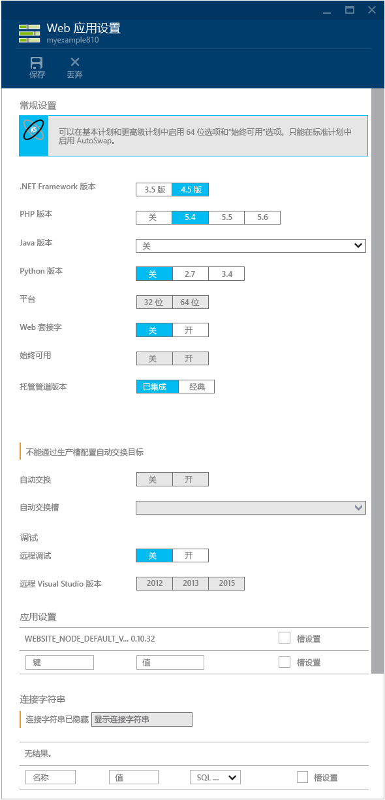
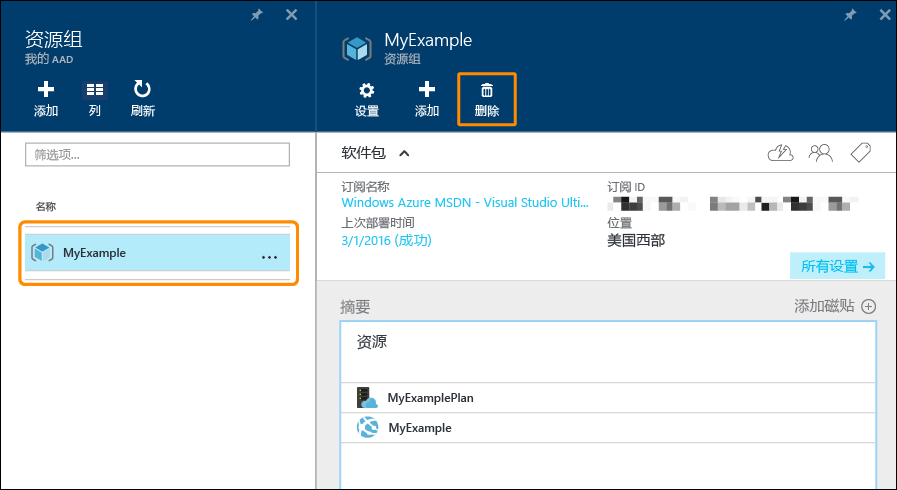

<properties
	pageTitle="ASP.NET 和 Azure 入门 | Azure"
	description="了解如何在 Visual Studio 中创建 ASP.NET Web 项目，并将其部署到 Azure 中的新 Web 应用。"
	services="app-service\web"
	documentationCenter=".net"
	authors="tdykstra"
	manager="wpickett"
	editor=""/>

<tags
	ms.service="app-service-web"
	ms.date="03/02/2016"
	wacn.date=""/>

# 配合 Visual Studio 使用 Azure 中的 ASP.NET Web 应用入门

> [AZURE.SELECTOR]
- [.Net](/documentation/articles/web-sites-dotnet-get-started)
- [Node.js](/documentation/articles/app-service-web-nodejs-get-started)
- [Java](/documentation/articles/web-sites-java-get-started)
- [PHP - Git](/documentation/articles/web-sites-php-mysql-deploy-use-git)
- [PHP - FTP](/documentation/articles/web-sites-php-mysql-deploy-use-ftp)
- [Python](/documentation/articles/web-sites-python-ptvs-django-mysql)

## 概述

本教程将向你介绍如何使用 Visual Studio 2015 将 ASP.NET Web 应用程序部署到 [Azure 中的 Web 应用](/home/features/web-site)。本教程假定你是此前没有 Azure 使用经验的 ASP.NET 开发人员。完成本教程之后，你将能够在云中启动并运行简单的 Web 应用程序。

下图演示了完整的应用程序：

学习内容：

* 在 Visual Studio 中，如何在创建新的 Web 项目的同时创建新的 Azure Web 应用。
* 如何使用 Visual Studio 将 Web 项目部署到 Azure Web 应用。
* 如何使用 [Azure 门户](/features/azure-portal/)监视和管理 Web 应用。

教程末尾的[故障排除](#troubleshooting)部分介绍了在出现故障的情况下应如何操作，[后续步骤](#next-steps)部分提供了其他教程的链接，方便用户更深入地了解如何使用 Azure Web 应用。

## 先决条件

[AZURE.INCLUDE [先决条件](../includes/app-service-web-dotnet-get-started-prereqs.md)]

## 在 Azure 中创建 Web 项目和 Web 应用

第一步是在 Visual Studio 中创建一个 Web 项目，并在 Azure 中创建一个 Web 应用。完成时，将项目部署到 Web 应用，以使其在 Internet 上可用。

下图演示了在创建和部署步骤中要执行的操作。

1. 打开 Visual Studio 2015。

2. 单击“文件”>“新建”>“项目”。

3. 在“新建项目”对话框中，单击“Visual C#”>“Web”>“ASP.NET Web 应用程序”。（如果需要，可以选择“Visual Basic”。）

3. 确保选择 **.NET Framework 4.5.2** 作为目标框架。

4.  [Azure Application Insights](/documentation/articles/app-insights-overview) 可监视 Web 应用的可用性、性能和使用情况。安装 Visual Studio 后当你首次创建 Web 项目时，将按默认选中“将 Application Insights 添加到项目”复选框。如果已选中该复选框，但你不想要尝试使用 Application Insights，请清除该复选框。

4. 将应用程序命名为 **MyExample**。

5. 单击**“确定”**。

	

5. 在“新建 ASP.NET 项目”对话框中，选择“MVC”模板。

7. 单击“更改身份验证”。

	

6. 在“更改身份验证”对话框中，单击“无身份验证”，然后单击“确定”。

	

	为本教程创建的应用程序十分简单，它不支持用户登录。

5. 在“新建 ASP.NET 项目”对话框的“Azure”部分中，确保已选择“在云中托管”，并且下拉列表中已选择“应用程序服务”。

	

	这些设置将指示 Visual Studio 为你的 Web 项目创建 Azure Web 应用。

6. 单击**“确定”**。

5. 如果你尚未登录到 Azure，Visual Studio 将提示你登录。使用你用来管理 Azure 订阅的帐户的 ID 和密码登录。

	如果你已登录，“创建 Azure Web 应用”对话框将询问你要创建哪些资源。

	

3. 在“创建 Azure Web 应用”对话框中，输入一个 **Web 应用程序名称**，该名称在 *chinacloudsites.cn* 域中必须唯一。例如，可以将它命名为 MyExample 并在右侧加上数字，使其成为唯一名称，例如 MyExample810。如果为你创建了默认的 Web 名称，则该名称是唯一的，你可以使用该名称。

	如果其他人已经使用了你输入的名称，你将看到右边是一个红色感叹号而不是绿色复选标记，此时你必须输入其他名称。

	应用程序的 URL 是此名称加上 *.chinacloudsites.cn*（如“Web 应用名称”文本框旁边所示）。例如，如果名称为 `MyExample810`，则 URL 为 `myexample810.chinacloudsites.cn`。

	[后续步骤](#next-steps)部分链接到的教程说明了如何将你自己的自定义域用于 Azure Web 应用。

6. 在“资源组”框的旁边，单击“新建”，然后输入“MyExample”或其他所需的名称。

	此组合框可让你选择现有的资源组，或通过键入与订阅中任何现有资源组不同的名称，来创建新资源组。

	资源组是 Azure 资源的集合，例如 Web 应用、数据库和 VM。在本教程中，最好创建新的资源组，因为这样可以通过一个步骤轻松删除你为本教程创建的所有 Azure 资源。有关详细信息，请参阅 [Azure Resource Manager overview（Azure Resource Manager 概述）](/documentation/articles/resource-group-overview)。

4. 单击“App Service 计划”下拉列表旁边的“新建”按钮。

	

	屏幕截图显示了“Web 应用名称”、“订阅”和“资源组”的示例值 -- 你的值会有所不同。

	在以下步骤中，你将为新资源组创建 App Service 计划。App Service 计划指定 Web 应用程序运行所在的计算资源。例如，如果你选择免费层，则 API 应用程序将在共享 VM 上运行；如果你选择某些付费层，则它在专用 VM 上运行。有关详细信息，请参阅 [App Service plans overview（App Service 计划概述）](/documentation/articles/azure-web-sites-web-hosting-plans-in-depth-overview)。

5. 在“配置 App Service 计划”对话框中，输入“MyExamplePlan”或其他所需的名称。

5. 在“位置”下拉列表中，选择离你最近的位置。

	此设置指定你的应用将在哪个 Azure 数据中心运行。就本教程来说，你可以选择任何区域，不会有明显差异。但是，对于生产应用，则需让服务器尽可能靠近访问该应用的客户端，以最大程度地减少[延迟](http://www.bing.com/search?q=web%20latency%20introduction&qs=n&form=QBRE&pq=web%20latency%20introduction&sc=1-24&sp=-1&sk=&cvid=eefff99dfc864d25a75a83740f1e0090)。

5. 在“大小”下拉列表中，单击“免费”。

	对于本教程，免费定价层即可提供足够的性能。

6. 在“配置 App Service 计划”对话框中，单击“确定”。

	

7. 在“创建 Azure Web 应用”对话框中，单击“创建”。

	

	通常在不到一分钟的时间内，Visual Studio 就能创建 Web 项目和 Web 应用。

	“解决方案资源管理器”窗口将显示新项目中的文件和文件夹。

	

	“Azure 活动”窗口将显示已创建的 Web 应用。

	

	可以在 Visual Studio 的“云资源管理器”窗口中看到该 Web 应用。

	
	
	此窗口可让你查看和管理各种 Azure 资源。屏幕截图只显示了 Web 应用，但在“云资源管理器”窗口中可以看到更多资源类型。右键单击 Web 应用等资源可以查看其管理选项。

## 将 Web 项目部署到 Azure Web 应用

在本部分中，你需要将 Web 项目部署到 Web 应用，如关系图中的第 2 步所示。

1. 在“解决方案资源管理器”中，右键单击该项目并选择“发布”。

	

	几秒钟后，将显示“发布 Web”向导。此向导将打开某个*发布配置文件*，其中包含可将 Web 项目部署到新 Web 应用的设置。如果你想要部署到不同的 Web 应用，可以单击“配置文件”选项卡来创建不同的配置文件。对于本教程，可接受用于部署到前面创建的 Web 应用的设置。

	发布配置文件包含用于部署的用户名和密码。这些凭据已事先为你生成，因此你不需要输入或更改。密码已在 `Properties\PublishProfiles` 文件夹中某个隐藏的用户特定文件内加密。

8. 在“发布 Web”向导的“连接”选项卡中，单击“下一步”。

	

	下一个选项卡是“设置”选项卡。可以在此处更改生成配置选项卡，以部署用于[远程调试](/documentation/articles/web-sites-dotnet-troubleshoot-visual-studio#remotedebug)的调试生成。该选项卡还提供了多个“文件发布选项”：

	* 删除目标处的其他文件
	* 在发布期间预编译
	* 从 App\_Data 文件夹中排除文件

	在本教程中，不需要使用这些选项。有关这些选项的作用的说明，请参阅 [How to: Deploy a Web Project Using One-Click Publish in Visual Studio（如何：在 Visual Studio 中使用一键式发布来部署 Web 项目）](https://msdn.microsoft.com/zh-cn/library/dd465337.aspx)。

10. 在“设置”选项卡中，单击“下一步”。

	

	下一个选项卡是“预览”选项卡。可以在此处查看要从项目复制到 API 应用的文件。如果要将项目部署到前面已部署到的 API 应用，则只会复制已更改的文件。如果要查看将要复制的项列表，请单击“开始预览”按钮。

11. 在“预览”选项卡中，单击“发布”。

	

	单击“发布”后，Visual Studio 开始执行将文件复制到 Azure 服务器的过程。这可能需要一到两分钟。

	“输出”和“Azure 活动”窗口将显示已执行的部署操作并报告已成功完成部署。

	

	成功完成部署后，默认浏览器将自动打开指向已部署 Web 应用的 URL。你创建的应用程序现在运行于云中。浏览器地址栏中的 URL 显示正在从 Internet 加载该 Web 应用。

	

> [AZURE.TIP] 可以启用“Web 单键发布”工具栏以快速完成部署。单击“视图”>“工具栏”，然后选择“Web 单键发布”。你可以通过工具栏选择一个配置文件，然后单击相关按钮进行发布，或者单击相关按钮以打开“发布 Web”向导。
> 

##  在 Azure 门户中监视和管理 Web 应用

[Azure 门户](/home/features/management-portal/)是一个 Web 界面，可用于管理和监视 Azure 服务，例如刚刚创建的 Web 应用。在本教程的本部分，你将了解可在该门户中执行的某些操作。

1. 在浏览器中转到 [https://portal.azure.cn](https://portal.azure.cn)，然后使用用于管理 Azure 帐户的凭据登录。

2. 单击“应用程序服务”，然后单击你的 Web 应用的名称。

	

	“Web 应用”边栏选项卡将显示 Web 应用的设置和使用情况统计信息概述。（在右侧打开的窗口称为*边栏选项卡*。）

	

	你的 Web 应用暂时没有过多的通信，因此可能不会在图形中显示任何内容。如果浏览到应用程序，刷新页面几次，然后刷新门户页的话，你将会看到显示了一些统计信息。

3. “设置”边栏选项卡显示可用于配置 Web 应用的其他选项。

	

	请注意“发布”部分中的“部署凭据”链接。可以在此处创建用于部署的自定义用户名和密码。单击边栏选项卡顶部的“保存”按钮以提交更改。如果你创建了新的用户名和密码，则必须在 Web 项目的“发布 Web”向导的“连接”选项卡中输入相同的值。
	
	该屏幕截图只是“设置”边栏选项卡的一部分视图。此边栏选项卡还有许多部分并未显示出来。

4. 在“设置”边栏选项卡的“常规”节部分中单击“应用程序设置”，以查看可在门户中配置的设置种类示例。

	例如，你可以控制 Web 应用使用的 .NET 版本、启用 [WebSockets](/blog/2013/11/14/introduction-to-websockets-on-windows-azure-web-sites/) 等功能，以及设置[连接字符串值](/blog/2013/07/17/windows-azure-web-sites-how-application-strings-and-connection-strings-work/)。

	

这只是门户的一部分功能。你还可以创建新 Web 应用、删除现有 Web 应用、停止和重新启动 Web 应用，以及管理其他类型的 Azure 服务，如数据库和虚拟机。

## 删除 Azure Web 应用

当你不再需要用到你为本教程创建的 Web 应用时，可以将它删除。

删除 Web 应用的简单方法是单击 Azure 门户中“Web 应用”边栏选项卡顶部的“删除”按钮。更好的方法是删除创建用来包含 Web 应用的资源组。在本教程中，资源组只包含 Web 应用，但资源组通常包含相关资源的集合。例如，当你删除 Web 应用时，该 Web 应用可能使用了你不再需要用到的数据库或 Azure 存储帐户。删除某个资源组时，将删除它所包含的所有内容。若要使用 Azure 门户删除资源组，请执行以下步骤。

1. 转到 [Azure 门户](https://portal.azure.cn)的主页。

2. 单击“资源组”。

3. 在资源组列表中，单击你要删除的资源组。

	当“资源组”边栏选项卡出现时，其中将会列出它所包含的资源。

4. 在“资源组”边栏选项卡中，单击“删除”。

	

## 故障排除

如果在学习本教程的过程中遇到问题，请确保你使用的是最新版本的 Azure SDK for .NET。检查版本的最简单方法是[下载 Azure SDK for Visual Studio 2015](http://go.microsoft.com/fwlink/?linkid=518003) -- 如果你已安装最新版本，Web 平台安装程序会指出不需要进行安装。

如果你在企业网络中并尝试通过防火墙部署到 Azure，请确保已针对 Web 部署打开端口 443 和 8172。如果无法打开这些端口，请参阅下面的“后续步骤”部分以了解其他部署选项。

在 Azure Web 应用中运行 ASP .NET Web 应用后，你可能想要深入了解可简化故障排解的 Visual Studio 功能。有关日志记录、远程调试等功能的信息，请参阅 [Troubleshooting Azure web apps in Visual Studio（在 Visual Studio 中对 Azure Web 应用进行故障排除）](/documentation/articles/web-sites-dotnet-troubleshoot-visual-studio)。

## 后续步骤

在本教程中，你已了解如何创建简单的 Web 应用程序并将其部署到 Azure Web 应用。你可以通过以下相关主题和资源来详细了解 Azure Web 应用：

* 如何将现有 Web 项目部署到新的 Web 应用

	若要启动现有 Web 项目的部署过程，请右键单击“方案资源管理器”中的项目，然后单击“发布”。选择“应用程序服务”作为发布目标。然后选择现有 Azure Web 应用作为目标，或单击“新建”来创建新的 Web 应用。如果单击“新建”来创建新的 Web 应用，其过程与本教程中所述的过程相同。

* 创建 Web 应用的其他方法

	还可以通过 [Azure 门户](https://portal.azure.cn/)、[适用于 Windows PowerShell 的 Azure cmdlet](/documentation/articles/powershell-install-configure) 或[跨平台命令行界面](/documentation/articles/xplat-cli-install)来创建 Web 应用。

* 如何创建 API 应用

	你已经了解如何创建主要用于托管网站的 Azure 实例。此类实例称为 Web 应用。此外，Azure 还将功能设计为方便 API 的开发、测试和托管。主要用于托管 API 的 Azure 实例称为 API 应用。有关详细信息，请参阅 [Get started with API Apps and ASP.NET in Azure Web App（Azure Web 应用中的 API 应用和 ASP.NET 入门）](/documentation/articles/app-service-api-dotnet-get-started)。

* 部署 Web 项目的其他方法

	有关通过 Visual Studio 或通过[源代码管理系统](http://www.asp.net/aspnet/overview/developing-apps-with-windows-azure/building-real-world-cloud-apps-with-windows-azure/source-control)的[自动部署](http://www.asp.net/aspnet/overview/developing-apps-with-windows-azure/building-real-world-cloud-apps-with-windows-azure/continuous-integration-and-continuous-delivery)功能以其他方式将 Web 项目部署到 Web 应用的信息，请参阅 [Get started with web apps in Azure（Azure 中的 Web Apps 入门）](/documentation/articles/app-service-web-get-started)和 [How to deploy an Azure web app（如何部署 Azure Web 应用）](/documentation/articles/web-sites-deploy)。

* 如何添加自定义域名和 SSL

	有关如何使用 SSL 和你自己的域（例如 www.contoso.com 而不是 contoso.chinacloudsites.cn）的信息，请参阅以下资源：

	* [在 Azure Web 应用中配置自定义域名](/documentation/articles/web-sites-custom-domain-name)
	* [为 Azure 网站启用 HTTPS](/documentation/articles/web-sites-configure-ssl-certificate)

* 如何添加聊天之类的实时功能

	对于实时功能（如聊天服务、游戏或股票行情），你可以使用 [ASP.NET SignalR](http://www.asp.net/signalr) 和 [WebSockets](/blog/2013/11/14/introduction-to-websockets-on-windows-azure-web-sites/) 传输方法来获得最佳性能。有关详细信息，请参阅[将 SignalR 与 Azure Web Apps 配合使用](http://www.asp.net/signalr/overview/signalr-20/getting-started-with-signalr-20/using-signalr-with-windows-azure-web-sites)。

* 如何针对 Web 应用程序在 Azure Web 应用、Azure 云服务和 Azure 虚拟机之间做出选择

	在 Azure 中，你可以根据本教程中所述在 Azure Web Apps 中运行 Web 应用程序，也可以在云服务或虚拟机中运行 Web 应用程序。有关详细信息，请参阅 [Azure web apps, cloud services, and VMs: When to use which（Azure Web Apps、云服务和 VM：何时使用何种产品）](/documentation/articles/choose-web-site-cloud-service-vm/)。

<!---HONumber=Mooncake_0509_2016-->