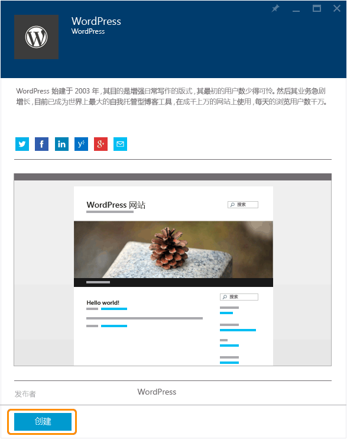
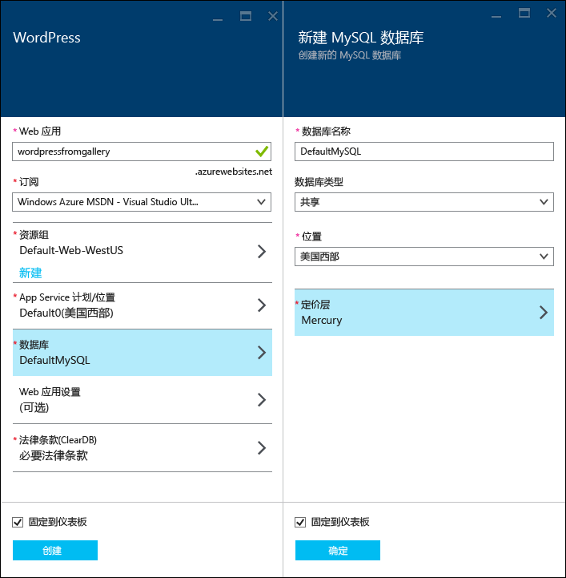
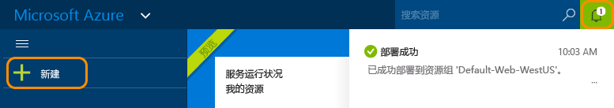
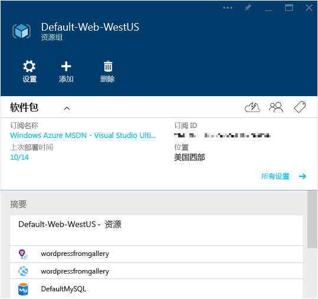

<properties
	pageTitle="在 Azure App Service 中创建 WordPress Web 应用 | Microsoft Azure"
	description="了解如何使用 Azure 门户为 WordPress 博客创建新的 Azure Web 应用。"
	services="app-service\web"
	documentationCenter="php"
	authors="rmcmurray"
	manager="wpickett"
	editor=""/>

<tags
	ms.service="app-service-web"
	ms.workload="na"
	ms.tgt_pltfrm="na"
	ms.devlang="PHP"
	ms.topic="hero-article"
	ms.date="08/11/2016"
	ms.author="robmcm"/>

# 在 Azure App Service 中创建 WordPress Web 应用

[AZURE.INCLUDE [选项卡](../../includes/app-service-web-get-started-nav-tabs.md)]

本教程说明如何从 Azure 应用商店部署 WordPress 博客站点。

完成本教程以后，你将在云中启动并运行自己的 WordPress 博客站点。

学习内容：

* 如何在 Azure 应用商店中查找应用程序模板。
* 如何在 Azure App Service 中根据模板创建 Web 应用。
* 如何配置适用于新 Web 应用和数据库的 Azure App Service 设置。

Azure 应用商店提供了由 Microsoft、第三方公司和开源软件计划开发的各种流行 Web 应用。Web 应用基于各种常用的框架，例如此 WordPress 示例中的 [PHP](/develop/nodejs/)，以及 [.NET](/develop/net/)、[Node.js](/develop/nodejs/)、[Java](/develop/java/)、[Python](/develop/python/) 等。若要从 Azure 应用商店创建 Web 应用，你所需要的唯一软件就是用于浏览 [Azure 门户](https://portal.azure.com/)的浏览器。

在本教程中部署的 WordPress 站点使用 MySQL 作为数据库。如果要改用 SQL 数据库作为数据库，请参阅 [Project Nami](http://projectnami.org/)。“Project Nami”也可通过应用商店获取。

> [AZURE.NOTE]
若要完成本教程，您需要一个 Microsoft Azure 帐户。如果没有帐户，可以[激活 Visual Studio 订户权益](/pricing/member-offers/msdn-benefits-details/?WT.mc_id=A261C142F)，或者[注册免费试用帐户](/zh-CN/pricing/free-trial/?WT.mc_id=A261C142F)。
>
> 如果要在注册 Azure 帐户之前开始使用 Azure App Service，请转到[试用应用服务](http://go.microsoft.com/fwlink/?LinkId=523751)。在那里，可以立即在应用服务中创建短期的入门级 Web 应用 - 无需信用卡，也无需做出承诺。

## 选择 WordPress，针对 Azure App Service 进行配置

1. 登录到 [Azure 门户](https://portal.azure.com/)。

2. 单击“新建”。
	
    ![新建][5]
	
3. 搜索“WordPress”，然后单击“WordPress”。如果你想使用 SQL 数据库代替 MySQL，则搜索“Project Nami”。

	![列表中的 WordPress][7]
	
5. 阅读完 WordPress 应用的说明后，单击“创建”。

	

4. 在“Web 应用”框中输入 Web 应用的名称。

	该名称在 azurewebsites.net 域中必须是唯一的，因为 Web 应用的 URL 将是 {name}.azurewebsites.net。如果你输入的名称不是唯一的，则会在文本框中显示一个红色的感叹号。

8. 如果你有多个订阅，请选择要使用的那一个。

5. 选择“资源组”或新建一个。

	有关资源组的详细信息，请参阅 [Azure Resource Manager 概述](../resource-group-overview.md)。

5. 选择“App Service 计划/位置”或新建一个。

	有关应用服务计划的详细信息，请参阅 [Azure App Service 计划概述](../azure-web-sites-web-hosting-plans-in-depth-overview.md)

7. 单击“数据库”，然后在“新建 MySQL 数据库”边栏选项卡中提供配置 MySQL 数据库所需的值。

	a.输入新名称或保留默认名称。

	b.保留“数据库类型”设置，即设置为“共享”。

	c.选择的位置与你为 Web 应用选择的位置一样。

	d.选择一个定价层。本教程可以使用 Mercury（免费提供最低数量的连接和最低容量的磁盘空间）。

8. 在“新建 MySQL 数据库”边栏选项卡中，单击“确定”。

8. 在“WordPress”边栏选项卡中，接受法律条款，然后单击“创建”。

	

	Azure App Service 通常在不到一分钟内创建好 Web 应用。你可以单击门户页顶部的铃铛图标来观看进度。

	

## 启动和管理你的 WordPress Web 应用
	
7. 创建完 Web 应用以后，请在 Azure 门户中导航到你在其中创建了应用程序的资源组，你可以看到 Web 应用和数据库。

	带灯泡图标的额外资源是 [Application Insights](/services/application-insights/)，提供适用于 Web 应用的监视服务。

1. 在“资源组”边栏选项卡中，单击 Web 应用行。

	  

2. 在“Web 应用”边栏选项卡中，单击“浏览”。

    ![网站 URL][browse]

3. 在 WordPress 的“欢迎”页中，输入 WordPress 所需的配置信息，然后单击“安装 WordPress”。

	  

4. 使用你在“欢迎”页中创建的凭据登录。

5. 此时会打开站点的“仪表板”页。

	

## 后续步骤

你已了解如何从库中创建和部署 PHP Web 应用。有关如何在 Azure 中使用 PHP 的详细信息，请参阅 [PHP 开发人员中心](/develop/php/)。

有关如何使用应用服务 Web 应用的详细信息，请参阅页面左侧（针对宽屏浏览器窗口）或页面顶部（针对窄屏浏览器窗口）的链接。

## 发生的更改
* 有关从网站更改为应用服务的指南，请参阅 [Azure App Service 及其对现有 Azure 服务的影响](http://go.microsoft.com/fwlink/?LinkId=529714)。

[5]: ./media/web-sites-php-web-site-gallery/startmarketplace.png
[7]: ./media/web-sites-php-web-site-gallery/search-web-app.png
[browse]: ./media/web-sites-php-web-site-gallery/browse-web.png

<!---HONumber=AcomDC_0921_2016-->