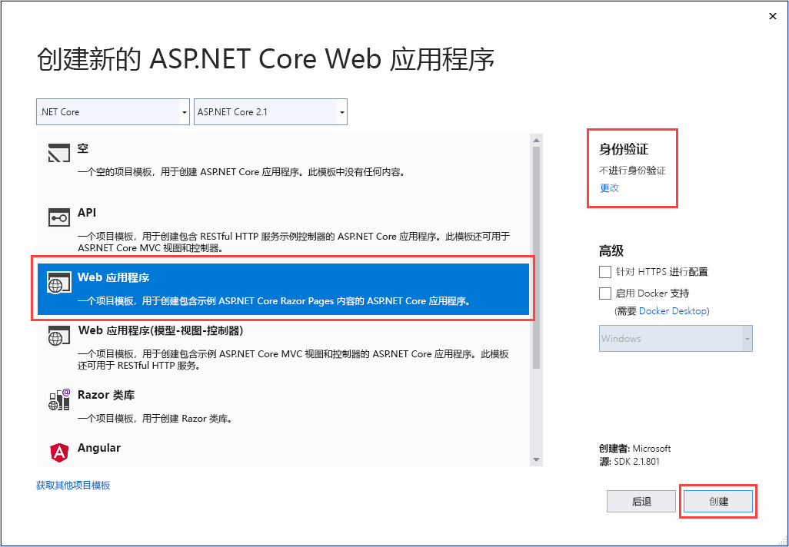
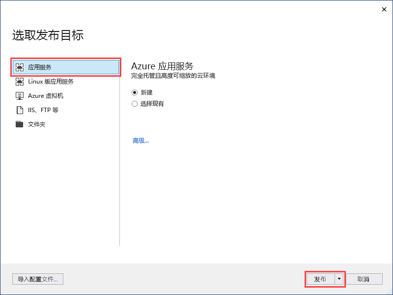
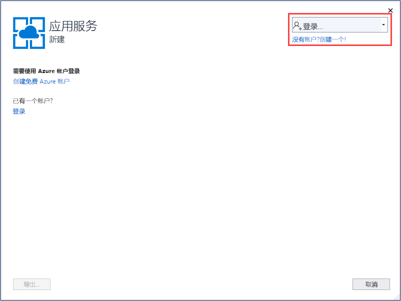
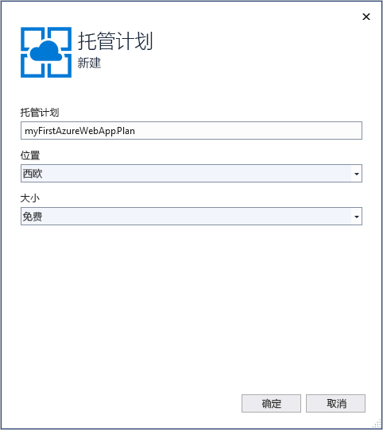
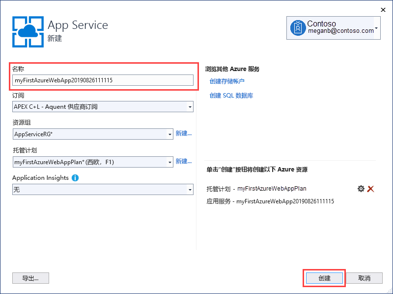
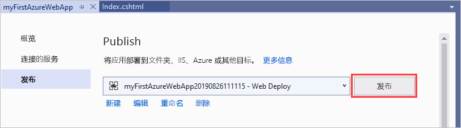
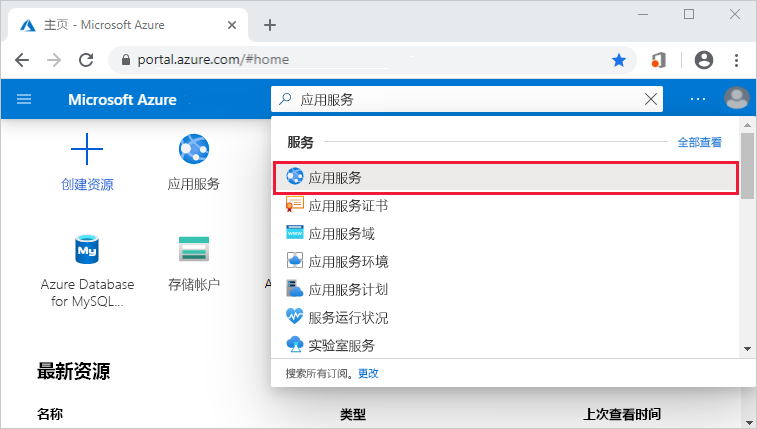
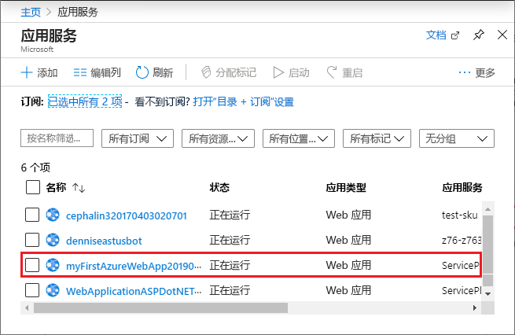
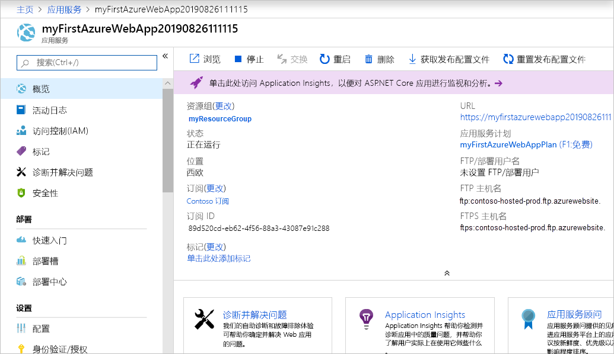

# <a name="create-an-aspnet-core-web-app-in-azure"></a>在 Azure 中创建 ASP.NET Core Web 应用

> [!NOTE]
> 本文将应用部署到 Windows 上的应用服务。 若要部署到基于 _Linux_ 的应用服务，请参阅[在基于 Linux 的应用服务中创建 .NET Core Web 应用](./containers/quickstart-dotnetcore.md)。
>

[Azure 应用服务](overview.md)提供高度可缩放、自修补的 Web 托管服务。

本快速入门演示如何将第一个 ASP.NET Core Web 应用部署到 Azure 应用服务中。 完成后，将拥有一个资源组，该资源组包含一个应用服务计划和一个部署了 Web 应用程序的应用服务应用。

[!INCLUDE [quickstarts-free-trial-note](../../includes/quickstarts-free-trial-note.md)]

## <a name="prerequisites"></a>先决条件

为完成此教程，请安装支持 **ASP.NET 和 Web 开发**工作负荷的 <a href="https://www.visualstudio.com/downloads/" target="_blank">Visual Studio 2019</a>。

如果已安装 Visual Studio 2019：

- 通过选择“帮助”   >   “检查更新”，在 Visual Studio 中安装最新更新。
- 通过选择“工具”   >   “获取工具和功能”，添加工作负荷。

## <a name="create-an-aspnet-core-web-app"></a>创建一个 ASP.NET Core Web 应用

按照以下步骤创建 ASP.NET Core Web 应用：

1. 打开 Visual Studio，然后选择“创建新项目”  。

1. 在“创建新项目”  中，找到并选择用于 C# 的 **ASP.NET Core Web 应用程序**，然后选择“下一步”  。

1. 在“配置新项目”  中，将应用程序命名为“myFirstAzureWebApp”  ，然后选择“创建”  。

   

1. 对于此快速入门，请选择“Web 应用程序”  模板。 确保身份验证设置为“无身份验证”  ，并且未选择其他选项。 选择“创建”  。

   

    可将任何类型的 ASP.NET Core Web 应用部署到 Azure。

1. 在 Visual Studio 菜单中，选择“调试” > “开始执行(不调试)”以在本地运行 Web 应用。  

   

## <a name="publish-your-web-app"></a>发布 Web 应用

1. 在“解决方案资源管理器”  中右键单击“myFirstAzureWebApp”  项目，然后选择“发布”  。

1. 选择“应用服务”  ，然后选择“发布”  。

   

1. 在“创建新的应用服务”  中，你的选项取决于你是否已登录 Azure 以及是否有一个链接到 Azure 帐户的 Visual Studio 帐户。 选择“添加帐户”  或“登录”  以登录 Azure 订阅。 如果你已经登录，请选择所需的帐户。

   > [!NOTE]
   > 如果已经登录，请先不要选择“创建”  。
   >

   

   [!INCLUDE [resource group intro text](../../includes/resource-group.md)]

1. 对于“资源组”  ，选择“新建”  。

1. 在“新资源组名称”  中，输入“myResourceGroup”  并选择“确定”  。

   [!INCLUDE [app-service-plan](../../includes/app-service-plan.md)]

1. 对于**托管计划**，请选择“新建”  。

1. 在“配置托管计划”  对话框中，输入下表中的值，然后选择“确定”  。

   | 设置 | 建议的值 | 描述 |
   |-|-|-|
   |应用服务计划| myAppServicePlan | 应用服务计划的名称。 |
   | 位置 | 西欧 | 托管 Web 应用的数据中心。 |
   | 大小 | 免费 | [定价层](https://azure.microsoft.com/pricing/details/app-service/?ref=microsoft.com&utm_source=microsoft.com&utm_medium=docs&utm_campaign=visualstudio)确定托管功能。 |

   

1. 在**名称**中，输入仅包含有效字符 `a-z`、`A-Z`、`0-9` 和 `-` 的唯一应用名称。 可以接受自动生成的唯一名称。 Web 应用的 URL 为 `http://<app_name>.azurewebsites.net`，其中 `<app_name>` 是应用名称。

   

1. 选择“创建”  开始创建 Azure 资源。

向导完成后，它会将 ASP.NET Core Web 应用发布到 Azure，然后在默认浏览器中启动该应用。


在“创建新的应用服务”  页中指定的应用名称将用作 `http://<app_name>.azurewebsites.net` 格式的 URL 前缀。

祝贺你！  你的 ASP.NET Core Web 应用已在 Azure 应用服务中实时运行！

## <a name="update-the-app-and-redeploy"></a>更新应用并重新部署

1. 在**解决方案资源管理器**中你的项目下，打开  “页” > “Index.cshtml”  。

1. 将两个 `<div>` 标记替换为以下代码：

   ```HTML
   <div class="jumbotron">
       <h1>ASP.NET in Azure!</h1>
       <p class="lead">This is a simple app that we’ve built that demonstrates how to deploy a .NET app to Azure App Service.</p>
   </div>
   ```

1. 若要重新部署到 Azure，请在“解决方案资源管理器”  中右键单击“myFirstAzureWebApp”  项目，然后选择“发布”  。

1. 在“发布”摘要页中选择“发布”   。

   

发布完成后，Visual Studio 将启动浏览器并转到 Web 应用的 URL。


## <a name="manage-the-azure-app"></a>管理 Azure 应用

若要管理 Web 应用，请转到 [Azure 门户](https://portal.azure.com)，搜索并选择“应用服务”  。



在“应用服务”页上，选择 Web 应用的名称  。



这里我们可以看到 Web 应用的概述页。 在这里，可以进行基本的管理，如浏览、停止、启动、重启和删除。



左侧菜单提供了用于配置应用的不同页面。

[!INCLUDE [Clean-up section](../../includes/clean-up-section-portal.md)]

## <a name="next-steps"></a>后续步骤

> [!div class="nextstepaction"]
> [将 ASP.NET Core 与 SQL 数据库配合使用](app-service-web-tutorial-dotnetcore-sqldb.md)
