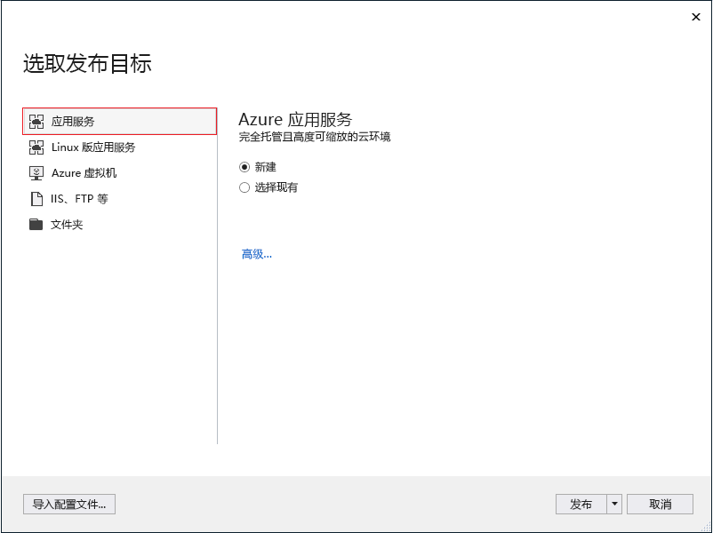
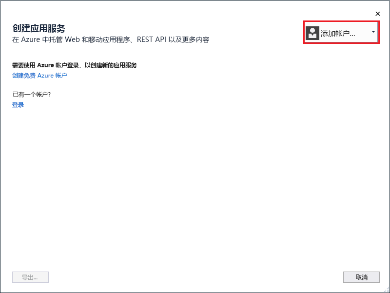
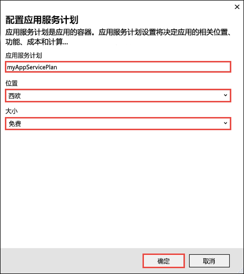
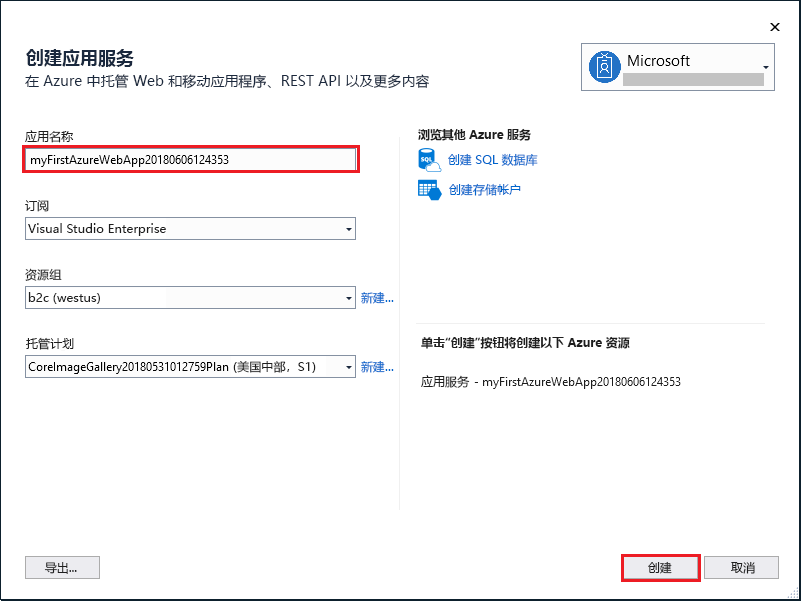

# <a name="create-an-aspnet-core-web-app-in-azure"></a>在 Azure 中创建 ASP.NET Core Web 应用

> [!NOTE]
> 本文将应用部署到 Windows 上的应用服务。 若要部署到基于 _Linux_ 的应用服务，请参阅[在基于 Linux 的应用服务中创建 .NET Core Web 应用](./containers/quickstart-dotnetcore.md)。
>

[Azure Web 应用](app-service-web-overview.md)提供高度可缩放、自修补的 Web 托管服务。  本快速入门演示如何将第一个 ASP.NET Core Web 应用部署到 Azure Web 应用中。 完成后，便拥有了一个资源组，该资源组包含一个应用服务计划和一个具有已部署的 Web 应用程序的 Azure Web 应用。

> [!NOTE]
> 如果想要了解如何生成和部署 ASP.NET Framework Web 应用，请参阅[此文](app-service-web-get-started-dotnet-framework.md)。 
>

[!INCLUDE [quickstarts-free-trial-note](../../includes/quickstarts-free-trial-note.md)]

## <a name="prerequisites"></a>先决条件

完成本教程：

* 使用以下工作负荷安装 <a href="https://www.visualstudio.com/downloads/" target="_blank">Visual Studio 2017</a>：
    - **ASP.NET 和 Web 开发**
    - **Azure 开发**

    

如果已安装 Visual Studio，请单击“工具” > **Get Tools and Features**“获取工具和功能”，以便在 Visual Studio 中添加工作负荷。

## <a name="create-an-aspnet-core-web-app"></a>创建一个 ASP.NET Core Web 应用

在 Visual Studio 中，通过依次选择“文件”>“新建”>“项目”创建项目。 

在“新建项目”对话框中，选择“Visual C#”>“Web”>“ASP.NET Core Web 应用程序”。

将应用程序命名为 _myFirstAzureWebApp_，然后选择“确定”。
   


可将任何类型的 ASP.NET Core Web 应用部署到 Azure。 在本快速入门教程中，请选择“Web 应用程序”模板，并确保将身份验证设置为“无身份验证”。
      
选择“确定”。


创建 ASP.NET Core 项目后，将显示 ASP.NET Core 欢迎页上，其中提供了大量资源的链接来帮助用户入门。 


在菜单中，选择“调试>启动但不调试”以在本地运行 Web 应用。


## <a name="publish-to-azure"></a>发布到 Azure

在“解决方案资源管理器”中右键单击“myFirstAzureWebApp”项目，然后选择“发布”。


确保已选择“Microsoft Azure 应用服务”，然后选择“发布”。



此时将打开“创建应用服务”对话框，用于创建在 Azure 中运行 ASP.NET Core Web 应用所需的所有 Azure 资源。

## <a name="sign-in-to-azure"></a>登录 Azure

在“创建应用服务”对话框中，选择“添加帐户”，然后登录到你的 Azure 订阅。 如果已登录，请从下拉列表中选择包含所需订阅的帐户。

> [!NOTE]
> 如果已经登录，请先不要选择“创建”。
>
>
   


## <a name="create-a-resource-group"></a>创建资源组

[!INCLUDE [resource group intro text](../../includes/resource-group.md)]

在“资源组”旁边，选择“新建”。

将资源组命名为 **myResourceGroup**，然后选择“确定”。

## <a name="create-an-app-service-plan"></a>创建应用服务计划

[!INCLUDE [app-service-plan](../../includes/app-service-plan.md)]

在“应用服务计划”旁边，选择“新建”。 

在“配置应用服务计划”对话框中，使用位于屏幕截图后的表中的设置。



| 设置 | 建议的值 | 说明 |
|-|-|-|
|应用服务计划| myAppServicePlan | 应用服务计划的名称。 |
| Location | 欧洲西部 | 托管 Web 应用的数据中心。 |
| 大小 | 免费 | [定价层](https://azure.microsoft.com/pricing/details/app-service/?ref=microsoft.com&utm_source=microsoft.com&utm_medium=docs&utm_campaign=visualstudio)确定托管功能。 |

选择“确定”。

## <a name="create-and-publish-the-web-app"></a>创建并发布 Web 应用

在“Web 应用名称”中，键入唯一的应用名称（有效字符为 `a-z`、`0-9` 和 `-`），或接受自动生成的唯一名称。 Web 应用的 URL 为 `http://<app_name>.azurewebsites.net`，其中 `<app_name>` 是 Web 应用名称。

选择“创建”开始创建 Azure 资源。



向导完成后，它会将 ASP.NET Core Web 应用发布到 Azure，然后在默认浏览器中启动该应用。


在[创建和发布步骤](#create-and-publish-the-web-app)中指定的 Web 应用名称用作 `http://<app_name>.azurewebsites.net` 格式的 URL 前缀。

恭喜，ASP.NET Core Web 应用已在 Azure 应用服务中实时运行！

## <a name="update-the-app-and-redeploy"></a>更新应用并重新部署

在“解决方案资源管理器”中打开“Pages/Index.cshtml”。

在顶部附近找到 `<div id="myCarousel" class="carousel slide" data-ride="carousel" data-interval="6000">` HTML 标记，将整个元素替换为以下代码：

```HTML
<div class="jumbotron">
    <h1>ASP.NET in Azure!</h1>
    <p class="lead">This is a simple app that we’ve built that demonstrates how to deploy a .NET app to Azure App Service.</p>
</div>
```

若要重新部署到 Azure，请在“解决方案资源管理器”中右键单击“myFirstAzureWebApp”项目，然后选择“发布”。

在发布页中选择“发布”。

发布完成后，Visual Studio 将启动浏览器并转到 Web 应用的 URL。


## <a name="manage-the-azure-web-app"></a>管理 Azure Web 应用

转到 <a href="https://portal.azure.com" target="_blank">Azure 门户</a>管理 Web 应用。

从左侧菜单中选择“应用服务”，并选择 Azure Web 应用的名称。


将看到 Web 应用的概述页。 在此处可以执行基本的管理任务，例如浏览、停止、启动、重新启动和删除。 


左侧菜单提供用于配置应用的不同页面。 

[!INCLUDE [Clean-up section](../../includes/clean-up-section-portal.md)]

## <a name="next-steps"></a>后续步骤

> [!div class="nextstepaction"]
> [将 ASP.NET Core 与 SQL 数据库配合使用](app-service-web-tutorial-dotnetcore-sqldb.md)
