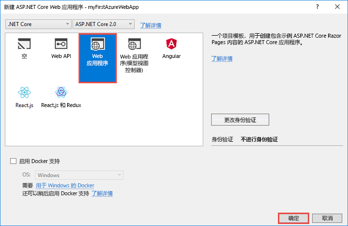
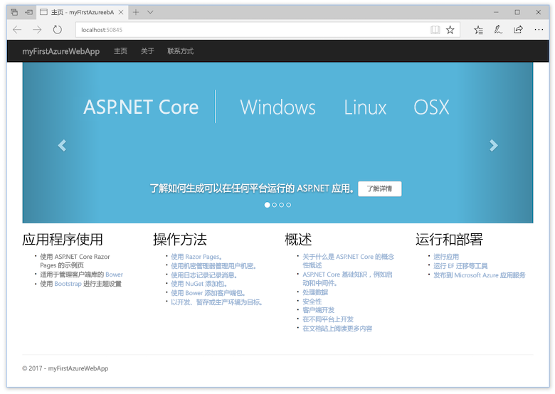
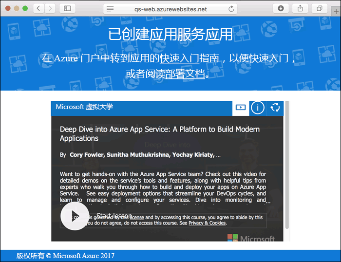
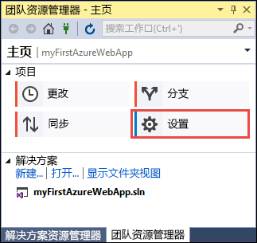
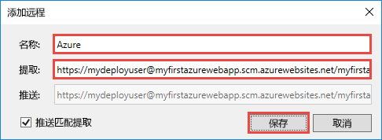
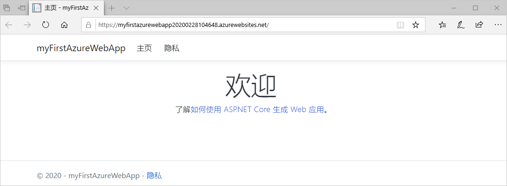
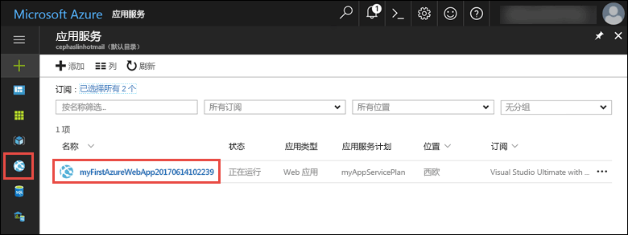
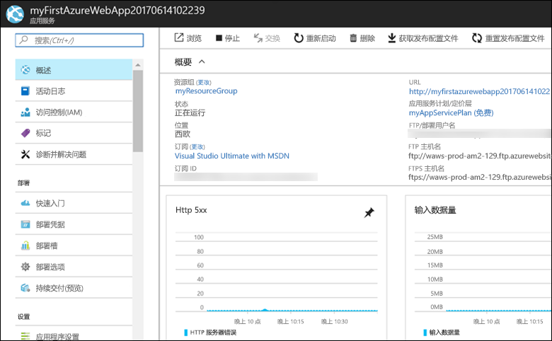

# <a name="create-an-aspnet-core-web-app-in-azure"></a>在 Azure 中创建 ASP.NET Core Web 应用

> [!NOTE]
> 本文将应用部署到 Windows 上的应用服务。 若要部署到基于 _Linux_ 的应用服务，请参阅[在基于 Linux 的应用服务中创建 .NET Core Web 应用](./containers/quickstart-dotnetcore.md)。
>
> 若要查找 ASP.NET Framework 应用的步骤，请参阅[在 Azure 中创建 ASP.NET Framework Web 应用](app-service-web-get-started-dotnet-framework.md)。 
>

[Azure Web 应用](app-service-web-overview.md)提供高度可缩放、自修补的 Web 托管服务。  本快速入门演示如何将第一个 ASP.NET Core Web 应用部署到 Azure Web 应用中。 完成后，便拥有了一个资源组，该资源组包含一个应用服务计划和一个具有已部署的 Web 应用程序的 Azure Web 应用。

[!INCLUDE [quickstarts-free-trial-note](../../includes/quickstarts-free-trial-note.md)]

## <a name="prerequisites"></a>先决条件

完成本教程：

* 使用以下工作负荷安装 <a href="https://www.visualstudio.com/downloads/" target="_blank">Visual Studio 2017</a>：
    - **ASP.NET 和 Web 开发**
    - **Azure 开发**

    

## <a name="create-an-aspnet-core-web-app"></a>创建一个 ASP.NET Core Web 应用

在 Visual Studio 中，通过依次选择“文件”>“新建”>“项目”创建项目。 

在“新建项目”对话框中，选择“Visual C#”>“Web”>“ASP.NET Core Web 应用程序”。

将应用程序命名为 _myFirstAzureWebApp_，选择“新建 Git 存储库”，然后选择“确定”。
   


可将任何类型的 ASP.NET Core Web 应用部署到 Azure。 在本快速入门教程中，请选择“Web 应用程序”模板，并确保将身份验证设置为“无身份验证”。
      
选择“确定”。



创建 ASP.NET Core 项目后，将显示 ASP.NET Core 欢迎页，其中提供了大量有助于入门的资源链接。 


在菜单中，选择“调试>启动但不调试”以在本地运行 Web 应用。



[!INCLUDE [cloud-shell-try-it.md](../../includes/cloud-shell-try-it.md)]

[!INCLUDE [Configure deployment user](../../includes/configure-deployment-user.md)] 

[!INCLUDE [Create resource group](../../includes/app-service-web-create-resource-group.md)] 

[!INCLUDE [Create app service plan](../../includes/app-service-web-create-app-service-plan.md)] 

[!INCLUDE [Create web app](../../includes/app-service-web-create-web-app.md)] 



## <a name="push-to-azure-from-visual-studio"></a>从 Visual Studio 推送到 Azure

回到 Visual Studio，在“视图”菜单中单击“团队资源管理器”。 此时会显示**团队资源管理器**。

在“主页”视图中，单击“设置” > “存储库设置”。



在“存储库设置”的“远程”部分，选择“添加”。 此时会显示“添加远程”对话框。

将“名称”字段设置为“Azure”，然后将“提取”字段设置为通过[创建 Web 应用](#create-a-web-app)保存的 URL。 单击“ **保存**”。



此设置相当于 Git 命令 `git remote add Azure <URL>`。

单击顶部的“主页”按钮。

选择“设置” > “全局设置”。 确认已设置名称和电子邮件地址。 必要时选择“更新”。

Visual Studio 已在创建项目时将所有文件提交到 Git 存储库中。 你现在需要做的是将文件推送到 Azure。

单击顶部的“主页”按钮。 选择“同步” > “操作” > “打开命令提示符”。 

在命令窗口中输入以下命令，并在系统提示时输入部署密码：

```
git push Azure master
```

此命令可能需要花费几分钟时间运行。 运行时，该命令会显示类似于以下示例的信息：

```
Counting objects: 4, done.
Delta compression using up to 8 threads.
Compressing objects: 100% (4/4), done.
Writing objects: 100% (4/4), 349 bytes | 349.00 KiB/s, done.
Total 4 (delta 3), reused 0 (delta 0)
remote: Updating branch 'master'.
remote: Updating submodules.
remote: Preparing deployment for commit id '9e20345e9c'.
remote: Generating deployment script.
remote: Project file path: .\myFirstAzureWebApp\myFirstAzureWebApp.csproj
remote: Solution file path: .\myFirstAzureWebApp.sln
remote: Generated deployment script files
remote: Running deployment command...
remote: Handling ASP.NET Core Web Application deployment.
remote:   Restoring packages for D:\home\site\repository\myFirstAzureWebApp\myFirstAzureWebApp.csproj...
remote:   Restoring packages for D:\home\site\repository\myFirstAzureWebApp\myFirstAzureWebApp.csproj...
...
remote: Finished successfully.
remote: Running post deployment command(s)...
remote: Deployment successful.
To https://<app_name>.scm.azurewebsites.net/<app_name>.git
 * [new branch]      master -> master
```

## <a name="browse-to-the-app"></a>浏览到应用

在浏览器中导航到 Azure Web 应用 URL：`http://<app_name>.azurewebsites.net`。

该页作为 Azure 应用服务 Web 应用运行。



恭喜，ASP.NET Core Web 应用已在 Azure 应用服务中实时运行！

## <a name="update-the-app-and-redeploy"></a>更新应用并重新部署

在“解决方案资源管理器”中打开“Pages/Index.cshtml”。

在顶部附近找到 `<div id="myCarousel" class="carousel slide" data-ride="carousel" data-interval="6000">` HTML 标记，将整个元素替换为以下代码：

```HTML
<div class="jumbotron">
    <h1>ASP.NET in Azure!</h1>
    <p class="lead">This is a simple app that we’ve built that demonstrates how to deploy a .NET app to Azure App Service.</p>
</div>
```

在“解决方案资源管理器”中右键单击“Pages/Index.cshtml”，然后单击“提交”。 针对所做的更改输入提交消息，然后单击“全部提交”。

返回到命令提示符窗口，将代码更改推送到 Azure。

```bash
git push Azure master
```

部署完成后，再次导航到 `http://<app_name>.azurewebsites.net`。


## <a name="manage-the-azure-web-app"></a>管理 Azure Web 应用

转到 <a href="https://portal.azure.com" target="_blank">Azure 门户</a>管理 Web 应用。

从左侧菜单中选择“应用服务”，并选择 Azure Web 应用的名称。



将看到 Web 应用的概述页。 在此处可以执行基本的管理任务，例如浏览、停止、启动、重新启动和删除。 



左侧菜单提供用于配置应用的不同页面。 

[!INCLUDE [Clean-up section](../../includes/clean-up-section-portal.md)]

## <a name="next-steps"></a>后续步骤

> [!div class="nextstepaction"]
> [将 ASP.NET Core 与 SQL 数据库配合使用](app-service-web-tutorial-dotnetcore-sqldb.md)
