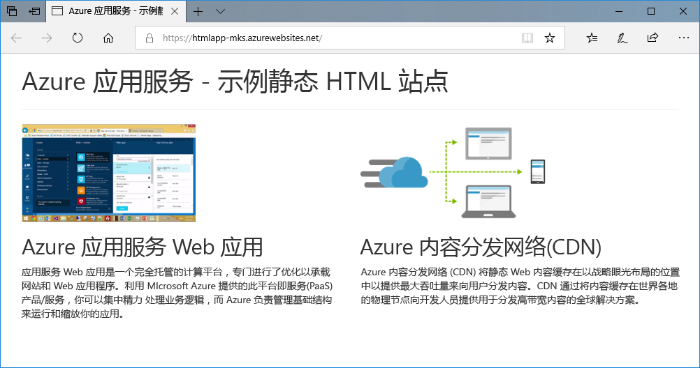
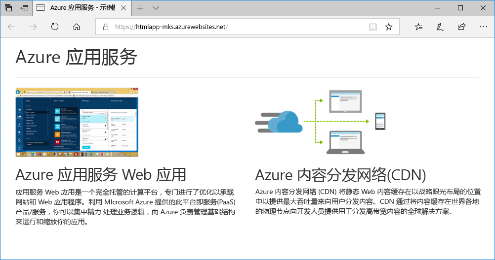
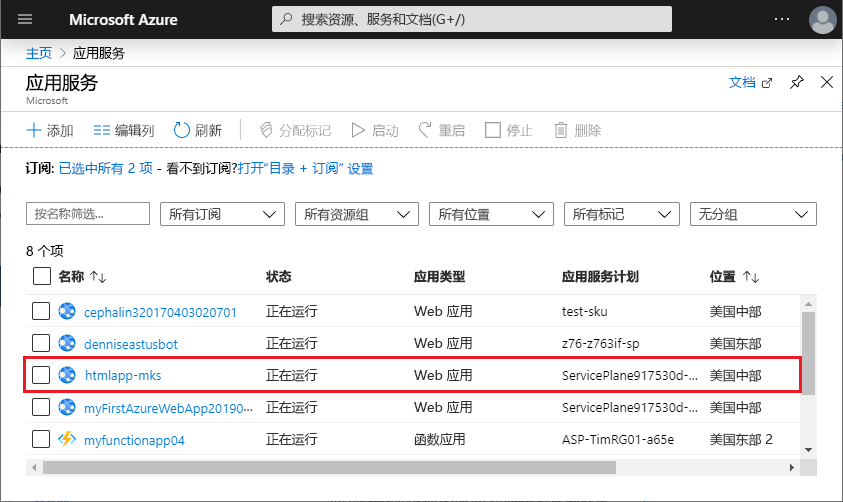
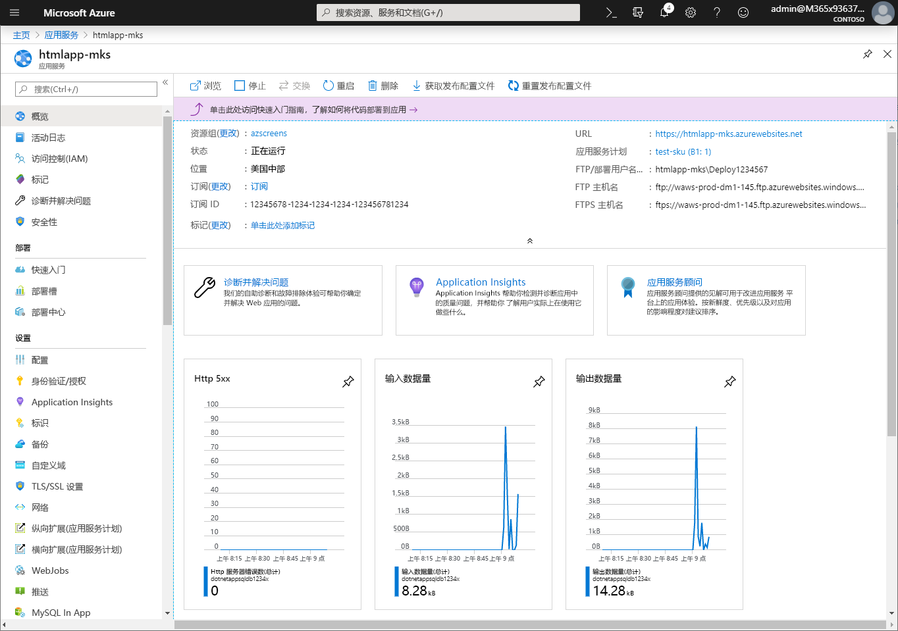

# <a name="create-a-static-html-web-app-in-azure"></a>在 Azure 中创建静态 HTML Web 应用

[Azure Web 应用](app-service-web-overview.md)提供高度可缩放、自修补的 Web 托管服务。  本快速入门教程演示如何将基本 HTML+CSS 站点部署到 Azure Web 应用。 使用 [Azure CLI](https://docs.microsoft.com/cli/azure/get-started-with-azure-cli) 创建 Web 应用，并使用 Git 将 HTML 内容示例部署到 Web 应用。



可以在 Mac、Windows 或 Linux 计算机上执行以下步骤。 安装先决条件后，大约需要五分钟完成这些步骤。

[!INCLUDE [quickstarts-free-trial-note](../../includes/quickstarts-free-trial-note.md)]

## <a name="prerequisites"></a>先决条件

完成本快速入门教程：

- <a href="https://git-scm.com/" target="_blank">安装 Git</a>

## <a name="download-the-sample"></a>下载示例

在终端窗口中，运行以下命令，将示例应用存储库克隆到本地计算机。

```bash
git clone https://github.com/Azure-Samples/html-docs-hello-world.git
```

切换到包含示例代码的目录。

```bash
cd html-docs-hello-world
```

## <a name="view-the-html"></a>查看 HTML

导航到包含示例 HTML 的目录。 在浏览器中打开 *index.html* 文件。


[!INCLUDE [cloud-shell-try-it.md](../../includes/cloud-shell-try-it.md)]

[!INCLUDE [Configure deployment user](../../includes/configure-deployment-user.md)] 

[!INCLUDE [Create resource group](../../includes/app-service-web-create-resource-group.md)] 

[!INCLUDE [Create app service plan](../../includes/app-service-web-create-app-service-plan.md)] 

[!INCLUDE [Create web app](../../includes/app-service-web-create-web-app.md)] 


[!INCLUDE [Push to Azure](../../includes/app-service-web-git-push-to-azure.md)] 

```bash
Counting objects: 13, done.
Delta compression using up to 4 threads.
Compressing objects: 100% (11/11), done.
Writing objects: 100% (13/13), 2.07 KiB | 0 bytes/s, done.
Total 13 (delta 2), reused 0 (delta 0)
remote: Updating branch 'master'.
remote: Updating submodules.
remote: Preparing deployment for commit id 'cc39b1e4cb'.
remote: Generating deployment script.
remote: Generating deployment script for Web Site
remote: Generated deployment script files
remote: Running deployment command...
remote: Handling Basic Web Site deployment.
remote: KuduSync.NET from: 'D:\home\site\repository' to: 'D:\home\site\wwwroot'
remote: Deleting file: 'hostingstart.html'
remote: Copying file: '.gitignore'
remote: Copying file: 'LICENSE'
remote: Copying file: 'README.md'
remote: Finished successfully.
remote: Running post deployment command(s)...
remote: Deployment successful.
To https://<app_name>.scm.azurewebsites.net/<app_name>.git
 * [new branch]      master -> master
```

## <a name="browse-to-the-app"></a>浏览到应用

在浏览器中转到 Azure Web 应用 URL：`http://<app_name>.azurewebsites.net`。

该页作为 Azure 应用服务 Web 应用运行。


**祝贺你！** 现已将第一个 HTML 应用部署到应用服务。

## <a name="update-and-redeploy-the-app"></a>更新并重新部署应用

在文本编辑器中打开 index.html 文件，并对标记进行更改。 例如，将 H1 标题从“Azure 应用服务 - 示例静态 HTML 站点”更改为“Azure 应用服务”。

在本地终端窗口中，提交在 Git 中所做的更改，然后将代码更改推送到 Azure。

```bash
git commit -am "updated HTML"
git push azure master
```

完成部署后，刷新浏览器以查看所做的更改。



## <a name="manage-your-new-azure-web-app"></a>管理新 Azure Web 应用

转到 <a href="https://portal.azure.com" target="_blank">Azure 门户</a>管理创建的 Web 应用。

在左侧菜单中单击“应用服务”，然后单击 Azure Web 应用的名称。



将看到 Web 应用的概述页。 在此处可以执行基本的管理任务，例如浏览、停止、启动、重新启动和删除。 



左侧菜单提供用于配置应用的不同页面。 

[!INCLUDE [cli-samples-clean-up](../../includes/cli-samples-clean-up.md)]

## <a name="next-steps"></a>后续步骤

> [!div class="nextstepaction"]
> [映射自定义域](app-service-web-tutorial-custom-domain.md)
