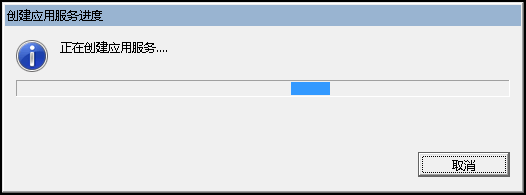
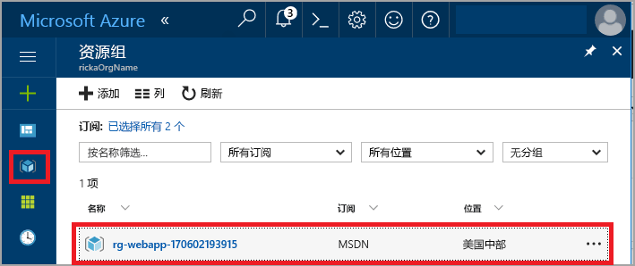
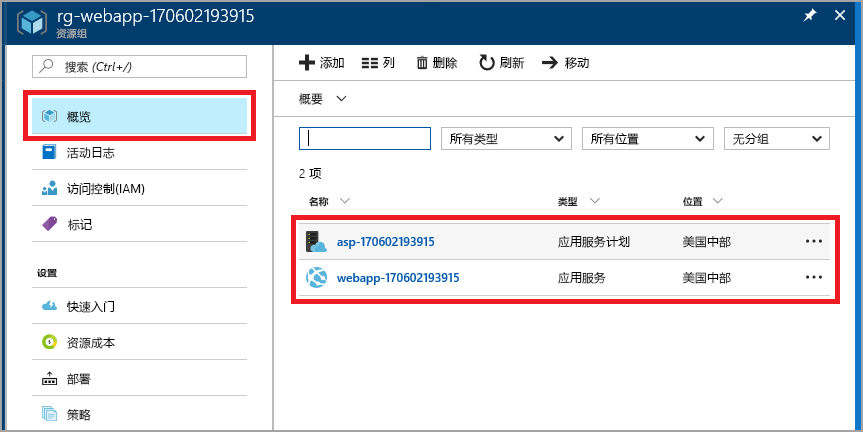
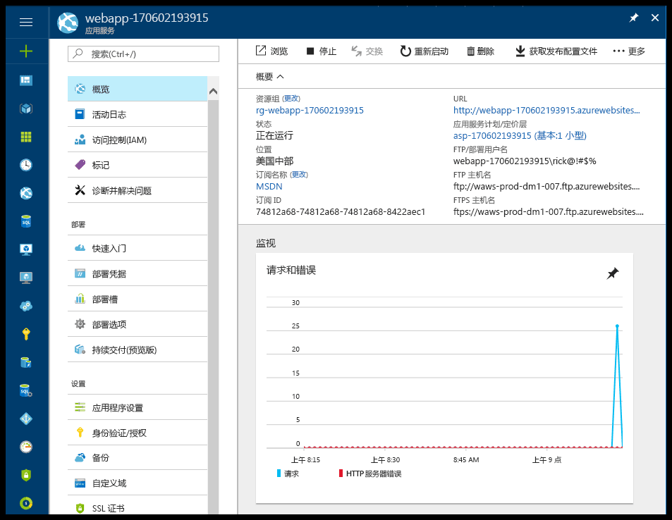

# <a name="create-your-first-java-web-app-in-azure"></a>在 Azure 中创建第一个 Java Web 应用

Azure [Web 应用](app-service-web-overview.md)提供高度可缩放、自修补的 Web 托管服务。 本快速入门演示如何使用 [Eclipse IDE for Java EE Developers](http://www.eclipse.org/) 将 Java Web 应用部署到应用服务。

完成本快速入门后，应用程序会在 Web 浏览器中如下图所示：


## <a name="prerequisites"></a>先决条件

若要完成本快速入门教程，请安装：

* 免费 <a href="http://www.eclipse.org/downloads/" target="_blank">Eclipse IDE for Java EE Developers</a>。 本快速入门教程使用 Eclipse Neon。
* <a href="/java/azure/eclipse/azure-toolkit-for-eclipse-installation" target="_blank">用于 Eclipse 的 Azure 工具包</a>。

[!INCLUDE [quickstarts-free-trial-note](../../includes/quickstarts-free-trial-note.md)]

## <a name="create-a-dynamic-web-project-in-eclipse"></a>在 Eclipse 中创建一个动态 Web 项目

在 Eclipse 中，选择“文件” > “新建” > “动态 Web 项目”。

在“新建动态 Web 项目”对话框中，将项目命名为 **MyFirstJavaOnAzureWebApp**，然后选择“完成”。
   


### <a name="add-a-jsp-page"></a>添加 JSP 页面

如果未显示“项目资源管理器”，请将其还原。


在“项目资源管理器”中，展开“MyFirstJavaOnAzureWebApp”项目。
右键单击“WebContent”，然后选择“新建” > “JSP 文件”。


在“新建 JSP 文件”对话框中：

* 将该文件命名为 **index.jsp**。
* 选择“完成”。

  

在 index.jsp 文件中，将 `<body></body>` 元素替换为以下标记：

```jsp
<body>
<h1><% out.println("Hello Azure!"); %></h1>
</body>
```

保存更改。

## <a name="publish-the-web-app-to-azure"></a>将 Web 应用发布到 Azure

在“项目资源管理器”中，右键单击该项目，然后选择“Azure” > “发布为 Azure Web 应用”。


在“Azure 登录”对话框中，保留“交互式”选项，然后选择“登录”。

按照登录说明操作。

### <a name="deploy-web-app-dialog-box"></a>“部署 Web 应用”对话框

登录 Azure 帐户后，随即显示“部署 Web 应用”对话框。

选择“创建” 。


### <a name="create-app-service-dialog-box"></a>“创建应用服务”对话框

随即显示含有默认值的“创建应用服务”对话框。 下图中显示的数字 **170602185241** 与对话框中的不同。


在“创建应用服务”对话框中：

* 保留为 Web 应用生成的名称。 该名称在 Azure 中必须唯一。 该名称是 Web 应用的 URL 地址的一部分。 例如：如果 Web 应用名称为 **MyJavaWebApp**，则 URL 为 myjavawebapp.azurewebsites.net。
* 保留默认 web 容器。
* 选择 Azure 订阅。
* 在“应用服务计划”选项卡中：

  * **新建**：保留默认值，该值是应用服务计划的名称。
  * **位置**：选择“西欧”或你附近的位置。
  * **定价层**：选择免费选项。 有关功能，请参阅[应用服务定价](https://azure.microsoft.com/pricing/details/app-service/?ref=microsoft.com&utm_source=microsoft.com&utm_medium=docs&utm_campaign=visualstudio)。

   

[!INCLUDE [app-service-plan](../../includes/app-service-plan.md)]

### <a name="resource-group-tab"></a>“资源组”选项卡

选择“资源组”选项卡。保留默认的资源组生成值。


[!INCLUDE [resource-group](../../includes/resource-group.md)]

选择“创建” 。

<!--
### The JDK tab

Select the **JDK** tab. Keep the default, and then select **Create**.


-->

Azure 工具包创建 Web 应用，并显示进度对话框。



### <a name="deploy-web-app-dialog-box"></a>“部署 Web 应用”对话框

在“部署 Web 应用”对话框中，选择“部署到根目录”。 如果你在 *wingtiptoys.azurewebsites.net* 中有一个应用服务，而你不部署到根目录，则会将名为 **MyFirstJavaOnAzureWebApp** 的 Web 应用部署到 *wingtiptoys.azurewebsites.net/MyFirstJavaOnAzureWebApp*。


该对话框显示 Azure、JDK 和 Web 容器选择。

选择“部署”将 Web 应用发布到 Azure。

发布完成后，在“Azure 活动日志”对话框中选择“已发布”链接。


祝贺你！ 你已成功将 Web 应用部署到 Azure。 


## <a name="update-the-web-app"></a>更新 Web 应用

将示例 JSP 代码更改为其他消息。

```jsp
<body>
<h1><% out.println("Hello again Azure!"); %></h1>
</body>
```

保存更改。

在“项目资源管理器”中，右键单击该项目，然后选择“Azure” > “发布为 Azure Web 应用”。

“部署 Web 应用”对话框随即出现并显示之前创建的应用服务。 

> [!NOTE] 
> 每次发布时选择“部署到根目录”。 
> 

选择 Web 应用，然后选择“部署”，此操作将发布更改。

当“发布”链接显示后，选择它以浏览到 Web 应用，并查看更改。

## <a name="manage-the-web-app"></a>管理 Web 应用

转到 <a href="https://portal.azure.com" target="_blank">Azure 门户</a>查看已创建的 Web 应用。

从左侧菜单中，选择“资源组”。



选择“资源组”。 该页显示在本快速入门教程中创建的资源。



选择 Web 应用（上图中的 **webapp-170602193915**）。

“概述”页随即出现。 在此页中可以查看应用的运行状况。 在此处可以执行基本的管理任务，例如浏览、停止、启动、重启和删除。 页面左侧的选项卡显示可以打开的不同配置。 



[!INCLUDE [clean-up-section-portal-web-app](../../includes/clean-up-section-portal-web-app.md)]

## <a name="next-steps"></a>后续步骤

> [!div class="nextstepaction"]
> [映射自定义域](app-service-web-tutorial-custom-domain.md)
