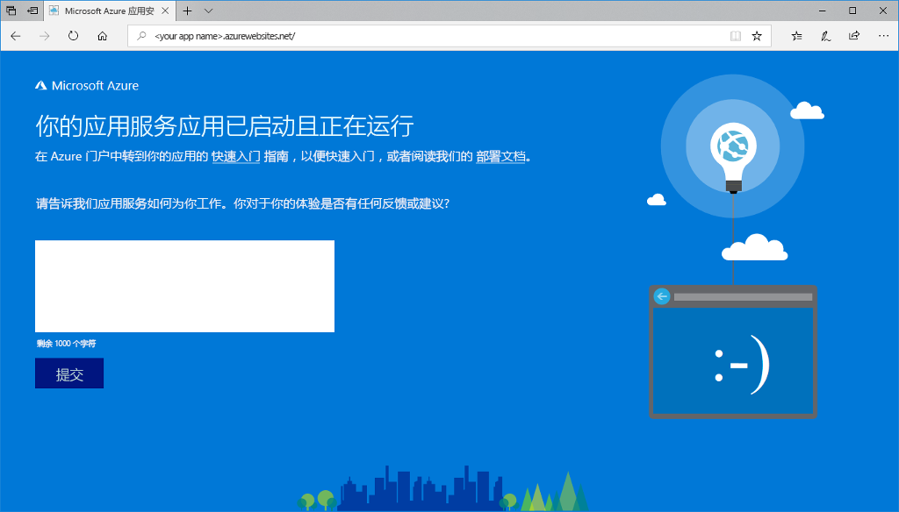
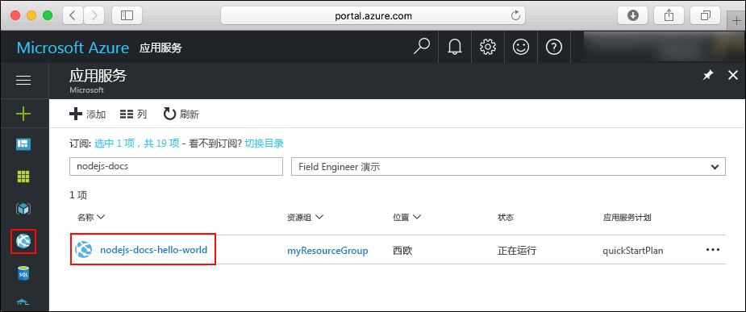
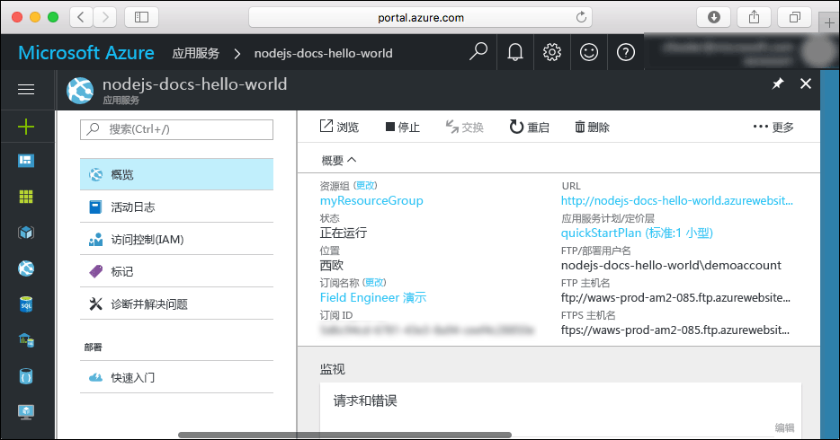

# <a name="create-a-nodejs-web-app-in-azure"></a>在 Azure 中创建 Node.js Web 应用

> [!NOTE]
> 本文将应用部署到 Windows 上的应用服务。 若要部署到基于 _Linux_ 的应用服务，请参阅[在基于 Linux 的 Azure 应用服务中创建 Node.js Web 应用](./containers/quickstart-nodejs.md)。
>

[Azure 应用服务](overview.md)提供高度可缩放、自修补的 Web 托管服务。  本快速入门演示如何将 Node.js 应用部署到 Azure 应用服务中。 使用 [Azure CLI](https://docs.microsoft.com/cli/azure/get-started-with-azure-cli) 创建 Web 应用，并使用 ZipDeploy 将 Node.js 代码示例部署到 Web 应用。


可以在 Mac、Windows 或 Linux 计算机上执行此处的步骤。 安装先决条件后，大约需要五分钟完成这些步骤。   

[!INCLUDE [quickstarts-free-trial-note](../../includes/quickstarts-free-trial-note.md)]

## <a name="prerequisites"></a>先决条件

完成本快速入门教程需要：

* <a href="https://nodejs.org/" target="_blank">安装 Node.js 和 NPM</a>

## <a name="download-the-sample"></a>下载示例

从 [https://github.com/Azure-Samples/nodejs-docs-hello-world/archive/master.zip](https://github.com/Azure-Samples/nodejs-docs-hello-world/archive/master.zip) 下载示例 Node.js 项目并提取 ZIP 存档。

打开 _index.js_ 并找到以下行：

```javascript
const port = process.env.PORT || 1337;
```

应用服务会将 process.env.PORT 注入应用程序，因此代码将使用该变量来获知要侦听的端口。 

在一个终端窗口中，导航到示例 Node.js 项目的**根目录**（包含 _index.js_ 的目录）。

## <a name="run-the-app-locally"></a>在本地运行应用

在本地运行应用程序，以便你能了解将它部署到 Azure 时它的外观应该是什么样的。 打开一个终端窗口并使用 `npm start` 脚本启动内置的 Node.js HTTP 服务器。

```bash
npm start
```

打开 Web 浏览器并导航到 `http://localhost:1337` 处的示例应用。

页面中会显示该示例应用发出的 Hello World 消息。


在终端窗口中，按 **Ctrl+C** 退出 Web 服务器。

> [!NOTE]
> 在 Azure 应用服务中，此应用在 IIS 中使用 [iisnode](https://github.com/Azure/iisnode) 运行。 为了让应用能够使用 iisnode 运行，根应用目录包含一个 web.config 文件。 此文件可以由 IIS 读取，与 iisnode 相关的设置记录在 [iisnode GitHub 存储库](https://github.com/Azure/iisnode/blob/master/src/samples/configuration/web.config)中。

## <a name="create-a-project-zip-file"></a>创建一个项目 zip 文件

在一个终端窗口中，导航到示例 Node.js 项目的**根目录**（包含 _index.js_ 的目录）。 创建一个包含项目所有内容的 zip 文件。 以下命令使用您终端中的默认工具执行操作：

```
# Bash
zip -r myAppFiles.zip .

# PowerShell
Compress-Archive -Path * -DestinationPath myAppFiles.zip
```

命令执行完后将此 ZIP 文件上传到 Azure 并将其部署到应用服务。

[!INCLUDE [cloud-shell-try-it.md](../../includes/cloud-shell-try-it.md)]

[!INCLUDE [Create resource group](../../includes/app-service-web-create-resource-group-scus.md)] 

[!INCLUDE [Create app service plan](../../includes/app-service-web-create-app-service-plan-scus.md)] 

## <a name="create-a-web-app"></a>创建 Web 应用

在 Cloud Shell 中，使用 [`az webapp create`](/cli/azure/webapp?view=azure-cli-latest#az-webapp-create) 命令在 `myAppServicePlan` 应用服务计划中创建一个 Web 应用。 

在以下示例中，将 `<app_name>` 替换为全局唯一的应用名称（有效字符是 `a-z`、`0-9` 和 `-`）。

```azurecli-interactive
# Bash and Powershell
az webapp create --resource-group myResourceGroup --plan myAppServicePlan --name <app_name>
```

创建 Web 应用后，Azure CLI 会显示类似于以下示例的输出：

```json
{
  "availabilityState": "Normal",
  "clientAffinityEnabled": true,
  "clientCertEnabled": false,
  "cloningInfo": null,
  "containerSize": 0,
  "dailyMemoryTimeQuota": 0,
  "defaultHostName": "<app_name>.azurewebsites.net",
  "enabled": true,
  < JSON data removed for brevity. >
}
```

### <a name="set-nodejs-runtime"></a>设置 Node.js 运行时

将 Node 运行时设置为 10.14.1。 若要查看所有受支持的运行时，请运行 [`az webapp list-runtimes`](/cli/azure/webapp?view=azure-cli-latest#az-webapp-list-runtimes)。

```azurecli-interactive
# Bash and Powershell
az webapp config appsettings set --resource-group myResourceGroup --name <app_name> --settings WEBSITE_NODE_DEFAULT_VERSION=10.14.1
```

浏览到新建的 Web 应用。 将 `<app_name>` 替换为唯一应用名称。

```bash
http://<app_name>.azurewebsites.net
```

新 Web 应用应该如下所示：



[!INCLUDE [Deploy ZIP file](../../includes/app-service-web-deploy-zip.md)]

## <a name="browse-to-the-app"></a>浏览到应用

使用 Web 浏览器浏览到已部署的应用程序。

```
http://<app_name>.azurewebsites.net
```

Node.js 示例代码在 Azure 应用服务 Web 应用中运行。


祝贺你！ 现已将第一个 Node.js 应用部署到应用服务。

## <a name="update-and-redeploy-the-code"></a>更新并重新部署代码

使用文本编辑器在 Node.js 应用中打开 `index.js` 文件，然后对 `response.end` 调用中的文本稍微进行更改：

```javascript
response.end("Hello Azure!");
```

在本地终端窗口中，导航到你的应用程序的**根目录**（包含 _index.js_ 的目录），为更新后的项目创建新的 ZIP 文件。

```azurecli-interactive
# Bash
zip -r myUpdatedAppFiles.zip .

# PowerShell
Compress-Archive -Path * -DestinationPath myUpdatedAppFiles.zip
```

将此新的 ZIP 文件部署到应用服务，使用的步骤与[部署 ZIP 文件](#deploy-zip-file)中的步骤相同。

切换回在“浏览到应用”步骤中打开的浏览器窗口，然后刷新页面。


## <a name="manage-your-new-azure-app"></a>管理新的 Azure 应用

转到 <a href="https://portal.azure.com" target="_blank">Azure 门户</a>管理创建的 Web 应用。

在左侧菜单中单击“应用程序服务”，然后单击 Azure 应用的名称。



这里我们可以看到 Web 应用的概述页。 并可以执行基本的管理任务，例如浏览、停止、启动、重新启动和删除。 



左侧菜单提供了用于配置应用的不同页面。 

[!INCLUDE [cli-samples-clean-up](../../includes/cli-samples-clean-up.md)]

## <a name="next-steps"></a>后续步骤

> [!div class="nextstepaction"]
> [将 Node.js 与 MongoDB 配合使用](app-service-web-tutorial-nodejs-mongodb-app.md)
