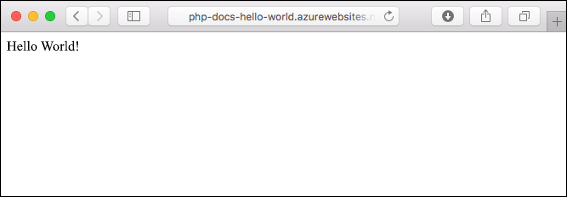
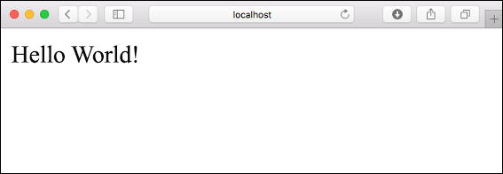
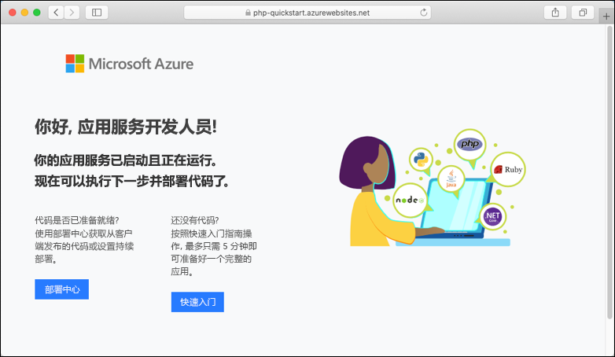
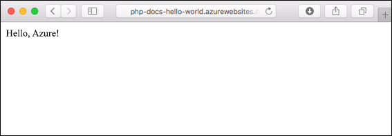
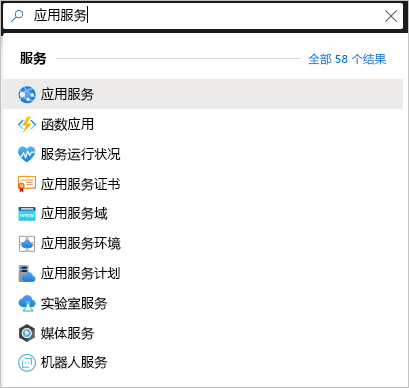
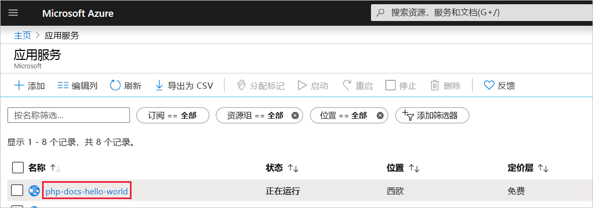
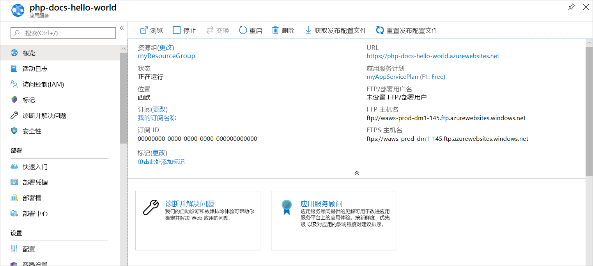

# <a name="create-a-php-web-app-in-azure"></a>在 Azure 中创建 PHP Web 应用

> [!NOTE]
> 本文将应用部署到 Windows 上的应用服务。 若要部署到基于 _Linux_ 的应用服务，请参阅[在基于 Linux 的应用服务中创建 PHP Web 应用](./containers/quickstart-php.md)。
>

[Azure 应用服务](overview.md)提供高度可缩放、自修复的 Web 托管服务。  本快速入门教程演示如何将 PHP 应用部署到 Azure 应用服务。 在 Cloud Shell 中使用 [Azure CLI](https://docs.microsoft.com/cli/azure/get-started-with-azure-cli) 创建 Web 应用，并使用 Git 将 PHP 代码示例部署到该 Web 应用。



可以在 Mac、Windows 或 Linux 计算机上执行此处的步骤。 安装先决条件后，大约需要五分钟完成这些步骤。

[!INCLUDE [quickstarts-free-trial-note](../../includes/quickstarts-free-trial-note.md)]

## <a name="prerequisites"></a>先决条件

完成本快速入门教程需要：

* <a href="https://git-scm.com/" target="_blank">安装 Git</a>
* <a href="https://php.net/manual/install.php" target="_blank">安装 PHP</a>

## <a name="download-the-sample-locally"></a>将示例下载到本地

在终端窗口中运行以下命令。 这样会将示例应用程序克隆到本地计算机，并导航到包含示例代码的目录。 

```bash
git clone https://github.com/Azure-Samples/php-docs-hello-world
cd php-docs-hello-world
```

## <a name="run-the-app-locally"></a>在本地运行应用

在本地运行应用程序，以便你能了解将它部署到 Azure 时它的外观应该是什么样的。 打开一个终端窗口并使用 `php` 命令启动内置的 PHP Web 服务器。

```bash
php -S localhost:8080
```

打开 Web 浏览器并导航到 `http://localhost:8080` 处的示例应用。

此时会看到来自示例应用的 Hello World! 消息显示在页面中。



在终端窗口中，按 **Ctrl+C** 退出 Web 服务器。

[!INCLUDE [cloud-shell-try-it.md](../../includes/cloud-shell-try-it.md)]

[!INCLUDE [Configure deployment user](../../includes/configure-deployment-user.md)]

[!INCLUDE [Create resource group](../../includes/app-service-web-create-resource-group.md)]

[!INCLUDE [Create app service plan](../../includes/app-service-web-create-app-service-plan.md)]

## <a name="create-a-web-app"></a>创建 Web 应用

在 Cloud Shell 中，使用 [`az webapp create`](/cli/azure/webapp?view=azure-cli-latest#az-webapp-create) 命令在应用服务计划 `myAppServicePlan` 中创建一个 Web 应用。 

在以下示例中，将 `<app-name>` 替换为全局唯一的应用名称（有效字符是 `a-z`、`0-9` 和 `-`）。 运行时设置为 `PHP|7.0`。 若要查看所有受支持的运行时，请运行 [`az webapp list-runtimes`](/cli/azure/webapp?view=azure-cli-latest#az-webapp-list-runtimes)。 


```azurecli-interactive
# Bash
az webapp create --resource-group myResourceGroup --plan myAppServicePlan --name <app-name> --runtime "PHP|7.4" --deployment-local-git
# PowerShell
az --% webapp create --resource-group myResourceGroup --plan myAppServicePlan --name <app-name> --runtime "PHP|7.4" --deployment-local-git
```
> [!NOTE]
> PowerShell 3.0 中引入的停止分析符号 `(--%)` 指示 PowerShell 避免将输入解释为 PowerShell 命令或表达式。 
>

创建 Web 应用后，Azure CLI 会显示类似于以下示例的输出：

<pre>
Local git is configured with url of 'https://&lt;username&gt;@&lt;app-name&gt;.scm.azurewebsites.net/&lt;app-name&gt;.git'
{
  "availabilityState": "Normal",
  "clientAffinityEnabled": true,
  "clientCertEnabled": false,
  "cloningInfo": null,
  "containerSize": 0,
  "dailyMemoryTimeQuota": 0,
  "defaultHostName": "&lt;app-name&gt;.azurewebsites.net",
  "enabled": true,
  &lt; JSON data removed for brevity. &gt;
}
</pre>

现在你已经创建了一个新的空 Web 应用并启用了 Git 部署。

> [!NOTE]
> Git 远程的 URL 将显示在 `deploymentLocalGitUrl` 属性中，其格式为 `https://<username>@<app-name>.scm.azurewebsites.net/<app-name>.git`。 保存此 URL，后续将会用到。
>

浏览到新建的 Web 应用。 将 _&lt;app name>_ 替换为在上一步中创建的唯一应用名称。

```bash
http://<app name>.azurewebsites.net
```

新 Web 应用应该如下所示：



[!INCLUDE [Push to Azure](../../includes/app-service-web-git-push-to-azure.md)] 

<pre>
Counting objects: 2, done.
Delta compression using up to 4 threads.
Compressing objects: 100% (2/2), done.
Writing objects: 100% (2/2), 352 bytes | 0 bytes/s, done.
Total 2 (delta 1), reused 0 (delta 0)
remote: Updating branch 'master'.
remote: Updating submodules.
remote: Preparing deployment for commit id '25f18051e9'.
remote: Generating deployment script.
remote: Running deployment command...
remote: Handling Basic Web Site deployment.
remote: Kudu sync from: '/home/site/repository' to: '/home/site/wwwroot'
remote: Copying file: '.gitignore'
remote: Copying file: 'LICENSE'
remote: Copying file: 'README.md'
remote: Copying file: 'index.php'
remote: Ignoring: .git
remote: Finished successfully.
remote: Running post deployment command(s)...
remote: Deployment successful.
To https://&lt;app-name&gt;.scm.azurewebsites.net/&lt;app-name&gt;.git
   cc39b1e..25f1805  master -> master
</pre>

## <a name="browse-to-the-app"></a>浏览到应用

使用 Web 浏览器浏览到已部署的应用程序。

```
http://<app-name>.azurewebsites.net
```

PHP 示例代码在 Azure 应用服务的 Web 应用中运行。


祝贺你！ 现已将第一个 PHP 应用部署到应用服务。

## <a name="update-locally-and-redeploy-the-code"></a>在本地更新并重新部署代码

使用本地文本编辑器打开 PHP 应用中的 `index.php` 文件，并对 `echo` 旁边的字符串中的文本稍微进行更改：

```php
echo "Hello Azure!";
```

在本地终端窗口中，提交在 Git 中所做的更改，然后将代码更改推送到 Azure。

```bash
git commit -am "updated output"
git push azure master
```

完成部署后，返回到“浏览到应用”步骤期间打开的浏览器窗口，然后刷新页面。



## <a name="manage-your-new-azure-app"></a>管理新的 Azure 应用

1. 转到 <a href="https://portal.azure.com" target="_blank">Azure 门户</a>管理创建的 Web 应用。 搜索并选择“应用服务”。

    

2. 选择 Azure 应用名称。

    

    此时会显示 Web 应用的“概览”页。 可在此处执行基本的管理任务，例如浏览、停止、重启和删除。   

    

    Web 应用菜单提供用于配置应用的不同选项。 

[!INCLUDE [cli-samples-clean-up](../../includes/cli-samples-clean-up.md)]

## <a name="next-steps"></a>后续步骤

> [!div class="nextstepaction"]
> [带 MySQL 的 PHP](app-service-web-tutorial-php-mysql.md)
