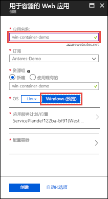
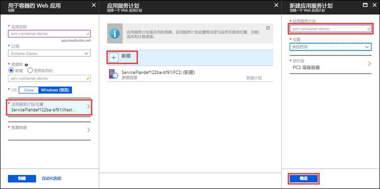
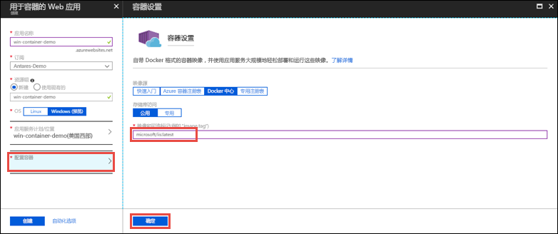
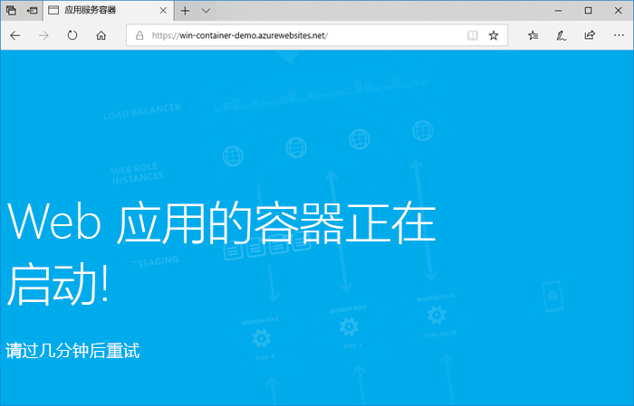

# <a name="run-a-custom-windows-container-in-azure-preview"></a>在 Azure 中运行自定义 Windows 容器（预览版）

[Azure 应用服务](app-service-web-overview.md)在 Windows 上提供预定义的应用程序堆栈，例如在 IIS 上运行的 ASP.NET 或 Node.js。 预配置的 Windows 环境锁定了操作系统，不允许对其进行管理访问、软件安装、全局程序集缓存更改等操作（请参阅 [Azure 应用服务上的操作系统功能](web-sites-available-operating-system-functionality.md)）。 如果应用程序需要的访问权限超出了预配置环境的允许，则可改为部署自定义 Windows 容器。 本快速入门介绍如何通过 [Docker 中心](https://hub.docker.com/)将自定义 IIS 映像部署到 Azure 应用服务。


## <a name="sign-in-to-azure"></a>登录 Azure

通过 https://portal.azure.com 登录到 Azure 门户。

## <a name="create-a-windows-container-app"></a>创建 Windows 容器应用

1. 在 Azure 门户的左上角选择“创建资源”。

2. 在 Azure 市场资源列表上方的搜索框中，搜索并选择“容器的 Web 应用”。

3. 提供应用名称（例如 *mywebapp*），接受创建新资源组所需的默认设置，然后在“OS”框中单击“Windows (预览版)”。

    

4. 单击“应用服务计划/位置” > “新建”，创建应用服务计划。 为新计划提供一个名称，接受默认设置，然后单击“确定”。

    

5. 单击“配置容器”，在“映像和可选标记”中键入 _microsoft/iis:latest_，然后单击“确定”。

    

    在本文中，请使用公共的 [microsoft/iis:latest](https://hub.docker.com/r/microsoft/iis/) Docker 中心映像。 如果用于 Web 应用程序的自定义映像位于其他位置，例如位于 [Azure 容器注册表](/azure/container-registry/)中或任何其他的专用存储库中，则可在这里对其进行配置。

6. 单击“创建”，等待 Azure 创建所需的资源。

## <a name="browse-to-the-container-app"></a>浏览到容器应用

Azure 操作完成后，会显示通知框。


1. 单击“转到资源”。

2. 在应用页中，单击“URL”下的链接。

此时会出现一个打开到以下页面的新浏览器页面：



等待数分钟，然后再次尝试，直到出现 IIS 欢迎页面：


**祝贺你！** 你现在是在 Azure 应用服务中运行第一个自定义 Windows 容器。

## <a name="see-container-start-up-logs"></a>查看容器启动日志

Windows 容器的加载可能需要一定的时间。 若要查看进度，请导航到以下 URL（将 *\<app_name>* 替换为应用名称）。
```
https://<app_name>.scm.azurewebsites.net/api/logstream
```

流式传输的日志如下所示：

```
2018-07-27T12:03:11  Welcome, you are now connected to log-streaming service.
27/07/2018 12:04:10.978 INFO - Site: win-container-demo - Start container succeeded. Container: facbf6cb214de86e58557a6d073396f640bbe2fdec88f8368695c8d1331fc94b
27/07/2018 12:04:16.767 INFO - Site: win-container-demo - Container start complete
27/07/2018 12:05:05.017 INFO - Site: win-container-demo - Container start complete
27/07/2018 12:05:05.020 INFO - Site: win-container-demo - Container started successfully
```

## <a name="use-a-different-docker-image"></a>使用其他 Docker 映像

可以使用其他自定义的 Docker 映像来运行应用。 但是，必须为所需框架选择适当的[父映像](https://docs.docker.com/develop/develop-images/baseimages/)： 

- 若要部署 .NET Framework 应用，请使用基于 Windows Server Core 2016 [Long-Term Servicing Channel (LTSC)](https://docs.microsoft.com/windows-server/get-started/semi-annual-channel-overview#long-term-servicing-channel-ltsc) 发行版的父映像。 
- 若要部署 .NET Core 应用，请使用基于 Windows Server Nano 2016 [Long-Term Servicing Channel (LTSC)](https://docs.microsoft.com/windows-server/get-started/semi-annual-channel-overview#long-term-servicing-channel-ltsc) 发行版的父映像。 

在应用启动期间，下载父映像需要一些时间。 不过，可以使用已缓存在 Azure 应用服务中的下述父映像之一，缩短启动时间：

- [microsoft/iis](https://hub.docker.com/r/microsoft/iis/):windowsservercore-ltsc2016，最新
- [microsoft/iis](https://hub.docker.com/r/microsoft/iis/):nanoserver-sac2016
- [microsoft/aspnet](https://hub.docker.com/r/microsoft/aspnet/):4.7.2-windowsservercore-ltsc2016，4.7.2，最新
- [microsoft/dotnet](https://hub.docker.com/r/microsoft/dotnet/):2.1-aspnetcore-runtime
- [microsoft/dotnet](https://hub.docker.com/r/microsoft/dotnet/):2.1-sdk
