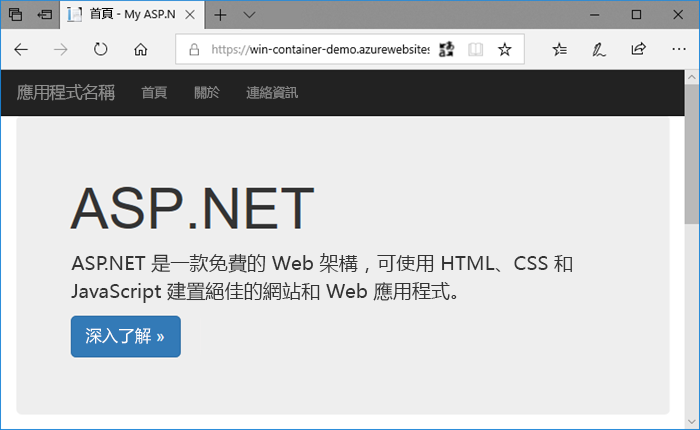
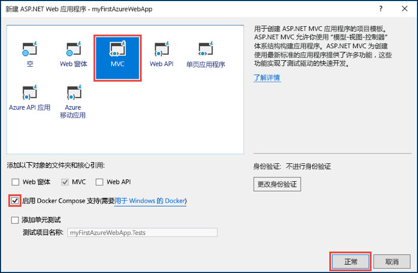
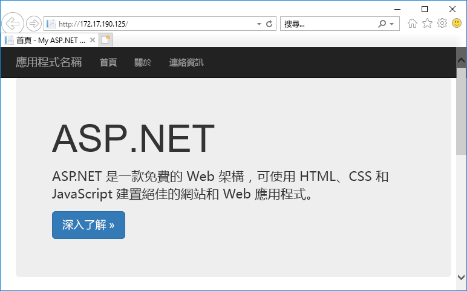
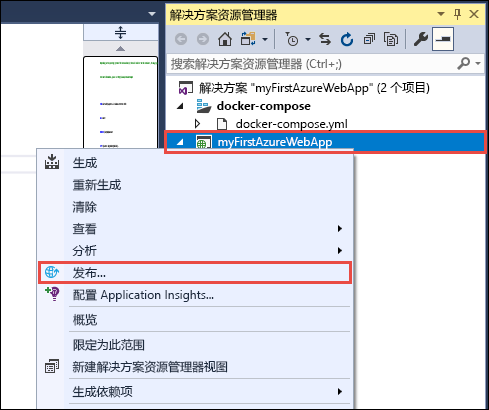
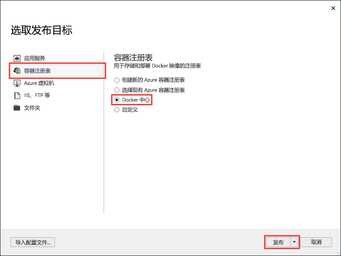
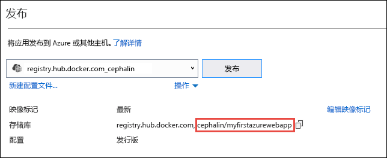
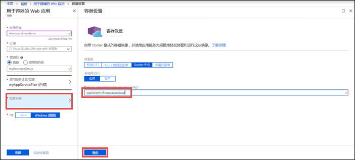
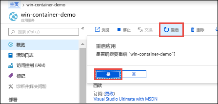
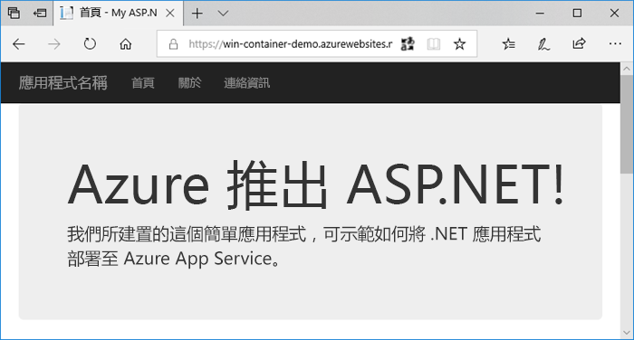

# <a name="run-a-custom-windows-container-in-azure-preview"></a>在 Azure 中运行自定义 Windows 容器（预览版）

[Azure 应用服务](overview.md)在 Windows 上提供预定义的应用程序堆栈，例如在 IIS 上运行的 ASP.NET 或 Node.js。 预配置的 Windows 环境锁定了操作系统，不允许对其进行管理访问、软件安装、全局程序集缓存更改等操作（请参阅 [Azure 应用服务上的操作系统功能](operating-system-functionality.md)）。 如果应用程序需要的访问权限超出了预配置环境的允许，则可改为部署自定义 Windows 容器。 本快速入门介绍如何将 Windows 映像中的 ASP.NET 应用从 Visual Studio 部署到 [Docker 中心](https://hub.docker.com/)以及在 Azure 应用服务中的自定义容器中运行它。



## <a name="prerequisites"></a>先决条件

完成本教程需要：

- <a href="https://hub.docker.com/" target="_blank">注册 Docker 中心帐户</a>
- <a href="https://docs.docker.com/docker-for-windows/install/" target="_blank">安装用于 Windows 的 Docker</a>。
- <a href="https://docs.microsoft.com/virtualization/windowscontainers/quick-start/quick-start-windows-10" target="_blank">将 Docker 切换为运行 Windows 容器</a>。
- <a href="https://www.visualstudio.com/downloads/" target="_blank">安装 Visual Studio 2017</a>，其中包含 ASP.NET 和 web 开发以及 Azure 开发工作负载。 如果已安装 Visual Studio 2017：
    - 通过单击“帮助” > “检查更新”，在 Visual Studio 中安装最新的更新。
    - 在 Visual Studio 中，通过单击“工具” > “获取工具和功能”，添加工作负载。

## <a name="create-an-aspnet-web-app"></a>创建 ASP.NET Web 应用

在 Visual Studio 中，通过依次选择“文件”>“新建”>“项目”创建项目。 

在“新建项目”对话框中，选择“Visual C#”>“Web”>“ASP.NET Web 应用程序 (.NET Framework)”。

将应用程序命名为 _myFirstAzureWebApp_，然后选择“确定”。
   


可将任何类型的 ASP.NET Web 应用部署到 Azure。 在本快速入门教程中，请选择“MVC”模板，并确保将身份验证设置为“无身份验证”。

选择“启用 Docker Compose 支持(_E)”。

选择“确定”。



如果 _Dockerfile_ 文件未自动打开，则从解决方案资源管理器中打开。

需要使用[受支持的父映像](#use-a-different-parent-image)。 通过将 `FROM` 行替换为以下代码，更改父映像，并保存文件：

```Dockerfile
FROM mcr.microsoft.com/dotnet/framework/aspnet:4.7.2-windowsservercore-ltsc2019
```

在菜单中，选择“调试>启动但不调试”以在本地运行 Web 应用。



## <a name="publish-to-docker-hub"></a>发布到 Docker 中心

在“解决方案资源管理器”中右键单击“myFirstAzureWebApp”项目，然后选择“发布”。



发布向导是自动启动的。 选择“容器注册表” > “Docker 中心” > “发布”。



提供 Docker 中心帐户凭据，然后单击“保存”。 

等待部署完成。 等待部署完成。 “发布”页会显示以后要在应用服务中使用的存储库名称。



复制此存储库名称待以后使用。

## <a name="sign-in-to-azure"></a>登录 Azure

通过 https://portal.azure.com 登录到 Azure 门户。

## <a name="create-a-windows-container-app"></a>创建 Windows 容器应用

1. 在 Azure 门户的左上角选择“创建资源”。

2. 在 Azure 市场资源列表上方的搜索框中，搜索并选择“用于容器的 Web 应用”。

3. 提供应用名称（例如 win-container-demo），接受创建新资源组所需的默认设置，然后在“OS”框中单击“Windows (预览版)”。

    

4. 单击“应用服务计划/位置” > “新建”，创建应用服务计划。 为新计划提供一个名称，接受默认设置，然后单击“确定”。

    

5. 单击“配置容器”。 在“映像和可选标记”  中，使用在 [发布到 Docker 中心](#publish-to-docker-hub) 中复制的存储库名称，然后单击“确定”。

    

    如果用于 Web 应用程序的自定义映像位于其他位置，例如位于 [Azure 容器注册表](/azure/container-registry/)中或任何其他的专用存储库中，则可在这里对其进行配置。

6. 单击“创建”，等待 Azure 创建所需的资源。

## <a name="browse-to-the-container-app"></a>浏览到容器应用

Azure 操作完成后，会显示通知框。


1. 单击“转到资源”。

2. 在应用页中，单击“URL”下的链接。

如果会打开一个如以下页面所示的新浏览器页面：


等待数分钟，然后再次尝试，直到显示默认 ASP.NET 主页：


祝贺你！ 你正在 Azure 应用服务中运行你的第一个自定义 Windows 容器。

## <a name="see-container-start-up-logs"></a>查看容器启动日志

加载 Windows 容器可能需要一些时间。 要查看进度，请导航到以下 URL（将 \<app_name> 替换为你的应用名称）。
```
https://<app_name>.scm.azurewebsites.net/api/logstream
```

流式传输的日志如下所示：

```
2018-07-27T12:03:11  Welcome, you are now connected to log-streaming service.
27/07/2018 12:04:10.978 INFO - Site: win-container-demo - Start container succeeded. Container: facbf6cb214de86e58557a6d073396f640bbe2fdec88f8368695c8d1331fc94b
27/07/2018 12:04:16.767 INFO - Site: win-container-demo - Container start complete
27/07/2018 12:05:05.017 INFO - Site: win-container-demo - Container start complete
27/07/2018 12:05:05.020 INFO - Site: win-container-demo - Container started successfully
```

## <a name="update-locally-and-redeploy"></a>在本地更新并重新部署

在“解决方案资源管理器”中打开“Views\Home\Index.cshtml”。

在顶部附近找到 `<div class="jumbotron">` HTML 标记，将整个元素替换为以下代码：

```HTML
<div class="jumbotron">
    <h1>ASP.NET in Azure!</h1>
    <p class="lead">This is a simple app that we’ve built that demonstrates how to deploy a .NET app to Azure App Service.</p>
</div>
```

若要重新部署到 Azure，请在“解决方案资源管理器”中右键单击“myFirstAzureWebApp”项目，然后选择“发布”。

在发布页上，选择“发布”并等待发布完成。

若要指示应用服务从 Docker 中心拉取新映像，请重启应用。 返回门户中的应用页，单击“重启” > “是”。



再次[浏览到容器应用](#browse-to-the-container-app)。 刷新网页时，应用应会先还原到“正在启动”页，然后在几分钟后再次显示更新的网页。



## <a name="use-a-different-parent-image"></a>使用其他父映像

可以使用其他自定义的 Docker 映像来运行应用。 但是，必须为所需框架选择适当的[父映像](https://docs.docker.com/develop/develop-images/baseimages/)： 

- 若要部署 .NET Framework 应用，请使用基于 Windows Server Core 2019 [Long-Term Servicing Channel (LTSC)](https://docs.microsoft.com/windows-server/get-started-19/servicing-channels-19#long-term-servicing-channel-ltsc) 发行版的父映像。 
- 若要部署 .NET Core 应用，请使用基于 Windows Server Nano 1809 [Semi-Annual Servicing Channel (SAC)](https://docs.microsoft.com/windows-server/get-started-19/servicing-channels-19#semi-annual-channel) 发行版的父映像。 

在应用启动期间，下载父映像需要一些时间。 不过，可以使用已缓存在 Azure 应用服务中的下述父映像之一，缩短启动时间：

- [mcr.microsoft.com/dotnet/framework/aspnet](https://hub.docker.com/_/microsoft-dotnet-framework-aspnet/):4.7.2-windowsservercore-ltsc2019
- [mcr.microsoft.com/windows/nanoserver](https://hub.docker.com/_/microsoft-windows-nanoserver/):1809 - 这是基础容器，可以跨 Microsoft [ASP.NET Core](https://hub.docker.com/_microsoft-dotnet-cores-aspnet) Microsoft Windows Nano Server 映像使用。

## <a name="next-steps"></a>后续步骤

> [!div class="nextstepaction"]
> [迁移到 Azure 中的 Windows 容器](app-service-web-tutorial-windows-containers-custom-fonts.md)
