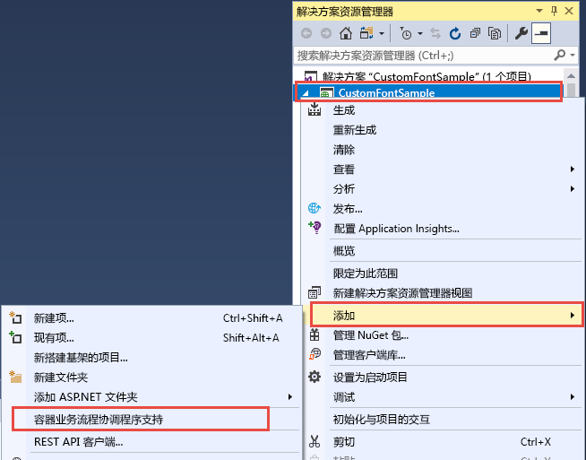
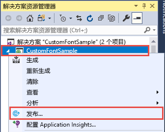
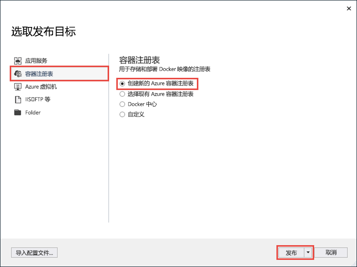
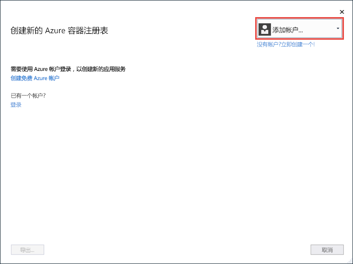
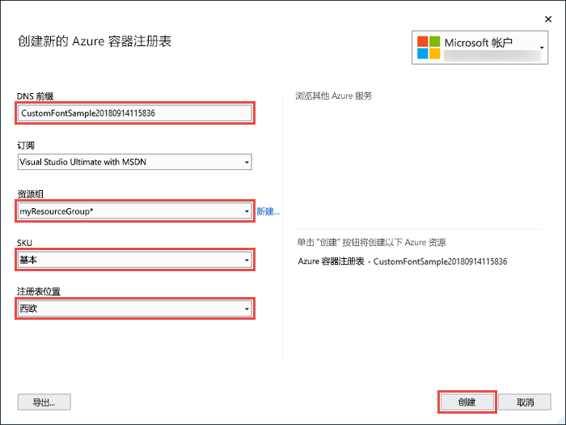
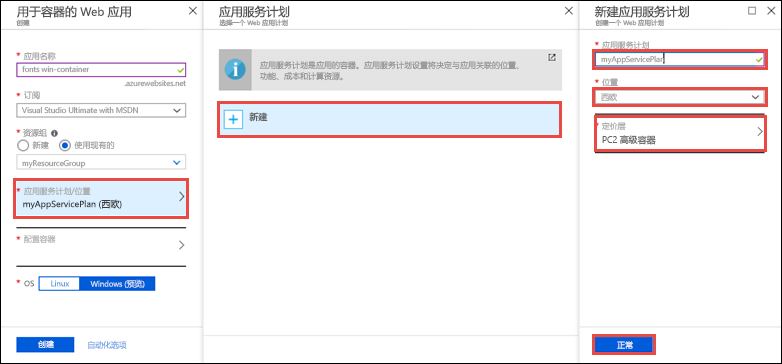
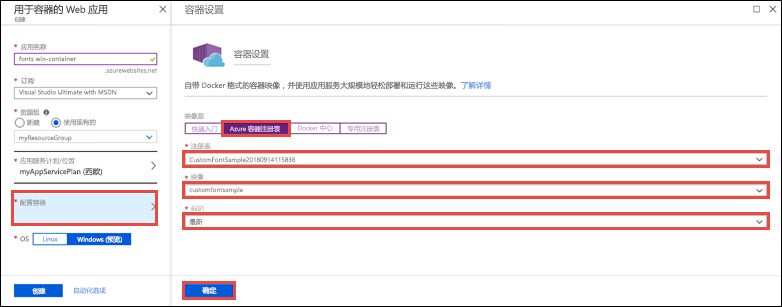

# <a name="migrate-an-aspnet-app-to-azure-app-service-using-a-windows-container-preview"></a>使用 Windows 容器将 ASP.NET 应用迁移到 Azure 应用服务（预览）

[Azure 应用服务](overview.md)在 Windows 上提供预定义的应用程序堆栈，例如在 IIS 上运行的 ASP.NET 或 Node.js。 预配置的 Windows 环境锁定了操作系统，不允许对其进行管理访问、软件安装、全局程序集缓存更改等操作（请参阅 [Azure 应用服务上的操作系统功能](operating-system-functionality.md)）。 但是，通过在应用服务中使用自定义 Windows 容器，可以作出应用所需的 OS 更改，因此可轻松迁移需要自定义 OS 和软件配置的本地应用。 本教程演示如何将使用 Windows 字体库中安装的自定义字体的 ASP.NET 应用迁移到应用服务。 你将自定义配置的 Windows 映像从 Visual Studio 部署到 [Azure 容器注册表](https://docs.microsoft.com/azure/container-registry/)，然后在应用服务中运行它。


## <a name="prerequisites"></a>先决条件

完成本教程需要：

- <a href="https://hub.docker.com/" target="_blank">注册 Docker 中心帐户</a>
- <a href="https://docs.docker.com/docker-for-windows/install/" target="_blank">安装用于 Windows 的 Docker</a>。
- <a href="https://docs.microsoft.com/virtualization/windowscontainers/quick-start/quick-start-windows-10" target="_blank">将 Docker 切换为运行 Windows 容器</a>。
- <a href="https://www.visualstudio.com/downloads/" target="_blank">安装 Visual Studio 2019</a>，其中包含 **ASP.NET 和 web 开发**以及 **Azure 开发**工作负载。 如果已安装 Visual Studio 2019：
    - 通过单击“帮助” > “检查更新”，在 Visual Studio 中安装最新的更新。
    - 在 Visual Studio 中，通过单击“工具” > “获取工具和功能”，添加工作负载。

## <a name="set-up-the-app-locally"></a>在本地设置应用

### <a name="download-the-sample"></a>下载示例

在此步骤中，将设置本地 .NET 项目。

- [下载示例项目 ](https://github.com/Azure-Samples/custom-font-win-container/archive/master.zip)。
- 提取（解压缩）custom-font-win-container.zip 文件。

示例项目包括一个简单的 ASP.NET 应用程序，该应用程序使用安装在 Windows 字体库中的自定义字体。 不需要安装字体，但这是一个与基础 OS 集成的应用示例。 要将此类应用迁移到应用服务，需要重新构建代码以移除集成，或通过自定义 Windows 容器将其按原样迁移。

### <a name="install-the-font"></a>安装字体

在 Windows 资源管理器中，导航到“custom-font-win-container-master/CustomFontSample”，右键单击“FrederickatheGreat-Regular.ttf”，然后选择“安装”。

该字体在 [Google Fonts](https://fonts.google.com/specimen/Fredericka+the+Great) 中公开发布。

### <a name="run-the-app"></a>运行应用

在 Visual Studio 中打开 custom-font-win-container/CustomFontSample.sln 文件。 

键入 `Ctrl+F5` 在不调试的情况下运行应用。 该应用将显示在默认浏览器中。 


由于它使用已安装的字体，因此应用无法在应用服务沙盒中运行。 但是，可以改为使用 Windows 容器对其进行部署，因为可以在 Windows 容器中安装该字体。

### <a name="configure-windows-container"></a>配置 Windows 容器

在解决方案资源管理器中，右键单击“CustomFontSample”项目，选择“添加” > “容器业务流程支持”。



选择“Docker Compose” > “确定”。

现在，项目设置为在 Windows 容器中运行。 Dockerfile 添加到 CustomFontSample 项目，docker-compose 项目添加到解决方案。 

在解决方案资源管理器中，打开 Dockerfile。

需要使用[受支持的父映像](app-service-web-get-started-windows-container.md#use-a-different-parent-image)。 通过将 `FROM` 行替换为以下代码，更改父映像：

```Dockerfile
FROM mcr.microsoft.com/dotnet/framework/aspnet:4.7.2-windowsservercore-ltsc2019
```

在该文件的末尾，添加以下行并保存文件：

```Dockerfile
RUN ${source:-obj/Docker/publish/InstallFont.ps1}
```

可以在 CustomFontSample 项目中找到 InstallFont.ps1。 它是一个安装该字体的简单脚本。 可以在[脚本中心](https://gallery.technet.microsoft.com/scriptcenter/fb742f92-e594-4d0c-8b79-27564c575133)找到更复杂的脚本版本。

## <a name="publish-to-azure-container-registry"></a>发布到 Azure 容器注册表

[Azure 容器注册表](https://docs.microsoft.com/azure/container-registry/)可以存储用于容器部署的映像。 可以将应用服务配置为使用 Azure 容器注册表中托管的映像。

### <a name="open-publish-wizard"></a>打开发布向导

在解决方案资源管理器中，右键单击“CustomFontSample”项目，选择“发布”。



### <a name="create-registry-and-publish"></a>创建注册表并发布

在发布向导中，选择“容器注册表” > “新建 Azure 容器注册表” > “发布”。



### <a name="sign-in-with-azure-account"></a>使用 Azure 帐户登录

在“新建 Azure 容器注册表”对话框中，选择“添加帐户”，然后登录到你的 Azure 订阅。 如果已登录，请从下拉列表中选择包含所需订阅的帐户。



### <a name="configure-the-registry"></a>配置注册表

根据下表中建议的值配置新的容器注册表。 完成后，单击“创建”。

| 设置  | 建议的值 | 更多信息 |
| ----------------- | ------------ | ----|
|**DNS 前缀**| 保留生成的注册表名称，或将其更改为另一个唯一的名称。 |  |
|**资源组**| 单击“新建”，键入 myResourceGroup，然后单击“确定”。 |  |
|**SKU**| 基本 | [定价层](https://azure.microsoft.com/pricing/details/container-registry/)|
|**注册表位置**| 西欧 | |



终端窗口随即打开并显示映像部署进度。 等待部署完成。

## <a name="sign-in-to-azure"></a>登录 Azure

通过 https://portal.azure.com 登录到 Azure 门户。

## <a name="create-a-web-app"></a>创建 Web 应用

在左侧菜单中，选择“创建资源” > “Web” > “用于容器的 Web 应用”。

### <a name="configure-the-new-web-app"></a>配置新 Web 应用

在“创建”界面中，根据下表配置设置：

| 设置  | 建议的值 | 更多信息 |
| ----------------- | ------------ | ----|
|**应用名称**| 键入唯一名称。 | Web 应用的 URL 为 `http://<app_name>.azurewebsites.net`，其中 `<app_name>` 是应用名称。 |
|**资源组**| 选择“使用现有资源组”，键入“myResourceGroup”。 |  |
|**OS**| Windows（预览） | |

### <a name="configure-app-service-plan"></a>配置应用服务计划

单击“应用服务计划/位置” > “新建”。 为新计划命名，选择“西欧”作为位置，然后单击“确定”。



### <a name="configure-container"></a>配置容器

单击“配置容器” > “Azure 容器注册表”。 选择之前在[发布到 Azure 容器注册表](#publish-to-azure-container-registry)中创建的注册表、映像和标记，然后单击“确定”。



### <a name="complete-app-creation"></a>完成应用创建

单击“创建”，等待 Azure 创建所需的资源。

## <a name="browse-to-the-web-app"></a>浏览到 Web 应用

Azure 操作完成后，会显示通知框。


1. 单击“转到资源”。

2. 在应用页中，单击“URL”下的链接。

如果会打开一个如以下页面所示的新浏览器页面：


等待几分钟，然后重试，直到主页显示你所需的美观字体：


祝贺你！ 你已通过 Windows 容器将 ASP.NET 应用程序迁移到 Azure 应用服务。

## <a name="see-container-start-up-logs"></a>查看容器启动日志

加载 Windows 容器可能需要一些时间。 要查看进度，请导航到以下 URL（将 \<app_name> 替换为你的应用名称）。
```
https://<app_name>.scm.azurewebsites.net/api/logstream
```

流式传输的日志如下所示：

```
14/09/2018 23:16:19.889 INFO - Site: fonts-win-container - Creating container for image: customfontsample20180914115836.azurecr.io/customfontsample:latest.
14/09/2018 23:16:19.928 INFO - Site: fonts-win-container - Create container for image: customfontsample20180914115836.azurecr.io/customfontsample:latest succeeded. Container Id 329ecfedbe370f1d99857da7352a7633366b878607994ff1334461e44e6f5418
14/09/2018 23:17:23.405 INFO - Site: fonts-win-container - Start container succeeded. Container: 329ecfedbe370f1d99857da7352a7633366b878607994ff1334461e44e6f5418
14/09/2018 23:17:28.637 INFO - Site: fonts-win-container - Container ready
14/09/2018 23:17:28.637 INFO - Site: fonts-win-container - Configuring container
14/09/2018 23:18:03.823 INFO - Site: fonts-win-container - Container ready
14/09/2018 23:18:03.823 INFO - Site: fonts-win-container - Container start-up and configuration completed successfully
```

