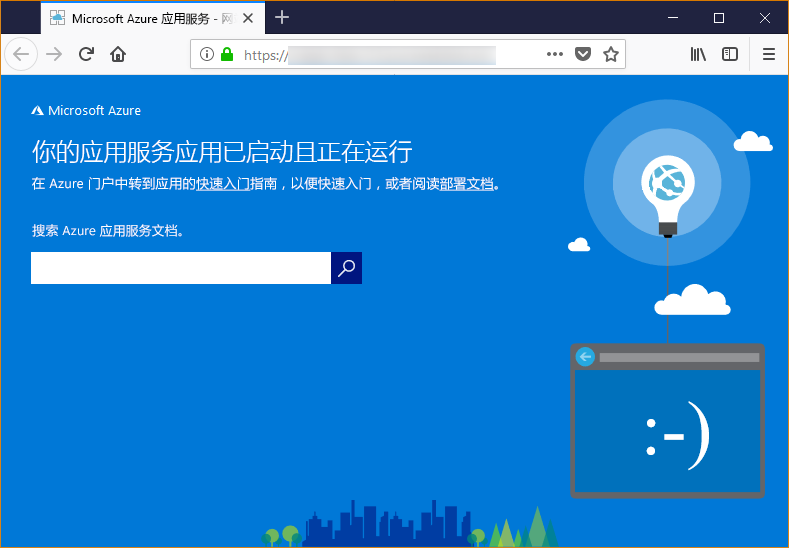

# <a name="configure-your-python-app-for-the-azure-app-service-on-linux"></a>为 Linux 上的 Azure 应用服务配置 Python 应用

本文介绍 [Linux 上的 Azure 应用服务](app-service-linux-intro.md)如何运行 Python 应用，以及如何按需自定义应用服务的行为。

## <a name="set-python-version"></a>设置 Python 版本

以下两个基础映像可用：Python 3.6 和 Python 3.7。 可以使用所需的基于 Python 的映像创建一个应用。 例如，若要使用 Python 3.7 创建一个应用，请在 Cloud Shell 中运行以下命令：

```azurecli-interactive
az webapp create --resource-group <group_name> --plan <plan_name> --name <app_name> --runtime "PYTHON|3.7"
```

例如，若要将 Python 版本（基于它的映像）更改为 Python 3.6，请在 Cloud Shell 中运行以下命令：

```azurecli-interactive
az webapp config set --resource-group <group_name> --name <app_name> --linux-fx-version "PYTHON|3.6"
```

如果需要其他版本的 Python，必须改为生成并部署自己的容器映像。 有关详细信息，请参阅[如何对用于容器的 Web 应用使用自定义 Docker 映像](tutorial-custom-docker-image.md)。

## <a name="container-characteristics"></a>容器特征

部署到 Linux 上的应用服务的 Python 应用在 GitHub 存储库 [Python 3.6](https://github.com/Azure-App-Service/python/tree/master/3.6.6) 或 [Python 3.7](https://github.com/Azure-App-Service/python/tree/master/3.7.0) 中定义的 Docker 容器内运行。

此容器具有以下特征：

- 应用是结合附加参数 `--bind=0.0.0.0 --timeout 600`，使用 [Gunicorn WSGI HTTP Server](https://gunicorn.org/) 运行的。

- 默认情况下，基础映像包含 Flask Web 框架，但容器支持符合 WSGI 规范并与 Python 3.7 兼容的其他框架，例如 Django。

- 若要安装其他包（例如 Django），请使用 `pip freeze > requirements.txt` 在项目的根目录中创建 [*requirements.txt*](https://pip.pypa.io/en/stable/user_guide/#requirements-files) 文件。 然后，使用 Git 部署将项目发布到应用服务，这会在容器中自动运行 `pip install -r requirements.txt` 来安装应用的依赖项。

## <a name="container-startup-process-and-customizations"></a>容器启动过程和自定义项

在启动期间，Linux 上的应用服务容器将运行以下步骤：

1. 检查并应用自定义启动命令（如果已提供）。
2. 检查是否存在 Django 应用的 *wsgi.py* 文件，如果存在，则使用该文件启动 Gunicorn。
3. 检查名为 *application.py* 的文件，如果找到，则使用 `application:app`（采用某个 Flask 应用）启动 Gunicorn。
4. 如果未找到其他任何应用，则启动容器中内置的默认应用。

以下部分提供了每个选项的更多详细信息。

### <a name="django-app"></a>Django 应用

对于 Django 应用，应用服务将在应用代码中查找名为 `wsgi.py` 的文件，然后使用以下命令运行 Gunicorn：

```bash
# <module> is the path to the folder containing wsgi.py
gunicorn --bind=0.0.0.0 --timeout 600 <module>.wsgi
```

若要更精细地控制启动命令，请使用[自定义启动命令](#custom-startup-command)，并将 `<module>` 替换为包含 *wsgi.py* 的模块名称。

### <a name="flask-app"></a>Flask 应用

对于 Flask，应用服务将查找名为 *application.py* 的文件并启动 Gunicorn，如下所示：

```bash
gunicorn --bind=0.0.0.0 --timeout 600 application:app
```

如果主应用模块包含在不同的文件中，请对应用对象使用不同的名称；若要为 Gunicorn 提供附加的参数，请使用[自定义启动命令](#custom-startup-command)。 该部分提供在 *hello.py* 中使用入口代码的 Flask 示例，以及名为 `myapp` 的示例 Flask 应用对象。

### <a name="custom-startup-command"></a>自定义启动命令

可以通过提供自定义 Gunicorn 启动命令来控制容器的启动行为。 例如，如果 Flask 应用的主模块是 *hello.py*，而该文件中的 Flask 应用对象名为 `myapp`，则命令如下所示：

```bash
gunicorn --bind=0.0.0.0 --timeout 600 hello:myapp
```

如果主模块位于子文件夹（例如 `website`）中，请使用 `--chdir` 参数指定该文件夹：

```bash
gunicorn --bind=0.0.0.0 --timeout 600 --chdir website hello:myapp
```

还可以将 Gunicorn 的任何附加参数添加到该命令，例如 `--workers=4`。 有关详细信息，请参阅[运行 Gunicorn](https://docs.gunicorn.org/en/stable/run.html) (docs.gunicorn.org)。

若要提供自定义命令，请执行以下步骤：

1. 在 Azure 门户中导航到[应用程序设置](../web-sites-configure.md?toc=%2fazure%2fapp-service%2fcontainers%2ftoc.json)页。

1. 在“运行时”设置中，将“堆栈”选项设置为“Python 3.7”，并直接在“启动文件”字段中输入命令。

    或者，可以使用类似于 *startup.txt*（或任何所需名称）的名称，将命令保存到项目根目录中的某个文本文件中。 然后，将该文件部署到应用服务，并改为在“启动文件”字段中指定该文件名。 使用此选项可以在源代码存储库中管理命令，而无需通过 Azure 门户进行管理。

1. 选择“保存”。 应用服务将自动重启，几秒钟后，应会看到已应用自定义启动命令。

> [!Note]
> 应用服务将忽略处理自定义命令文件时出现的任何错误，然后通过查找 Django 和 Flask 应用来继续执行其启动过程。 如果未看到预期的行为，请检查启动文件是否已部署到应用服务且不包含任何错误。

### <a name="default-behavior"></a>默认行为

如果应用服务找不到自定义命令、Django 应用或 Flask 应用，则它会运行位于 _opt/defaultsite_ 文件夹中的默认只读应用。 默认应用如下所示：



## <a name="troubleshooting"></a>故障排除

- **部署自己的应用代码后看到默认应用。**  之所以出现默认应用，是因为你实际上并未将应用代码部署到应用服务，或应用服务未找到你的应用代码，因此运行了默认应用。
  - 请重启应用服务，等待 15 到 20 秒，然后再次检查应用。
  - 请确保使用适用于 Linux 的应用服务，而不要使用基于 Windows 的实例。 在 Azure CLI 中运行 `az webapp show --resource-group <resource_group_name> --name <app_service_name> --query kind` 命令，对 `<resource_group_name>` 和 `<app_service_name>` 进行相应的替换。 应该会看到作为输出的 `app,linux`，否则请重新创建应用服务并选择 Linux。
    - 使用 SSH 或 Kudu 控制台直接连接到应用服务，并检查文件是否存在于 *site/wwwroot* 下。 如果这些文件不存在，请检查部署过程并重新部署应用。
  - 如果这些文件存在，则表示应用服务无法识别特定的启动文件。 检查是否按应用服务的预期方式为 [Django](#django-app) 或 [Flask](#flask-app) 构建了应用，或使用[自定义启动命令](#custom-startup-command)。
  
- **浏览器中显示“服务不可用”消息。** 浏览器在等待应用服务的响应时超时，这表示应用服务已启动 Gunicorn 服务器，但指定应用代码的参数不正确。
  - 刷新浏览器，尤其是在应用服务计划中使用最低定价层的情况下。 例如，使用免费层时，应用可能需要较长时间才能启动，并在刷新浏览器后才会做出响应。
  - 检查是否按应用服务的预期方式为 [Django](#django-app) 或 [Flask](#flask-app) 构建了应用，或使用[自定义启动命令](#custom-startup-command)。
  - 使用 SSH 或 Kudu 控制台连接到应用服务，然后检查 *LogFiles* 文件夹中存储的诊断日志。 有关日志记录的详细信息，请参阅[在 Azure 应用服务中启用 Web 应用的诊断日志记录](../troubleshoot-diagnostic-logs.md)。
