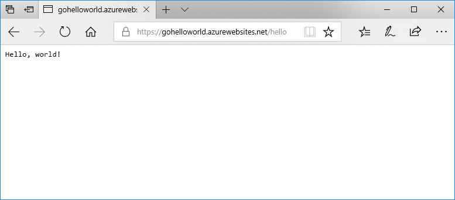

# <a name="deploy-a-dockergo-web-app-in-web-app-for-containers"></a>在用于容器的 Web 应用中部署 Docker/Go Web 应用

在 Linux 上，[应用服务 Linux](app-service-linux-intro.md) 提供预定义的应用程序堆栈，并支持特定语言，例如 .NET、PHP、Node.js 等。 还可使用自定义 Docker 映像，于尚未在 Azure 中定义的应用程序堆栈中运行 Web 应用。 本快速入门介绍了如何创建 Web 应用并从 Docker 中心部署 Go 映像。 使用 [Azure CLI](https://docs.microsoft.com/cli/azure/get-started-with-azure-cli) 创建 Web 应用。



[!INCLUDE [quickstarts-free-trial-note](../../../includes/quickstarts-free-trial-note.md)]

[!INCLUDE [cloud-shell-try-it.md](../../../includes/cloud-shell-try-it.md)]

[!INCLUDE [Configure deployment user](../../../includes/configure-deployment-user.md)]

[!INCLUDE [Create resource group](../../../includes/app-service-web-create-resource-group-linux.md)]

[!INCLUDE [Create app service plan](../../../includes/app-service-web-create-app-service-plan-linux.md)]

## <a name="create-a-web-app"></a>创建 Web 应用

使用 [az webapp create](/cli/azure/webapp?view=azure-cli-latest#az_webapp_create) 命令在 `myAppServicePlan` 应用服务计划中创建 [Web 应用](../app-service-web-overview.md)。 不要忘记将 `<app name>` 替换为全局唯一的应用名称。

```azurecli-interactive
az webapp create --resource-group myResourceGroup --plan myAppServicePlan --name <app name> --deployment-container-image-name microsoft/azure-appservices-go-quickstart
```

在上述命令中，`--deployment-container-image-name` 指向公共 Docker 中心映像 [microsoft/azure-appservices-go-quickstart](https://hub.docker.com/r/microsoft/azure-appservices-go-quickstart/)。

创建 Web 应用后，Azure CLI 会显示类似于以下示例的输出：

```json
{
  "availabilityState": "Normal",
  "clientAffinityEnabled": true,
  "clientCertEnabled": false,
  "cloningInfo": null,
  "containerSize": 0,
  "dailyMemoryTimeQuota": 0,
  "defaultHostName": "<app name>.azurewebsites.net",
  "deploymentLocalGitUrl": "https://<username>@<app name>.scm.azurewebsites.net/<app name>.git",
  "enabled": true,
  < JSON data removed for brevity. >
}
```

## <a name="browse-to-the-app"></a>浏览到应用

```bash
http://<app_name>.azurewebsites.net/hello
```


**祝贺你！** 已将运行 Go 应用程序的自定义 Docker 映像部署到用于容器的 Web 应用。

[!INCLUDE [Clean-up section](../../../includes/cli-script-clean-up.md)]

## <a name="next-steps"></a>后续步骤

> [!div class="nextstepaction"]
> [使用自定义 Docker 映像](tutorial-custom-docker-image.md)
