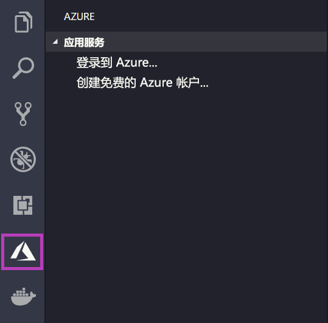
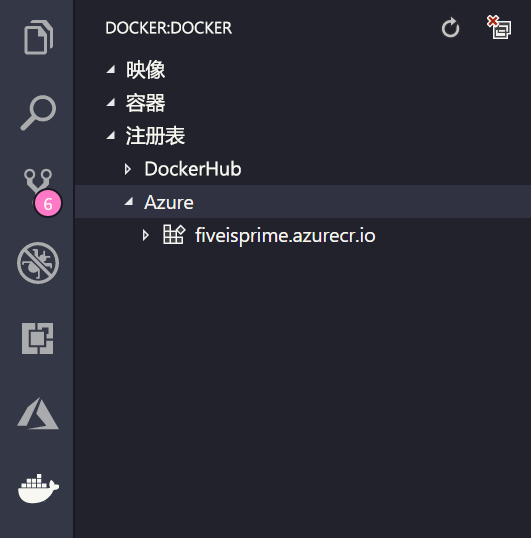

# <a name="deploy-a-custom-linux-container-to-azure-app-service"></a>将自定义 Linux 容器部署到 Azure 应用服务

Linux 上的应用服务在 Linux 上提供预定义的应用程序堆栈，并支持特定语言，例如 .NET、PHP、Node.js 等。 还可使用自定义 Docker 映像，于尚未在 Azure 中定义的应用程序堆栈中运行 Web 应用。 本快速入门介绍如何将[Azure 容器注册表](/azure/container-registry) (ACR) 中的映像部署到应用服务。

## <a name="prerequisites"></a>先决条件

* 一个 [Azure 帐户](https://azure.microsoft.com/free/?utm_source=campaign&utm_campaign=vscode-tutorial-docker-extension&mktingSource=vscode-tutorial-docker-extension)
* [Docker](https://www.docker.com/community-edition)
* [Visual Studio Code](https://code.visualstudio.com/)
* [适用于 VS Code 的 Azure 应用服务扩展](vscode:extension/ms-azuretools.vscode-azureappservice)。 可以使用此扩展在 Azure 平台即服务 (PaaS) 上创建、管理和部署 Linux Web 应用。
* [适用于 VS Code 的 Docker 扩展](vscode:extension/ms-azuretools.vscode-docker)。 可以使用此扩展简化本地 Docker 映像和命令的管理，并将生成的应用映像部署到 Azure。

## <a name="create-an-image"></a>创建映像

若要完成本快速入门，需要在 [Azure 容器注册表](/azure/container-registry)中存储合适的 Web 应用映像。 遵循[快速入门：使用 Azure 门户创建专用容器注册表](/azure/container-registry/container-registry-get-started-portal)中的说明进行操作，但使用 `mcr.microsoft.com/azuredocs/go` 映像而不是 `hello-world` 映像。

> [!IMPORTANT]
> 请确保在创建容器注册表时将“管理员用户”  选项设为“启用”  。 也可以在 Azure 门户中从注册表页的“访问密钥”  部分进行设置。 应用服务访问需要此设置。

## <a name="sign-in"></a>登录

接下来，使用应用服务扩展启动 VS Code 并登录到 Azure 帐户。 为此，请在活动栏中选择 Azure 徽标，导航到“应用服务”  资源管理器，然后选择“登录到 Azure”  ，并按照说明进行操作。



## <a name="check-prerequisites"></a>检查先决条件

现在你可以检查是否已安装并配置了所有必备组件。

在 VS Code 的状态栏中应会显示你的 Azure 电子邮件地址，“应用服务”资源管理器中应会显示你的订阅。 

接下来，验证是否已安装并运行 Docker。 以下命令将显示 Docker 版本（如果它正在运行）。

```bash
docker --version
```

最后，请确保已连接 Azure 容器注册表。 为此，请在活动栏中选择 Docker 徽标，然后导航到“注册表”  。



## <a name="deploy-the-image-to-azure-app-service"></a>将映像部署到 Azure 应用服务

完成所有配置后，即可将映像直接从 Docker 扩展资源管理器部署到 [Azure 应用服务](https://azure.microsoft.com/services/app-service/)。

在 **DOCKER 资源管理器**中的“注册表”  节点下找到映像，并将其展开以显示其标记。 右键单击标记，然后选择“将映像部署到 Azure 应用服务”  。

在此处，按照提示选择订阅、全局唯一的应用名称、资源组和应用服务计划。 选择“B1 基本”  作为“定价层”，并选择区域。

部署之后，你的应用将在 `http://<app name>.azurewebsites.net` 上可用。

“资源组”  是 Azure 中所有应用程序资源的命名集合。 例如，资源组可以包含对网站、数据库和 Azure 函数的引用。

应用服务计划  定义用于托管网站的物理资源。 此快速入门在 Linux 基础结构上使用   “基本”托管计划，这意味着该站点将与其他网站一起托管在 Linux 计算机上。 如果开始使用“基本”  计划，则可以使用 Azure 门户进行扩展，使你的计算机是在计算机上运行的唯一站点。

## <a name="browse-the-website"></a>浏览网站

“输出”  面板将在部署过程中打开，以指示操作的状态。 操作完成后，查找在“应用服务”  资源管理器中创建的应用，右键单击该应用，然后选择“浏览网站”  以在浏览器中打开该站点。

> [!div class="nextstepaction"]
> [我遇到了问题](https://www.research.net/r/PWZWZ52?tutorial=quickstart-docker&step=deploy-app)

## <a name="next-steps"></a>后续步骤

祝贺你，你现已成功完成本快速入门！

接下来请查看其他 Azure 扩展。

* [Cosmos DB](https://marketplace.visualstudio.com/items?itemName=ms-azuretools.vscode-cosmosdb)
* [Azure Functions](https://marketplace.visualstudio.com/items?itemName=ms-azuretools.vscode-azurefunctions)
* [Azure CLI 工具](https://marketplace.visualstudio.com/items?itemName=ms-vscode.azurecli)
* [Azure 资源管理器工具](https://marketplace.visualstudio.com/items?itemName=msazurermtools.azurerm-vscode-tools)

或安装 [Azure 工具](https://marketplace.visualstudio.com/items?itemName=ms-vscode.vscode-node-azure-pack)扩展包获取所有这些工具。
