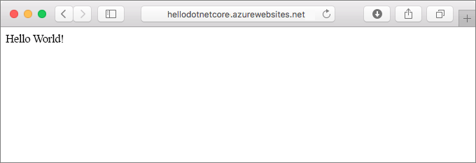
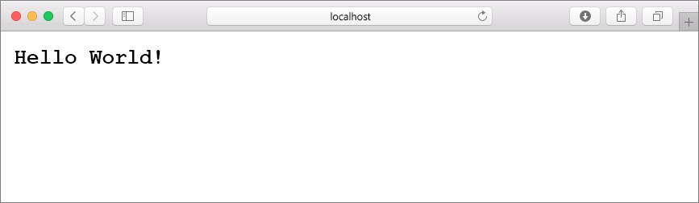
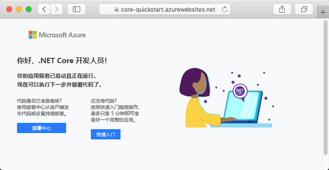
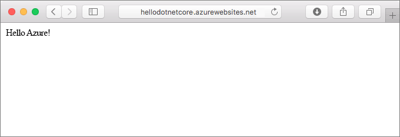
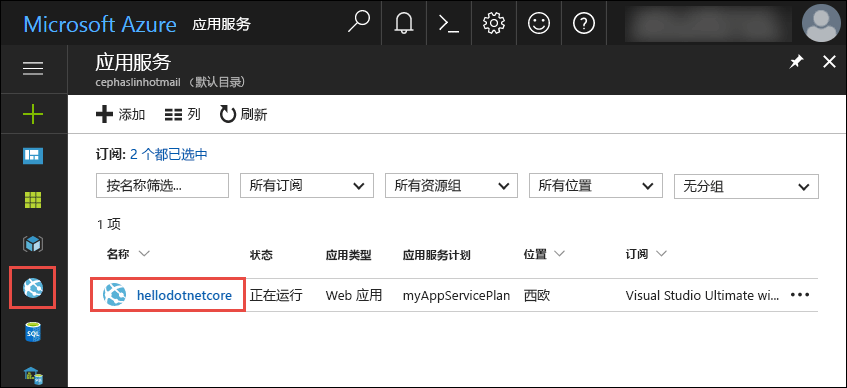
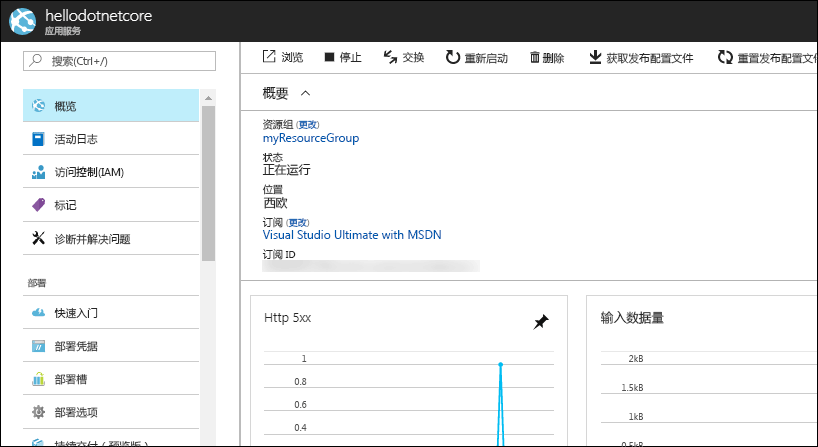

# <a name="create-an-aspnet-core-app-in-app-service-on-linux"></a>在 Linux 上的应用服务中创建 ASP.NET Core 应用

> [!NOTE]
> 本文将应用部署到基于 Linux 的应用服务。 若要部署到基于 Windows 的应用服务，请参阅[在 Azure 中创建 ASP.NET Core 应用](../app-service-web-get-started-dotnet.md)  。
>

[Linux 应用服务](app-service-linux-intro.md)使用 Linux 操作系统，提供高度可缩放的自修补 Web 托管服务。 本快速入门演示如何在 Linux 应用服务中创建 [.NET Core](https://docs.microsoft.com/aspnet/core/) 应用。 使用 [Azure CLI](https://docs.microsoft.com/cli/azure/get-started-with-azure-cli) 创建应用，并使用 Git 将 .NET Core 代码部署到该应用。



可以使用 Mac、Windows 或 Linux 计算机执行本文中的步骤。

[!INCLUDE [quickstarts-free-trial-note](../../../includes/quickstarts-free-trial-note.md)]

## <a name="prerequisites"></a>先决条件

完成本快速入门教程需要：

* <a href="https://git-scm.com/" target="_blank">安装 Git</a>
* <a href="https://dotnet.microsoft.com/download/dotnet-core/3.1" target="_blank">安装最新的 .NET Core 3.1 SDK</a>

## <a name="create-the-app-locally"></a>在本地创建应用

在计算机的终端窗口中，创建一个名为 `hellodotnetcore` 的目录，并将当前目录切换到该目录。

```bash
mkdir hellodotnetcore
cd hellodotnetcore
```

创建新的 .NET Core 应用。

```bash
dotnet new web
```

## <a name="run-the-app-locally"></a>在本地运行应用

在本地运行应用程序，以便你能了解将它部署到 Azure 时它的外观应该是什么样的。 

还原 NuGet 包并运行该应用。

```bash
dotnet run
```

打开 Web 浏览器并导航到 `http://localhost:5000` 处的应用。

页面中会显示该示例应用发出的 Hello World  消息。



在终端窗口中，按 **Ctrl+C** 退出 Web 服务器。 为 .NET Core 项目初始化 Git 存储库。

```bash
git init
git add .
git commit -m "first commit"
```

[!INCLUDE [cloud-shell-try-it.md](../../../includes/cloud-shell-try-it.md)]

[!INCLUDE [Configure deployment user](../../../includes/configure-deployment-user.md)]

[!INCLUDE [Create resource group](../../../includes/app-service-web-create-resource-group-linux.md)]

[!INCLUDE [Create app service plan](../../../includes/app-service-web-create-app-service-plan-linux.md)]

## <a name="create-a-web-app"></a>创建 Web 应用

[!INCLUDE [Create web app](../../../includes/app-service-web-create-web-app-dotnetcore-linux-no-h.md)]

浏览到新建的应用。 将 &lt;app name> 替换为你的应用名称  。

```bash
https://<app-name>.azurewebsites.net
```

新应用应该如下所示：



[!INCLUDE [Push to Azure](../../../includes/app-service-web-git-push-to-azure.md)] 

<pre>
Enumerating objects: 5, done.
Counting objects: 100% (5/5), done.
Compressing objects: 100% (3/3), done.
Writing objects: 100% (3/3), 285 bytes | 95.00 KiB/s, done.
Total 3 (delta 2), reused 0 (delta 0), pack-reused 0
remote: Deploy Async
remote: Updating branch 'master'.
remote: Updating submodules.
remote: Preparing deployment for commit id 'd6b54472f7'.
remote: Repository path is /home/site/repository
remote: Running oryx build...
remote: Build orchestrated by Microsoft Oryx, https://github.com/Microsoft/Oryx
remote: You can report issues at https://github.com/Microsoft/Oryx/issues
remote:
remote: Oryx Version      : 0.2.20200114.13, Commit: 204922f30f8e8d41f5241b8c218425ef89106d1d, ReleaseTagName: 20200114.13
remote: Build Operation ID: |imoMY2y77/s=.40ca2a87_
remote: Repository Commit : d6b54472f7e8e9fd885ffafaa64522e74cf370e1
.
.
.
remote: Deployment successful.
remote: Deployment Logs : 'https://&lt;app-name&gt;.scm.azurewebsites.net/newui/jsonviewer?view_url=/api/deployments/d6b54472f7e8e9fd885ffafaa64522e74cf370e1/log'
To https://&lt;app-name&gt;.scm.azurewebsites.net:443/&lt;app-name&gt;.git
   d87e6ca..d6b5447  master -> master
</pre>

## <a name="browse-to-the-app"></a>浏览到应用

使用 Web 浏览器浏览到已部署的应用程序。

```bash
http://<app_name>.azurewebsites.net
```

.NET Core 示例代码在包含内置映像的 Linux 上的应用服务中运行。


祝贺你！  现已将第一个 .NET Core 应用部署到 Linux 应用服务。

## <a name="update-and-redeploy-the-code"></a>更新并重新部署代码

在本地目录中，打开 Startup.cs 文件  。 对方法调用 `context.Response.WriteAsync` 中的文本稍作更改：

```csharp
await context.Response.WriteAsync("Hello Azure!");
```

提交在 Git 中所做的更改，然后将代码更改推送到 Azure。

```bash
git commit -am "updated output"
git push azure master
```

完成部署后，切换回在“浏览到应用”  步骤中打开的浏览器窗口，并点击“刷新”。



## <a name="manage-your-new-azure-app"></a>管理新的 Azure 应用

转到 <a href="https://portal.azure.com" target="_blank">Azure 门户</a>管理已创建的应用。

在左侧菜单中单击**应用程序服务**，然后单击 Azure 应用的名称。



这里我们可以看到应用的“概述”页。 并可以执行基本的管理任务，例如浏览、停止、启动、重新启动和删除。 



左侧菜单提供了用于配置应用的不同页面。 

[!INCLUDE [cli-samples-clean-up](../../../includes/cli-samples-clean-up.md)]

## <a name="next-steps"></a>后续步骤

> [!div class="nextstepaction"]
> [教程：将 ASP.NET Core 应用与 SQL 数据库配合使用](tutorial-dotnetcore-sqldb-app.md)

> [!div class="nextstepaction"]
> [配置 ASP.NET Core 应用](configure-language-dotnetcore.md)
