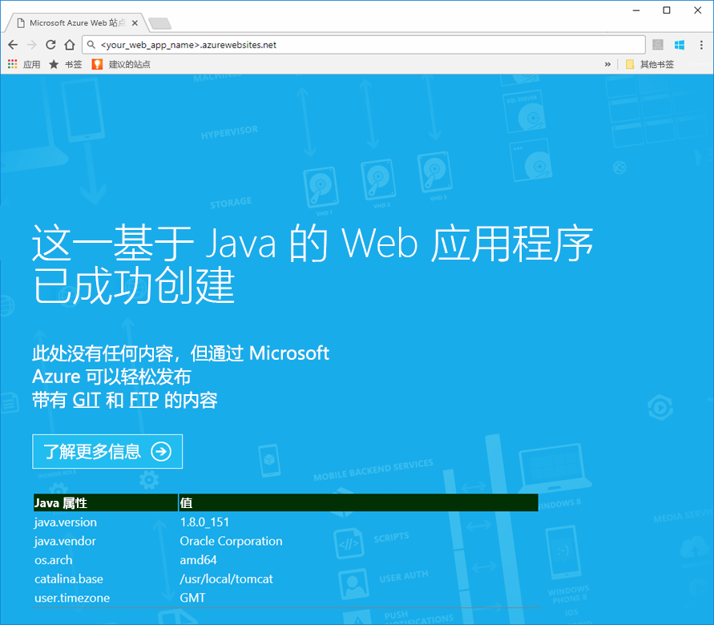
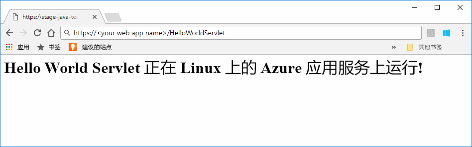

# <a name="preview-create-a-java-web-app-in-app-service-on-linux"></a>预览版：在 Linux 上的应用服务中创建 Java Web 应用

Linux 上的应用服务目前提供一项支持 Java Web 应用的预览版功能。 有关预览版的详细信息，请参阅 [Microsoft Azure 预览版的补充使用条款](https://azure.microsoft.com/support/legal/preview-supplemental-terms/)。 [使用用于 IntelliJ 的 Azure 工具包将 Java Web 应用部署到云中的 Linux 容器](https://docs.microsoft.com/java/azure/intellij/azure-toolkit-for-intellij-hello-world-web-app-linux)是一种替代方法，适用于将 Java 应用部署到你自己的容器。

> [!NOTE]
> 本文将 Java Web 应用部署到基于 Linux 的应用服务。
>

[Linux 应用服务](app-service-linux-intro.md)使用 Linux 操作系统，提供高度可缩放的自修补 Web 托管服务。 本快速入门演示如何使用内置映像将 Java 应用部署到 Linux 上的应用服务。 使用 [Azure CLI](https://docs.microsoft.com/cli/azure/get-started-with-azure-cli) 创建包含内置映像的 Web 应用，然后将 Java 应用部署到 Web 应用。


[!INCLUDE [quickstarts-free-trial-note](../../../includes/quickstarts-free-trial-note.md)]


## <a name="prerequisites"></a>先决条件

完成本快速入门教程： 

* 必须拥有 Azure 订阅。 如果你还没有 Azure 订阅，可以在开始前创建一个 [免费帐户](https://azure.microsoft.com/free/?ref=microsoft.com&utm_source=microsoft.com&utm_medium=docs&utm_campaign=visualstudio)。
* [安装 Git](https://git-scm.com/)。
* 安装 [Eclipse](https://www.eclipse.org/downloads/)。


[!INCLUDE [cloud-shell-try-it.md](../../../includes/cloud-shell-try-it.md)]

[!INCLUDE [Configure deployment user](../../../includes/configure-deployment-user.md)]

[!INCLUDE [Create resource group](../../../includes/app-service-web-create-resource-group-linux.md)]

[!INCLUDE [Create app service plan](../../../includes/app-service-web-create-app-service-plan-linux.md)]


## <a name="create-a-web-app"></a>创建 Web 应用

在 Cloud Shell 的 `myAppServicePlan` 应用服务计划中创建一个 [Web 应用](../app-service-web-overview.md)。 可以通过使用 [`az webapp create`](/cli/azure/webapp?view=azure-cli-latest#az_webapp_create) 命令完成此操作。 在以下示例中，将 \<app_name> 替换为全局唯一的应用名称（有效字符为 `a-z`、`0-9` 和 `-`）。 

```azurecli-interactive
# Bash
az webapp create --name <app_name> --resource-group myResourceGroup --plan myAppServicePlan --runtime "TOMCAT|8.5-jre8"
# PowerShell
az --% webapp create --name <app_name> --resource-group myResourceGroup --plan myAppServicePlan --runtime "TOMCAT|8.5-jre8"
```

对于 **runtime** 参数，请使用以下某个运行时：
 * TOMCAT|8.5-jre8
 * TOMCAT|9.0-jre8


创建 Web 应用后，Azure CLI 会显示类似于以下示例的信息：

```json
{
  "additionalProperties": {},
  "availabilityState": "Normal",
  "clientAffinityEnabled": true,
  "clientCertEnabled": false,
  "cloningInfo": null,
  "containerSize": 0,
  "dailyMemoryTimeQuota": 0,
  "defaultHostName": "<your web app name>.azurewebsites.net",
  "enabled": true,
  "enabledHostNames": [
    "<your web app name>.azurewebsites.net",
    "<your web app name>.scm.azurewebsites.net"
  ],
  "ftpPublishingUrl": "ftp://<your ftp URL>",  
  < JSON data removed for brevity. >
}
```

复制 **ftpPublishingUrl** 的值。 如果选择 FTP 部署，则稍后会用到它。

浏览到新建的 Web 应用。

```
http://<app_name>.azurewebsites.net
```

如果 Web 应用启动并运行，则会出现一个默认的屏幕，类似于下图：




## <a name="download-the-sample-java-app"></a>下载示例 Java 应用

在计算机的终端窗口中，运行以下命令，将示例应用存储库克隆到本地计算机。 将在后面的步骤中部署此示例应用。

```bash
git clone https://github.com/Azure-Samples/java-docs-hello-world
```


## <a name="deploying-the-java-app-to-app-service-on-linux"></a>将 Java 应用部署到基于 Linux 的应用服务

在 [Eclipse](https://www.eclipse.org/downloads/) 中打开示例项目，[将 Java 应用导出到名为 `helloworld.war` 的 Web 存档 (WAR) 文件](http://help.eclipse.org/kepler/index.jsp?topic=%2Forg.eclipse.wst.webtools.doc.user%2Ftopics%2Ftwcrewar.html)。

若要部署 Java 应用 WAR 文件，可以使用 WarDeploy（目前为[预览版](https://azure.microsoft.com/support/legal/preview-supplemental-terms/)）或 FTP。

根据所用部署方法的不同，浏览到 Java Web 应用所需的相对路径也会稍有不同。

### <a name="deploy-with-wardeploy"></a>使用 WarDeploy 进行部署 

若要通过 WarDeploy 来部署 WAR 文件，请使用以下 cURL 示例命令行将 POST 请求发送到 *https://<your app name>.scm.azurewebsites.net/api/wardeploy*。 POST 请求必须在消息正文中包含此 .war 文件。 应用的部署凭据是通过使用 HTTP BASIC 身份验证在请求中提供的。 有关 WarDeploy 的详细信息，请参阅[使用 ZIP 或 WAR 文件将应用部署到 Azure 应用服务](../app-service-deploy-zip.md)。

```bash
curl -X POST -u <username> --data-binary @"<war_file_path>" https://<app_name>.scm.azurewebsites.net/api/wardeploy
```

更新以下项目：

* `username` - 使用以前创建的部署凭据用户名。
* `war_file_path` - 使用本地 WAR 文件路径。
* `app_name` - 使用以前创建的应用名称。

执行此命令。 出现 cURL 提示时，键入部署凭据的密码。

在 Web 浏览器中使用以下 URL 浏览到已部署的应用程序。

```bash
http://<app_name>.azurewebsites.net
```

Java 示例代码在包含内置映像的 Web 应用中运行。


使用 Web 浏览器浏览到 Servlet。

```bash
http://<app_name>.azurewebsites.net/HelloWorldServlet
```

Servlet 在包含内置映像的 Web 应用中运行。




**祝贺你！** 现已将第一个 Java 应用部署到 Linux 应用服务。


### <a name="ftp-deployment"></a>FTP 部署

也可使用 FTP 来部署 WAR 文件。 

通过 FTP 将文件上传到 Web 应用的 */home/site/wwwroot/webapps* 目录。 以下示例命令行使用 cURL：

```bash
curl -T war_file_path -u "app_name\username" ftp://webappFTPURL/site/wwwroot/webapps/
```

更新以下项目：

* `war_file_path` - 使用本地 WAR 文件路径。
* `app_name` - 使用以前创建的应用名称。
* `username` - 使用以前创建的部署凭据用户名。
* `webappFTPURL` - 将 **FTP 主机名**值用于以前复制的 Web 应用。 FTP 主机名也列在 **Azure 门户**的 Web 应用的“概览”边栏选项卡中。[](https://portal.azure.com/)

执行此命令。 出现 cURL 提示时，键入部署凭据的密码。


在 Web 浏览器中使用以下 URL 浏览到已部署的应用程序。

```bash
http://<app_name>.azurewebsites.net/helloworld
```

Java 示例代码在包含内置映像的 Web 应用中运行。


使用 Web 浏览器浏览到 Servlet。

```bash
http://<app_name>.azurewebsites.net/helloworld/HelloWorldServlet
```

Java 示例代码在包含内置映像的 Web 应用中运行。


**祝贺你！** 现已将第一个 Java 应用部署到 Linux 应用服务。


[!INCLUDE [cli-samples-clean-up](../../../includes/cli-samples-clean-up.md)]


## <a name="next-steps"></a>后续步骤

若要详细了解如何将 Java 与 Azure 配合使用，请参阅以下链接：

* [面向 Java 开发人员的 Azure](https://docs.microsoft.com/java/azure/)
* [使用用于 IntelliJ 的 Azure 工具包将 Hello World Web 应用部署到云中的 Linux 容器](https://docs.microsoft.com/java/azure/intellij/azure-toolkit-for-intellij-hello-world-web-app-linux)
* [用于 Visual Studio Team Services 的 Java 工具](https://java.visualstudio.com/)
