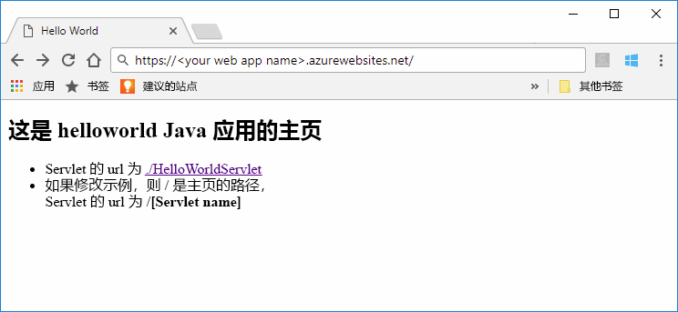
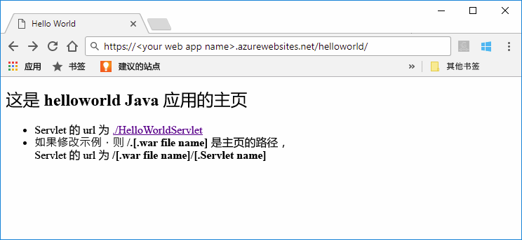

# <a name="quickstart-create-a-java-web-app-in-app-service-on-linux"></a>快速入门：在 Linux 上的应用服务中创建 Java Web 应用

Linux 上的应用服务目前提供一项支持 Java Web 应用的预览版功能。 有关预览版的详细信息，请参阅 [Microsoft Azure 预览版的补充使用条款](https://azure.microsoft.com/support/legal/preview-supplemental-terms/)。 

[Linux 上的应用服务](app-service-linux-intro.md)使用 Linux 操作系统，提供高度可缩放的自修补 Web 托管服务。 本快速入门介绍如何将 [Azure CLI](https://docs.microsoft.com/cli/azure/get-started-with-azure-cli) 与[用于 Azure Web 应用（预览版）的 Maven 插件](https://github.com/Microsoft/azure-maven-plugins/tree/develop/azure-webapp-maven-plugin)配合使用，以便使用内置的 Linux 映像部署 Java Web 应用。



[使用用于 IntelliJ 的 Azure 工具包将 Java Web 应用部署到云中的 Linux 容器](https://docs.microsoft.com/java/azure/intellij/azure-toolkit-for-intellij-hello-world-web-app-linux)是一种替代方法，适用于将 Java 应用部署到你自己的容器。

[!INCLUDE [quickstarts-free-trial-note](../../../includes/quickstarts-free-trial-note.md)]


## <a name="prerequisites"></a>先决条件

完成本快速入门教程： 

* 在本地安装 [Azure CLI 2.0 或更高版本](https://docs.microsoft.com/cli/azure/install-azure-cli?view=azure-cli-latest)。
* [Apache Maven](http://maven.apache.org/)。


## <a name="create-a-java-app"></a>创建 Java 应用

使用 Maven 执行以下命令，以便创建新的 *helloworld* Web 应用：  

    mvn archetype:generate -DgroupId=example.demo -DartifactId=helloworld -DarchetypeArtifactId=maven-archetype-webapp

转到新的 *helloworld* 项目目录，然后使用以下命令生成所有模块：

    mvn verify

此命令将验证并创建所有模块，包括 *helloworld/target* 子目录中的 *helloworld.war* 文件。


## <a name="deploying-the-java-app-to-app-service-on-linux"></a>将 Java 应用部署到基于 Linux 的应用服务

可以通过多个部署选项将 Java Web 应用部署到 Linux 上的应用服务。 这些选项包括：

* [通过适用于 Azure Web 应用的 Maven 插件进行部署](https://github.com/Microsoft/azure-maven-plugins/tree/develop/azure-webapp-maven-plugin)
* [通过 ZIP 或 WAR 进行部署](https://docs.microsoft.com/azure/app-service/app-service-deploy-zip)
* [通过 FTP 进行部署](https://docs.microsoft.com/azure/app-service/app-service-deploy-ftp)

在本快速入门中，需使用适用于 Azure Web 应用的 Maven 插件。 它的优势在于，它可以很容易地通过 Maven 来使用，并且可以为你创建必需的 Azure 资源（资源组、应用服务计划和 Web 应用）。

### <a name="deploy-with-maven"></a>使用 Maven 部署

若要通过 Maven 进行部署，请在 *pom.xml* 文件的 `<build>` 元素中添加以下插件定义：

```xml
    <plugins>
      <plugin>
        <groupId>com.microsoft.azure</groupId> 
        <artifactId>azure-webapp-maven-plugin</artifactId> 
        <version>1.1.0</version>
        <configuration> 
          <resourceGroup>YOUR_RESOURCE_GROUP</resourceGroup> 
          <appName>YOUR_WEB_APP</appName> 
          <linuxRuntime>tomcat 9.0-jre8</linuxRuntime>
          <deploymentType>ftp</deploymentType> 
          <resources> 
              <resource> 
                  <directory>${project.basedir}/target</directory> 
                  <targetPath>webapps</targetPath> 
                  <includes> 
                      <include>*.war</include> 
                  </includes> 
                  <excludes> 
                      <exclude>*.xml</exclude> 
                  </excludes> 
              </resource> 
          </resources> 
        </configuration>
      </plugin>
    </plugins>
```    

更新插件配置中的以下占位符：

| 占位符 | 说明 |
| ----------- | ----------- |
| `YOUR_RESOURCE_GROUP` | 要在其中创建 Web 应用的新资源组的名称。 通过将应用的所有资源都放在一个组中，可以一起管理它们。 例如，删除资源组会删除与该应用关联的所有资源。 使用唯一的新资源组名称（例如 *TestResources*）更新此值。 将在后面的部分使用此资源组名称来清除所有 Azure 资源。 |
| `YOUR_WEB_APP` | 应用名称是部署到 Azure (YOUR_WEB_APP.azurewebsites.net) 时 Web 应用的主机名的一部分。 使用将用于托管 Java 应用的新 Azure Web 应用的唯一名称（例如 *contoso*）更新此值。 |

配置的 `linuxRuntime` 元素控制可以与应用程序配合使用的内置 Linux 映像。

请执行以下命令，然后按照全部说明使用 Azure CLI 进行身份验证：

    az login

请使用以下命令将 Java 应用部署到 Web 应用：

    mvn clean package azure-webapp:deploy


部署完成 以后，请在 Web 浏览器中使用以下 URL 浏览到已部署的应用程序。

```bash
http://<app_name>.azurewebsites.net/helloworld
```

Java 示例代码在包含内置映像的 Web 应用中运行。



**祝贺你！** 现已将第一个 Java 应用部署到 Linux 应用服务。


[!INCLUDE [cli-samples-clean-up](../../../includes/cli-samples-clean-up.md)]


## <a name="next-steps"></a>后续步骤

本快速入门介绍了如何使用 Maven 创建 Java Web 应用，然后将 Java Web 应用部署到 Linux 上的应用服务。 若要详细了解如何将 Java 与 Azure 配合使用，请单击下面的链接。

> [!div class="nextstepaction"]
> [面向 Java 开发人员的 Azure](https://docs.microsoft.com/java/azure/)

