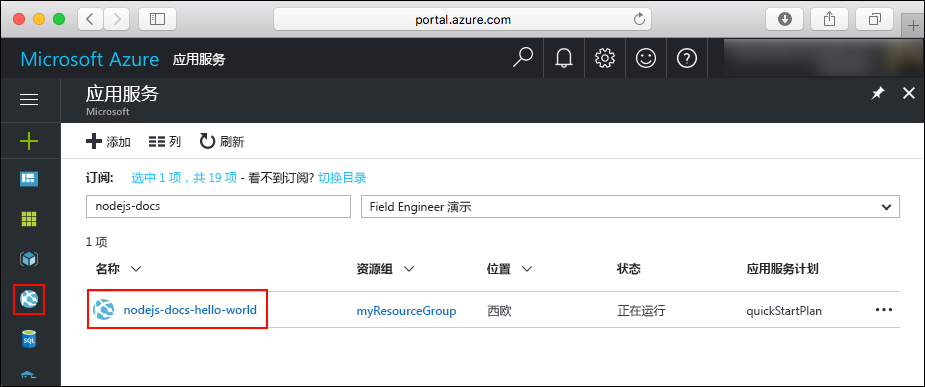
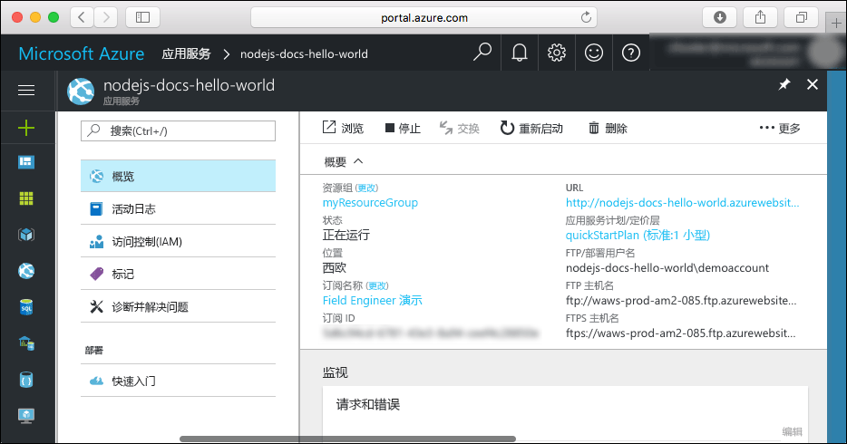

# <a name="create-a-nodejs-web-app-in-a-linux-container-in-azure"></a>在 Azure 的 Linux 容器中创建 Node.js Web 应用

[用于容器的 Web 应用](app-service-linux-intro.md)使用 Linux 操作系统，提供高度可缩放的自修补 Web 托管服务。 本快速入门演示了如何将 Node.js 应用部署到用于容器的 Azure Web 应用中。 使用 [Azure CLI](https://docs.microsoft.com/cli/azure/get-started-with-azure-cli) 创建 Web 应用，并使用 Git 将 Node.js 代码部署到 Web 应用。


可以在 Mac、Windows 或 Linux 计算机上执行以下步骤。

## <a name="prerequisites"></a>先决条件

完成本快速入门教程：

* [安装 Git](https://git-scm.com/)
* [安装 Node.js 和 NPM](https://nodejs.org/)

[!INCLUDE [quickstarts-free-trial-note](../../../includes/quickstarts-free-trial-note.md)]

## <a name="download-the-sample"></a>下载示例

在计算机的终端窗口中，运行以下命令，将示例应用存储库克隆到本地计算机。

```bash
git clone https://github.com/Azure-Samples/nodejs-docs-hello-world
```

使用此终端窗口运行本快速入门中的所有命令。

切换到包含示例代码的目录。

```bash
cd nodejs-docs-hello-world
```

## <a name="run-the-app-locally"></a>在本地运行应用

打开一个终端窗口并使用 `npm start` 脚本启动内置的 Node.js HTTP 服务器，以在本地运行应用程序。

```bash
npm start
```

打开 Web 浏览器并导航到 `http://localhost:1337` 处的示例应用。

页面中会显示该示例应用发出的 Hello World 消息。


在终端窗口中，按 **Ctrl+C** 退出 Web 服务器。

[!INCLUDE [cloud-shell-try-it.md](../../../includes/cloud-shell-try-it.md)]

[!INCLUDE [Configure deployment user](../../../includes/configure-deployment-user.md)]

[!INCLUDE [Create resource group](../../../includes/app-service-web-create-resource-group.md)]

[!INCLUDE [Create app service plan](../../../includes/app-service-web-create-app-service-plan-linux.md)]

## <a name="create-a-web-app"></a>创建 Web 应用

[!INCLUDE [Create web app](../../../includes/app-service-web-create-web-app-linux-nodejs-no-h.md)]

浏览到该站点查看新建的 Web 应用。 将 _&lt;应用名称>_ 替换为唯一的应用名称。

```bash
http://<app name>.azurewebsites.net
```


[!INCLUDE [Push to Azure](../../../includes/app-service-web-git-push-to-azure.md)]

```bash
Counting objects: 23, done.
Delta compression using up to 4 threads.
Compressing objects: 100% (21/21), done.
Writing objects: 100% (23/23), 3.71 KiB | 0 bytes/s, done.
Total 23 (delta 8), reused 7 (delta 1)
remote: Updating branch 'master'.
remote: Updating submodules.
remote: Preparing deployment for commit id 'bf114df591'.
remote: Generating deployment script.
remote: Generating deployment script for node.js Web Site
remote: Generated deployment script files
remote: Running deployment command...
remote: Handling node.js deployment.
remote: Kudu sync from: '/home/site/repository' to: '/home/site/wwwroot'
remote: Copying file: '.gitignore'
remote: Copying file: 'LICENSE'
remote: Copying file: 'README.md'
remote: Copying file: 'index.js'
remote: Copying file: 'package.json'
remote: Copying file: 'process.json'
remote: Deleting file: 'hostingstart.html'
remote: Ignoring: .git
remote: Using start-up script index.js from package.json.
remote: Node.js versions available on the platform are: 4.4.7, 4.5.0, 6.2.2, 6.6.0, 6.9.1.
remote: Selected node.js version 6.9.1. Use package.json file to choose a different version.
remote: Selected npm version 3.10.8
remote: Finished successfully.
remote: Running post deployment command(s)...
remote: Deployment successful.
To https://<app_name>.scm.azurewebsites.net:443/<app_name>.git
 * [new branch]      master -> master
```

## <a name="browse-to-the-app"></a>浏览到应用

使用 Web 浏览器浏览到已部署的应用程序。

```bash
http://<app_name>.azurewebsites.net
```

Node.js 示例代码在 Azure 应用服务 Web 应用中运行。


**祝贺你！** 现已将第一个 Node.js 应用部署到应用服务。

## <a name="update-and-redeploy-the-code"></a>更新并重新部署代码

使用文本编辑器在 Node.js 应用中打开 `index.js` 文件，然后对 `response.end` 调用中的文本稍微进行更改：

```nodejs
response.end("Hello Azure!");
```

提交在 Git 中所做的更改，然后将代码更改推送到 Azure。

```bash
git commit -am "updated output"
git push azure master
```

完成部署后，切换回在“浏览到应用”步骤中打开的浏览器窗口，并点击“刷新”。


## <a name="manage-your-new-azure-web-app"></a>管理新 Azure Web 应用

转到 <a href="https://portal.azure.com" target="_blank">Azure 门户</a>管理创建的 Web 应用。

在左侧菜单中单击“应用服务”，然后单击 Azure Web 应用的名称。



将看到 Web 应用的概述页。 在此处可以执行基本的管理任务，例如浏览、停止、启动、重新启动和删除。 



左侧菜单提供用于配置应用的不同页面。 

[!INCLUDE [cli-samples-clean-up](../../../includes/cli-samples-clean-up.md)]

## <a name="next-steps"></a>后续步骤

> [!div class="nextstepaction"]
> [将 Node.js 与 MongoDB 配合使用](tutorial-nodejs-mongodb-app.md)
