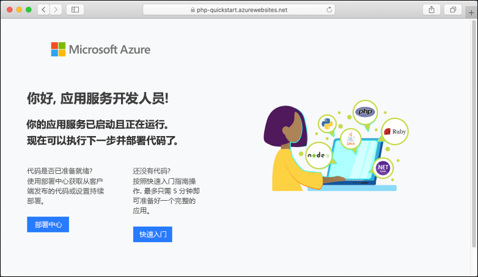
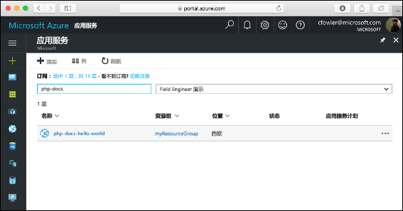
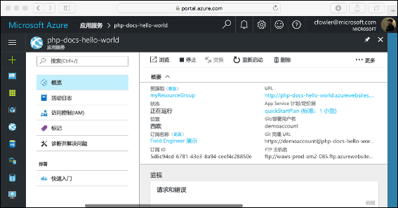

# <a name="create-a-php-app-in-app-service-on-linux"></a>在 Linux 上的应用服务中创建 PHP 应用

> [!NOTE]
> 本文将应用部署到基于 Linux 的应用服务。 若要部署到 _Windows_ 上的应用服务，请参阅[在 Azure 中创建 PHP 应用](../app-service-web-get-started-php.md)。
>

[Linux 应用服务](app-service-linux-intro.md)使用 Linux 操作系统，提供高度可缩放的自修补 Web 托管服务。 本快速入门教程展示了如何使用 [Cloud Shell](https://docs.microsoft.com/azure/cloud-shell/overview) 将 PHP 应用部署到 Linux 上的 Azure 应用服务。


可以使用 Mac、Windows 或 Linux 计算机执行本文中的步骤。

[!INCLUDE [quickstarts-free-trial-note](../../../includes/quickstarts-free-trial-note.md)]

## <a name="prerequisites"></a>先决条件

完成本快速入门教程需要：

* <a href="https://git-scm.com/" target="_blank">安装 Git</a>
* <a href="https://php.net" target="_blank">安装 PHP</a>

## <a name="download-the-sample"></a>下载示例

在终端窗口中运行以下命令，将示例应用程序克隆到本地计算机，并导航到包含示例代码的目录。

```bash
git clone https://github.com/Azure-Samples/php-docs-hello-world
cd php-docs-hello-world
```

## <a name="run-the-app-locally"></a>在本地运行应用

在本地运行应用程序，以便你能了解将它部署到 Azure 时它的外观应该是什么样的。 打开一个终端窗口并使用 `php` 命令启动内置的 PHP Web 服务器。

```bash
php -S localhost:8080
```

打开 Web 浏览器并导航到 `http://localhost:8080` 处的示例应用。

此时会看到来自示例应用的 Hello World!  消息显示在页面中。


在终端窗口中，按 **Ctrl+C** 退出 Web 服务器。

[!INCLUDE [cloud-shell-try-it.md](../../../includes/cloud-shell-try-it.md)]

[!INCLUDE [Configure deployment user](../../../includes/configure-deployment-user.md)]

[!INCLUDE [Create resource group](../../../includes/app-service-web-create-resource-group-linux.md)]

[!INCLUDE [Create app service plan](../../../includes/app-service-web-create-app-service-plan-linux.md)]

## <a name="create-a-web-app"></a>创建 Web 应用

[!INCLUDE [Create web app](../../../includes/app-service-web-create-web-app-php-linux-no-h.md)] 

浏览到该站点查看使用内置映像新建的应用。 将 &lt;app name>  替换为你的应用名称。

```bash
http://<app-name>.azurewebsites.net
```

新应用应该如下所示：



[!INCLUDE [Push to Azure](../../../includes/app-service-web-git-push-to-azure.md)] 

<pre>
Counting objects: 26, done.
Delta compression using up to 4 threads.
Compressing objects: 100% (23/23), done.
Writing objects: 100% (26/26), 4.95 KiB | 0 bytes/s, done.
Total 26 (delta 9), reused 0 (delta 0)
remote: Deploy Async
remote: Updating branch 'master'.
remote: Updating submodules.
remote: Preparing deployment for commit id 'df425ea6ef'.
remote: Repository path is /home/site/repository
remote: Running oryx build...
remote: Build orchestrated by Microsoft Oryx, https://github.com/Microsoft/Oryx
remote: You can report issues at https://github.com/Microsoft/Oryx/issues
remote: .
remote: .
remote: .
remote: Deployment successful.
remote: Deployment Logs : 'https://&lt;app-name&gt;.scm.azurewebsites.net/newui/jsonviewer?view_url=/api/deployments/.../log'
To https://&lt;app-name&gt;.scm.azurewebsites.net/&lt;app-name&gt;.git
 * [new branch]      master -> master
</pre>

## <a name="browse-to-the-app"></a>浏览到应用

使用 Web 浏览器浏览到已部署的应用程序。

```bash
http://<app-name>.azurewebsites.net
```

PHP 示例代码在包含内置映像的 Linux 上的应用服务中运行。


祝贺你！  现已将第一个 PHP 应用部署到 Linux 应用服务。

## <a name="update-locally-and-redeploy-the-code"></a>在本地更新并重新部署代码

在本地目录中，打开 PHP 应用中的 `index.php` 文件，并对 `echo` 旁边的字符串中的文本略加更改：

```php
echo "Hello Azure!";
```

提交在 Git 中所做的更改，然后将代码更改推送到 Azure。

```bash
git commit -am "updated output"
git push azure master
```

完成部署后，切换回**浏览到应用**步骤中打开的浏览器窗口，然后刷新页面。


## <a name="manage-your-new-azure-app"></a>管理新的 Azure 应用

转到 <a href="https://portal.azure.com" target="_blank">Azure 门户</a>管理已创建的应用。

在左侧菜单中单击**应用程序服务**，然后单击 Azure 应用的名称。



这里我们可以看到应用的“概述”页。 并可以执行基本的管理任务，例如浏览、停止、启动、重新启动和删除。



左侧菜单提供了用于配置应用的不同页面。 

[!INCLUDE [cli-samples-clean-up](../../../includes/cli-samples-clean-up.md)]

## <a name="next-steps"></a>后续步骤

> [!div class="nextstepaction"]
> [教程：将 PHP 应用与 MySQL 配合使用](tutorial-php-mysql-app.md)

> [!div class="nextstepaction"]
> [配置 PHP 应用](configure-language-php.md)
