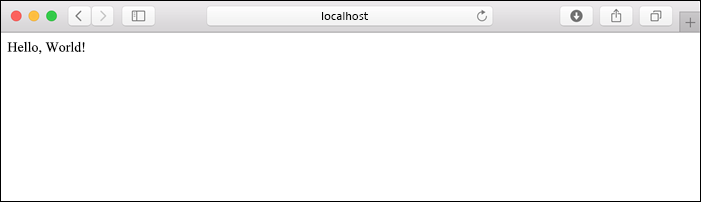
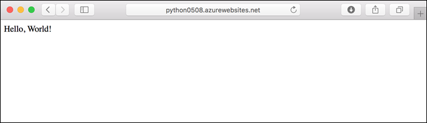
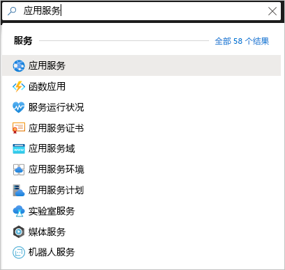
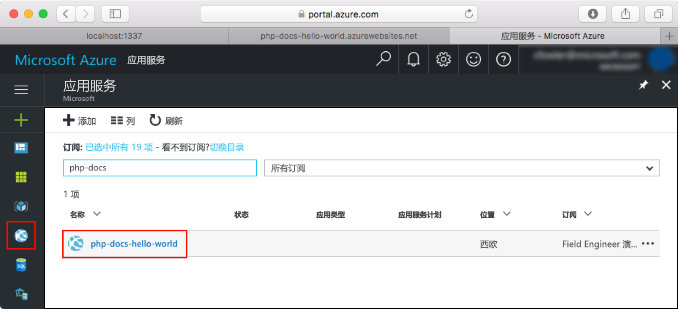
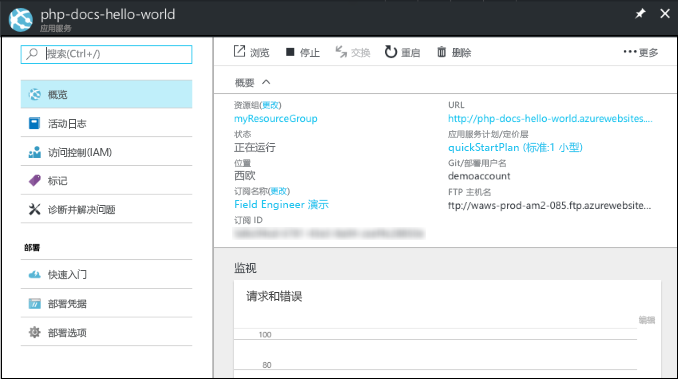

# <a name="quickstart-create-a-python-app-in-azure-app-service-on-linux"></a>快速入门：在 Linux 上的 Azure 应用服务中创建 Python 应用

在本快速入门中，需将 Python Web 应用部署到 [Linux 上的应用服务](app-service-linux-intro.md)，该版本提供了一项高度可缩放、自我修补的 Azure Web 托管服务。 在 Mac、Linux 或 Windows 计算机上使用本地 [Azure 命令行接口 (CLI)](/cli/azure/install-azure-cli)。 配置的 Web 应用使用免费的应用服务层，因此本文中的操作不会产生任何费用。

如果希望通过 IDE 部署应用，请参阅[从 Visual Studio Code 将 Python 应用部署到应用服务](/azure/python/tutorial-deploy-app-service-on-linux-01)。

## <a name="prerequisites"></a>先决条件

- Azure 订阅 - [创建免费帐户](https://azure.microsoft.com/free/?ref=microsoft.com&utm_source=microsoft.com&utm_medium=docs&utm_campaign=visualstudio)
- <a href="https://www.python.org/downloads/" target="_blank">Python 3.7</a>（也支持 Python 3.6）
- <a href="https://git-scm.com/downloads" target="_blank">Git</a>
- <a href="https://docs.microsoft.com/cli/azure/install-azure-cli" target="_blank">Azure CLI</a> 2.0.80 或更高版本。 请运行 `az --version` 检查版本。

## <a name="download-the-sample"></a>下载示例

在终端窗口中，运行以下命令，将示例应用程序克隆到本地计算机。 

```terminal
git clone https://github.com/Azure-Samples/python-docs-hello-world
```

然后转到该文件夹：

```terminal
cd python-docs-hello-world
```

存储库包含一个 application.py 文件，后者会告知应用服务：代码包含 Flask 应用  。 有关详细信息，请参阅[容器启动过程和自定义项](how-to-configure-python.md)。

## <a name="run-the-sample"></a>运行示例

在终端窗口中，使用以下命令（操作系统适用）安装所需的依赖项，并启动内置开发服务器。 

# <a name="bash"></a>[Bash](#tab/bash)

```bash
python3 -m venv venv
source venv/bin/activate
pip install -r requirements.txt
export FLASK_APP=application.py
flask run
```

# <a name="powershell"></a>[PowerShell](#tab/powershell)

```powershell
py -3 -m venv env
env\scripts\activate
pip install -r requirements.txt
Set-Item Env:FLASK_APP ".\application.py"
flask run
```

# <a name="cmd"></a>[Cmd](#tab/cmd)

```cmd
py -3 -m venv env
env\scripts\activate
pip install -r requirements.txt
SET FLASK_APP=application.py
flask run
```

---

打开 Web 浏览器并转到 `http://localhost:5000/` 处的示例应用。 应用显示“Hello World!”消息  。



在终端窗口中，按 Ctrl+C 退出 Web 服务器   。

## <a name="sign-in-to-azure"></a>登录 Azure

Azure CLI 提供了许多便捷命令，可以在本地终端的命令行下使用这些命令来预配和管理 Azure 资源。 可以使用命令来执行在浏览器中通过 Azure 门户所执行的相同任务。 还可以在脚本中使用 CLI 命令自动执行管理过程。

要在 Azure CLI 中运行 Azure 命令，必须先使用 `az login` 命令进行登录。 此命令将打开浏览器以获取凭据。

```azurecli
az login
```

## <a name="deploy-the-sample"></a>部署示例

[`az webapp up`](/cli/azure/webapp#az-webapp-up) 命令将在应用服务上创建 Web 应用并部署代码。

在包含示例代码的 python-docs-hello-world 文件夹中，运行以下 `az webapp up` 命令  。 将 `<app-name>` 替换为全局唯一的应用名称（有效字符是 `a-z`、`0-9` 和 `-`）  。


```azurecli
az webapp up --sku F1 -n <app-name>
```
> [!CAUTION]
> 如果使用的是 Azure CLI 版本 2.5.0  ，则 `az webapp up` 中存在回归，在未提供 `-l <location-name>` 参数的情况下，某些方案会失败。 此问题[在此跟踪](https://github.com/Azure/azure-cli/issues/13257)。  
> 
>可以使用 `az --version` 命令查看所使用的 Azure CLI 的版本。
>

`--sku F1` 参数在“免费”定价层上创建 Web 应用。 省略此参数即可改用高级层，这会按小时计费。

可以选择性地包含参数 `-l <location-name>`，其中，`<location_name>` 是 Azure 区域，例如 centralus、eastasia、westeurope、koreasouth、brazilsouth、centralindia等。       可以运行 [`az account list-locations`](/cli/azure/appservice?view=azure-cli-latest.md#az-appservice-list-locations) 命令来检索 Azure 帐户的允许区域列表。

`az webapp up` 命令可能需要几分钟才能完全运行。 运行时，它会显示类似于以下示例的信息，其中的 `<app-name>` 是前面提供的名称：

<pre>
Creating Resource group 'appsvc_rg_Linux_centralus' ...
Resource group creation complete
Creating App service plan 'appsvc_asp_Linux_centralus' ...
App service plan creation complete
Creating app '&lt;app-name&gt;' ....
Configuring default logging for the app, if not already enabled
Creating zip with contents of dir D:\Examples\python-docs-hello-world ...
Getting scm site credentials for zip deployment
Starting zip deployment. This operation can take a while to complete ...
Deployment endpoint responded with status code 202
You can launch the app at http://&lt;app-name&gt;.azurewebsites.net
{
  "URL": "http://&lt;app-name&gt;.net",
  "appserviceplan": "appsvc_asp_Linux_centralus",
  "location": "eastus",
  "name": "&lt;app-name&gt;",
  "os": "Linux",
  "resourcegroup": "appsvc_rg_Linux_centralus",
  "runtime_version": "python|3.7",
  "runtime_version_detected": "-",
  "sku": "FREE",
  "src_path": "D:\\Examples\\python-docs-hello-world"
}
</pre>

[!INCLUDE [AZ Webapp Up Note](../../../includes/app-service-web-az-webapp-up-note.md)]

## <a name="browse-to-the-app"></a>浏览到应用

在 Web 浏览器中使用以下 URL 浏览到已部署的应用程序：`http://<app-name>.azurewebsites.net`。

Python 示例代码在使用内置映像的应用服务中运行 Linux 容器。



祝贺你！  现已将 Python 应用部署到 Linux 上的应用服务。

## <a name="redeploy-updates"></a>重新部署更新

在偏好的代码编辑器中打开 application.py，并按如下所示更新 `hello` 函数。  此项更改会添加一个 `print` 语句，用于生成要在下一部分使用的日志记录输出。 

```python
def hello():
    print("Handling request to home page.")
    return "Hello Azure!"
```

保存更改并退出编辑器。 

再次使用 `az webapp up` 命令，重新部署应用：

```azurecli
az webapp up
```

此命令使用 .azure/config 文件中缓存的值，包括应用名称、资源组和应用服务计划。 

部署完成之后，返回打开 `http://<app-name>.azurewebsites.net` 的浏览器窗口并刷新页面，此时应显示修改后的消息：


> [!TIP]
> Visual Studio Code 为 Python 和 Azure 应用服务提供了功能强大的扩展，简化了将 Python Web 应用部署到应用服务的过程。 有关详细信息，请参阅[将 Python 应用从 Visual Studio Code 部署到应用服务](/azure/python/tutorial-deploy-app-service-on-linux-01)。

## <a name="stream-logs"></a>流式传输日志

可以访问应用内和运行应用的容器所生成的控制台日志。 这些日志包括使用 `print` 语句生成的任何输出。

若要流式传输日志，请运行以下命令：

```azurecli
az webapp log tail
```

在浏览器中刷新应用以生成控制台日志，日志中应包含与以下文本类似的行。 如果未立即显示输出，请在 30 秒后重试。

<pre>
2020-04-03T22:54:04.236405938Z Handling request to home page.
2020-04-03T22:54:04.236497641Z 172.16.0.1 - - [03/Apr/2020:22:54:04 +0000] "GET / HTTP/1.1" 200 12 "-" "Mozilla/5.0 (Windows NT 10.0; Win64; x64) AppleWebKit/537.36 (KHTML, like Gecko) Chrome/81.0.4044.83 Safari/537.36 Edg/81.0.416.41"
</pre>

也可通过浏览器在 `https://<app-name>.scm.azurewebsites.net/api/logs/docker` 中检查日志文件。

若要随时停止日志流式处理，请键入 `Ctrl`+`C`。

## <a name="manage-the-azure-app"></a>管理 Azure 应用

转到 <a href="https://portal.azure.com" target="_blank">Azure 门户</a>管理已创建的应用。 搜索并选择“应用服务”。 



选择 Azure 应用名称。



这里我们可以看到应用的“概述”页。 并可以执行基本的管理任务，例如浏览、停止、启动、重新启动和删除。



应用服务菜单提供了用于配置应用的不同页面。

## <a name="clean-up-resources"></a>清理资源

在前面的步骤中，你在资源组中创建了 Azure 资源。 资源组根据位置得名，例如“appsvc_rg_Linux_CentralUS”。 如果使用 F1 免费层以外的应用服务 SKU，这些资源会持续产生费用（请参阅[应用服务定价](https://azure.microsoft.com/pricing/details/app-service/linux/)）。

如果将来不需要这些资源，请按如下方式删除资源组：运行以下命令，并将 `<resource-group-name>` 替换为 `az webapp up` 命令的输出中所显示的资源组（例如“appsvc_rg_Linux_centralus”）。 此命令可能需要一分钟才能完成。

```azurecli
az group delete -n <resource-group-name>
```

## <a name="next-steps"></a>后续步骤

> [!div class="nextstepaction"]
> [教程：使用 PostgreSQL 的 Python (Django) Web 应用](tutorial-python-postgresql-app.md)

> [!div class="nextstepaction"]
> [将用户登录添加到 Python Web 应用](../../active-directory/develop/quickstart-v2-python-webapp.md)

> [!div class="nextstepaction"]
> [配置 Python 应用](how-to-configure-python.md)

> [!div class="nextstepaction"]
> [教程：在自定义容器中运行 Python 应用](tutorial-custom-docker-image.md)
