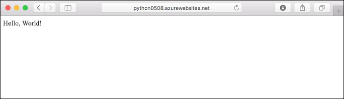
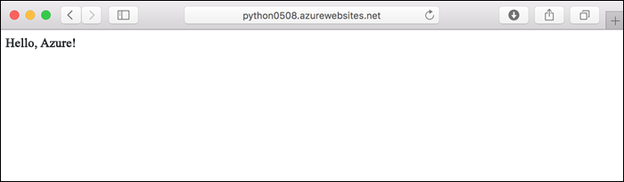
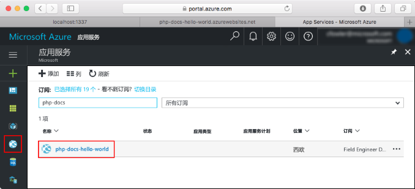
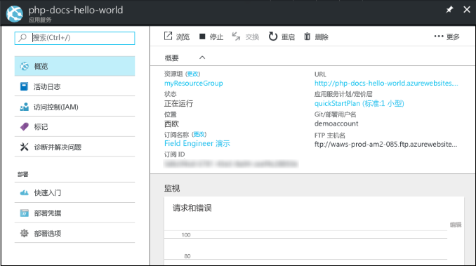

# <a name="deploy-a-python-web-app-in-web-app-for-containers"></a>在用于容器的 Web 应用中部署 Python Web 应用

[Linux 应用服务](app-service-linux-intro.md)使用 Linux 操作系统，提供高度可缩放的自修补 Web 托管服务。 本快速入门展示了如何创建 Web 应用并使用自定义 Docker 中心映像向其部署简单的 Flask 应用。 使用 [Azure CLI](https://docs.microsoft.com/cli/azure/get-started-with-azure-cli) 创建 Web 应用。



[!INCLUDE [quickstarts-free-trial-note](../../../includes/quickstarts-free-trial-note.md)]

## <a name="prerequisites"></a>先决条件

完成本教程：

* <a href="https://git-scm.com/" target="_blank">安装 Git</a>
* <a href="https://www.docker.com/community-edition" target="_blank">安装 Docker Community Edition</a>
* <a href="https://hub.docker.com/" target="_blank">注册 Docker 中心帐户</a>

## <a name="download-the-sample"></a>下载示例

在终端窗口中运行以下命令，将示例应用程序克隆到本地计算机，并导航到包含示例代码的目录。

```bash
git clone https://github.com/Azure-Samples/python-docs-hello-world
cd python-docs-hello-world
```

此存储库在 _/app_ 文件夹中包含一个简单的 Flask 应用程序，并且包含一个 _Dockerfile_，它指定了以下三件事情：

- 使用 [tiangolo/uwsgi-nginx-flask:python3.6-alpine3.7](https://hub.docker.com/r/tiangolo/uwsgi-nginx-flask/) 基础映像。
- 容器应当在端口 8000 上侦听。
- 将 `/app` 目录复制到容器的 `/app` 目录。

配置遵循[适用于基础映像的说明](https://hub.docker.com/r/tiangolo/uwsgi-nginx-flask/)。

## <a name="run-the-app-locally"></a>在本地运行应用

在 Docker 容器中运行应用。

```bash
docker build --rm -t flask-quickstart .
docker run --rm -it -p 8000:8000 flask-quickstart
```

打开 Web 浏览器并导航到 `http://localhost:8000` 处的示例应用。

页面中会显示该示例应用发出的 **Hello World** 消息。


在终端窗口中，按 **Ctrl+C** 来停止容器。

## <a name="deploy-image-to-docker-hub"></a>将映像部署到 Docker 中心

登录到 Docker 中心帐户。 根据提示输入你的 Docker 中心凭据。

```bash
docker login
```

对映像进行标记，将其推送到你的 Docker 中心帐户中的一个新的“公共”存储库（推送到名为 `flask-quickstart` 的存储库）。 将 *\<dockerhub_id>* 替换为你的 Docker 中心 ID。

```bash
docker tag flask-quickstart <dockerhub_id>/flask-quickstart
docker push <dockerhub_id>/flask-quickstart
```

> [!NOTE]
> 如果找不到指定的存储库，则 `docker push` 会创建一个公共存储库。 本快速入门采用 Docker 中心内的一个公共存储库。 如果希望推送到专用存储库，稍后需要在 Azure 应用服务中配置你的 Docker 中心凭据。 请参阅[创建 Web 应用](#create-a-web-app)。

映像推送完成后，便可以在 Azure Web 应用程序中使用它。

[!INCLUDE [cloud-shell-try-it.md](../../../includes/cloud-shell-try-it.md)]

[!INCLUDE [Create resource group](../../../includes/app-service-web-create-resource-group-linux.md)]

[!INCLUDE [Create app service plan](../../../includes/app-service-web-create-app-service-plan-linux.md)]

## <a name="create-a-web-app"></a>创建 Web 应用

使用 [az webapp create](/cli/azure/webapp?view=azure-cli-latest#az_webapp_create) 命令在 `myAppServicePlan` 应用服务计划中创建 [Web 应用](../app-service-web-overview.md)。 将 *\<app name>* 替换为一个全局唯一的应用名称，将 *\<dockerhub_id>* 替换为你的 Docker 中心 ID。

```azurecli-interactive
az webapp create --resource-group myResourceGroup --plan myAppServicePlan --name <app name> --deployment-container-image-name <dockerhub_id>/flask-quickstart
```

创建 Web 应用后，Azure CLI 会显示类似于以下示例的输出：

```json
{
  "availabilityState": "Normal",
  "clientAffinityEnabled": true,
  "clientCertEnabled": false,
  "cloningInfo": null,
  "containerSize": 0,
  "dailyMemoryTimeQuota": 0,
  "defaultHostName": "<app name>.azurewebsites.net",
  "deploymentLocalGitUrl": "https://<username>@<app name>.scm.azurewebsites.net/<app name>.git",
  "enabled": true,
  < JSON data removed for brevity. >
}
```

如果之前上传到了专用存储库，则还需要在应用服务中配置 Docker 中心凭据。 有关详细信息，请参阅[使用 Docker 中心内的专用映像](tutorial-custom-docker-image.md#use-a-private-image-from-docker-hub-optional)。

### <a name="specify-container-port"></a>指定容器端口

如 _Dockerfile_ 中所指定，容器在端口 8000 上进行侦听。 要使应用服务将你的请求路由到正确的端口，需要设置 *WEBSITES_PORT* 应用设置。

在 Cloud Shell 中，运行 [`az webapp config appsettings set`](/cli/azure/webapp/config/appsettings?view=azure-cli-latest#az_webapp_config_appsettings_set) 命令。


```azurecli-interactive
az webapp config appsettings set --name <app_name> --resource-group myResourceGroup --settings WEBSITES_PORT=8000
```

## <a name="browse-to-the-app"></a>浏览到应用

```bash
http://<app_name>.azurewebsites.net/
```


> [!NOTE]
> Web 应用需要一些时间才能启动，因为在首次请求该应用时必须下载并运行 Docker 中心映像。 如果一开始在经过很长时间后出现错误，只需刷新页面即可。

**祝贺你！** 你已将运行 Python 应用的自定义 Docker 映像部署到用于容器的 Web 应用。

## <a name="update-locally-and-redeploy"></a>在本地更新并重新部署

使用本地文本编辑器在 Python 应用中打开 `app/main.py` 文件，然后对 `return` 语句旁边的文本稍微进行更改：

```python
return 'Hello, Azure!'
```

重新生成映像并再次将其推送到 Docker 中心。

```bash
docker build --rm -t flask-quickstart .
docker tag flask-quickstart <dockerhub_id>/flask-quickstart
docker push <dockerhub_id>/flask-quickstart
```

在 Cloud Shell 中，重启该应用。 重启应用可确保应用所有设置，且从注册表中拉取最近的容器。

```azurecli-interactive
az webapp restart --resource-group myResourceGroup --name <app_name>
```

等待大约 15 秒，以便应用服务拉取已更新的映像。 切换回在“浏览到应用”步骤中打开的浏览器窗口，然后刷新页面。



## <a name="manage-your-azure-web-app"></a>管理 Azure Web 应用

转到 [Azure 门户](https://portal.azure.com)查看已创建的 Web 应用。

从左侧菜单中单击“应用服务”，并单击 Azure Web 应用的名称。



默认情况下，门户将显示 Web 应用“概述”页。 在此页中可以查看应用的运行状况。 在此处还可以执行基本的管理任务，例如浏览、停止、启动、重新启动和删除。 该页左侧的选项卡显示可以打开的不同配置页。



[!INCLUDE [Clean-up section](../../../includes/cli-script-clean-up.md)]

## <a name="next-steps"></a>后续步骤

> [!div class="nextstepaction"]
> [将 Python 与 PostgreSQL 配合使用](tutorial-docker-python-postgresql-app.md)

> [!div class="nextstepaction"]
> [使用自定义映像](tutorial-custom-docker-image.md)