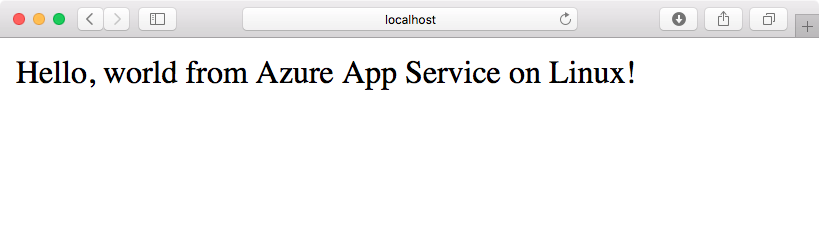
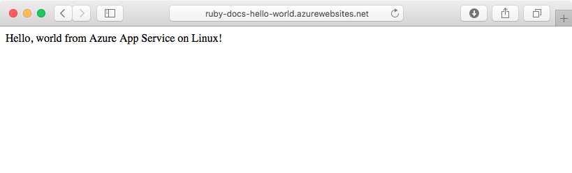
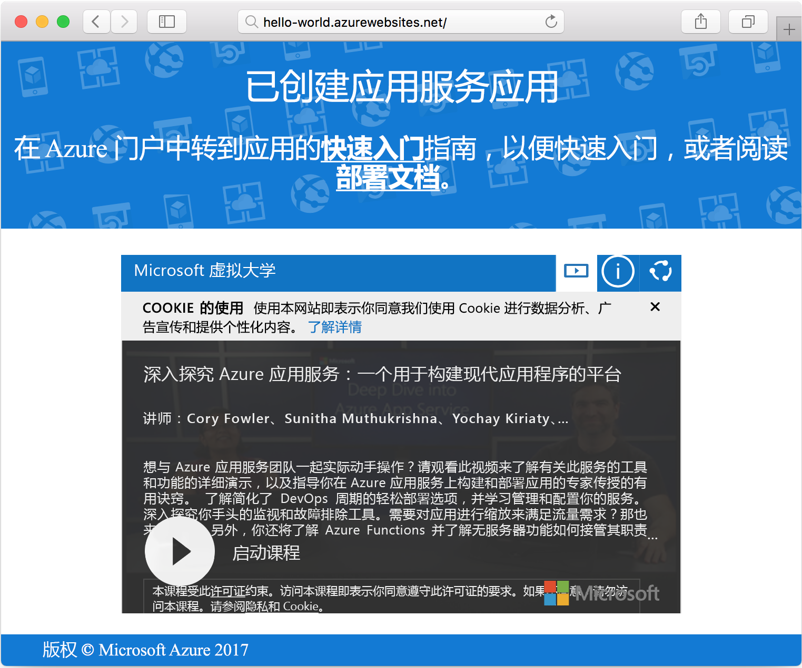

# <a name="create-a-ruby-app-in-app-service-on-linux"></a>使用 Linux 应用服务创建 Ruby 应用

[Linux 应用服务](app-service-linux-intro.md)提供高度可缩放、自修补的 Web 托管服务。 本快速入门将介绍如何创建一个基本的 Ruby on Rails 应用程序并将其部署到 Azure 上，以作为 Linux 上的一个 Web 应用程序。



[!INCLUDE [quickstarts-free-trial-note](../../../includes/quickstarts-free-trial-note.md)]

## <a name="prerequisites"></a>先决条件

* <a href="https://www.ruby-lang.org/en/documentation/installation/#rubyinstaller" target="_blank">安装 Ruby 2.4.1 或更高版本</a>
* <a href="https://git-scm.com/" target="_blank">安装 Git</a>

## <a name="download-the-sample"></a>下载示例

在终端窗口中，运行以下命令，将示例应用存储库克隆到本地计算机：

```bash
git clone https://github.com/Azure-Samples/ruby-docs-hello-world
```

## <a name="run-the-application-locally"></a>在本地运行应用程序

运行 rails 服务器以使应用程序正常运作。 切换到“hello-world”目录，`rails server` 命令将启动服务器。

```bash
cd hello-world\bin
rails server
```

使用 Web 浏览器导航到 `http://localhost:3000` 以在本地测试该应用。


## <a name="modify-app-to-display-welcome-message"></a>修改应用程序以显示欢迎消息

修改应用程序以使其显示欢迎消息。 首先，必须通过修改~/workspace/ruby-docs-hello-world/config/routes.rb 文件使其包含一个名为 `hello` 的路由，来设置路由。

  ```ruby
  Rails.application.routes.draw do
      #For details on the DSL available within this file, see http://guides.rubyonrails.org/routing.html
      root 'application#hello'
  end
  ```

更改应用程序控制器，以使其将消息以 HTML 的形式返回到浏览器。 

打开 *~/workspace/hello-world/app/controllers/application_controller.rb* 进行编辑。 修改 `ApplicationController` 类以使其类似下面的代码示例：

  ```ruby
  class ApplicationController > ActionController :: base
    protect_from_forgery with: :exception
    def hello
      render html: "Hello, world from Azure Web App on Linux!"
    end
  end
  ```

现在已配置了应用。 使用 web 浏览器导航到 `http://localhost:3000` 来确认根登陆页面。



[!INCLUDE [Try Cloud Shell](../../../includes/cloud-shell-try-it.md)]

[!INCLUDE [Configure deployment user](../../../includes/configure-deployment-user.md)]

## <a name="create-a-ruby-web-app-on-azure"></a>在 Azure 上创建 Ruby Web 应用

资源组需包含 Web 应用所需的资产。 若要创建资源组，请使用 [`az group create`](/cli/azure/webapp?view=azure-cli-latest#az_webapp_create) 命令。

```azurecli-interactive
az group create --location westeurope --name myResourceGroup
```

使用 [`az appservice plan create`](/cli/azure/appservice/plan?view=azure-cli-latest#az_appservice_plan_create) 命令创建 Web 应用的应用服务计划。

```azurecli-interactive
az appservice plan create --name myAppServicePlan --resource-group myResourceGroup --is-linux
```

接下来，发出 [`az webapp create`](/cli/azure/webapp?view=azure-cli-latest#az_webapp_create) 命令，以创建使用新创建的服务计划的 Web 应用。 请注意，运行时设置为 `ruby|2.3`。 不要忘记将 `<app name>` 替换为唯一的应用名称。

```azurecli-interactive
az webapp create --resource-group myResourceGroup --plan myAppServicePlan --name <app name> \
--runtime "ruby|2.3" --deployment-local-git
```

该命令的输出会显示有关新创建的 Web 应用及部署 URL 的信息。 如下方示例所示。 复制该 URL，本教程稍后会使用。

```bash
https://<deployment user name>@<app name>.scm.azurewebsites.net/<app name>.git
```

创建 Web 应用后，即可查看“概述”页。 导航到此页。 将显示以下启动页面：




## <a name="deploy-your-application"></a>部署应用程序

运行以下命令，以将本地应用程序部署到 Azure 网站：

```bash
git remote add azure <Git deployment URL from above>
git add -A
git commit -m "Initial deployment commit"
git push azure master
```

确认远程部署操作报告了成功消息。 命令生成的输出类似于以下文本：

```bash
remote: Using sass-rails 5.0.6
remote: Updating files in vendor/cache
remote: Bundle gems are installed into ./vendor/bundle
remote: Updating files in vendor/cache
remote: ~site/repository
remote: Finished successfully.
remote: Running post deployment command(s)...
remote: Deployment successful.
To https://<your web app name>.scm.azurewebsites.net/<your web app name>.git
  579ccb....2ca5f31  master -> master
myuser@ubuntu1234:~workspace/<app name>$
```

在部署完成后，通过使用 [`az webapp restart`](/cli/azure/webapp?view=azure-cli-latest#az_webapp_restart) 命令，重新启动 Web 应用以使部署生效，如下所示：

```azurecli-interactive
az webapp restart --name <app name> --resource-group myResourceGroup
```

导航到你的站点并验证结果。

```bash
http://<app name>.azurewebsites.net
```


> [!NOTE]
> 当应用正在重新启动时，尝试浏览站点会生成 HTTP 状态代码 `Error 503 Server unavailable`。 可能需要花费几分钟时间才能完全重新启动。
>

[!INCLUDE [Clean-up section](../../../includes/cli-script-clean-up.md)]

## <a name="next-steps"></a>后续步骤

> [!div class="nextstepaction"]
> [Ruby on Rails 与 MySQL](tutorial-ruby-mysql-app.md)
