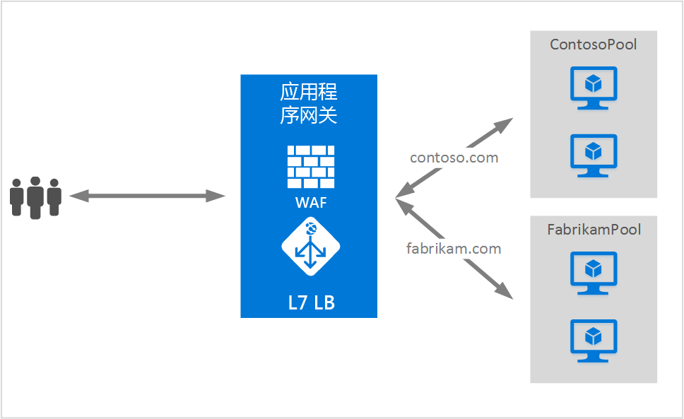

# <a name="application-gateway-multiple-site-hosting"></a>应用程序网关的多站点托管功能

托管多个站点可以让你在同一应用程序网关实例上配置多个 Web 应用程序。 此功能可以将多达 20 个网站添加到一个应用程序网关中，为部署配置更有效的拓扑。 每个网站都可以定向到自己的后端池。 在以下示例中，应用程序网关通过两个名为 ContosoServerPool 和 FabrikamServerPool 的后端服务器池来为 contoso.com 和 fabrikam.com 提供流量。



> [!IMPORTANT]
> 规则将按照门户中的列出顺序进行处理。 我们强烈建议先配置多站点侦听器，然后再配置基本侦听器。  这可以确保将流量路由到适当的后端。 如果基本侦听器先列出并且与传入的请求匹配，则该侦听器将处理该请求。

对 http://contoso.com 的请求将路由到 ContosoServerPool，而对 http://fabrikam.com 的请求将路由到 FabrikamServerPool。

同样可以将同一父域的两个子域托管到同一应用程序网关部署。 使用子域的示例可以包括在单个应用程序网关部署中托管的 http://blog.contoso.com 和 http://app.contoso.com。

## <a name="host-headers-and-server-name-indication-sni"></a>主机标头和服务器名称指示 (SNI)

可以通过三种常用机制在同一基础结构上启用多站点托管功能。

1. 托管多个 Web 应用程序时，每个唯一的 IP 地址可以托管一个应用程序。
2. 使用主机名在同一 IP 地址上托管多个 Web 应用程序。
3. 使用不同的端口在同一 IP 地址上托管多个 Web 应用程序。

目前，应用程序网关通过单个公共 IP 地址来侦听流量。 因此，目前不支持使用多个自带 IP 地址的应用程序。 应用程序网关支持托管多个应用程序，每个应用程序在不同的端口上进行侦听，但此方案要求应用程序接受非标准端口上的流量，通常情况下这不是所需的配置。 应用程序网关需要使用 HTTP 1.1 主机标头才能在相同的公共 IP 地址和端口上托管多个网站。 在应用程序网关上托管的站点也可以通过服务器名称指示 (SNI) TLS 扩展来支持 SSL 卸载。 这种情况意味着，客户端浏览器和后端 Web 场必须支持 RFC 6066 中定义的 HTTP/1.1 和 TLS 扩展。

## <a name="listener-configuration-element"></a>侦听器配置元素

现有的 HTTPListener 配置元素得到了增强，因此可以支持主机名称和服务器名称指示元素，方便应用程序网关将流量路由到相应的后端池。 以下代码示例是模板文件中 HttpListeners 元素的代码片段。

```json
"httpListeners": [
    {
        "name": "appGatewayHttpsListener1",
        "properties": {
            "FrontendIPConfiguration": {
                "Id": "/subscriptions/<subid>/resourceGroups/<rgName>/providers/Microsoft.Network/applicationGateways/applicationGateway1/frontendIPConfigurations/DefaultFrontendPublicIP"
            },
            "FrontendPort": {
                "Id": "/subscriptions/<subid>/resourceGroups/<rgName>/providers/Microsoft.Network/applicationGateways/applicationGateway1/frontendPorts/appGatewayFrontendPort443'"
            },
            "Protocol": "Https",
            "SslCertificate": {
                "Id": "/subscriptions/<subid>/resourceGroups/<rgName>/providers/Microsoft.Network/applicationGateways/applicationGateway1/sslCertificates/appGatewaySslCert1'"
            },
            "HostName": "contoso.com",
            "RequireServerNameIndication": "true"
        }
    },
    {
        "name": "appGatewayHttpListener2",
        "properties": {
            "FrontendIPConfiguration": {
                "Id": "/subscriptions/<subid>/resourceGroups/<rgName>/providers/Microsoft.Network/applicationGateways/applicationGateway1/frontendIPConfigurations/appGatewayFrontendIP'"
            },
            "FrontendPort": {
                "Id": "/subscriptions/<subid>/resourceGroups/<rgName>/providers/Microsoft.Network/applicationGateways/applicationGateway1/frontendPorts/appGatewayFrontendPort80'"
            },
            "Protocol": "Http",
            "HostName": "fabrikam.com",
            "RequireServerNameIndication": "false"
        }
    }
],
```

可以查看 [Resource Manager template using multiple site hosting](https://github.com/Azure/azure-quickstart-templates/blob/master/201-application-gateway-multihosting)（使用多站点托管的 Resource Manager 模板），了解如何进行基于模板的端到端部署。

## <a name="routing-rule"></a>路由规则

不需更改路由规则。 应继续选择“基本”路由规则，以便将适当的站点侦听器绑定到相应的后端地址池。

```json
"requestRoutingRules": [
{
    "name": "<ruleName1>",
    "properties": {
        "RuleType": "Basic",
        "httpListener": {
            "id": "/subscriptions/<subid>/resourceGroups/<rgName>/providers/Microsoft.Network/applicationGateways/applicationGateway1/httpListeners/appGatewayHttpsListener1')]"
        },
        "backendAddressPool": {
            "id": "/subscriptions/<subid>/resourceGroups/<rgName>/providers/Microsoft.Network/applicationGateways/applicationGateway1/backendAddressPools/ContosoServerPool')]"
        },
        "backendHttpSettings": {
            "id": "/subscriptions/<subid>/resourceGroups/<rgName>/providers/Microsoft.Network/applicationGateways/applicationGateway1/backendHttpSettingsCollection/appGatewayBackendHttpSettings')]"
        }
    }

},
{
    "name": "<ruleName2>",
    "properties": {
        "RuleType": "Basic",
        "httpListener": {
            "id": "/subscriptions/<subid>/resourceGroups/<rgName>/providers/Microsoft.Network/applicationGateways/applicationGateway1/httpListeners/appGatewayHttpListener2')]"
        },
        "backendAddressPool": {
            "id": "/subscriptions/<subid>/resourceGroups/<rgName>/providers/Microsoft.Network/applicationGateways/applicationGateway1/backendAddressPools/FabrikamServerPool')]"
        },
        "backendHttpSettings": {
            "id": "/subscriptions/<subid>/resourceGroups/<rgName>/providers/Microsoft.Network/applicationGateways/applicationGateway1/backendHttpSettingsCollection/appGatewayBackendHttpSettings')]"
        }
    }

}
]
```

## <a name="next-steps"></a>后续步骤

了解多站点托管以后，请转到[创建使用多站点托管的应用程序网关](application-gateway-create-multisite-azureresourcemanager-powershell.md)，以便创建能够支持多个 Web 应用程序的应用程序网关。

